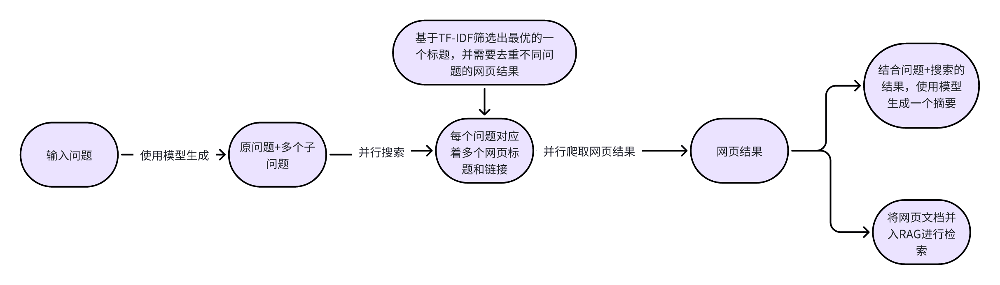

### 项目简介

本项目是一个基于搜索引擎的信息获取系统，通过搜索引擎为模型检索所需的信息。系统利用大语言模型（LLM）将用户问题拆解为子问题，结合搜索引擎并行获取相关内容，最终生成针对用户问题的精准摘要。该项目可补充现有的 RAG（Retrieval-Augmented Generation）和 `chat_to_db` 模块，特别适用于处理涉及最新信息或本地文档库未包含的内容。

### 项目流程图



1. **输入问题与子问题拆解**

   - 系统接收用户的问题，使用大语言模型将其拆解为多个子问题，增加搜索的广度和深度。

2. **并行搜索**

   - 系统将主问题和子问题通过搜索引擎并行搜索，获取相关网页的标题和链接，并过滤无效链接。

3. **基于 TF-IDF 筛选最优标题**

   - 使用 TF-IDF 和余弦相似度计算标题与问题的相关性，筛选出最优的链接，并去重，确保搜索结果的质量。

4. **网页爬取与内容过滤**

   - 爬取筛选出的网页内容，过滤乱码、广告页面和无效内容，仅保留有效的文本信息，提升信息的准确性。

5. **生成摘要**

   - 将爬取的内容与原问题和子问题整合，使用大语言模型生成针对问题的精准摘要，并返回给用户。

### 可调节参数

运行程序时，可以通过命令行参数调整程序的行为：

- `--qury`：所提问的问题（默认值："请问NLP是什么？"）。
- `--model_path`：模型路径（默认值：`"/home/nfs02/model/Qwen1.5-14B-Chat"`）。
- `--max_new_tokens`：生成文本的最大长度，控制摘要的字数（默认值：`500`）。
- `--summary`：是否生成总结，布尔值，`True` 或 `False`（默认值：`True`）。
- `--splitQFlag`：是否将问题拆解为子问题，布尔值，`True` 或 `False`（默认值：`True`）。
- `--mainTopn`：主问题的 Top N 网页选择，用于控制爬取的网页数量（默认值：`3`）。
- `--subTopn`：子问题的 Top N 网页选择（默认值：`1`）。

### 安装与运行

1. **克隆项目仓库：**

   ```bash
   git clone https://gitee.com/hupeng2023/open-source-summer.git
   cd repo(请修改为对应目录)

2. **安装依赖：**

   ```bash
   pip install -r requirements.txt

3. **运行程序：**

   ```bash
   python main.py --qury "请问NLP是什么？"
