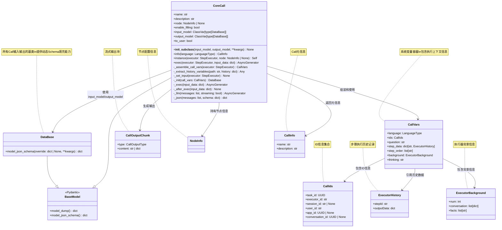
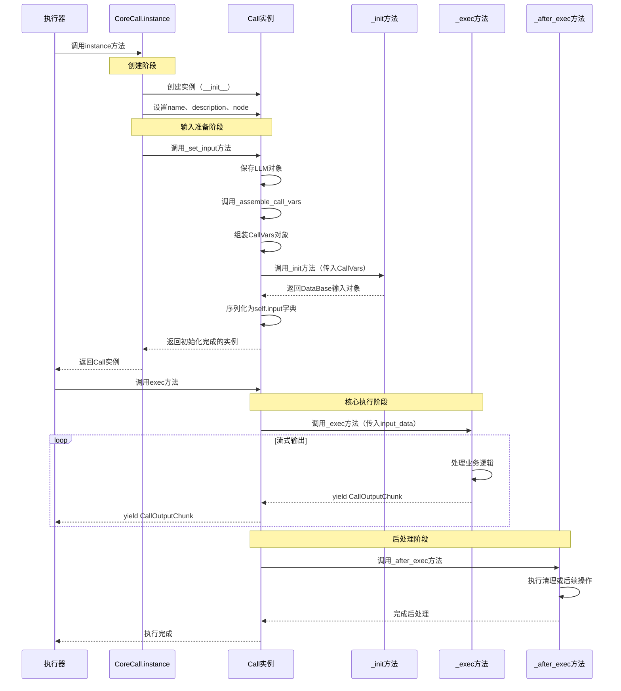
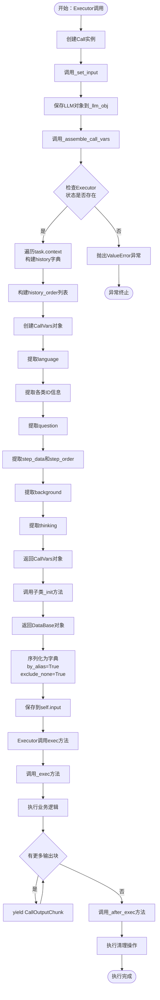
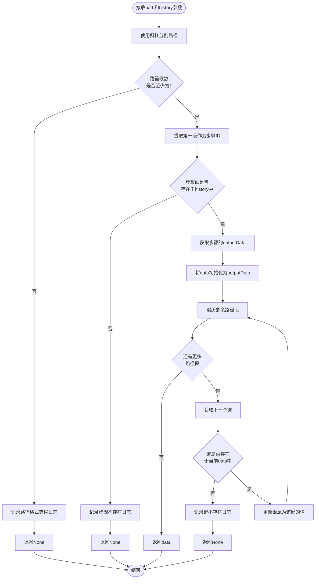
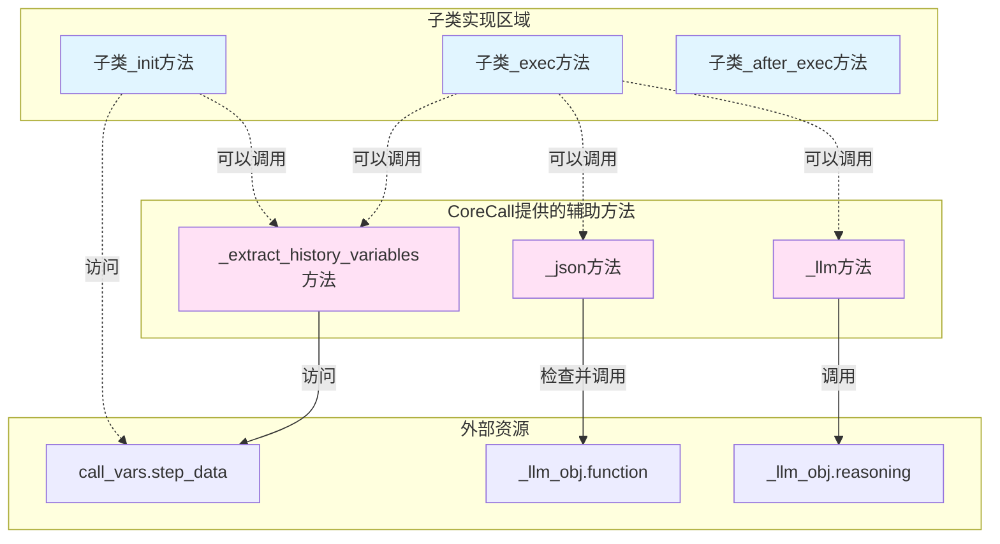

# CoreCall基类模块文档

## 1. 模块概述

CoreCall是欧拉助手框架中所有Call类的抽象基类，定义了Call工具的通用接口规范和核心执行逻辑。该模块基于Pydantic构建，提供了标准化的输入输出定义、生命周期管理、系统变量组装、历史数据访问等基础能力，确保所有具体的Call实现遵循统一的调用契约和执行流程。

## 2. 代码结构

CoreCall基类位于 `apps/scheduler/call/` 目录下：

```text
apps/scheduler/call/
└── core.py         # CoreCall基类和DataBase基类定义
```

## 3. 核心类与方法

### 3.1 DataBase类

`DataBase` 是所有Call输入输出的基类，继承自Pydantic的BaseModel。

#### 3.1.1 核心功能

DataBase提供了动态Schema填充能力，允许子类在运行时通过override参数动态调整JSON Schema定义。

#### 3.1.2 model_json_schema方法

**功能描述**：生成类的JSON Schema，并支持通过override参数动态覆盖属性定义。

**执行流程**：

1. 调用父类的model_json_schema方法生成基础Schema
2. 检查是否提供了override参数
3. 如果提供了override，遍历其中的键值对
4. 将override中的每个属性定义覆盖到Schema的properties字段中
5. 返回更新后的完整Schema

**应用场景**：支持在不修改类定义的情况下，根据运行时需求调整字段的Schema描述，实现灵活的类型系统。

### 3.2 CoreCall类

`CoreCall` 是所有Call工具的抽象父类，定义了Call的完整生命周期接口。

### 3.3 主要属性

| 属性名 | 类型 | 默认值 | 描述 |
|--------|------|--------|------|
| `name` | str | - | Step的名称，在JSON Schema中被排除 |
| `description` | str | - | Step的描述信息，在JSON Schema中被排除 |
| `node` | NodeInfo \| None | - | 节点信息，包含执行环境相关配置 |
| `enable_filling` | bool | False | 是否启用自动参数填充功能 |
| `input_model` | ClassVar[type[DataBase]] | - | Call的输入数据类型模板（类变量） |
| `output_model` | ClassVar[type[DataBase]] | - | Call的输出数据类型模板（类变量） |
| `to_user` | bool | False | 是否需要将输出返回给用户 |

**配置说明**：

- `arbitrary_types_allowed`: 允许使用任意类型的Python对象
- `extra="allow"`: 允许接受未在模型中声明的额外字段

### 3.4 主要方法

#### 3.4.1 __init_subclass__方法

**功能描述**：在子类定义时自动执行的类初始化钩子方法，用于设置子类的输入输出模型。

**执行时机**：当定义一个继承自CoreCall的新类时，Python解释器会自动调用此方法。

**执行流程**：

1. 调用父类的__init_subclass__方法完成基础初始化
2. 从类定义参数中提取input_model参数
3. 从类定义参数中提取output_model参数
4. 将这两个模型类赋值给子类的类变量

**设计意图**：强制所有子类在定义时必须指定输入输出模型，确保类型安全。

#### 3.4.2 info方法

**功能描述**：返回Call工具的元信息，包括名称和描述，支持国际化。

**方法签名**：接受一个language参数，默认为中文，返回CallInfo对象。

**实现要求**：这是一个抽象方法，所有子类必须实现此方法提供具体的工具信息。如果子类未实现，调用时会抛出NotImplementedError异常。

#### 3.4.3 _assemble_call_vars方法

**功能描述**：从执行器中提取和组装系统变量，构建完整的调用上下文。

**执行流程**：

1. **状态检查**：验证执行器的任务状态是否存在，如不存在则记录错误日志并抛出ValueError异常
2. **历史数据提取**：遍历任务的上下文列表（executor.task.context）
3. **构建历史字典**：以步骤ID为键，执行历史对象为值，创建history字典
4. **记录执行顺序**：将步骤ID按顺序添加到history_order列表中
5. **组装CallVars对象**：从执行器的不同部分提取信息，包括：
   - 语言配置（language）
   - 各类ID信息（task_id、executor_id、session_id等）
   - 用户问题（question）
   - 历史数据（step_data和step_order）
   - 背景信息（background）
   - 思考过程（thinking）
6. **返回组装结果**：返回完整的CallVars对象供后续使用

**数据来源映射**：

- `language`: executor.task.runtime.language
- `task_id`: executor.task.metadata.id
- `executor_id`: executor.task.state.executorId
- `session_id`: executor.task.runtime.sessionId
- `user_id`: executor.task.metadata.userId
- `app_id`: executor.task.state.appId
- `conversation_id`: executor.task.metadata.conversationId
- `question`: executor.question
- `background`: executor.background
- `thinking`: executor.task.runtime.reasoning

#### 3.4.4 _extract_history_variables方法

**功能描述**：根据路径表达式从历史数据中提取特定变量值。

**路径格式**：使用斜杠分隔的路径字符串，格式为 `step_id/key/to/variable`，其中第一段为步骤ID，后续段为数据键的嵌套路径。

**执行流程**：

1. **路径解析**：使用斜杠分割路径字符串为段列表
2. **路径验证**：检查路径至少包含一个段（步骤ID），否则记录错误并返回None
3. **步骤查找**：检查第一段指定的步骤ID是否存在于历史字典中，不存在则记录错误并返回None
4. **数据定位**：获取该步骤的outputData作为起始数据对象
5. **路径遍历**：按顺序遍历剩余的路径段
   - 对于每个键，检查是否存在于当前数据对象中
   - 如果键不存在，记录错误并返回None
   - 如果存在，将当前数据对象更新为该键对应的值
6. **返回结果**：返回最终定位到的变量值

**错误处理**：所有错误情况都会记录日志并返回None，不会抛出异常。

**示例路径**：

- `step1/result` - 获取step1的输出中的result字段
- `weather/data/temperature` - 获取weather步骤输出的data.temperature字段

#### 3.4.5 instance方法

**功能描述**：工厂方法，用于创建Call类的实例并完成初始化。

**执行流程**：

1. **实例创建**：使用类构造函数创建Call对象
2. **基础属性设置**：从执行器中提取名称和描述信息
3. **节点信息注入**：设置节点配置信息
4. **额外参数应用**：通过kwargs传入其他自定义参数
5. **输入数据初始化**：调用_set_input方法完成输入数据的准备
6. **返回实例**：返回完全初始化的Call实例

**设计模式**：这是一个异步工厂方法，封装了复杂的实例化逻辑。

#### 3.4.6 _set_input方法

**功能描述**：准备Call执行所需的输入数据和系统变量。

**执行流程**：

1. **LLM对象保存**：将执行器的LLM对象存储到实例变量_llm_obj中，供后续调用
2. **系统变量组装**：调用_assemble_call_vars方法构建CallVars对象
3. **输入数据初始化**：调用子类实现的_init方法，传入系统变量
4. **数据序列化**：将_init返回的DataBase对象转换为字典格式
   - 使用by_alias=True选项，按字段别名序列化
   - 使用exclude_none=True选项，排除值为None的字段
5. **保存输入数据**：将序列化后的字典赋值给self.input属性

**作用范围**：此方法在instance方法中被调用，确保每个Call实例都有正确的输入数据。

#### 3.4.7 _init方法

**功能描述**：子类必须实现的抽象方法，用于根据系统变量准备Call的具体输入数据。

**方法签名**：接受CallVars参数，返回DataBase类型的输入对象。

**实现要求**：

- 所有继承CoreCall的子类必须实现此方法
- 方法应当根据call_vars中的信息构建输入数据模型实例
- 如果子类未实现，调用时会抛出NotImplementedError异常

**设计意图**：将输入数据的构建逻辑委托给子类，使不同的Call可以有不同的输入准备策略。

#### 3.4.8 _exec方法

**功能描述**：子类可以重载的执行方法，定义Call的核心业务逻辑，以流式方式返回输出。

**方法签名**：接受输入数据字典，返回异步生成器，生成CallOutputChunk对象。

**默认实现**：生成一个空内容的文本类型输出块。

**重载要求**：

- 子类应当实现自己的_exec逻辑
- 使用yield语句逐块返回执行结果
- 每个输出块应当是CallOutputChunk类型

**流式设计**：支持大模型等需要流式输出的场景，提升响应速度。

#### 3.4.9 _after_exec方法

**功能描述**：在执行完成后调用的钩子方法，用于执行清理或后处理逻辑。

**方法签名**：接受输入数据字典，无返回值。

**默认实现**：空实现，不执行任何操作。

**重载场景**：

- 需要记录执行日志
- 需要释放资源
- 需要执行状态更新
- 需要触发后续操作

#### 3.4.10 exec方法

**功能描述**：Call的统一执行入口，编排完整的执行流程。

**执行流程**：

1. **流式执行**：调用_exec方法开始执行核心逻辑
2. **结果转发**：使用async for循环接收_exec生成的每个输出块
3. **逐块输出**：使用yield将每个CallOutputChunk传递给调用者
4. **后处理执行**：在所有输出块生成完毕后，调用_after_exec方法
5. **异步等待**：使用await等待后处理完成

**设计模式**：这是一个模板方法，定义了Call执行的标准流程，子类通过重载_exec和_after_exec方法来定制行为。

#### 3.4.11 _llm方法

**功能描述**：提供给子类使用的便捷LLM调用接口，封装了与大语言模型的交互。

**方法签名**：

- 接受消息列表（messages）和流式标志（streaming）
- 返回异步生成器，逐块生成字符串内容

**执行流程**：

1. **模型调用**：调用_llm_obj.reasoning.call方法
2. **传递参数**：将messages和streaming参数传递给底层LLM
3. **结果处理**：接收LLM返回的块对象
4. **内容提取**：从每个块中提取content字段，如果为None则返回空字符串
5. **流式输出**：使用yield逐块返回内容字符串

**使用场景**：子类在_exec方法中需要调用大模型时，可以直接使用此方法。

#### 3.4.12 _json方法

**功能描述**：提供给子类使用的结构化JSON生成接口，支持基于Schema的受约束生成。

**方法签名**：

- 接受消息列表（messages）和JSON Schema（schema）
- 返回符合Schema定义的JSON字典对象

**执行流程**：

1. **模型检查**：验证_llm_obj.function是否已配置
2. **异常处理**：如果未设置函数调用模型，记录错误日志并抛出CallError异常
3. **函数调用**：调用_llm_obj.function.call方法
4. **参数传递**：传入消息列表和Schema定义
5. **返回结果**：等待并返回符合Schema的JSON对象

**应用场景**：需要让大模型生成结构化数据，如表单填充、参数提取等。

## 4. 类关系图

以下是CoreCall模块中主要类的继承和依赖关系：



## 5. 生命周期流程图

以下是CoreCall的完整生命周期流程，从实例化到执行完成：



## 6. 数据流转图

以下是系统变量和数据在CoreCall中的流转过程：



## 7. 历史变量提取流程图

以下是_extract_history_variables方法的详细执行流程：



## 8. 辅助方法调用关系

以下是CoreCall提供给子类的辅助方法调用关系：



## 9. 数据结构详解

### 9.1 CallVars 系统变量结构

CallVars是CoreCall中最重要的数据结构，包含了执行Call所需的所有上下文信息。

| 字段名 | 类型 | 必需 | 说明 |
|--------|------|------|------|
| `language` | LanguageType | ✅ | 当前使用的语言类型（中文/英文） |
| `ids` | CallIds | ✅ | 包含任务ID、执行器ID、会话ID等标识信息 |
| `question` | str | ✅ | 改写或原始的用户问题 |
| `step_data` | dict[str, ExecutorHistory] | ✅ | 步骤执行历史的字典，键为步骤ID |
| `step_order` | list[str] | ✅ | 步骤执行的顺序列表 |
| `background` | ExecutorBackground | ✅ | 执行器的背景信息，包含对话历史和事实 |
| `thinking` | str | ✅ | AI的推理思考过程文本 |

### 9.2 CallIds ID信息结构

| 字段名 | 类型 | 必需 | 说明 |
|--------|------|------|------|
| `task_id` | UUID | ✅ | 当前任务的唯一标识符 |
| `executor_id` | str | ✅ | Flow执行器的ID |
| `session_id` | str \| None | ❌ | 用户会话ID（可选） |
| `user_id` | str | ✅ | 用户唯一标识符 |
| `app_id` | UUID \| None | ❌ | 应用ID（可选） |
| `conversation_id` | UUID \| None | ❌ | 对话ID（可选） |

### 9.3 ExecutorHistory 历史记录结构

ExecutorHistory记录了每个步骤的执行结果，是提取历史变量的数据源。

| 字段名 | 类型 | 说明 |
|--------|------|------|
| `stepId` | str | 步骤的唯一标识符 |
| `outputData` | dict[str, Any] | 步骤的输出数据，可以是嵌套的字典结构 |

### 9.4 ExecutorBackground 背景信息结构

| 字段名 | 类型 | 说明 |
|--------|------|------|
| `num` | int | 对话记录的最大保留数量 |
| `conversation` | list[dict[str, str]] | 历史对话记录列表，每条包含role和content |
| `facts` | list[str] | 当前执行器关联的背景事实信息列表 |

### 9.5 CallOutputChunk 输出块结构

| 字段名 | 类型 | 说明 |
|--------|------|------|
| `type` | CallOutputType | 输出类型枚举（TEXT/DATA/ERROR） |
| `content` | str \| dict[str, Any] | 输出内容，可以是文本或结构化数据 |

## 10. 子类实现要求

继承CoreCall的子类必须遵循以下规范：

### 10.1 必需实现的方法

1. **info方法**：返回Call的名称和描述信息
2. **_init方法**：根据CallVars准备输入数据
3. **__init_subclass__参数**：在类定义时提供input_model和output_model

### 10.2 可选重载的方法

1. **_exec方法**：实现核心业务逻辑
2. **_after_exec方法**：实现后处理逻辑

### 10.3 可用的辅助方法

1. **_llm方法**：调用大语言模型
2. **_json方法**：生成结构化JSON数据
3. **_extract_history_variables方法**：提取历史变量

### 10.4 子类定义示例

```python
class MyCall(CoreCall, input_model=MyInput, output_model=MyOutput):
    """自定义Call实现"""

    @classmethod
    def info(cls, language: LanguageType = LanguageType.CHINESE) -> CallInfo:
        if language == LanguageType.CHINESE:
            return CallInfo(name="我的工具", description="这是一个自定义工具")
        return CallInfo(name="My Tool", description="This is a custom tool")

    async def _init(self, call_vars: CallVars) -> MyInput:
        # 准备输入数据
        return MyInput(field1="value1", field2="value2")

    async def _exec(
        self, input_data: dict[str, Any]
    ) -> AsyncGenerator[CallOutputChunk, None]:
        # 执行业务逻辑
        result = "处理结果"
        yield CallOutputChunk(type=CallOutputType.TEXT, content=result)
```

## 11. 工作原理总结

CoreCall基类通过以下机制实现了统一的Call执行框架：

1. **类型系统**：使用Pydantic模型定义输入输出，提供强类型检查和序列化能力
2. **生命周期管理**：通过instance、_set_input、_init、exec、_exec、_after_exec等方法定义了清晰的执行流程
3. **上下文组装**：_assemble_call_vars方法从执行器中提取所有必需的上下文信息
4. **历史数据访问**：_extract_history_variables方法提供了便捷的历史变量访问接口
5. **LLM集成**：_llm和_json方法封装了与大语言模型的交互逻辑
6. **流式输出**：通过异步生成器支持流式数据返回，提升响应速度
7. **模板方法模式**：exec方法定义执行流程框架，子类通过重载特定方法定制行为
8. **错误处理**：在关键位置提供日志记录和异常处理机制

通过这些设计，CoreCall确保了所有Call实现的一致性和可维护性，同时为子类提供了足够的灵活性来实现各自的业务逻辑。
