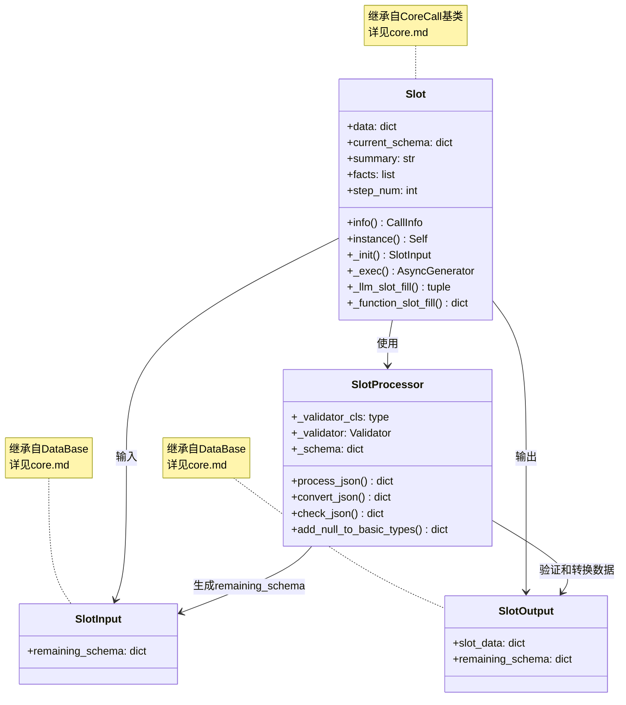
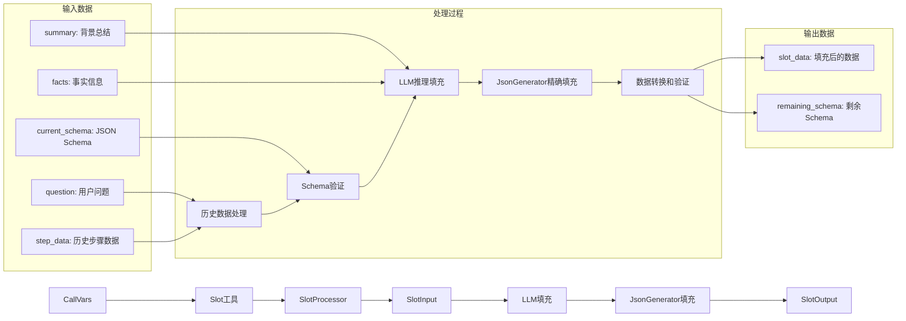
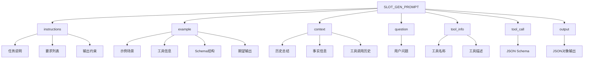
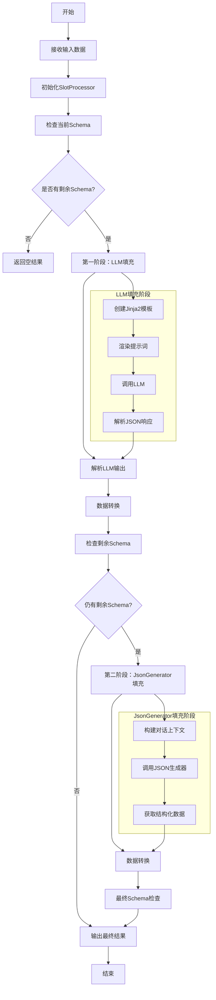
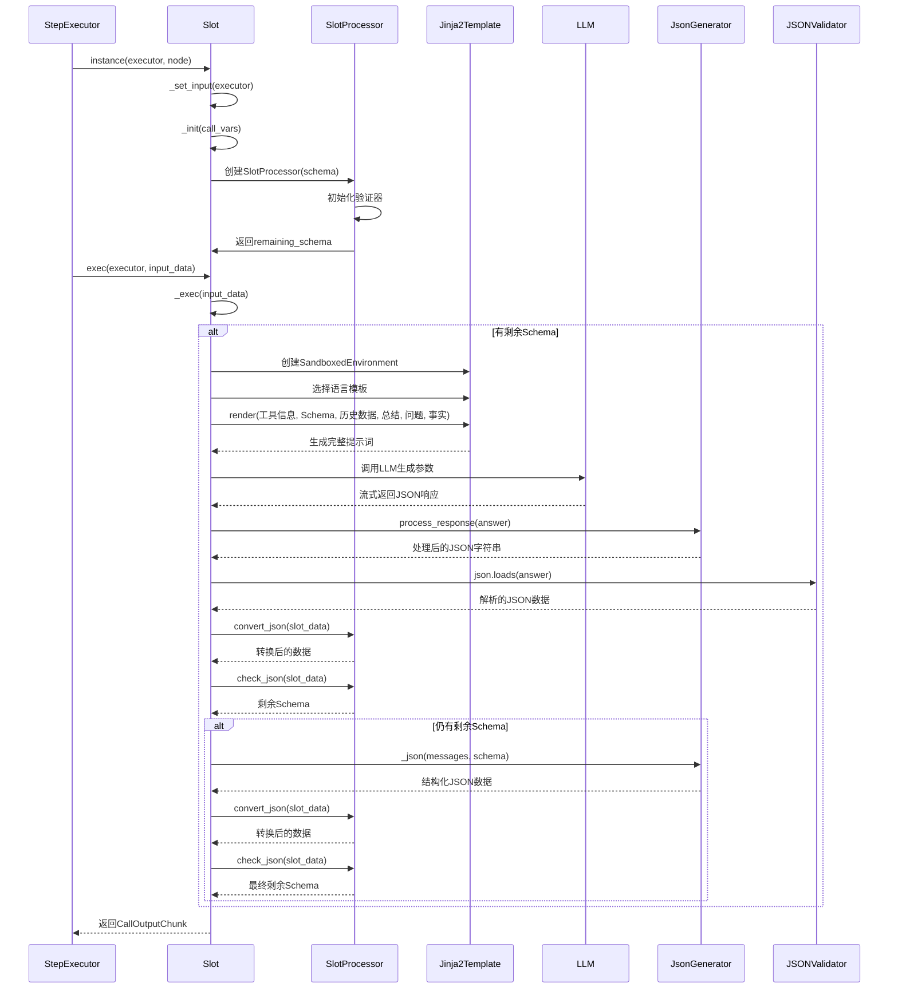
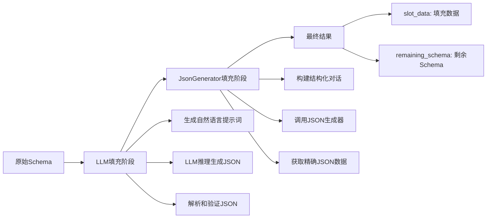
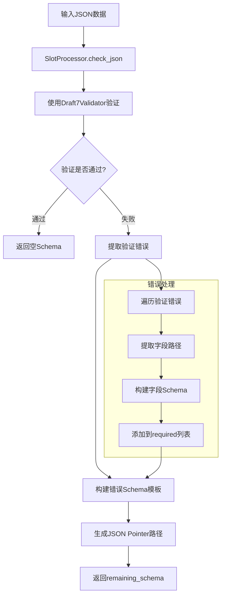

# Slot工具模块文档

## 概述

Slot工具是一个智能参数自动填充工具，它通过分析历史步骤数据、背景信息和用户问题，自动生成符合JSON Schema要求的参数对象。该工具使用JsonGenerator进行精确的剩余参数填充。

## 功能特性

- **智能参数填充**：基于历史步骤和背景信息自动填充工具参数
- **Schema验证**：支持JSON Schema验证和错误检测
- **模板化提示词**：使用Jinja2模板引擎动态生成提示词
- **结构化数据**：基于Pydantic模型进行数据验证和序列化

## 核心组件

### 1. Slot类

Slot工具的核心实现类，继承自`CoreCall`基类，负责参数自动填充的整个流程。

### 2. 主要属性

| 属性名 | 类型 | 默认值 | 描述 |
|--------|------|--------|------|
| `data` | dict[str, Any] | {} | 当前输入数据 |
| `current_schema` | dict[str, Any] | {} | 当前JSON Schema |
| `summary` | str | "" | 背景信息总结 |
| `facts` | list[str] | [] | 事实信息列表 |
| `step_num` | int | 1 | 历史步骤数 |

### 3. 核心方法

- `info()`: 返回工具的多语言名称和描述
- `instance()`: 创建工具实例
- `_init()`: 初始化工具输入，处理历史数据和Schema
- `_exec()`: 执行参数填充逻辑
- `_llm_slot_fill()`: 使用大语言模型填充参数
- `_function_slot_fill()`: 使用JsonGenerator填充剩余参数

## 数据结构

Slot工具涉及多个数据模型，它们之间的关系如下：



### 数据模型说明

- **SlotInput**: 包含剩余需要填充的Schema信息(继承自DataBase，详见[core.md](core.md))
- **SlotOutput**: 包含填充后的数据和剩余Schema(继承自DataBase，详见[core.md](core.md))
- **SlotProcessor**: 参数槽处理器，负责JSON Schema验证和数据转换

### 数据流转关系



## 提示词模板

Slot工具使用Jinja2模板引擎生成提示词，支持中英文两种语言。模板设计遵循以下原则：

### 模板设计特点

- **结构化指令**：使用XML标签清晰分隔不同部分
- **动态内容渲染**：通过Jinja2循环语法动态生成历史工具数据
- **输出格式控制**：明确指定JSON输出要求和限制

### 提示词模板结构



### 模板核心要素

1. **任务说明**：明确要求生成符合JSON Schema的参数对象
2. **数据优先级**：用户输入 > 背景信息 > 历史数据
3. **格式约束**：严格按照JSON Schema输出，不编造字段
4. **可选字段处理**：可省略可选字段
5. **示例说明**：提供具体的使用示例

## 工作流程

Slot工具采用两阶段填充策略，确保参数填充的准确性和完整性：



## 执行时序图



## 核心算法

### 1. 两阶段填充策略



### 2. Schema验证流程



## 使用示例

### 基本使用

Slot工具是系统内置的隐藏工具，不可由用户直接使用。

### 输出数据示例

```python
# Slot工具输出数据结构示例
slot_output = SlotOutput(
    slot_data={
        "city": "杭州",
        "date": "明天"
    },
    remaining_schema={}  # 空表示所有参数已填充完成
)
```

## 配置参数

| 参数 | 类型 | 默认值 | 描述 |
|------|------|--------|------|
| `data` | dict[str, Any] | {} | 当前输入数据 |
| `current_schema` | dict[str, Any] | {} | 当前JSON Schema |
| `summary` | str | "" | 背景信息总结 |
| `facts` | list[str] | [] | 事实信息列表 |
| `step_num` | int | 1 | 历史步骤数 |
| `to_user` | bool | False | 是否将输出返回给用户 |
| `enable_filling` | bool | False | 是否需要进行自动参数填充 |

## 错误处理

Slot工具包含以下错误处理机制：

### 1. JSON解析错误

- LLM输出格式不正确时的异常处理
- 使用try-catch捕获JSON解析异常
- 解析失败时返回空字典

### 2. Schema验证错误

- JSON Schema格式错误检测
- 验证器初始化失败处理
- 字段验证失败时的错误提取
