# MCP Agent Executor 模块设计文档

## 1. 概述

MCP Agent Executor 是基于 Model Context Protocol (MCP) 的智能代理执行器,负责将用户的自然语言目标转化为可执行的工具调用序列,并自动完成多步骤任务流程。

### 1.1 核心特性

- **动态工具选择**：基于用户查询动态选择 top-N 工具并执行
- **批量工具调用**：支持一次规划多个工具并行执行
- **风险评估**：对工具执行进行风险评估和用户确认
- **TODO 管理**：内置 TODO 列表管理功能（读取和更新）
- **断点续传**：支持任务暂停和恢复
- **参数补充**：检测参数错误并请求用户补充
- **状态管理**：完整的执行器和步骤状态机
- **提示词管理**：统一的提示词加载和格式化机制

### 1.2 技术栈

- **语言**: Python 3.x
- **异步框架**: anyio
- **MCP 客户端**: mcp (Anthropic)
- **LLM 集成**: 支持多种大模型
- **数据验证**: Pydantic
- **模板引擎**: Jinja2

## 2. 架构设计

### 2.1 类结构

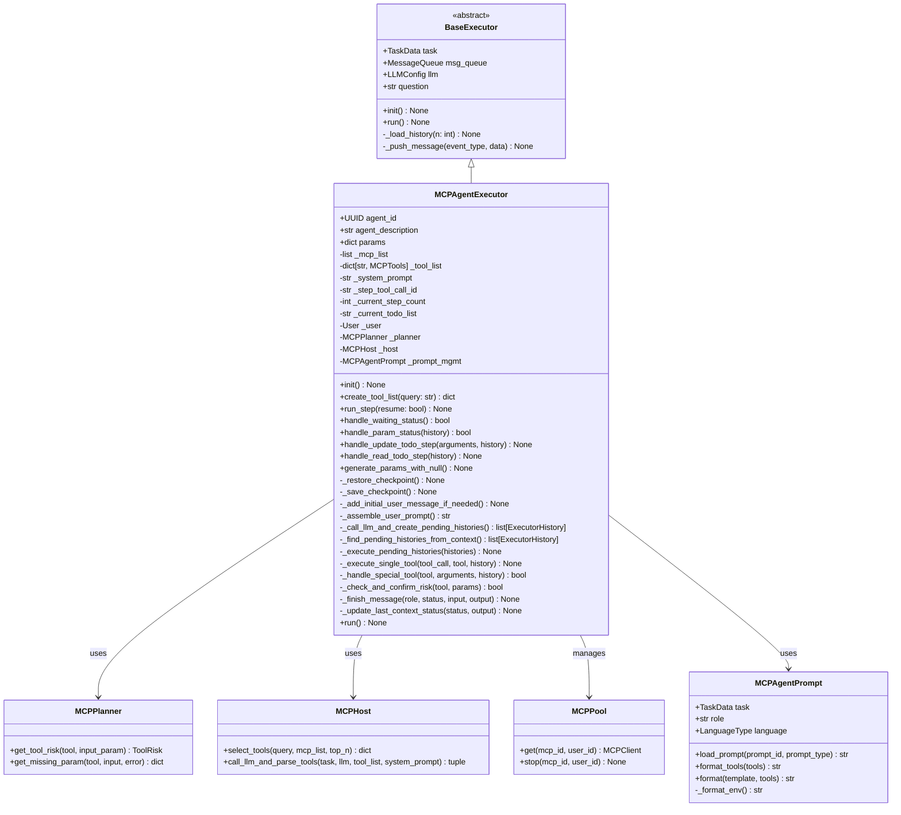

### 2.2 核心组件关系

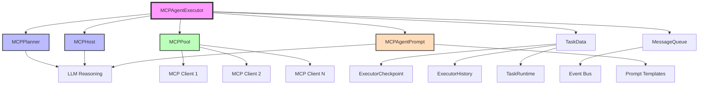

## 3. 执行流程

### 3.1 主流程图

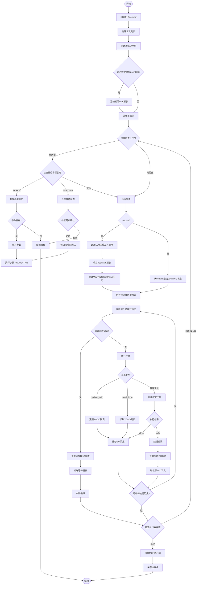

### 3.2 步骤执行状态机

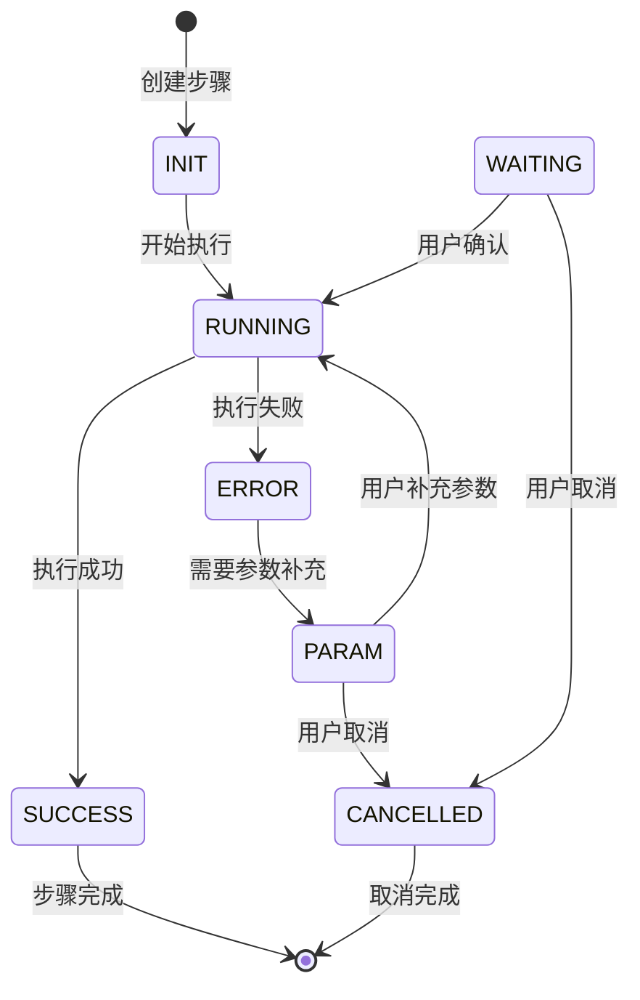

### 3.3 执行器状态机

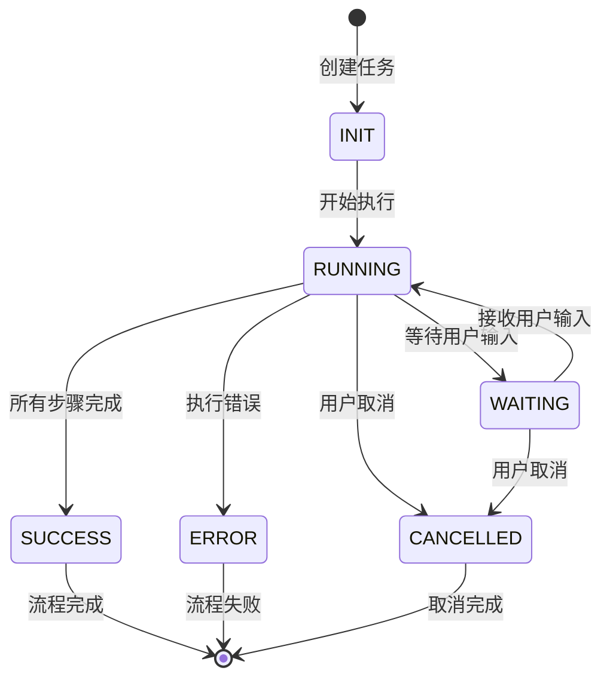

## 4. 时序图

### 4.1 正常执行流程

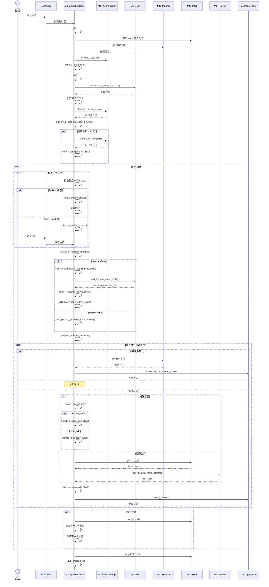

### 4.2 Resume 恢复流程

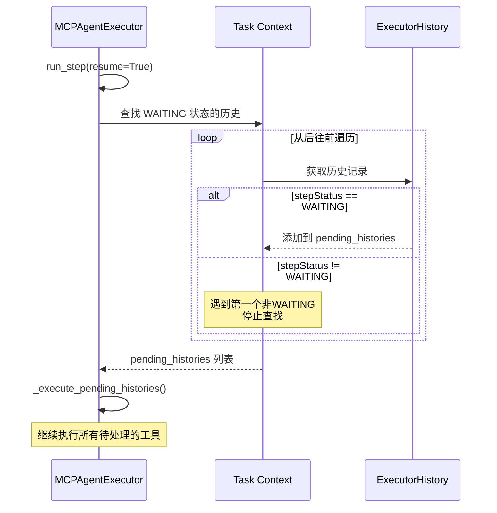

## 5. 核心方法详解

### 5.1 初始化方法

#### init() - 初始化执行器

**功能说明：** 在执行器创建后首次被调用,负责初始化所有必要的组件和状态。

**执行步骤：**

1. 如果 question 为空,使用 task.runtime.userInput 作为问题
2. 初始化必要变量（MCP 列表、工具字典、系统提示词、步骤计数、TODO 列表等）
3. 从用户管理器中获取并验证用户信息
4. 创建规划器（MCPPlanner）实例
5. 创建宿主（MCPHost）实例
6. 创建提示词管理器（MCPAgentPrompt）实例
7. 加载历史会话记录
8. 如果任务状态不存在,创建初始的 ExecutorCheckpoint
9. 如果任务状态存在,调用 `_restore_checkpoint()` 恢复检查点数据

**使用场景：** 在调度器创建执行器实例后自动调用

**代码位置：** [agent.py:139-182](apps/scheduler/executor/agent.py#L139-L182)

---

#### _restore_checkpoint() - 恢复检查点

**功能说明：** 从 checkpoint 的 extraData 中恢复步骤计数和 TODO 列表到内存变量。

**执行步骤：**

1. 检查 task.state 和 extraData 是否存在
2. 解析 extraData 为 AgentCheckpointExtra 对象
3. 恢复 `_current_step_count` 和 `_current_todo_list`
4. 记录日志

**使用场景：** 在 init() 中调用,用于断点续传

**代码位置：** [agent.py:184-196](apps/scheduler/executor/agent.py#L184-L196)

---

#### create_tool_list() - 创建工具列表

**功能说明：** 根据用户查询动态选择 top-N 工具,并添加特殊工具。

**参数说明：**

- **query**: 用户查询字符串

**执行步骤：**

1. 调用 host 的 select_tools 方法获取 top 15 相关工具
2. 添加 update_todo_list 工具（更新 TODO 列表）
3. 添加 read_todo_list 工具（读取 TODO 列表）
4. 返回完整的工具字典

**工具描述加载：** 使用 MCPAgentPrompt 的 load_prompt 从 prompts 目录加载工具描述

**使用场景：** 在 run() 开始时调用,动态构建可用工具集

**代码位置：** [agent.py:198-222](apps/scheduler/executor/agent.py#L198-L222)

---

### 5.2 提示词管理方法

#### MCPAgentPrompt 类

**功能说明：** 专门处理提示词的加载、格式化和渲染。

**主要方法：**

##### load_prompt() - 加载提示词

**参数：**

- **prompt_id**: 提示词 ID
- **prompt_type**: 提示词类型（part, role, func, alert 等）

**执行逻辑：**

1. 根据语言类型（中文/英文）构建文件路径
2. 从 `{data_dir}/prompts/system/{prompt_type}/{prompt_id}.{language}.txt` 加载文件
3. 返回文件内容

**代码位置：** [agent.py:58-67](apps/scheduler/executor/agent.py#L58-L67)

##### format_tools() - 格式化工具列表

**参数：**

- **tools**: 工具字典

**执行逻辑：**

1. 加载工具提示词模板（part.tool）
2. 使用 Jinja2 渲染模板,传入 tools 字典
3. 返回格式化后的工具列表文本

**代码位置：** [agent.py:91-98](apps/scheduler/executor/agent.py#L91-L98)

##### format() - 格式化提示词模板

**参数：**

- **template**: 包含占位符的模板字符串（如 `{part.tool}`, `{role.main}` 等）
- **tools**: 工具字典

**执行逻辑：**

1. 使用正则表达式匹配所有 `{xxx.yyy}` 格式的占位符
2. 对每个占位符进行替换：
   - `{part.env}`: 调用 `_format_env()` 生成环境信息
   - `{part.tool}`: 调用 `format_tools()` 生成工具列表
   - 其他: 直接调用 `load_prompt()` 加载提示词
3. 返回格式化后的完整提示词

**代码位置：** [agent.py:101-124](apps/scheduler/executor/agent.py#L101-L124)

---

### 5.3 步骤执行方法

#### run_step() - 执行步骤主逻辑

**功能说明：** 执行完整的步骤流程,包括 LLM 调用和工具执行。

**参数：**

- **resume**: 是否恢复执行（默认 False）

**执行流程：**

1. 设置执行器状态为 RUNNING
2. 根据 resume 参数选择获取待执行历史的方式：
   - **resume=False**: 调用 `_call_llm_and_create_pending_histories()` 调用 LLM 并创建新的待执行历史
   - **resume=True**: 调用 `_find_pending_histories_from_context()` 从 context 中查找 WAITING 状态的历史
3. 调用 `_execute_pending_histories()` 统一执行所有待执行的历史

**特点：**

- 支持两种模式：新执行和恢复执行
- 统一的执行逻辑,简化流程控制

**代码位置：** [agent.py:730-745](apps/scheduler/executor/agent.py#L730-L745)

---

#### _call_llm_and_create_pending_histories() - 调用 LLM 并创建待执行历史

**功能说明：** 调用 LLM 获取下一步操作,并为每个工具调用创建 WAITING 状态的 history。

**执行流程：**

1. 增加步骤计数 `_current_step_count`
2. 使用预先创建的系统提示词 `_system_prompt`
3. 调用 host 的 `call_llm_and_parse_tools` 方法
4. 保存 assistant 消息到历史记录（role="assistant"）
5. 如果没有工具调用,设置执行器状态为 SUCCESS 并返回空列表
6. 遍历每个工具调用：
   - 检查工具是否存在于工具列表中
   - 创建 WAITING 状态的 tool history（包含 tool_call_id）
   - 添加到 task.context 和 pending_histories
7. 返回 pending_histories 列表

**返回值：** `list[ExecutorHistory]` - 待执行的历史列表

**代码位置：** [agent.py:566-646](apps/scheduler/executor/agent.py#L566-L646)

---

#### _find_pending_histories_from_context() - 从 context 查找待执行历史

**功能说明：** 从 task.context 中查找所有连续的 WAITING 状态的 history,用于恢复执行。

**执行流程：**

1. 从 context 的最后一个历史记录开始往前遍历
2. 如果 stepStatus 为 WAITING,插入到列表前面（保持原有顺序）
3. 遇到第一个非 WAITING 状态就停止
4. 返回所有连续的 WAITING 状态历史

**使用场景：** 在 resume=True 时调用,恢复因风险确认中断的工具执行

**代码位置：** [agent.py:649-660](apps/scheduler/executor/agent.py#L649-L660)

---

#### _execute_pending_histories() - 执行待处理历史列表

**功能说明：** 统一执行所有待处理的 history,处理风险确认和工具调用。

**执行流程：**

1. 遍历每个待执行的 history
2. 提取工具名称和参数
3. 从工具列表中查找对应的工具
4. 如果工具不存在,设置 ERROR 状态并继续下一个
5. 从 extraData 中提取 tool_call_id
6. 更新当前步骤状态（stepId, stepName, stepStatus）
7. 对非特殊工具进行风险检查：
   - 如果需要确认,设置 WAITING 状态并中断循环
   - 否则继续执行
8. 构造 LLMToolCall 对象
9. 调用 `_execute_single_tool()` 执行工具
10. 捕获异常,设置 ERROR 状态,停止 MCP 进程,继续下一个工具

**容错机制：** 单个工具失败不会中断整个批次的执行

**代码位置：** [agent.py:663-728](apps/scheduler/executor/agent.py#L663-L728)

---

#### _execute_single_tool() - 执行单个工具

**功能说明：** 执行单个 MCP 工具调用或特殊工具,处理执行结果。

**参数：**

- **tool_call**: LLM 的工具调用对象
- **selected_tool**: 选中的工具对象
- **tool_history**: 预创建的历史记录对象

**执行流程：**

1. 提取工具参数
2. 检查是否为特殊工具（TODO 相关）：
   - 如果是,调用 `_handle_special_tool()` 并返回
3. 对于普通工具：
   - 从 mcp_pool 获取 MCP 客户端
   - 调用 call_tool 方法并传入参数
   - 检查 isError 字段判断是否有错误
   - 如果有错误,抛出 RuntimeError 异常
   - 提取输出文本内容
   - 尝试解析为 JSON,失败则使用原始字符串
   - 更新 tool_history 的状态和输出
   - 推送 STEP_OUTPUT 事件

**异常处理：**

- **工具执行错误**: 抛出 RuntimeError 异常
- 由调用方（_execute_pending_histories）捕获并处理

**代码位置：** [agent.py:452-503](apps/scheduler/executor/agent.py#L452-L503)

---

### 5.4 特殊工具处理方法

#### _handle_special_tool() - 处理特殊工具

**功能说明：** 统一处理 TODO 相关的特殊工具。

**参数：**

- **selected_tool**: 选中的工具对象
- **tool_arguments**: 工具参数
- **tool_history**: 历史记录对象

**执行流程：**

1. 检查工具名称是否为 update_todo_list
   - 如果是,调用 `handle_update_todo_step()`
2. 检查工具名称是否为 read_todo_list
   - 如果是,调用 `handle_read_todo_step()`
3. 返回 True 表示已处理,False 表示不是特殊工具

**返回值：** bool - 是否为特殊工具

**代码位置：** [agent.py:393-410](apps/scheduler/executor/agent.py#L393-L410)

---

#### handle_update_todo_step() - 处理更新 TODO 步骤

**功能说明：** 直接接受大模型 Function Call 的参数并存储 todo list 到内存变量。

**参数：**

- **tool_arguments**: 工具参数（包含 todo_list 字段）
- **tool_history**: 历史记录对象

**执行流程：**

1. 设置步骤状态为 RUNNING
2. 推送 STEP_INPUT 事件
3. 从参数中提取 todo_list
4. 更新内存变量 `_current_todo_list`
5. 设置步骤状态为 SUCCESS
6. 更新 tool_history 的状态和输出
7. 推送 STEP_OUTPUT 事件

**输出内容：**

```json
{"status": "success"}
```

**代码位置：** [agent.py:336-366](apps/scheduler/executor/agent.py#L336-L366)

---

#### handle_read_todo_step() - 处理读取 TODO 步骤

**功能说明：** 返回当前的 todo list。

**参数：**

- **tool_history**: 历史记录对象

**执行流程：**

1. 设置步骤状态为 RUNNING
2. 推送 STEP_INPUT 事件（空参数）
3. 设置步骤状态为 SUCCESS
4. 构造输出数据（包含当前 todo_list）
5. 更新 tool_history 的状态和输出
6. 推送 STEP_OUTPUT 事件

**输出内容：**

```json
{"todo": "当前的todo列表内容"}
```

**代码位置：** [agent.py:369-390](apps/scheduler/executor/agent.py#L369-L390)

---

### 5.5 风险确认方法

#### _check_and_confirm_risk() - 检查并确认工具执行风险

**功能说明：** 检查是否需要用户确认工具执行风险,如果需要则推送等待确认消息。

**参数：**

- **selected_tool**: 选中的工具对象
- **tool_params**: 工具参数

**执行流程：**

1. 检查用户是否设置了 autoExecute=True
   - 如果是,返回 False（跳过风险检查）
2. 检查最后一个 history 是否为同一个工具且已确认风险
   - 如果是,返回 False（跳过风险检查）
3. 调用 planner 的 `get_tool_risk()` 获取风险评估
4. 设置执行器状态为 WAITING,步骤状态为 WAITING
5. 推送 STEP_WAITING_FOR_START 事件
6. 返回 True（需要确认）

**返回值：** bool - 是否需要风险确认

**代码位置：** [agent.py:413-449](apps/scheduler/executor/agent.py#L413-L449)

---

### 5.6 状态处理方法

#### handle_waiting_status() - 处理等待状态

**功能说明：** 处理 WAITING 状态,判断用户是否批准执行。

**执行流程：**

1. 检查 params 是否存在
   - 不存在则调用 `_cancel_and_cleanup()` 并返回 False
2. 尝试解析 params 为 MCPRiskConfirm 对象
   - 解析失败则取消并返回 False
3. 检查 confirm 字段是否为 True
   - 为 False 则取消并返回 False
4. 设置步骤状态为 RUNNING
5. 根据 stepId 找到对应的 history,标记 risk_confirmed=True
6. 返回 True

**取消操作（_cancel_and_cleanup）：**

- 设置执行器状态为 CANCELLED
- 设置步骤状态为 CANCELLED
- 推送 STEP_OUTPUT 事件
- 更新最后一个 context 的状态

**返回值：**

- True: 用户批准,继续执行
- False: 用户拒绝或参数无效,取消任务

**代码位置：** [agent.py:286-333](apps/scheduler/executor/agent.py#L286-L333)

---

#### handle_param_status() - 处理参数状态

**功能说明：** 处理 PARAM 状态,合并用户补充的参数并继续执行。

**参数：**

- **history**: 当前步骤的历史记录对象

**执行流程：**

1. 检查 params 是否存在
   - 不存在则取消任务并返回 False
2. 合并 params 与 history.inputData
3. 更新 history 的时间戳
4. 设置执行器状态为 RUNNING
5. 设置步骤状态为 RUNNING
6. 更新最后一个 context 的状态
7. 返回 True

**返回值：**

- True: 参数已整合,继续执行
- False: 用户取消,退出循环

**代码位置：** [agent.py:789-816](apps/scheduler/executor/agent.py#L789-L816)

---

#### generate_params_with_null() - 生成参数补充请求

**功能说明：** 当检测到参数错误时,生成需要用户补充的参数列表并暂停执行。

**执行流程：**

1. 从最后一个 history 中获取工具名称
2. 从 tool_list 中获取对应的 MCPTools
3. 调用规划器的 `get_missing_param` 获取缺失参数列表
4. 提取错误信息
5. 设置执行器状态为 WAITING,步骤状态为 PARAM
6. 推送 STEP_WAITING_FOR_PARAM 事件

**输出内容：**

```json
{
  "message": "错误消息",
  "params": {
    "参数名": {
      "type": "string",
      "description": "参数描述"
    }
  }
}
```

**代码位置：** [agent.py:748-786](apps/scheduler/executor/agent.py#L748-L786)

---

### 5.7 消息和状态管理方法

#### _finish_message() - 保存消息到历史记录

**功能说明：** 根据角色类型保存不同类型的消息到历史记录。

**参数：**

- **role**: 消息角色（user/assistant/tool）
- **step_status**: 步骤状态
- **input_data**: 输入数据（可选）
- **output_data**: 输出数据（可选）

**执行流程：**

1. 根据角色处理不同的推送逻辑：
   - **assistant**: 提取 assistant 文本,推送 TEXT_ADD 事件
   - **tool**: 推送 STEP_OUTPUT 事件
2. 构建 extraData（包含 role 和 tool_call_id）
3. 创建 ExecutorHistory 对象
4. 添加到 task.context

**特点：**

- 根据不同角色推送不同的事件类型
- 保存 role 和 tool_call_id 到 extraData,便于后续识别消息类型

**代码位置：** [agent.py:238-283](apps/scheduler/executor/agent.py#L238-L283)

---

#### _update_last_context_status() - 更新最后一个 context 的状态

**功能说明：** 如果最后一个 context 是当前步骤,更新其状态和输出。

**执行流程：**

1. 检查 task.context 是否为空
2. 检查最后一个 context 的 stepId 是否等于当前 stepId
3. 如果是,更新 stepStatus 和 outputData（如果提供）
4. 更新时间戳

**参数：**

- **step_status**: 新的步骤状态
- **output_data**: 输出数据（可选）

**代码位置：** [agent.py:225-235](apps/scheduler/executor/agent.py#L225-L235)

---

### 5.8 Checkpoint 管理方法

#### _save_checkpoint() - 保存检查点

**功能说明：** 保存步骤计数和 TODO 列表到 checkpoint 的 extraData。

**执行流程：**

1. 创建 AgentCheckpointExtra 对象（包含 step_count 和 todo_list）
2. 序列化为字典并保存到 task.state.extraData
3. 记录调试日志

**使用场景：** 在 run() 结束时调用,保存当前状态

**代码位置：** [agent.py:819-835](apps/scheduler/executor/agent.py#L819-L835)

---

### 5.9 用户提示词管理方法

#### _add_initial_user_message_if_needed() - 添加初始 user 消息

**功能说明：** 判断是否需要添加初始 user 消息,如果需要则添加。

**执行逻辑：**

1. 判断是否需要添加 user 消息：
   - history 为空,需要添加
   - 最后一个记录是 assistant 且后面没有 tool 消息,需要添加
   - extraData 为空（旧数据）,需要添加
2. 如果需要：
   - 调用 `_assemble_user_prompt()` 组装用户提示词
   - 调用 `_finish_message()` 保存 user 消息

**使用场景：** 在 run() 开始时调用,确保 LLM 调用前有正确的消息序列

**代码位置：** [agent.py:534-563](apps/scheduler/executor/agent.py#L534-L563)

---

#### _assemble_user_prompt() - 组装用户提示词

**功能说明：** 根据当前状态动态组装用户提示词。

**执行流程：**

1. 使用 task.runtime.userInput 作为基础模板
2. 判断当前步骤数是否超过最大步骤数：
   - 如果超过,添加 `{alert.max_step_reached}` 提示
3. 判断当前 todo_list 是否为空：
   - 如果为空,添加 `{alert.todo_empty}` 提示
4. 使用 MCPAgentPrompt 的 format() 方法格式化模板
5. 返回完整的用户提示词

**返回值：** str - 格式化后的用户提示词

**代码位置：** [agent.py:506-531](apps/scheduler/executor/agent.py#L506-L531)

---

### 5.10 主执行循环

#### run() - 主执行循环

**功能说明：** MCP Agent 的主执行逻辑,循环处理步骤直到完成或停止。

**执行流程：**

1. 调用 `create_tool_list()` 创建工具列表
2. 一次性创建系统提示词并保存到 `_system_prompt`
3. 调用 `_add_initial_user_message_if_needed()` 添加初始 user 消息
4. 设置执行器状态为 RUNNING
5. 进入主循环（当执行器状态为 RUNNING 时继续）：
   - 检查是否有历史记录
   - 如果有历史,取出最后一个 history 并判断状态：
     - **PARAM 状态**: 调用 `handle_param_status()`,如果返回 False 则退出循环
     - **WAITING 状态**: 调用 `handle_waiting_status()`,如果返回 False 则退出循环;如果返回 True,调用 `run_step(resume=True)` 恢复执行
   - 调用 `run_step()` 执行步骤
6. 循环结束后,清理所有 MCP 客户端
7. 调用 `_save_checkpoint()` 保存检查点

**循环退出条件：**

- 执行器状态不再是 RUNNING（SUCCESS/ERROR/CANCELLED）
- `handle_param_status()` 返回 False
- `handle_waiting_status()` 返回 False

**清理操作：**

- 遍历所有 MCP 服务并停止客户端
- 捕获并记录异常

**代码位置：** [agent.py:838-901](apps/scheduler/executor/agent.py#L838-L901)

---

## 6. 数据模型

### 6.1 核心数据模型关系图

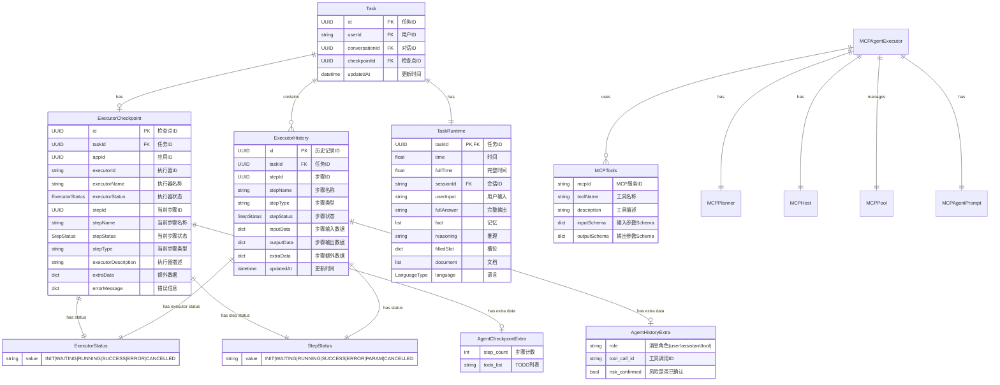

### 6.2 执行器状态枚举

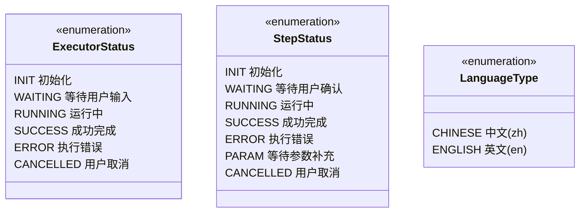

### 6.3 数据模型详细说明

#### ExecutorCheckpoint - 执行器检查点

**用途**: 保存任务执行的当前状态,支持断点续传和状态恢复。

**关键字段**:

- **执行器级别**:
  - `executorId`: 唯一标识一个执行流程
  - `executorName`: 流程的可读名称
  - `executorStatus`: 整个执行器的当前状态
  - `executorDescription`: 流程的详细描述

- **步骤级别**:
  - `stepId`: 当前正在执行步骤的唯一标识
  - `stepName`: 步骤名称（通常是工具名称）
  - `stepStatus`: 当前步骤的状态
  - `stepType`: 步骤类型标识

- **辅助数据**:
  - `extraData`: AgentCheckpointExtra 结构（step_count, todo_list）
  - `errorMessage`: 错误信息（包含 err_msg 和 data）

#### ExecutorHistory - 执行器历史

**用途**: 记录每个步骤的完整执行历史,用于上下文记忆和回溯。

**关键字段**:

- **输入输出**:
  - `inputData`: 步骤执行时的输入参数
  - `outputData`: 步骤执行后的输出结果
  - `extraData`: AgentHistoryExtra 结构（role, tool_call_id, risk_confirmed）

- **状态追踪**:
  - `stepStatus`: 该历史记录对应的步骤状态
  - `executorStatus`: 记录时的执行器状态
  - `updatedAt`: 记录更新时间

**用途场景**:

- LLM 上下文组装
- 用户查看执行历史
- 错误诊断和重试
- Resume 恢复执行

#### MCPTools - MCP 工具定义

**用途**: 描述 MCP 服务提供的工具及其参数规范。

**关键字段**:

- `id`: 工具的唯一标识符
- `mcpId`: 所属 MCP 服务的 ID
- `toolName`: 工具在 MCP 服务中的名称
- `description`: 工具功能的自然语言描述
- `inputSchema`: JSON Schema 格式的输入参数定义
- `outputSchema`: JSON Schema 格式的输出结果定义

**特殊工具**:

- `update_todo_list`: 虚拟工具,用于更新 TODO 列表
- `read_todo_list`: 虚拟工具,用于读取 TODO 列表

#### AgentCheckpointExtra - Agent 检查点额外数据

**用途**: 保存 Agent 特有的检查点数据。

**关键字段**:

- `step_count`: 当前执行的步骤计数
- `todo_list`: TODO 列表的字符串表示

#### AgentHistoryExtra - Agent 历史额外数据

**用途**: 保存每个步骤的角色信息和工具调用 ID。

**关键字段**:

- `role`: 消息角色（user/assistant/tool）
- `tool_call_id`: 工具调用 ID（仅 tool 角色有值）
- `risk_confirmed`: 风险是否已确认（避免重复弹出确认）

### 6.4 消息角色流转图

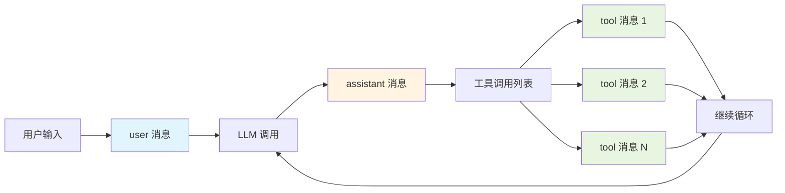

**说明**:

1. **user 消息**: 包含用户输入和系统提示词
2. **assistant 消息**: 包含 LLM 的思考文本和工具调用列表
3. **tool 消息**: 包含工具的执行结果
4. 循环执行直到任务完成

## 7. 事件系统

### 7.1 事件类型

| 事件类型              | 触发时机          | 数据结构         |
|----------------------|-------------------|------------------|
| TEXT_ADD | assistant 消息输出 | assistant 文本内容 |
| STEP_INPUT | 工具开始执行 | 工具参数 |
| STEP_OUTPUT | 工具执行完成 | 工具结果 |
| STEP_WAITING_FOR_START | 等待用户确认 | ToolRisk |
| STEP_WAITING_FOR_PARAM | 等待参数补充 | 缺失参数列表 |

### 7.2 事件流转图

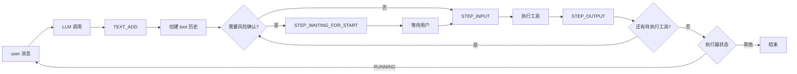

## 8. 配置参数

### 8.1 常量配置

| 常量                  | 值                                     | 说明                    |
| :-------------------- | :------------------------------------- | :---------------------- |
| IGNORE_RISK_TOOL      | {"update_todo_list", "read_todo_list"} | 忽略风险检查的工具列表  |
| TOP_N_TOOLS           | 15                                     | 每次选择的 top 工具数量 |
| AGENT_MAX_STEPS       | 配置文件中定义                         | Agent 最大步骤数        |

### 8.2 用户配置

| 配置项      | 类型  | 说明                        |
|-------------|-------|-----------------------------|
| autoExecute | bool  | 是否自动执行（不等待确认）  |

### 8.3 提示词配置

提示词文件存放在 `{data_dir}/prompts/system/` 目录下,按类型和语言组织:

```text
prompts/system/
├── role/               # 角色提示词
│   ├── main.zh.txt
│   └── main.en.txt
├── part/               # 部分提示词
│   ├── tool.zh.txt
│   ├── todo.zh.txt
│   ├── final.zh.txt
│   └── env.zh.txt
├── func/               # 函数描述
│   ├── update_todo_list.zh.txt
│   └── read_todo_list.zh.txt
└── alert/              # 警告提示
    ├── max_step_reached.zh.txt
    └── todo_empty.zh.txt
```

## 9. 错误处理策略

### 9.1 错误分类

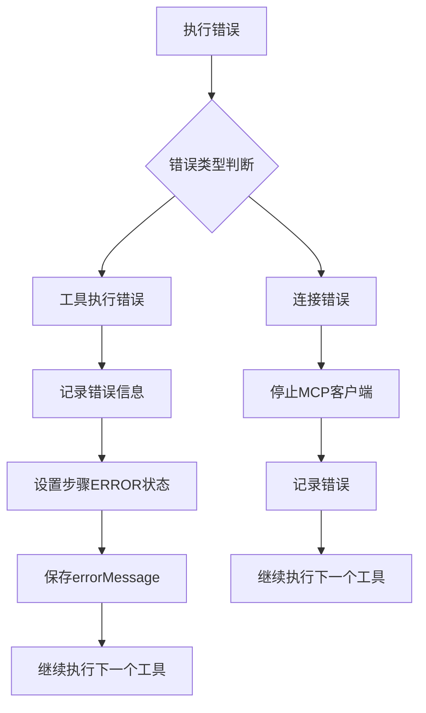

### 9.2 错误处理流程

1. **工具执行错误**
   - 在 _execute_single_tool 中抛出异常
   - 在 _execute_pending_histories 中捕获
   - 停止相关 MCP 进程
   - 设置步骤 ERROR 状态
   - 保存错误信息到 errorMessage
   - 继续执行下一个工具

2. **连接错误**
   - 停止当前用户的 MCP 客户端
   - 记录错误信息
   - 不中断整个批次执行

3. **容错机制**
   - 单个工具失败不影响其他工具
   - 批量执行模式下继续执行剩余工具
   - 错误信息保存在 checkpoint 中供后续处理

## 10. 性能优化

### 10.1 MCP 连接池

- 使用 `MCPPool` 管理 MCP 客户端
- 按 `(mcp_id, user_id)` 复用连接
- 任务结束后统一关闭连接

### 10.2 上下文管理

- 历史记录限制（通过 _load_history 配置）
- 动态工具选择（每次只加载 top 15 工具）
- 系统提示词全局创建（只创建一次）
- 步骤计数和 TODO 列表保存在内存变量中

### 10.3 批量执行优化

- 一次 LLM 调用可选择多个工具并行执行
- 工具失败不影响其他工具的执行
- 减少多轮 LLM 调用,提高效率

### 10.4 提示词优化

- 使用 Jinja2 模板引擎高效渲染
- 支持占位符替换,避免硬编码
- 按需加载提示词文件,减少内存占用

## 11. 安全考虑

### 11.1 风险评估

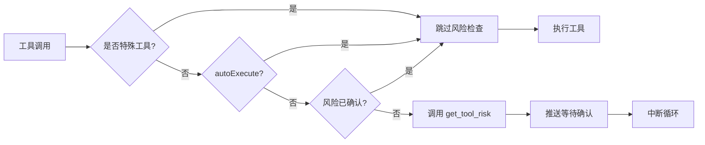

### 11.2 风险确认机制

1. **特殊工具豁免**: update_todo_list 和 read_todo_list 不需要风险确认
2. **autoExecute 豁免**: 用户设置 autoExecute=True 时跳过风险确认
3. **重复确认避免**: 标记 risk_confirmed=True,避免同一工具重复弹出确认
4. **风险评估**: 使用 LLM 评估工具执行风险并生成用户友好的描述

## 12. 实现细节

### 12.1 当前实现状态

**已实现功能：**

1. ✅ 基本的执行器初始化和状态管理
2. ✅ 动态工具选择（基于用户查询）
3. ✅ 批量工具执行（支持多工具并行调用）
4. ✅ 风险评估和用户确认机制
5. ✅ 参数错误检测和补充请求
6. ✅ TODO 列表管理（读取和更新）
7. ✅ 历史记录和上下文管理
8. ✅ MCP 客户端连接池管理
9. ✅ 完整的状态机（Executor 和 Step）
10. ✅ 错误处理和容错机制
11. ✅ 提示词管理系统
12. ✅ Resume 恢复执行机制
13. ✅ Checkpoint 持久化
14. ✅ 角色消息管理（user/assistant/tool）

### 12.2 关键实现逻辑

#### 消息角色管理

消息历史记录使用 role 字段区分三种类型：

- **user**: 用户输入和系统提示词
  - inputData: `{"user": "用户提示词"}`
- **assistant**: LLM 的思考文本
  - inputData: `{"assistant": "LLM 文本输出"}`
- **tool**: 工具调用和结果
  - inputData: 工具参数
  - outputData: 工具结果
  - extraData 包含 tool_call_id

#### 工具执行错误处理

工具执行错误通过检查 `output_data.isError` 字段来判断,如果为真则从 TextContent 中提取错误信息并抛出 RuntimeError 异常。

在批量执行中,异常被捕获后会：

- 停止相关的 MCP 进程
- 设置步骤状态为 ERROR
- 保存错误信息到 errorMessage
- 继续执行下一个工具（不中断整个批次）

#### 状态转换逻辑

**PARAM 状态处理：**

- 检查 params 是否存在
- 合并 params 与 history.inputData
- 设置状态为 RUNNING
- 返回 True 继续循环

**WAITING 状态处理：**

依次检查以下条件,任一不满足则取消任务：

1. params 是否存在
2. params 是否能解析为 MCPRiskConfirm 对象
3. confirm 字段是否为 True

如果通过检查：

- 设置状态为 RUNNING
- 标记 risk_confirmed=True
- 调用 run_step(resume=True) 恢复执行

#### Pending Histories 机制

1. LLM 调用后,为每个工具调用预创建 WAITING 状态的 history
2. 所有 history 保存到 task.context
3. 统一调用 _execute_pending_histories 执行
4. 如果遇到需要风险确认的工具,中断循环
5. 用户确认后,通过 resume=True 从 context 中恢复 WAITING 状态的 history 继续执行

这个机制的优势：

- 历史记录完整保存
- 支持断点续传
- 简化状态管理

#### 提示词管理

使用 MCPAgentPrompt 类统一管理提示词：

1. 按类型（role/part/func/alert）和语言（zh/en）组织提示词文件
2. 使用占位符语法（`{type.id}`）引用其他提示词
3. 使用 Jinja2 渲染模板,支持动态数据注入
4. 特殊处理 env 和 tool 提示词,动态生成内容

#### Checkpoint 持久化

在 checkpoint 的 extraData 中保存：

- `step_count`: 当前步骤计数（用于检测是否超过最大步骤数）
- `todo_list`: 当前 TODO 列表内容

在 init() 时通过 _restore_checkpoint() 恢复这些数据到内存变量。

在 run() 结束时通过 _save_checkpoint() 保存这些数据。

### 12.3 系统提示词创建时机

系统提示词在 run() 开始时一次性创建并保存到 `_system_prompt` 变量,后续所有 LLM 调用都复用这个提示词。

模板结构：

```text
{role.main}       # 主要角色定义

{part.todo}       # TODO 管理说明
{part.final}      # 结束条件说明
{part.tool}       # 工具列表
{part.env}        # 环境信息
```

### 12.4 用户提示词动态组装

用户提示词在每次添加 user 消息时动态组装,包含：

1. 基础内容：task.runtime.userInput
2. 条件提示：
   - 如果 step_count >= AGENT_MAX_STEPS,添加 `{alert.max_step_reached}`
   - 如果 todo_list 为空,添加 `{alert.todo_empty}`

这样可以根据当前状态动态调整提示词,引导 LLM 采取正确的行动。

## 13. 参考资料

- [Model Context Protocol](https://modelcontextprotocol.io/)
- [Anthropic MCP SDK](https://github.com/anthropics/mcp)
- [apps/scheduler/executor/agent.py](apps/scheduler/executor/agent.py) - 源代码实现
- [Jinja2 Documentation](https://jinja.palletsprojects.com/)
