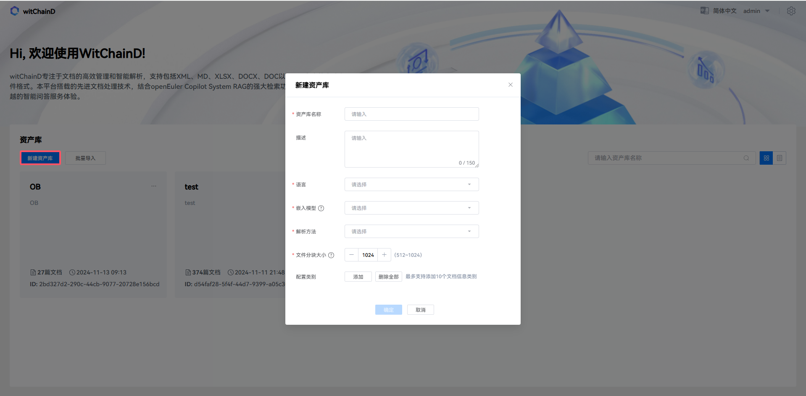
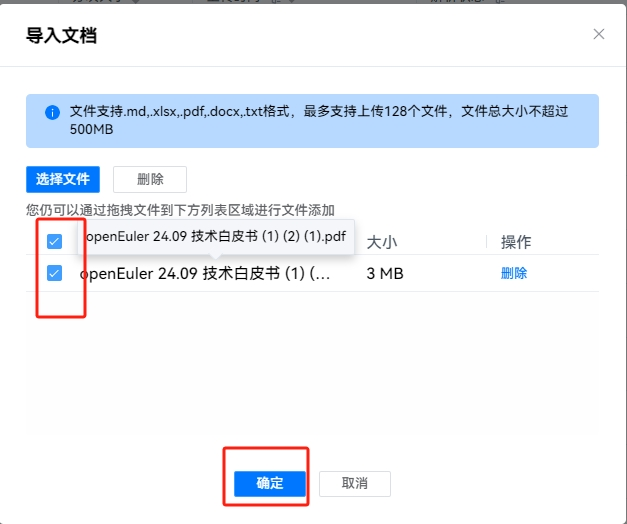
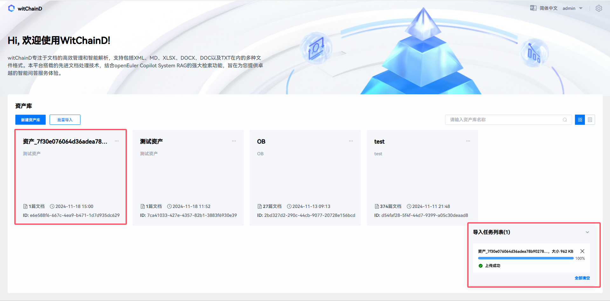
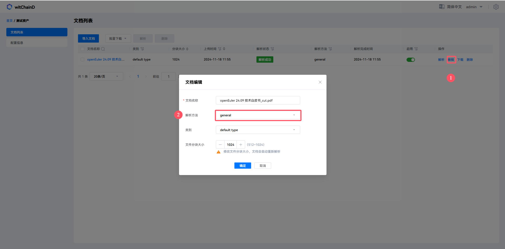
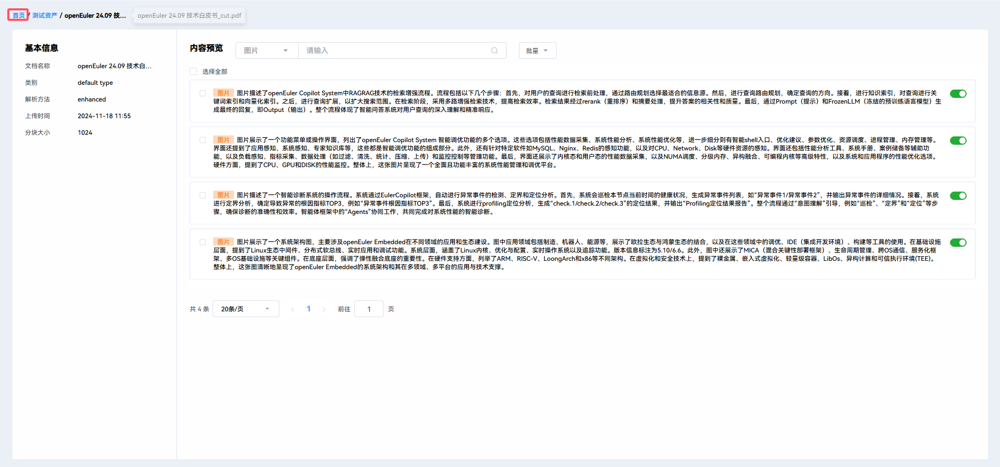
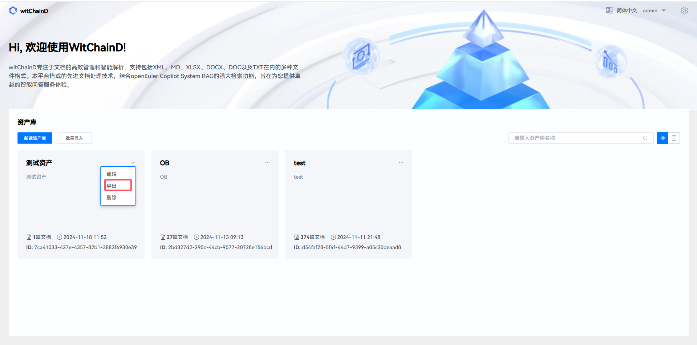
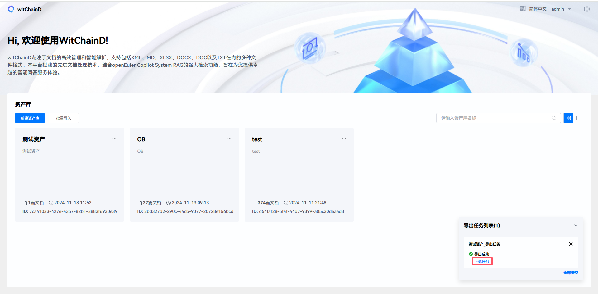

# Local Asset Library Construction Guide

This platform is designed to provide enterprises (users) with a visual entry point to manage local document assets. The functionality is divided into the following sections:

- User Management:
  
  You can log into the witchainD platform with your account and configure large models on the platform to provide capabilities for certain document parsing modes.
- Asset Management
  
  Create, delete, import assets, edit assets or asset information by specifying asset name, asset description, asset default parsing method, asset default chunk size, and embedding model.
- Document Management
  - Support users to upload files with limited size and quantity, and also allow users to download their uploaded files. Users can enter assets by clicking on asset cards, where documents are displayed as entries.
  - Support document parsing for txt, md, xlsx, docx, doc, and pdf documents
  - There are three document parsing methods: general, ocr, and enhanced modes. In general mode, only text and tables are extracted. In ocr mode, not only text and tables are extracted, but also image content from some documents. Enhanced mode summarizes the extracted content from images based on ocr.

- Document Parsing Result Management:
  
  Evaluate or eliminate the impact of chunks on retrieval by specifying chunk categories and keywords to filter target chunks, or by specifying whether chunks are enabled.
- Task Management
  
  View the status of current import/export asset and document parsing tasks, cancel or remove import/export asset libraries and document parsing tasks
- Retrieval Enhancement:
  
  The final parsing results of this platform are presented externally in the form of vectorization and keywords. It also provides technologies such as token compression and question completion to enhance the probability of result hits, and uses random contextual association to complete retrieval results.

## Login Management Platform

Please enter `https://$(wichaind domain)` in your browser to access EulerCopilot's WitChainD web page.
The login interface is as follows. Enter your account (admin) and password (123456), then click the login button to access the system.

## Create New Asset

### 1. View Asset Library

Enter the asset card display page. The cards show the asset name, description, number of documents, creation time, and asset ID.

You can convert the assets displayed as cards to entry display through the button in the red box.

### 2. Create New Asset Library

Click "Create New Asset" to bring up the asset information configuration dialog.

Fill in the asset library name, asset library description (optional), language, embedding model, default parsing method, and default file chunk size, then click OK.

After the asset library is created, it will ask whether to add documents. Click OK.

Click OK to complete and enter the asset library.

## Import Documents

### Single Import

Click the "Import Document" button to bring up the document upload dialog. Select local files and check them for upload.

### Batch Import

Click 1 "Batch Import Assets", 2 "Select Local Assets", 3 "Check Local Assets", and finally click OK to import assets.

Assets importing.

Asset import successful.

## Parse Documents

Waiting for parsing. Click cancel to stop document parsing.

After parsing is completed, the parsing status will show "Parse Successful".

There are three document parsing methods: general, ocr, and enhanced modes. Please choose the appropriate document parsing method according to your needs.

After parsing is complete, you can click on the filename to enter the document parsing result display details. You can view the document parsing results as shown in the figure below:

You can filter document parsing fragments, tables, and images through 1, search for corresponding fragments through keywords with fuzzy search through 2, and set whether to enable fragments in retrieval through 3, as shown in the figure below:

## Export Assets

Click "Return to Homepage".

Then click "Export Assets".

Shows that assets are being exported, as shown in the figure below:

Export successful. Click download to show download success.

