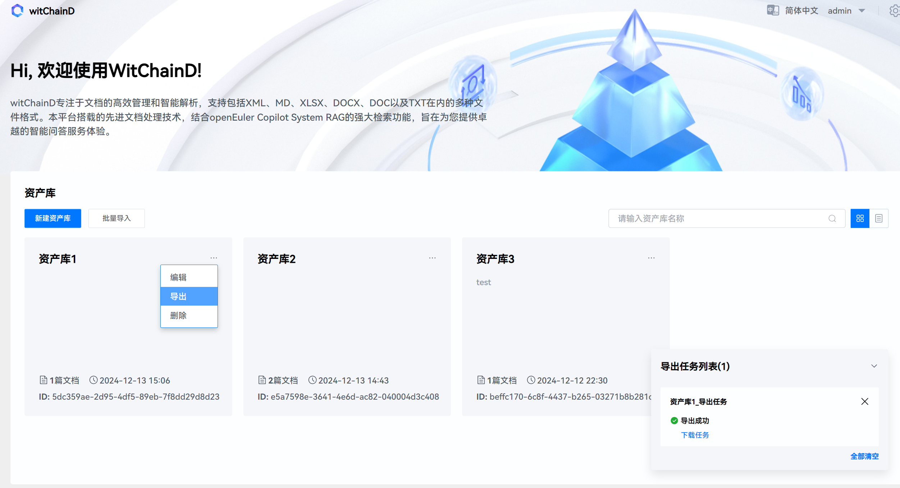
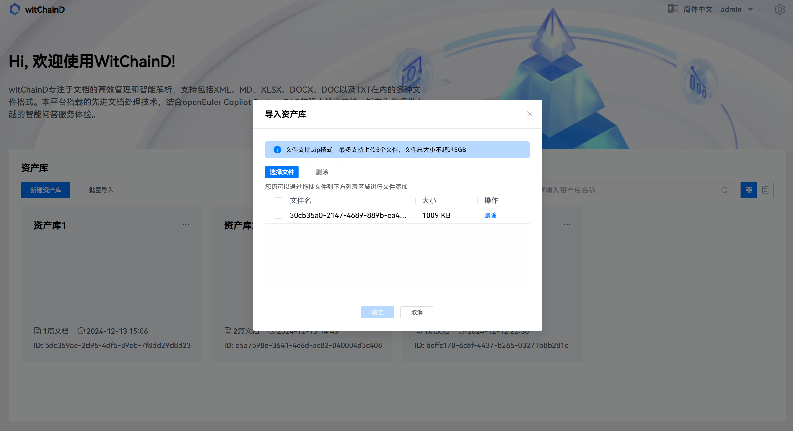
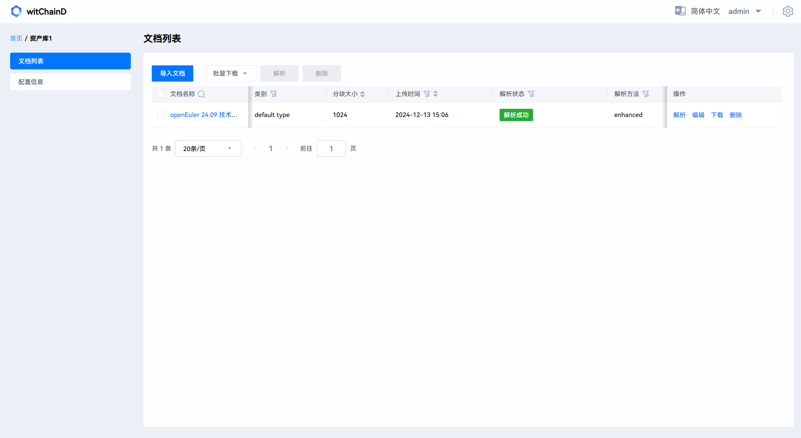
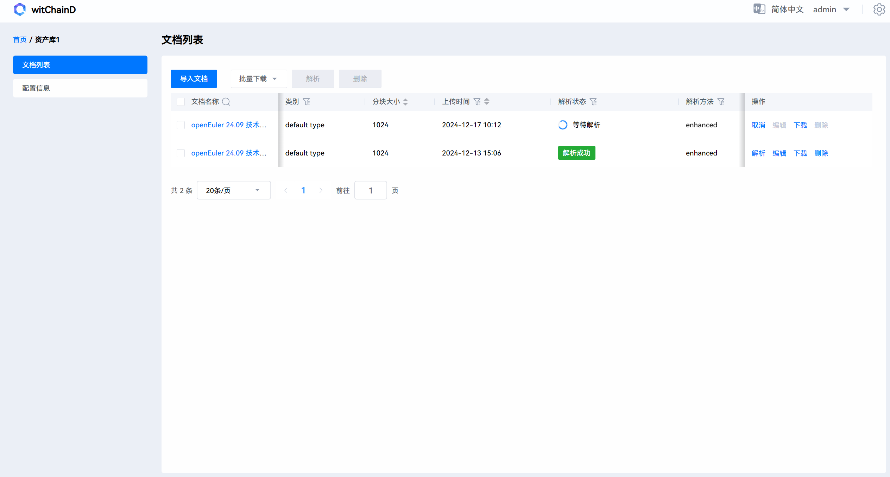
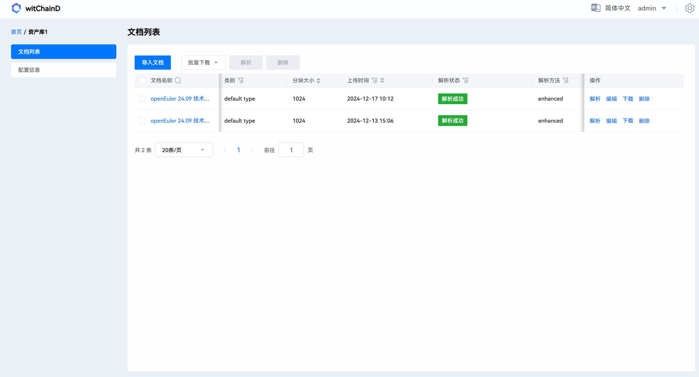
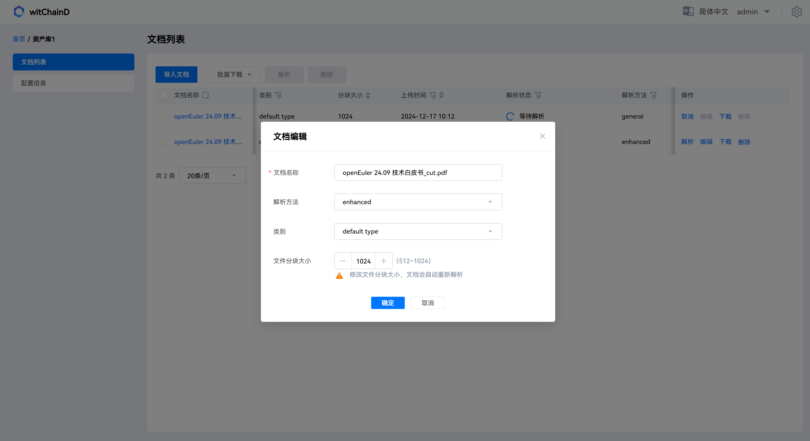
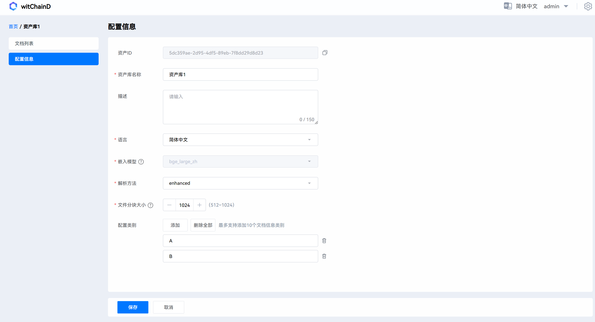

# witChainD User Guide - Knowledge Base Management

After completing the witChainD deployment, you can use witChainD for knowledge base management.

The following sections will introduce witChainD's functionality from a page perspective.

## 1. Asset Library Management Interface

This page is the asset library management interface, which users will enter after logging in.

**Supported Operations:**

- Configure Models: Click the settings button in the upper right corner to modify model-related configurations.

  

- Create New Asset Library: Click the "New Asset Library" button to create a new one, supporting custom name, description, language, embedding model, parsing method, file chunk size, and document category. Note: Duplicate names will automatically be modified to the asset library ID.

  

- Edit Asset Library: Click the edit button of the asset library to edit, supporting modification of name, description, language, parsing method, file chunk size, and document category. Note: Cannot be modified to duplicate names.

  

  

- Export Asset Library: Click the export button of the asset library to export. After export completion, you need to download the corresponding asset library to local according to the download task in the task list.

  

- Batch Import Asset Libraries: Click "Batch Import", upload local files and select them to import.

  

- Search Asset Libraries: Type text in the search bar to search for asset libraries whose names contain the corresponding text.

## 2. Document Management Interface

Click on the corresponding asset library in the asset management interface to enter the document management interface.

**Supported Operations:**

- Import Documents: Click "Import Documents" to upload files from local for import. After import, parsing will automatically start with the default configuration of that asset library.

  

- Parse Documents: Click "Parse" in the operations to parse the document. You can also select multiple documents for batch parsing.

  
  
  
  
  

- Edit Document Configuration: Click "Edit" to edit document configuration, supporting editing of document name, parsing method, category, and file chunk size.

  

- Download Documents: Click download to download documents to local, or select multiple documents for batch download.

- Delete Documents: Click delete to remove documents from the asset library, or select multiple documents for batch deletion.

- Search Documents: Click the search key next to the document name, type the search text in the popup search box to search for documents whose names contain that text.

  

- Edit Asset Library Configuration: Supports editing asset library name, description, language, default parsing method, file chunk size, and document information category.

  

## 3. Parsing Result Management Interface

Click on a parsed document to enter the document's parsing result management interface. The interface displays text block content previews after document parsing in order, with each text block accompanied by a tag indicating whether the information in that text block comes from paragraphs, lists, or images in the document. The switch on the right indicates whether that text block is enabled.

**Supported Operations:**

- Disable/Enable Text Blocks: Click the switch on the right side of the text block to disable/enable the corresponding text block, or select multiple text blocks for batch disable/enable.

  

- Search Text Blocks: Type content in the search box to find text blocks containing the corresponding content.
