# User Guide for Intelligent Q&A

## Starting a Conversation
In the input box at the bottom of the conversation area, enter the content you want to ask. Press `Shift + Enter` for a line break, press `Enter` to send the question, or click the "Send" button to submit your query.

> **Note**
>
> The conversation area is located in the main part of the page, as shown in Figure 1.

- Figure 1: Conversation Area  
  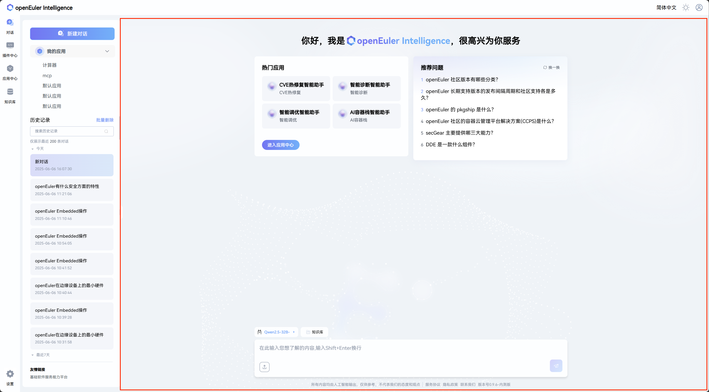
  
> **Note**
>
> Knowledge base configuration is located on the right side of the page, as shown in Figure 2. Users can configure the knowledge base to enhance the Q&A experience.

- Figure 2: Knowledge Base Configuration  
  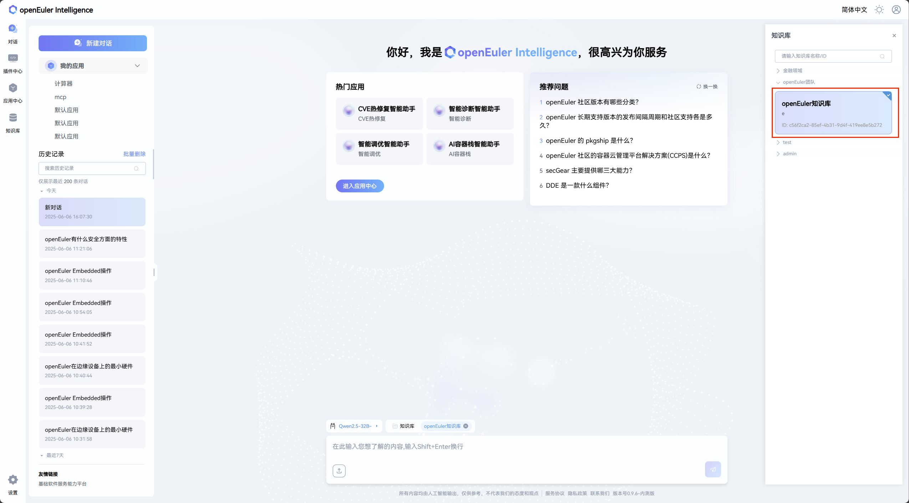

> **Note**
>
> Users can click the settings button in the bottom left corner to access the model configuration page. Currently, 8 basic templates from different vendors are provided for large model creation.

- Figure 3: Large Model Creation  
  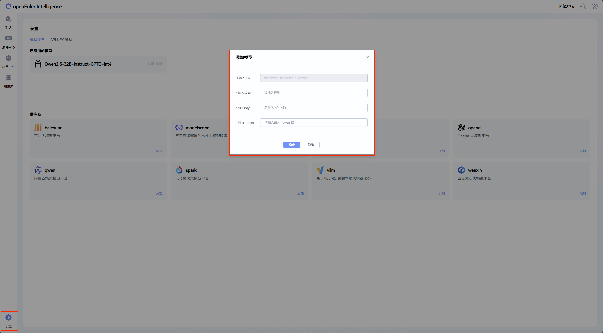

> **Note**
>
> Users can select a pre-configured model from the drop-down menu in the bottom left corner (the system provides one default model).

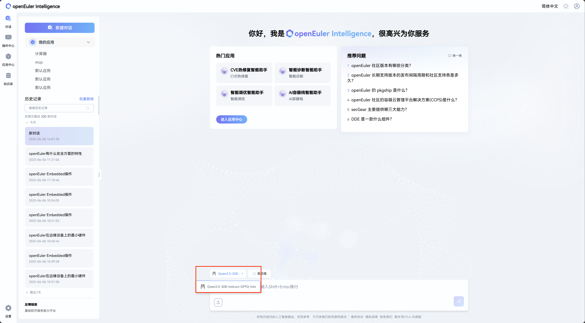

### Multi-Turn Continuous Conversation
openEuler Intelligence supports multi-turn continuous conversations. Simply continue asking follow-up questions in the same conversation. As shown in Figure 4, openEuler Intelligence will supplement and respond to your questions based on the conversation context.

- Figure 4: Multi-Turn Conversation  
  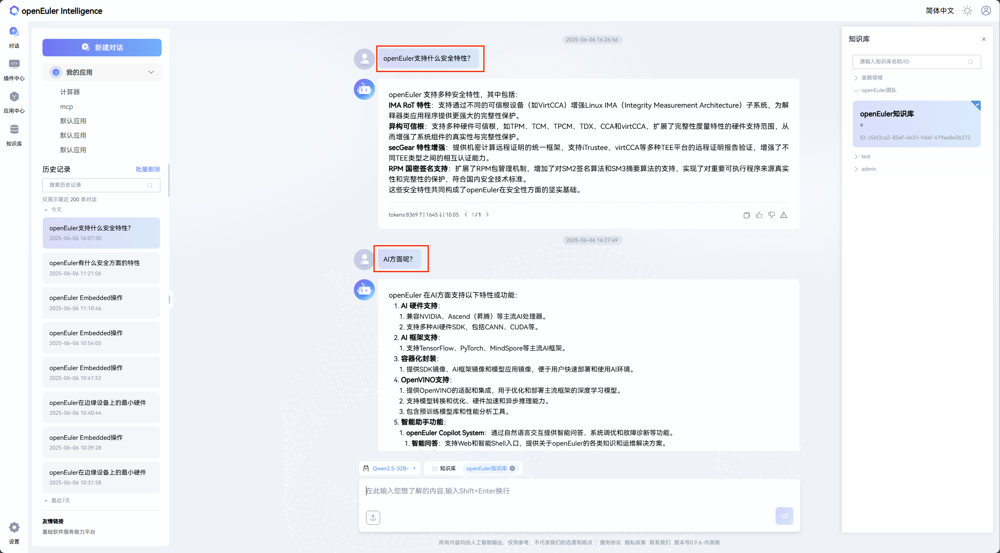

### File Upload
**Step 1** Click the "Upload File" button in the bottom left corner of the conversation area, as shown in Figure 5.

- Figure 5: File Upload Button  
  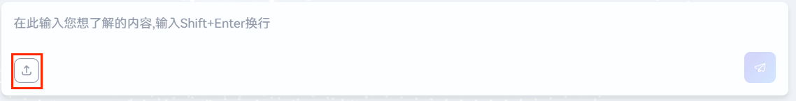

> **Note**
>
> When you hover your mouse over the "Upload File" button, a prompt will appear showing the supported file specifications and formats, as shown in Figure 6.

- Figure 6: File Upload Specification Prompt on Hover  
  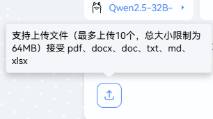

**Step 2** In the pop-up file selection window, select the file you want to upload and click "Open" to start the upload. A maximum of 10 files can be uploaded at once, with a total size limit of 64MB. Supported formats include PDF, docx, doc, txt, md, and xlsx.

After the upload starts, the upload progress will be displayed at the bottom of the conversation area, as shown in Figure 7.

- Figure 7: All Uploading Files Listed Below the Q&A Input Box  
  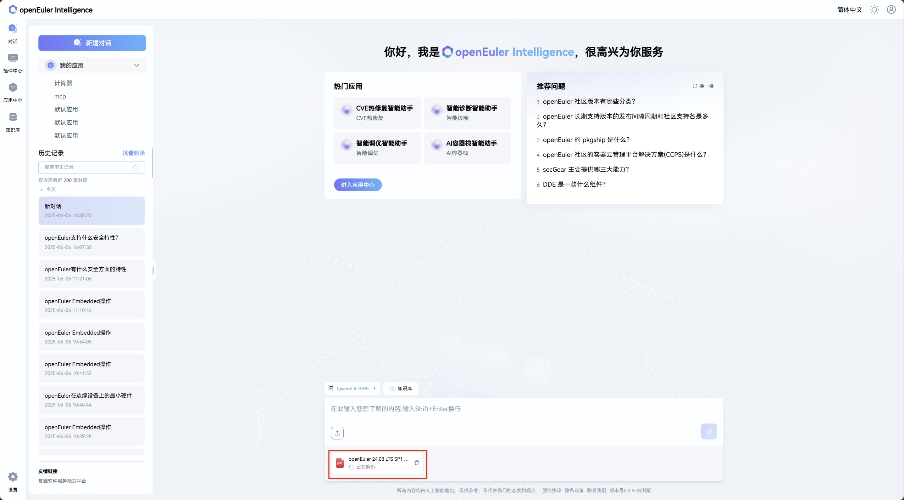

Once the files are uploaded successfully, the number of uploaded files will be displayed in the history record area on the left, as shown in Figure 8.

- Figure 8: Number of Uploaded Files Displayed on the Conversation History Tab  
  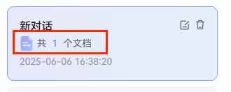

### Asking Questions About Uploaded Files
After the files are uploaded, you can ask questions about them using the same method as a regular conversation. As shown in Figure 9, you can directly inquire about content related to the uploaded files.

- Figure 9: Asking Questions Related to Uploaded Files  
  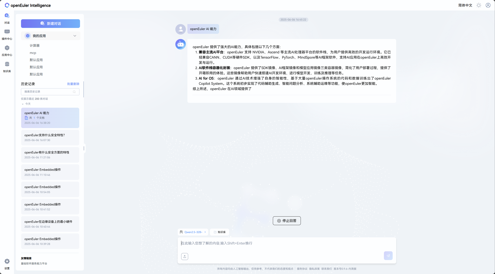

## Managing Conversations
> **Note**
>
> The conversation management area is located on the left side of the page.

### Creating a New Conversation
Click the "New Conversation" button to create a new conversation, as shown in Figure 10.

- Figure 10: "New Conversation" Button in the Top Left Corner of the Page  
  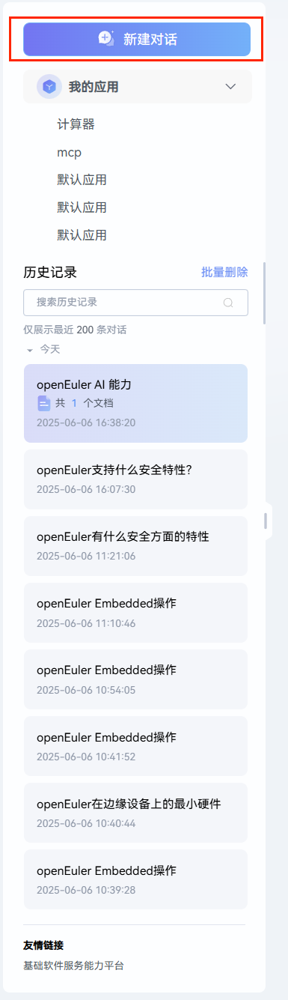

### Searching Conversation History
Enter keywords in the history search input box on the left side of the page, then click  

to search the conversation history, as shown in Figure 11.

- Figure 11: Conversation History Search Box  
  

### Managing Individual Conversation History Entries
The list of history records is located below the history search bar. On the right side of each conversation history entry, click  

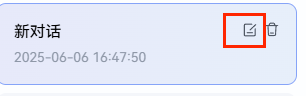

to edit the name of the conversation history entry, as shown in Figure 12.

- Figure 12: Click the "Edit" Icon to Rename the History Entry  
  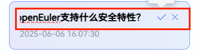

After entering the new name for the conversation history entry, click the  

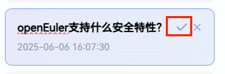

icon on the right to save the renaming, or click the  

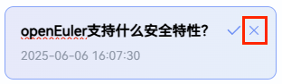

icon to abandon the renaming, as shown in Figure 13.

- Figure 13: Complete/Cancel Renaming of the History Entry  
  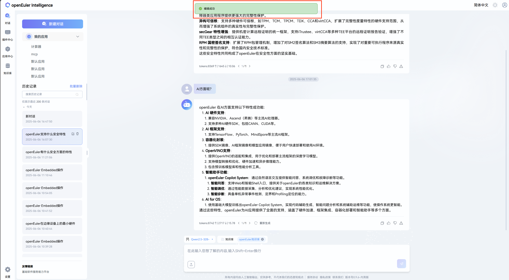

In addition, click the delete icon on the right side of a conversation history entry (as shown in Figure 14) to trigger a secondary confirmation for deleting that individual entry. In the pop-up secondary confirmation window (as shown in Figure 15), click "Confirm" to delete the entry, or click "Cancel" to abort the deletion.

- Figure 14: Click the "Trash Can" Icon to Delete an Individual History Entry  
  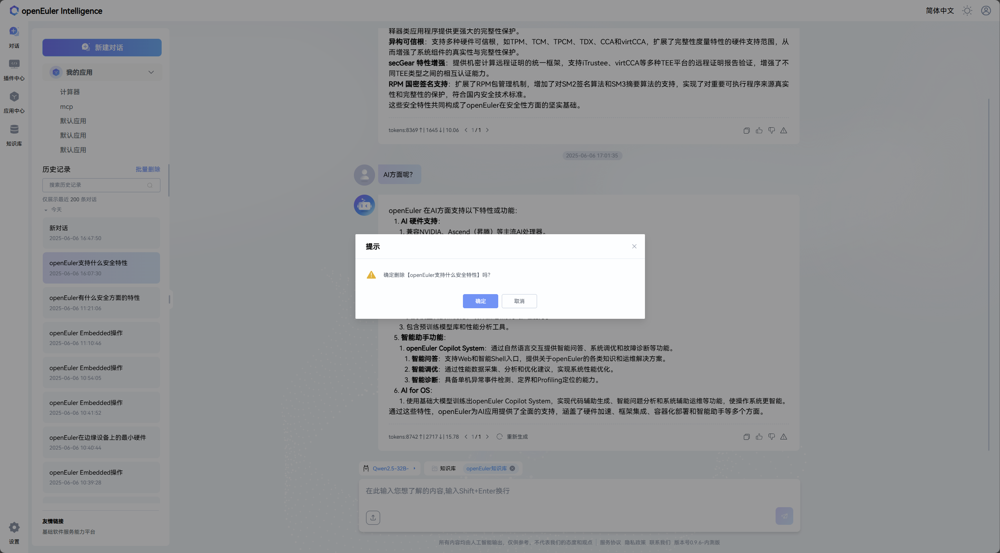

- Figure 15: Secondary Confirmation for Deleting the History Entry  
  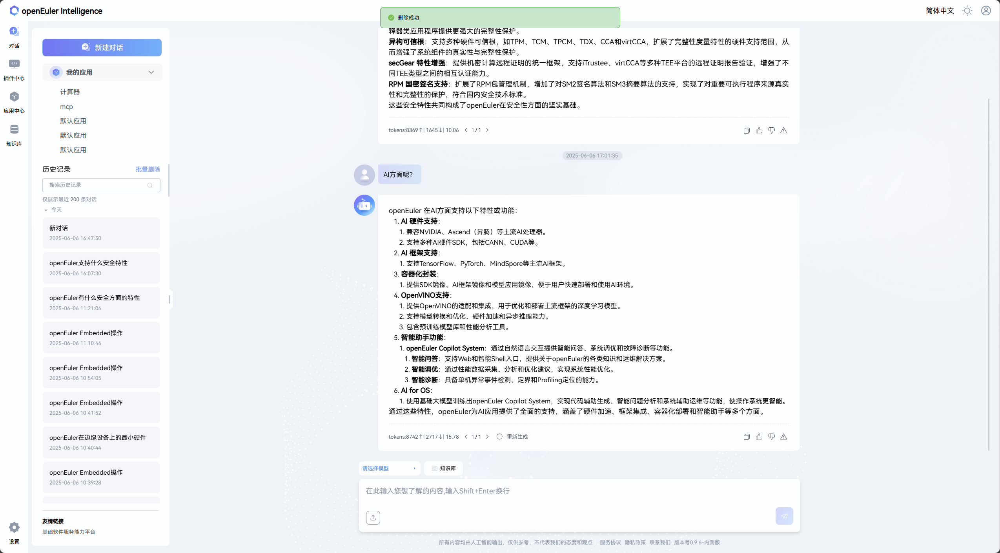

### Batch Deleting Conversation History Entries
First, click "Batch Delete" (as shown in Figure 16).

- Figure 16: Batch Delete Function in the Top Right Corner of the History Search Box  
  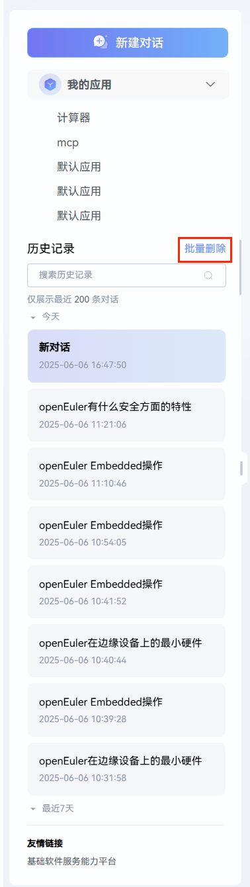

Then, select the history entries you want to delete, as shown in Figure 17. Click "Select All" to select all history entries; click an individual history entry or the checkbox on its left to select a single entry.

- Figure 17: Check the History Entries to Be Batch Deleted on the Left  
  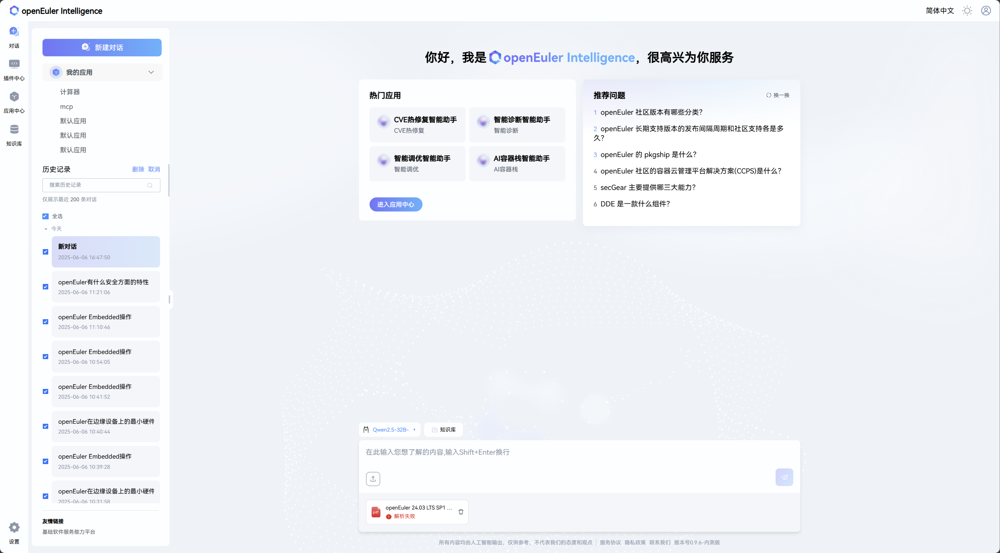

Finally, a secondary confirmation is required for batch deletion. As shown in Figure 18, click "Confirm" to delete the selected entries, or click "Cancel" to abort the batch deletion.

- Figure 18: Secondary Confirmation for Deleting Selected History Entries  
  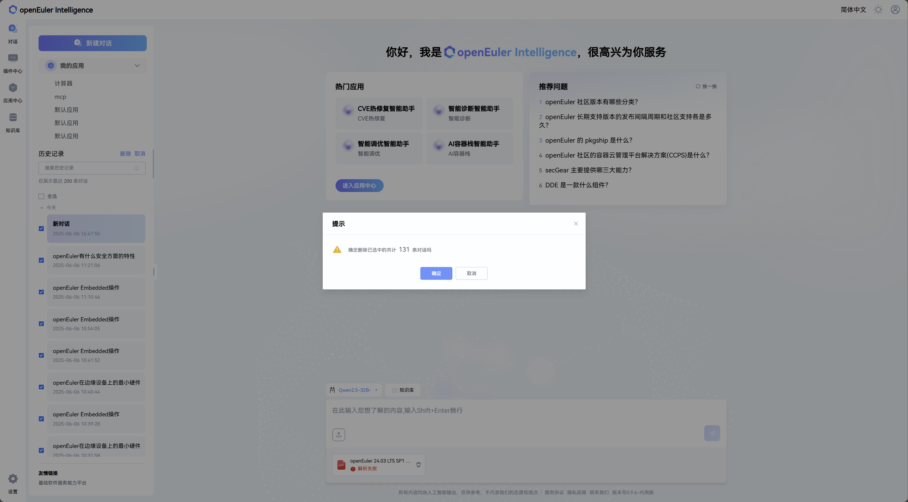

## Appendix

### Instructions for Exporting User Information
The openEuler Intelligence backend provides a user information export function. If you need to export your user information, please proactively contact us via the email <contact@openeuler.io>. Our operation and maintenance team will send the exported user information back to you via email.