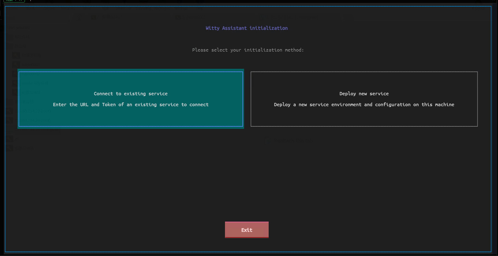
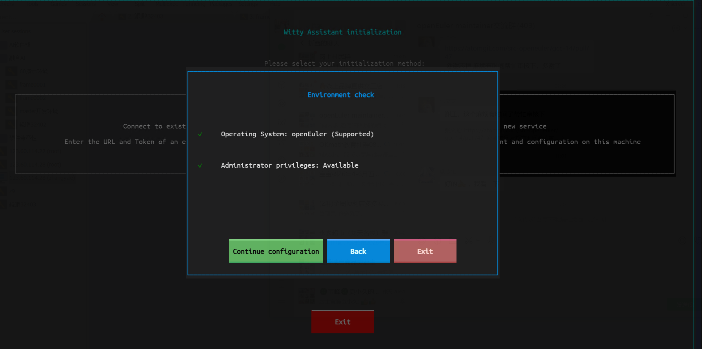
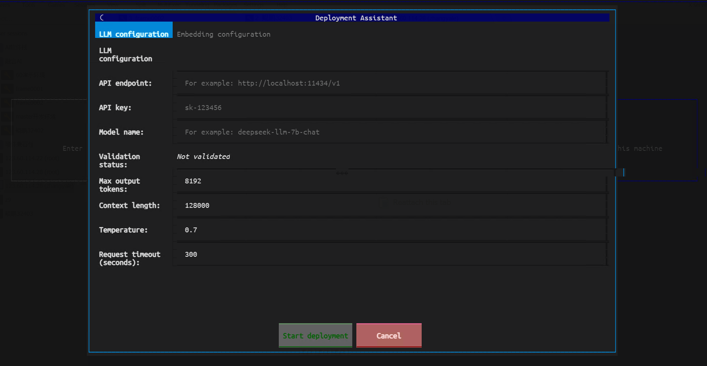
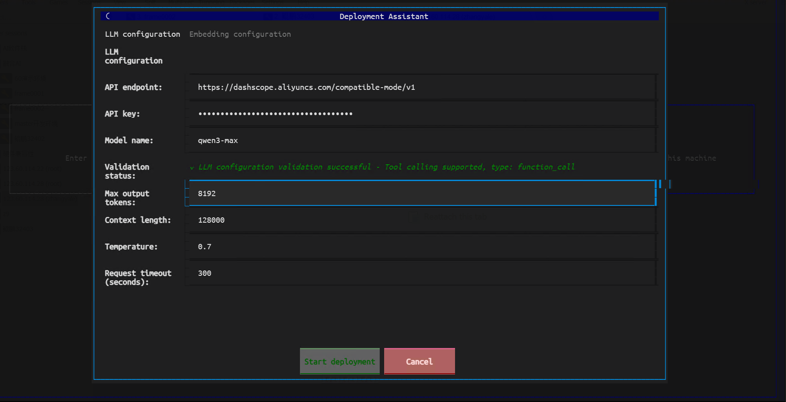
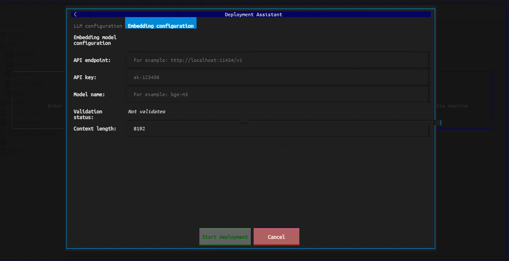
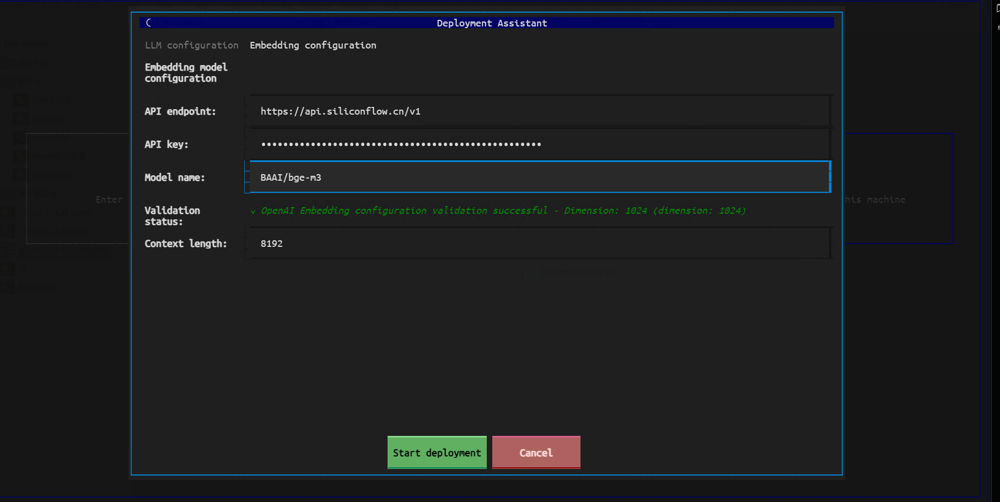
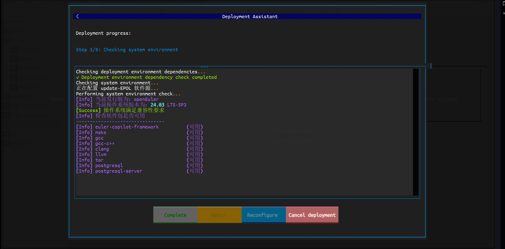
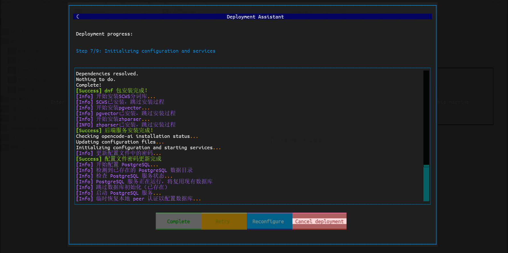
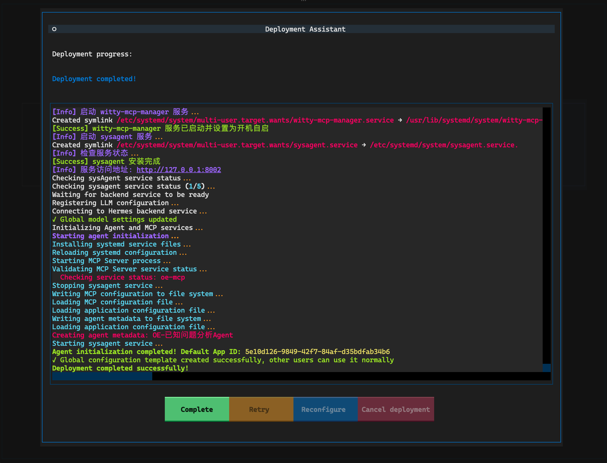

# Witty Assistant CLI Installation Guide

This manual applies to Witty Assistant version 2.0.0.

## Environment Requirements

- **Operating System**: openEuler 24.03 LTS SP3 or higher
- **Memory**: At least 8GB RAM
- **Storage**: At least 20GB free disk space
- **Network**: Stable internet connection (for offline deployment, please prepare required resources in advance, see FAQ for details)
- **LLM Services**:
  - Online: Requires access to online LLM APIs that support tool calling, such as Alibaba Cloud Model Studio, DeepSeek Chat, GLM, MiniMax, SiliconFlow, etc.
  - Local: Supports locally deployed LLM services such as llama-server, ollama, vLLM, LM Studio, etc., requiring LLMs that support tool calling, such as Qwen3, DeepSeek 3.2, GLM-4.7, MiniMax M2.1, Kimi K2, etc.
- **System Permissions**: Requires sudo privileges to install necessary software packages and dependencies

## Quick Start

### Installing Witty Assistant

Witty Assistant is pre-installed in the openEuler 24.03 LTS SP3 standard image. Before using, please run the following command to update system packages:

```bash
sudo dnf update -y
```

To manually install Witty Assistant, execute:

```bash
sudo dnf install -y witty-assistant
```

### Initializing Witty Assistant

```bash
sudo witty init
```



The process of deploying a new service involves installing RPM packages. Please ensure you execute the command with a user having administrator privileges.

> [!NOTE]Note:
>
> The interface style of the command-line client may vary depending on terminal compatibility. It is recommended to use a terminal emulator supporting 256 colors or more for the best experience. The examples in this document are based on connecting to openEuler via SSH through the Windows 11 built-in terminal.

### Choosing to Deploy a New Service

Select "Deploy New Service" on the welcome screen, and Witty Assistant will perform an environment check.



Select "Continue Configuration" to enter the parameter configuration interface.

### Configuring Parameters

In the parameter configuration interface, please set the following parameters according to your actual situation:



Configure the LLM service parameters in sequence:

- **API Endpoint**: Enter the API address of the online or local LLM service
- **API Key**: Enter the API Key or Token as required by the selected LLM service
- **Model Name**: Select the LLM to use

Please ensure the selected LLM supports the tool calling feature; otherwise, the agent will not function properly.



**Embedding Model Configuration:**

Switch to the "Embedding Configuration" tab and fill in the Embedding-related parameters:





Supported Embedding endpoint formats include OpenAI-compatible format and TEI format. Please fill in according to the actual situation.

### Starting Deployment

After completing the LLM configuration, click the "Start Deployment" button below to initiate the deployment process.





The deployment process may take a considerable amount of time; please be patient. Upon completion, the system will display a success message.



After the lightweight deployment mode is complete, initialized agents and automatically configured default agents will be displayed.

### Other Configurations

After deployment, you can perform the following configurations:

- **Set Default Agent** (applicable only to sysAgent backend):

  ```bash
  witty set-default agent
  ```

- **Manage LLM Configuration** (requires administrator privileges, applicable only to sysAgent backend):

  ```bash
  sudo witty llm
  ```

- **View Logs**:

  ```bash
  witty logs
  ```

- **Set Log Level**:

  ```bash
  witty set-default log-level INFO
  ```

## Appendix

### Using LLM Services in Offline Environments

#### Intranet LLM API Services

If the LLM service in the intranet environment needs to be accessed via HTTPS, please ensure the certificate is correctly configured in the system to avoid certificate verification failures during deployment. If a valid certificate cannot be configured, add the following to environment variables to skip certificate verification:

```bash
export OI_SKIP_SSL_VERIFY=true
```

It is recommended to add the above command to the `~/.bashrc` or `~/.bash_profile` file to ensure this environment variable is set with each login.

#### Locally Deploying LLM Services

If no LLM service is available, you can deploy a local LLM service that supports the tool calling capability. sysAgent supports the standard OpenAI API (v1/chat/completions).

If the local device does not have a GPU, it is recommended to use MoE models with fewer activated parameters, such as Qwen3-30B-A3B, for better performance. Locally deploying LLMs requires significant computing resources; it is recommended to use a server or PC with at least 32GB of memory and a multi-core CPU for deployment.

#### Configuring Proxy for sysAgent

If the intranet environment needs to access LLM services through a proxy server, set the following in the `sysagent` service file (`/etc/systemd/system/sysagent.service`):

```bash
[Service]
Environment="HTTP_PROXY=http://<proxy-server>:<port>"
Environment="HTTPS_PROXY=http://<proxy-server>:<port>"
Environment="NO_PROXY=localhost,127.0.0.1"
```

Replace `<proxy-server>` and `<port>` with the actual proxy server address and port number. After saving the file, execute the following commands to reload the service configuration and restart the `sysagent` service:

```bash
sudo systemctl daemon-reload
sudo systemctl restart sysagent
```

### FAQ

#### Q1: How to set the language of the installation interface?

**A1**: The default language of the installation interface is automatically selected based on the terminal's language environment variables. You can specify the language by setting the `LANG` environment variable, for example:

```bash
export LANG=zh_CN.UTF-8  # Set to Chinese
export LANG=en_US.UTF-8  # Set to English
```

After deployment, if you need to change the interface language, use the following command in the command line:

```bash
witty set-default locale zh_CN  # Switch to Chinese
witty set-default locale en_US  # Switch to English
```

#### Q2: What should I do if pip package downloads are slow during deployment?

**A2**: You can use domestic pip mirror sources, such as Tsinghua University's mirror source. Modify the pip configuration file to use the Tsinghua mirror source:

```bash
mkdir -p ~/.pip
echo "[global]" > ~/.pip/pip.conf
echo "index-url = https://pypi.tuna.tsinghua.edu.cn/simple" >> ~/.pip/pip.conf
```

#### Q3: How can I obtain required dependency packages if I cannot access the external network?

**A3**: You can download the required dependency packages in an environment with external network access, then transfer them to the target environment for installation. The specific steps are as follows:

1. In an environment with external network access, use the following command to download the required dependency packages:

    ```bash
    pip download -d /path/to/download/dir <package-name>
    ```

    Replace `<package-name>` with the actual package name you need to download, and `/path/to/download/dir` with the actual download directory.

2. Copy the downloaded dependency packages to the target environment.

3. In the target environment, use the following command to install the dependency packages:

    ```bash
    pip install --no-index --find-links=/path/to/download/dir <package-name>
    ```

    Replace `/path/to/download/dir` with the actual download directory, and `<package-name>` with the actual package name you need to install.

#### Q4: The server system version is restricted and cannot be upgraded to openEuler 24.03 LTS SP3. What should I do?

**A4**: You can try to manually install the required software packages and dependencies on the current system version. Since openEuler 24.03 LTS and above use kernel 6.6 and Python 3.11, you only need to modify the version information in the `/etc/os-release` and `/etc/openEuler-release` files to 24.03 LTS SP3.

Please note that this method requires you to prepare the necessary software packages and dependencies yourself and may encounter compatibility issues. It is recommended to verify in a test environment before applying to the production environment.
