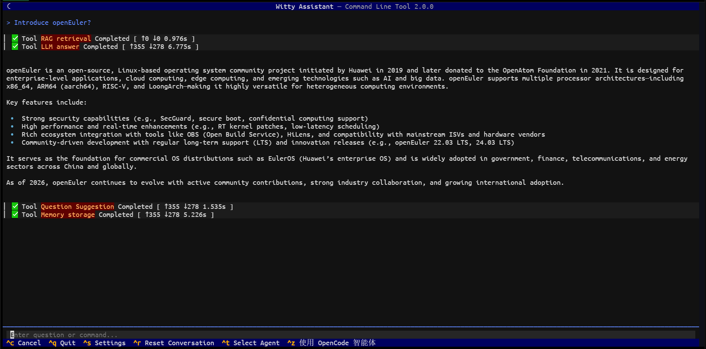
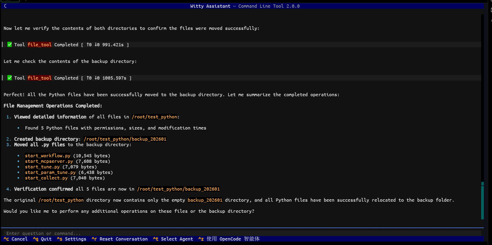

# Witty Assistant CLI Agent Introduction

## Introduction

This manual provides a comprehensive introduction to the Witty Assistant CLI agent capability system. The agent series is an intelligent interaction tool built on the Witty Assistant platform for vertical business scenarios. Relying on a dedicated technical architecture and MCP service capability foundation, it deeply adapts to business scenario requirements, enabling lightweight, scenario-specific intelligent service deployment.

Currently, the Witty Assistant platform has integrated two agents: LLM chat and Basic Operations Agent. LLM chat focuses on intelligent dialogue inquiry capabilities, providing users with natural language interaction support. The Basic Operations Agent is a specialized tool for openEuler basic operations, with its core advantage lying in the integration of two major MCP service capabilities, achieving an organic combination of full-scenario openEuler system basic operations coverage and lightweight knowledge retrieval. The Known Issues Analysis Agent will be developed for known issue diagnosis scenarios. Through standardized capability descriptions and practical use cases, this manual provides enterprise operations personnel with "ready-to-use" operational guidance, helping to lower the operational threshold and enhance the standardization and efficiency of operations work.

### Default Agent Summary Table

| Agent Name | Core Applicable Scenarios | Core Capability Modules |
| --------- | ----------- | ----------- |
| LLM chat | Intelligent dialogue inquiry | LLM model |
| Basic Operations Agent | Full-scenario basic operations (command execution, file management, system monitoring, etc.) + Lightweight knowledge retrieval | 1. oe-cli-mcp-server: Complete basic operations toolset <br> 2. rag-server: Lightweight knowledge base management and retrieval toolset |

## LLM chat

LLM chat is an intelligent dialogue agent integrated into the Witty Assistant platform. It relies on the capabilities of mainstream LLM models and does not require MCP service support. It focuses on providing users with efficient, natural intelligent dialogue inquiry services and serves as the foundational module of the Witty Assistant platform's intelligent interaction system.

### Core Capabilities

LLM chat leverages mainstream LLM models configured by users, possessing efficient and accurate natural language conversation and inquiry capabilities without requiring MCP services or complex configurations. Positioned as a "lightweight intelligent conversation assistant," it has no professional operational threshold. Users can directly initiate inquiries through natural language and quickly receive clear, accurate responses and feedback.

### Use Case

The following demonstrates a basic use case:

```markdown
Introduce openEuler
```



## Basic Operations Agent

The Basic Operations Agent integrates two core MCP services to create a one-stop operations hub combining "basic operations + knowledge retrieval." All tools are adapted to openEuler system characteristics, support local/remote execution (for some tools), provide bilingual (Chinese/English) returns, and feature strict parameter specifications with unified return formats, allowing direct integration into enterprise operations processes.

### Core Capabilities

| Service Category | MCP Tool Name | Core Function Positioning | Default Port |
| ---------- | -------- | ----------- | --- |
| Basic Operations Service | <a href="#cmd_executor_tool">cmd_executor_tool</a> | Local/SSH remote command/script execution with automatic timeout adaptation | 12555 |
| Basic Operations Service | <a href="#file_tool">file_tool</a> | Complete local file/directory query, add, modify, delete operations | 12555 |
| Basic Operations Service | <a href="#network_fix_bootproto_tool">network_fix_bootproto_tool</a> | Automatically fix NetworkManager IP acquisition issues | 12555 |
| Basic Operations Service | <a href="#pkg_tool">pkg_tool</a> | openEuler software package query, install, update, remove, cache cleanup | 12555 |
| Basic Operations Service | <a href="#proc_tool">proc_tool</a> | Process/service view, start, stop, force termination | 12555 |
| Basic Operations Service | <a href="#ssh_fix_tool">ssh_fix_tool</a> | Diagnose and fix openEuler system SSH connection issues | 12555 |
| Basic Operations Service | <a href="#sys_info_tool">sys_info_tool</a> | Batch collection of system/hardware/security information | 12555 |
| Lightweight RAG Service | <a href="#create_knowledge_base">create_knowledge_base</a> | Create independent knowledge bases with custom chunk size and vectorization configuration | 12311 |
| Lightweight RAG Service | <a href="#delete_knowledge_base">delete_knowledge_base</a> | Delete specified knowledge base with cascading document and chunk cleanup | 12311 |
| Lightweight RAG Service | <a href="#list_knowledge_bases">list_knowledge_bases</a> | List all knowledge bases with details and current selection status | 12311 |
| Lightweight RAG Service | <a href="#select_knowledge_base">select_knowledge_base</a> | Select the current knowledge base for subsequent document operations | 12311 |
| Lightweight RAG Service | <a href="#import_document">import_document</a> | Concurrent multi-format document import with automatic parsing and vectorization | 12311 |
| Lightweight RAG Service | <a href="#search">search</a> | Hybrid keyword+vector retrieval returning most relevant results | 12311 |
| Lightweight RAG Service | <a href="#list_documents">list_documents</a> | View all document details under the current knowledge base | 12311 |
| Lightweight RAG Service | <a href="#delete_document">delete_document</a> | Delete specified document with cascading associated chunk cleanup | 12311 |
| Lightweight RAG Service | <a href="#update_document">update_document</a> | Update document chunk size and re-parse for vectorization | 12311 |
| Lightweight RAG Service | <a href="#export_database">export_database</a> | Export knowledge base database file for backup | 12311 |
| Lightweight RAG Service | <a href="#import_database">import_database</a> | Import database file, merging knowledge bases and documents | 12311 |

### Use Cases

The following demonstrates file operations, providing natural language interaction prompt formats with key information such as file paths for immediate use. All scenarios are tailored to actual enterprise operations needs.

- Scenario: Local File Batch Management

  ```text
    Need to manage files in the local /root/test_python directory, perform the following operations:
       1. View detailed information (including permissions, size, modification time) of all files in the /root/test_python directory;
       2. Create an empty folder named backup_202601 in the /root/test_python directory;
       3. Move all files with .py extension from the /root/test_python directory to the backup_202601 folder;
       4. Verify the move results and return the list of successfully moved files.
  ```
  


## MCP Overview

The following details each Server's information and the core details of their subordinate tools.

### MCP_Server List

| Port | Service Name | Directory Path | Description |
|--------|----------|----------|------|
| 12555 | oe-cli-mcp-server | mcp_center/oe_cli_mcp_server | Basic Operations MCP: Provides core tools including command execution, file management, system information query, process management, package management, SSH repair, Network repair, etc. |
| 12311 | rag-server | mcp_center/third_party_mcp/rag | Lightweight RAG Service: Provides core tools including knowledge base creation and management, document import and retrieval, database export and import, etc. |

### MCP_Server Details

#### oe-cli-mcp-server

| MCP_Server Name | MCP_Tool List | Tool Function | Core Input Parameters | Key Return Content |
|-----------------|---------------|----------|--------------|--------------|
|                 | <a id="cmd_executor_tool">cmd_executor_tool</a> | Supports local/SSH remote execution of shell commands/scripts, automatically sets timeout based on command type, terminates automatically on timeout | - host: Target host IP/hostname (default 127.0.0.1 for local execution)<br>- command: Shell command/script to execute (required)<br>- timeout: Timeout in seconds (optional, positive integer) | success (execution result), message (execution info/error message), result (command output content), target (execution target), timeout_used (actual timeout used) |
|                 | <a id="file_tool">file_tool</a> | Supports complete local file/directory query, add, modify, delete operations, pure Python implementation with no shell dependency | - action: Operation type (required, enum: ls/cat/add/append/edit/rename/chmod/delete)<br>- file_path: Absolute path to target file/directory (required)<br>- Other parameters: content (content to write), new_path (new path), mode (permission mode), etc. (passed as needed) | success (execution result), message (execution info/error message), result (operation results list), file_path (operation path), target (fixed as 127.0.0.1) |
|                 | <a id="network_fix_bootproto_tool">network_fix_bootproto_tool</a> | Automatically fixes the issue where NetworkManager fails to obtain IP after startup, edits network card configuration and restarts services | - target: Target host IP/hostname (default 127.0.0.1)<br>- lang: Language setting (optional) | success (fix result), message (fix result description), target (target host), result (detailed step information list) |

| **oe-cli-mcp-server** | <a id="pkg_tool">pkg_tool</a> | Supports openEuler system software package query, install, update, remove, cache cleanup, based on dnf/rpm with secure invocation | - action: Operation type (required, enum: list/info/install/local-install/update/update-sec/remove/clean)<br>- Other parameters: pkg_name (package name), rpm_path (absolute RPM path), cache_type (cache type), etc. (passed as needed) | success (execution result), message (execution info/error message), result (operation results list/log), pkg_name (operated package name), target (fixed as 127.0.0.1) |
|                 | <a id="proc_tool">proc_tool</a> | Supports process/service view, start, stop, force termination management operations, based on ps/systemctl/kill commands | - proc_actions: List of operation types (required, enum: list/find/stat/start/restart/stop/kill)<br>- Other parameters: proc_name (process name), pid (process ID), service_name (service name), etc. (passed as needed) | success (operation result), message (operation info/error message), result (operation results list/log), target (fixed as 127.0.0.1), proc_actions (executed operations) |
|                 | <a id="ssh_fix_tool">ssh_fix_tool</a> | Diagnoses and fixes SSH connection failures on openEuler systems, checks port connectivity, sshd service status, and repairs configuration | - target: Target host IP/hostname (required)<br>- port: SSH port (default 22)<br>- lang: Language setting (optional) | success (fix result), message (fix result description), target (target host), result (list of execution results for each step) |
|                 | <a id="sys_info_tool">sys_info_tool</a> | Batch collects system, hardware, and security information from openEuler systems, pure Python + safe system command invocation | - info_types: List of information types (required, enum: os/load/uptime/cpu/mem/disk/gpu/net/selinux/firewall) | success (collection result), message (collection info/error message), result (structured collected data), target (fixed as 127.0.0.1), info_types (collected types) |

#### rag-server

| MCP_Server Name | MCP_Tool List | Tool Function | Core Input Parameters | Key Return Content |
|-----------------|---------------|----------|--------------|--------------|
|                 | <a id="create_knowledge_base">create_knowledge_base</a> | Creates a new knowledge base, supports custom chunk size and vectorization configuration; must be selected after creation before use | - kb_name: Knowledge base name (required, unique)<br>- chunk_size: Chunk size in tokens (required)<br>- Other parameters: embedding_model (vectorization model), embedding_endpoint (service endpoint), etc. (optional) | success (creation result), message (operation description), data (includes kb_id, kb_name, chunk_size) |
|                 | <a id="delete_knowledge_base">delete_knowledge_base</a> | Deletes specified knowledge base; cannot delete currently selected knowledge base; cascades deletion of subordinate documents and chunks | - kb_name: Knowledge base name (required) | success (deletion result), message (operation description), data (includes deleted kb_name) |
|                 | <a id="list_knowledge_bases">list_knowledge_bases</a> | Lists all available knowledge bases with detailed information and current selection status | No parameters | success (query result), message (operation description), data (includes knowledge base list, count, current selected kb_id) |
| **rag-server** | <a id="select_knowledge_base">select_knowledge_base</a> | Selects a knowledge base as the current working object; subsequent operations are associated with this knowledge base | - kb_name: Knowledge base name (required) | success (selection result), message (operation description), data (includes kb_id, kb_name, document count) |
|                 | <a id="import_document">import_document</a> | Concurrently imports multiple files into the currently selected knowledge base, supports TXT/DOCX/DOC formats, automatically parses, splits, and vectorizes | - file_paths: List of absolute file paths (required)<br>- chunk_size: Chunk size in tokens (optional, defaults to knowledge base configuration) | success (import result), message (operation description including success/failure counts), data (includes total files, successful/failed file lists) |
|                 | <a id="search">search</a> | Performs hybrid keyword and vector retrieval on the currently selected knowledge base, weights and merges results with deduplication and sorting | - query: Query text (required)<br>- top_k: Number of results to return (optional, defaults to configuration value) | success (retrieval result), message (retrieval description), data (includes chunk list, result count) |
|                 | <a id="list_documents">list_documents</a> | Views detailed information of all documents under the currently selected knowledge base | No parameters | success (query result), message (operation description), data (includes document list, count) |
|                 | <a id="delete_document">delete_document</a> | Deletes a specified document under the currently selected knowledge base, cascades deletion of associated chunks | - doc_name: Document name (required) | success (deletion result), message (operation description), data (includes deleted doc_name) |
|                 | <a id="update_document">update_document</a> | Updates document chunk size, re-parses, splits, and generates new vectors | - doc_name: Document name (required)<br>- chunk_size: New chunk size in tokens (required) | success (update result), message (operation description), data (includes doc_id, doc_name, new chunk count/size) |
|                 | <a id="export_database">export_database</a> | Exports the entire knowledge base database file to a specified path for backup | - export_path: Absolute export path (required) | success (export result), message (operation description), data (includes source path, export path) |
|                 | <a id="import_database">import_database</a> | Imports a .db database file, merges content into the existing knowledge base, automatically handles name conflicts | - source_db_path: Absolute path to source database (required) | success (import result), message (operation description), data (includes source path, imported knowledge base/document count) |
