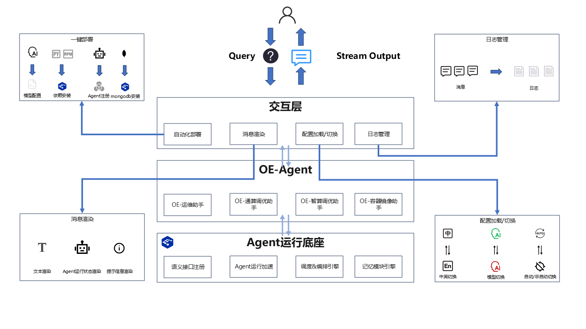

# Witty Assistant CLI Introduction

## Overview

Witty Assistant CLI (abbreviated as witty shell) is a shell-side tool developed based on the openEuler operating system. Leveraging the core capabilities of large language models, it enables automatic conversion of user natural language requests to tool calls, and presents tool execution results intuitively in natural language form, providing openEuler users with an efficient and convenient operations interaction interface.

## Architecture Diagram

## Feature Introduction

The core functions of Witty Assistant CLI consist of four major modules. The responsibilities and implementation logic of each module are as follows:

### Automated Deployment Module

This module implements one-click deployment of Witty Assistant CLI and its associated components through standardized processes. The specific流程 includes:

- **Interactive Configuration**: Obtains key information such as framework deployment form and LLM basic parameters through user interaction, and automatically writes them to configuration files, ensuring accuracy of deployment parameters;

- **Dependency Installation**: Automatically executes deployment scripts to complete the installation of two types of dependencies:
  - RPM Dependencies: Includes core components such as the Agent scheduling framework, ensuring tool scheduling capabilities;
  - Python Dependencies: Covers basic libraries supporting Witty Assistant CLI deployment and operation, ensuring completeness of tool functionality.

### Message Rendering Module

This module focuses on standardized rendering of three types of key messages, aiming to enhance information display readability and user interaction experience:

- **Text Message Rendering**: Formats summary information after task execution, clearly presenting task results;

- **Agent Running Status Rendering**: Displays real-time single-step execution status of Agents, facilitating user monitoring of task progress;

- **Prompt Message Rendering**: In non-automatic running mode, standardizes rendering of operation prompt information requiring user confirmation, guiding users through interactions.

### Configuration Loading and Switching Module

This module supports flexible switching of core shell-side configurations to meet usage requirements in different scenarios. Specific switching capabilities include:

- **Chinese/English Information Switching**: Enables switching between Chinese and English for shell interface display language and Agent output content, adapting to users with different language preferences;

- **Model Switching**: Supports quick switching of LLMs used for Agent scheduling, allowing users to select appropriate models based on business requirements;

- **Interaction Mode Switching**: Provides switching functionality for Agent running modes (automatic execution / user manual confirmation execution), balancing efficiency and operational controllability.

### Log Management Module

This module performs standardized log management of key operational information with a time-dimension focus: automatically backs up shell operation logs and Agent execution logs according to preset file sizes, ensuring logs are traceable and manageable, providing data support for problem troubleshooting and operations analysis.

## Value

Leveraging its four core capabilities—one-click deployment, standardized message rendering, flexible configuration switching, and规范化 log management—Witty Assistant CLI creates a natural language operations interaction interface for openEuler users. It effectively lowers the entry barrier for new openEuler users while reducing operational complexity for operations personnel, decreasing overall operations costs, and helping to improve the operational efficiency of the openEuler operating system.
