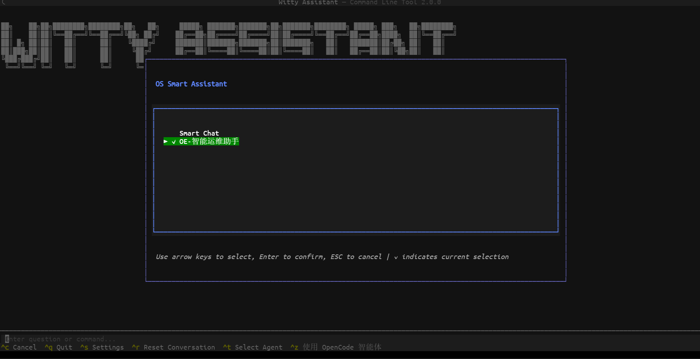
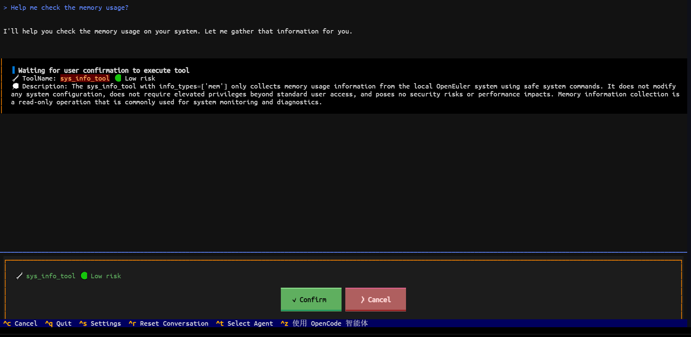
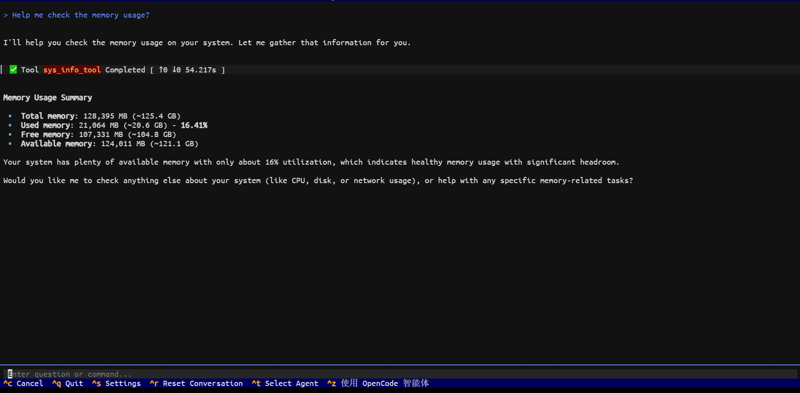
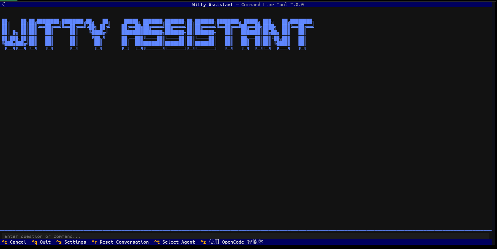
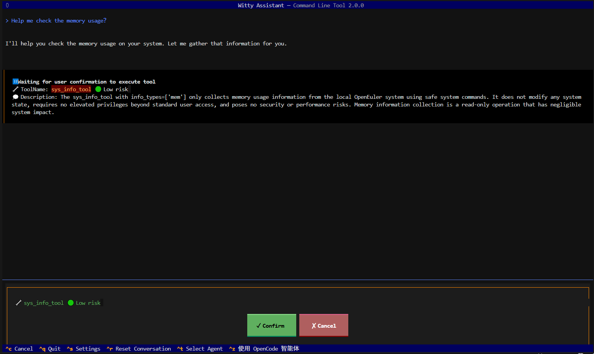
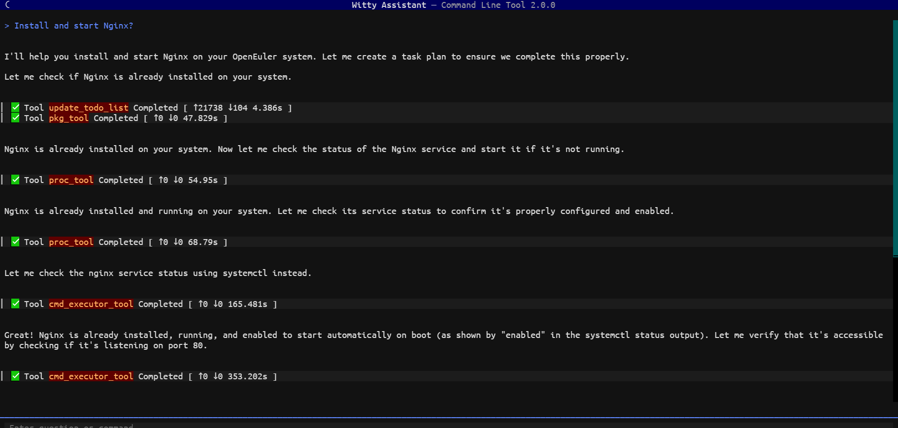
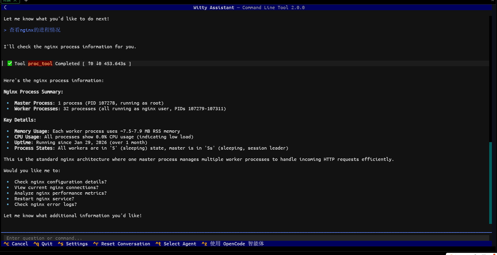
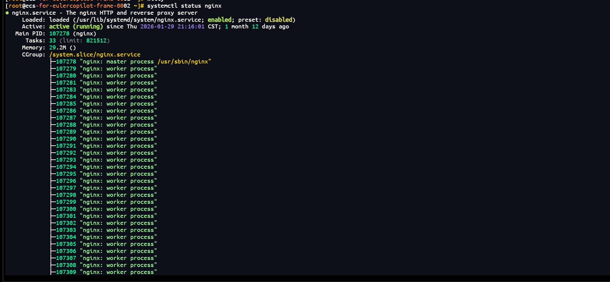

# Witty Assistant CLI Usage Introduction

## Introduction

Witty Assistant CLI is an OS intelligent assistant under openEuler Intelligence. The command-line client of Witty Assistant provides an AI-driven command-line interaction experience, supports multiple LLM backends, integrates the MCP protocol, and offers a modern TUI interface.

### Core Features

- **Intelligent Terminal Interface**: Modern TUI interface based on Textual
- **Streaming Response**: Real-time display of AI reply content
- **Deployment Assistant**: Built-in automatic deployment functionality for Witty Assistant backend services
- **Configuration Management**: Built-in settings interface (Ctrl+S) and local configuration files for easy backend switching/connection information updates

## Usage Instructions

### Opening Witty Assistant

Open Witty Assistant, ctrl + c to interrupt, ctrl + q to exit, ctrl + s to open settings, ctrl + t to select an agent, mouse selection is supported.

```sh
witty
```

<src="./pictures/open_Witty.png" width="1200" />

### Selecting an Agent

Click to select an agent (ctrl + t), default is Basic Operations Agent, use up/down keys to select, Enter to confirm, ESC to cancel, highlight indicates selection. Refer to [Agent Introduction](https://atomgit.com/openeuler/euler-copilot-framework/blob/master/docs/zh/witty_assistant/witty_shell/user_guide/agent_introduce.md) for agent details.



### Using an Agent

To use an agent, take the Basic Operations Agent as an example here, press Enter to confirm and enter the dialogue interface.

<src="./pictures/open_Witty.png" width="1200" />

Enter commands or questions in the lower-left input field, such as "check memory usage for me". The agent will automatically select the appropriate MCP tool based on the query and ask whether to execute; click confirm here.



Output results:



>[!NOTE]Note:
>
> Settings -> Change User Settings -> General Settings, you can set the MCP tool authorization mode.

### Witty Assistant Presets

You can configure the client by entering the following commands before witty.

#### Configuring Language

**Supported Languages:**

- **English (en_US)** - Default language
- **Simplified Chinese (zh_CN)**

Switch to Simplified Chinese

```sh
witty set-default locale zh_CN
```

Switch to English

```sh
witty set-default locale en_US
```

Language settings are automatically saved and will take effect on next startup.

#### Setting Default Agent

Command to set default agent

```sh
witty set-default agent
```

#### Setting Log Level and Verifying

```sh
witty set-default log-level INFO
```

### Viewing Logs

View the latest log content:

```sh
witty logs
```

### Managing LLM Configurations

```sh
witty llm
```

<!-- img src="./pictures/set_llm.png" width="1200" -->

### Interface Operation Shortcuts

- **Ctrl+S**: Open settings interface
- **Ctrl+R**: Reset conversation history
- **Ctrl+T**: Select agent
- **Tab**: Switch focus between command input box and output area
- **Esc**: Exit application
- **Ctrl+C**: Cancel currently executing task (interrupt LLM request or stop command execution)
- **Ctrl+Q**: Exit program and close TUI

>[!NOTE]Note:
>
> For operation details, including witty logs, etc., refer to the shell [readme](https://atomgit.com/openeuler/euler-copilot-shell)

## Platform Demonstration

### Using Windows Terminal

#### Opening Witty Assistant

```sh
witty
```



#### Selecting an Agent


#### Using an Agent


The agent outputs results based on tool execution results


### Using VSCode

#### Opening Witty Assistant

<src="./pictures/vscode_open.png" width="1200" />

#### Selecting an Agent

Usage method refers to the above, the following mainly demonstrates some pages:

<src="./pictures/vscode_agent_set.png" width="1200" />

#### Using an Agent



## Use Case

Taking "Nginx service startup" as an example, demonstrating advanced usage of the intelligent assistant CLI:

**Natural Language Interaction**: Start Witty Assistant, switch to "Basic Operations Agent", i.e., OE Intelligent Operations Assistant, enter "install nginx and start it";



**Check nginx Process**: Enter "check nginx process status" to verify if installation and startup were successful by viewing the nginx process;



**Verify Results Using Command Line**: Use `systemctl status nginx` to verify if nginx was successfully started.


