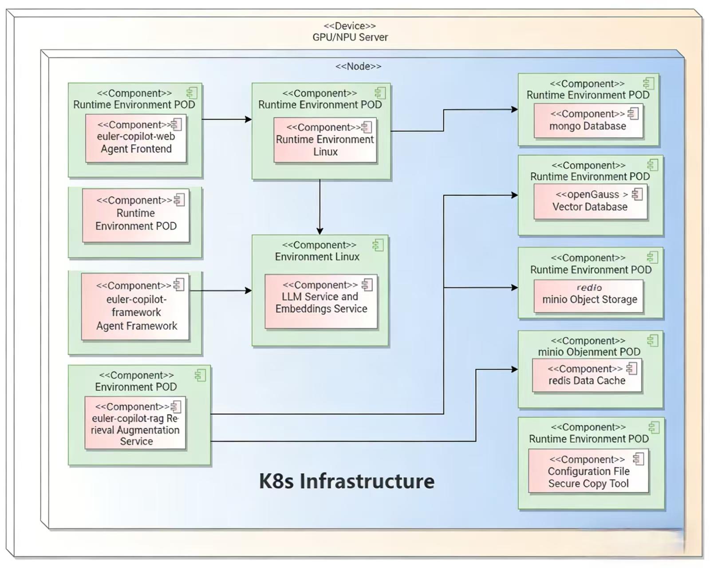
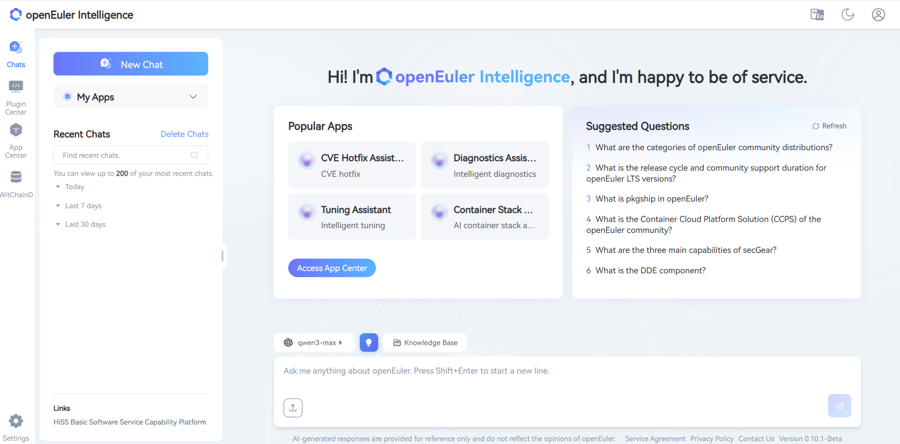
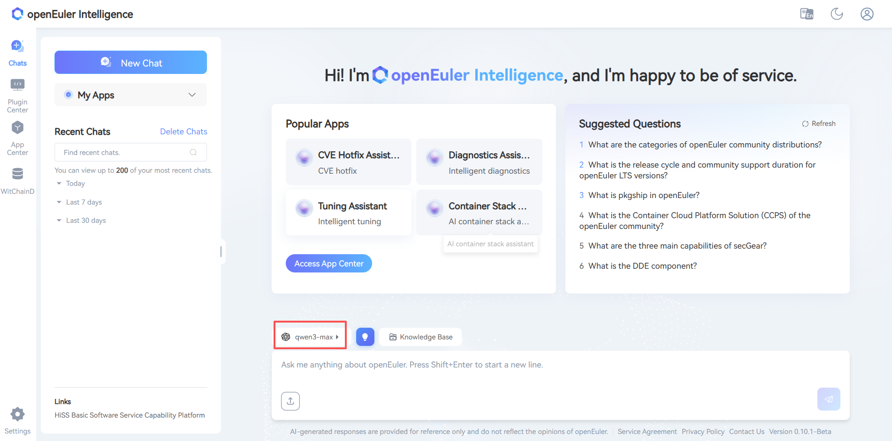
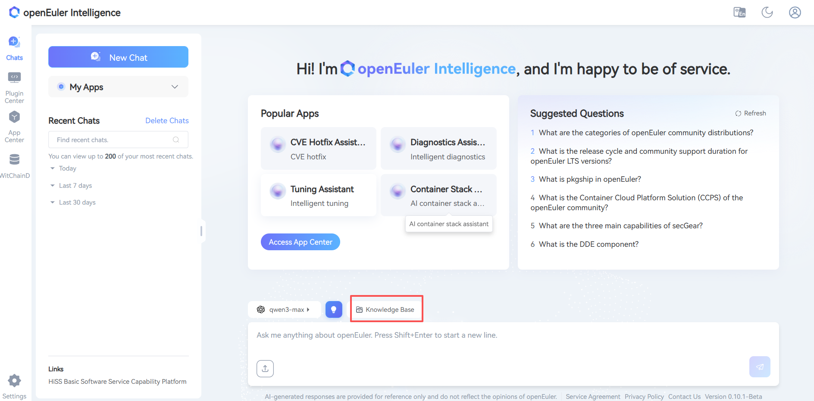
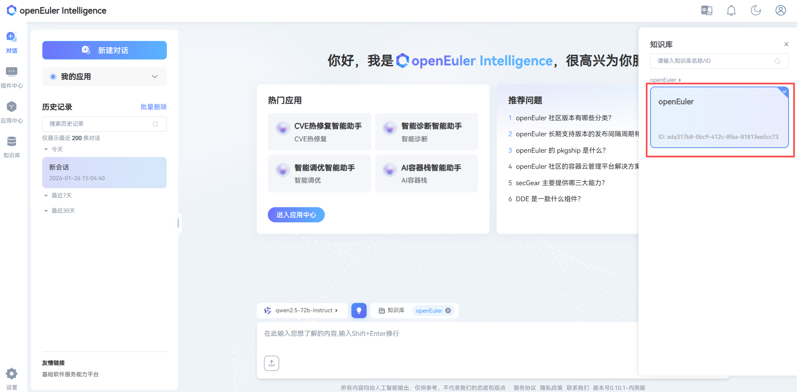

# Witty Assistant Web Deployment Guide

**Version Information**
Current Version: v0.10.1
Release Date: January 23, 2026

## Product Overview

Witty Assistant Web is an intelligent Q&A tool. The web client of Witty Assistant provides an AI-driven intelligent Q&A interaction interface, supports multiple LLM backends, integrates the MCP protocol. Using the Witty Assistant web client can solve the convenience issue of operating system knowledge acquisition and empower developers and operations personnel with OS domain models. As an operating system knowledge acquisition tool, it supports intelligent Q&A, knowledge base management, agent applications and workflow applications, as well as semantic interface upload. Combined with agent task planning capabilities, it significantly lowers the barrier to developing and using operating system features.

This guide provides deployment instructions for the Witty Assistant intelligent assistant system based on automated scripts, supporting both one-click automatic deployment and manual step-by-step deployment methods.

### Component Introduction

| Component Name | Service Port | Service Description |
| --------- | --------- | --------- |
| euler-copilot-framework | 8002 (Internal) | Agent framework core service, responsible for task scheduling and execution |
| euler-copilot-web | 8080 | Web frontend user interface service |
| euler-copilot-rag | 9988 (Internal) | Retrieval Augmented Generation service, supporting document retrieval and analysis |
| authhub-backend-service | 11120 (Internal) | Authentication and authorization service backend |
| authhub-web-service | 8000 | Authentication and authorization service frontend |
| mysql | 3306 (Internal) | MySQL relational database, storing user data and configuration information |
| redis | 6379 (Internal) | Redis cache database, supporting session and temporary data storage |
| minio | 9000/9001 (Internal/External) | MinIO object storage service, for document and file management |
| mongo | 27017 (Internal) | MongoDB document database, storing unstructured data |
| openGauss | 5432 (Internal) | openGauss vector database, supporting semantic retrieval and vector computation |
| secret_inject | No port | Configuration file security injection tool, ensuring sensitive information security |

### System Requirements

#### Software Requirements

| Component | Version Requirements | Remarks |
| ------ | --------- | --------- |
| Operating System | openEuler 22.03 LTS or higher | Officially certified versions recommended |
| Kubernetes | K3s v1.30.2+ (with Traefik Ingress) | Lightweight Kubernetes distribution |
| Package Management | Helm v3.15.3+ | Kubernetes application package management tool |
| Python Environment | Python 3.9.9+ | Model download and script execution environment |

#### Hardware Specifications

| Resource Type | Minimum Configuration | Production Recommendation | Description |
| --------- | --------- | ------------- | ------ |
| CPU Cores | 4 cores | 16 cores or more | AVX512 instruction set support recommended |
| Memory | 4GB | 64GB | |
| Storage Space | 32GB | 64GB+ | |
| LLM | qwen2.5-14B | qwen2.5-32B | Supports local deployment or API calls |
| GPU Memory (Optional) | NVIDIA RTX A4000 8GB | NVIDIA A100 80GB * 2 | Required only for GPU inference scenarios |

**Deployment Prerequisites Description**:

1. For pure CPU environments, it is recommended to call cloud service models via API or deploy quantized local models
2. If a Kubernetes cluster (version ≥1.28) already exists, the K3s installation step can be skipped

### Deployment Architecture



## Quick Start

### Obtaining Deployment Scripts

Download the latest repository from the [Official Git Repository](https://atomgit.com/openeuler/euler-copilot-framework.git):

```bash
# 1. Execute in network-connected environment
cd /home
git clone https://atomgit.com/openeuler/euler-copilot-framework.git -b release-0.10.1
```

```bash
# 2. Execute in offline environment
# Switch to release-0.10.1 branch, download ZIP and upload to target server
unzip euler-copilot-framework.tar -d /home
cd /home/euler-copilot-framework/deploy/scripts
```

### Obtaining Resources (Execute in Offline Environment)

Manually download the latest images and tools from the [Witty Assistant Resource Address](https://repo.oepkgs.net/openEuler/rpm/openEuler-22.03-LTS/contrib/eulercopilot/):

**Resource List**:

| Resource Type | File List | Storage Location | Architecture Support |
| --------- | --------- | --------- | --------- |
| **Image Files** | `euler-copilot-framework:0.10.1-[x86/arm]`<br>`euler-copilot-web:0.10.1-[x86/arm]`<br>`data_chain_back_end:0.10.1-[x86/arm]`<br>`data_chain_web:0.10.1-[x86/arm]`<br>`authhub:0.9.3-x86`<br>`authhub-web:0.9.3-x86`<br>`opengauss:latest-x86`<br>`redis:7.4-alpine-x86`<br>`mysql:8-x86`<br>`minio:empty-x86`<br>`mongo:7.0.16-x86`<br>`secret_inject:dev-x86` | /home/eulercopilot/images | x86_64, ARM64 |
| **Model Files** | `bge-m3-Q4_K_M.gguf`<br>`deepseek-llm-7b-chat-Q4_K_M.gguf` | /home/eulercopilot/models | Universal |
| **Deployment Tools** | `helm-v3.15.0-linux-{arm64/amd64}.tar.gz`<br>`k3s-airgap-images-{arm64/amd64}.tar.zst`<br>`k3s-{arm64/amd64}`<br>`k3s-install.sh`<br>`ollama-linux-{arm64/amd64}.tgz` | /home/eulercopilot/tools | x86_64, ARM64 |

```bash
# In a network-connected environment, you can execute scripts to save images and transfer to target server
# Enter the script directory
cd /home/euler-copilot-framework/deploy/scripts/9-other-script/

# Execute image save script (specify version and architecture)
bash save_images.sh --version 0.10.1 --arch x86

# Images will be saved to /home/eulercopilot/images, use SCP to transfer image files to target server
scp -r /home/eulercopilot/images/* root@target-server:/home/eulercopilot/images/
```

### Deployment Execution

#### One-Click Deployment

- One-click automatic deployment mode is mainly suitable for users **without pre-deployed LLM resources**:

   ```bash
   bash deploy.sh
   ```

   ```text
   ==============================
   Witty Assistant Deployment System
   ==============================
   0) One-click Automatic Deployment Mode - Fully automatic installation (recommended for beginners)
   1) Manual Step-by-Step Deployment Mode 
   2) Service Restart Management
   3) System Uninstallation and Cleanup
   4) Exit Deployment Program
   ==============================
   Please select deployment mode [0-4]: 0
   ```

- **Automatically installs and configures all necessary components**:
  - Automatically deploys k3s, helm, Ollama
  - Downloads and deploys Deepseek LLM (deepseek-llm-7b-chat)
  - Downloads and deploys Embedding model (bge-m3)
  - Installs databases, Authhub authentication service, and Witty Assistant application
  - Can run in pure CPU environment; if GPU resources are available, GPU drivers must be pre-installed, and acceleration will be automatically utilized
  - Automatically configures model interfaces for Witty Assistant calls

#### Step-by-Step Deployment

- Step-by-step deployment mode is mainly suitable for scenarios where **LLM interfaces and embedding model interfaces already exist**.

- Prepare model services in advance:
  - Ensure LLM service is deployed or accessible
  - Ensure embedding model service is deployed or accessible
  - Edit the values.yaml file before deployment, pre-fill model service information, such as each model's API endpoint, key, name, etc.

   ```yaml
   # Configuration example:
   models:
   # LLM for Q&A; requires OpenAI-compatible API
   answer:
      # [Required] API endpoint URL (check API provider documentation to confirm if "v1" suffix is needed)
      endpoint: https://$ip:$port/v1
      # [Required] API key; default is empty
      key: sk-123456
      # [Required] Model name
      name: qwen3-32b
      # [Required] Model maximum context length; recommended >=8192
      ctxLength: 8192
      # Model maximum output length, recommended >=2048
      maxTokens: 8192
   # Model for function calling; specific inference frameworks recommended
   functionCall:
      # Inference framework type, default is ollama
      # Available framework types: ["vllm", "sglang", "ollama", "openai"]
      backend: openai
      # [Required] Model endpoint; check API provider documentation to confirm if "v1" suffix is needed
      # Leave empty to use same configuration as Q&A model
      endpoint: https://$ip:$port/v1
      # API key; leave empty to use same configuration as Q&A model
      key: sk-123456
      # Model name; leave empty to use same configuration as Q&A model
      name: qwen3-32b
      # Model maximum context length; leave empty to use same configuration as Q&A model
      ctxLength: 8192
      # Model maximum output length; leave empty to use same configuration as Q&A model
      maxTokens: 8192
   # Model for data embedding
   embedding:
      # Inference framework type, default is openai
      # [Required] Embedding API type: ["openai", "mindie"]
      type: openai
      # [Required] Embedding URL (requires "v1" suffix)
      endpoint: https://$ip:$port/v1
      # [Required] Embedding model API key
      key: sk-123456
      # [Required] Embedding model name
      name: BAAI/bge-m3
   # Model for reranking rag retrieval results
   reranker:
      # [Required] Reranker interface type: ["guijiliudong", "algorithm",
      # "bailian", "v1lm", "assecend"]
      type: guijiliudong
      # [Required] Reranker URL (requires "/v1/rerank" suffix)
      endpoint: https://api.siliconflow.cn/v1/rerank
      # [Required] Reranker model API Key
      key: sk-123456
      # [Required] Reranker model name
      name: BAAI/bge-reranker-v2-m3
      # [Required] Reranker model icon URL
      icon: https://sf-maas-uat-prod.oss-cn-shanghai.aliyuncs.com/Model_LOGO/BAAI.svg
   ```

   ```bash
   # Execute script
   bash deploy.sh
   ```

   ```bash
   # Select 1 for manual deployment
   ==============================
         Main Deployment Menu
   ==============================
   0) One-click Automatic Deployment 
   1) Manual Step-by-Step Deployment - Existing Model Services
   2) Restart Services
   3) Uninstall All Components and Clear Data
   4) Exit Program
   ==============================
   Please enter option number (0-3): 1
   ```

   ```bash
   # Skip steps 3, 4, 5 and execute sequentially
   ==============================
         Manual Step-by-Step Deployment Menu
   ==============================
   1) Execute Environment Check Script
   2) Install k3s and helm
   3) Install Ollama - Can be skipped if model services already exist
   4) Deploy Deepseek Model - Can be skipped if model services already exist
   5) Deploy Embedding Model - Can be skipped if model services already exist
   6) Install Databases
   7) Install AuthHub
   8) Install Witty Assistant
   9) Return to Main Menu
   ==============================
   Please enter option number (1-9):
   ```

### Restart Operations

- Select the service to restart and press Enter to execute

   ```bash
   ==============================
         Service Restart Menu
   ==============================
   List of restartable services:
   1) authhub-backend
   2) authhub
   3) framework
   4) minio
   5) mongo
   6) mysql
   7) opengauss
   8) rag
   9) rag-web
   10) redis
   11) web
   12) Return to Main Menu
   ==============================
   Please enter the service number to restart (1-12):
   ```

### Uninstallation Operations

- Uninstallation only uninstalls services and clears data, does not uninstall deployment tools

   ```bash
   ==============================
         Main Deployment Menu
   ==============================
   0) One-click Automatic Deployment
   1) Manual Step-by-Step Deployment
   2) Uninstall All Components and Clear Data
   3) Exit Program
   ==============================
   Please enter option number (0-3): 2
   ```

### Operations Commands

- Use the following commands for service and image maintenance

   ```bash
   # View service status
   kubectl get pod -n euler-copilot
   ```

   ```bash
   # View component logs
   kubectl logs $pod_name -n euler-copilot
   ```

   ```bash
   # Modify LLM configuration
   cd /home/euler-copilot-framework/deploy/chart/euler_copilot
   vim values.yaml
   helm upgrade euler-copilot -n euler-copilot .
   ```

   ```bash
   # Check cluster events
   kubectl get events -n euler-copilot
   ```

   ```bash
   # View images
   k3s crictl images
   # Remove image
   k3s crictl rmi $image_id
   # Import image
   k3s ctr image import $image_tar
   ```

### Verify Installation

Congratulations, **Witty Assistant** has been successfully deployed! To start your experience, enter `https://$host:30080` in your browser to access the Witty Assistant web page:

- On first visit, click **Register Now** to create an account
- Complete the login process

   

   

### Build Domain-Specific Intelligent Q&A

The knowledge base focuses on efficient document management and intelligent parsing, supporting multiple file formats including xlsx, pdf, doc, docx, pptx, html, json, yaml, md, zip, and txt. The advanced document processing technology carried by this platform, combined with Witty Assistant's powerful retrieval capabilities, aims to provide you with an excellent intelligent Q&A service experience. For detailed operations, please visit the [Knowledge Base Management User Guide](https://atomgit.com/openeuler/euler-copilot-framework/blob/master/docs/zh/witty_assistant/witty_web/user_guide/knowledge_guide.md)

- **Enter Knowledge Base Management System**:
  - Click Knowledge Base
  - Create a new team, click Confirm
  - Click Create Asset Library or Import Asset Library

- **Configure Asset Library**
  - Click Dialogue
  - Click Model

   

  - Click Knowledge Base

   

  - Select Asset Library

   

## Appendix

### LLM Preparation

#### GPU Environment (Based on vLLM)

1. Install Dependencies:

   ```bash
   # Basic environment
   Python >= 3.10
   CUDA >= 11.7
   GPU Driver Installation: https://www.nvidia.cn/drivers/lookup/

   # Install vLLM
   pip install vllm
   # For OpenAI compatible web server
   pip install 'vllm[openai]'
   ```

2. Download Model:

   ```bash
   # Using huggingface-cli
   pip install huggingface-cli
   huggingface-cli download --resume-download Qwen/Qwen1.5-14B-Chat --local-dir Qwen1.5-14B-Chat
   ```

3. Start Service:

   ```bash
   python -m vllm.entrypoints.openai.api_server \
      --model /root/models/Qwen1.5-14B-Chat/ \
      --served-model-name qwen1.5-14b-chat \
      --api-key sk-123456 \
      --host 0.0.0.0 \
      --port 30000 \
      --tensor-parallel-size 8 \
      --gpu-memory-utilization 0.7 \
      --dtype half
   ```

   Common Parameter Descriptions

   ```bash
   # Core parameters
   --model /path/to/model           # Model path
   --served-model-name name         # Model name in API
   --api-key sk-xxxxxx              # API key (multiple keys can be set, separated by commas)
   --host 0.0.0.0                   # Listening address
   --port 30000                     # Port number

   # GPU related parameters
   --tensor-parallel-size 8         # Number of GPUs (tensor parallelism)
   --gpu-memory-utilization 0.7     # GPU memory utilization
   --dtype half                     # Data type (half/float16, bfloat16, float32)
   ```

4. Modify Configuration:

   ```bash
   # Modify model settings
   vim /home/euler-copilot-framework/deploy/chart/euler_copilot/values.yaml
   ```

5. Update Service:
  
   ```bash
   # Update service
   helm upgrade -n euler-copilot euler-copilot .
   ```

   ```bash
   # Restart framework service
   kubectl get pod -n euler-copilot
   kubectl delete pod framework-deploy-65b669fc58-q9bw7 -n euler-copilot
   ```

6. curl LLM Interface

   ```bash
   curl http://localhost:30000/v1/chat/completions \
   -H "Content-Type: application/json" \
   -H "Authorization: Bearer sk-123456" \
   -d '{
      "model": "qwen1.5-14b-chat",
      "messages": [
         {"role": "system", "content": "You are a helpful assistant"},
         {"role": "user", "content": "Hello"}
      ],
      "stream": true,
      "n": 1,
      "max_tokens": 8192
   }'
   ```

#### NPU Environment

Reference: [Ascend Image Repository](https://www.hiascend.com/developer/ascendhub)

### FAQ

[Reference Link](https://atomgit.com/openeuler/docs/blob/stable-common/docs/zh/faq/community_tools/openeuler_intelligence_deployment_faqs.md)
