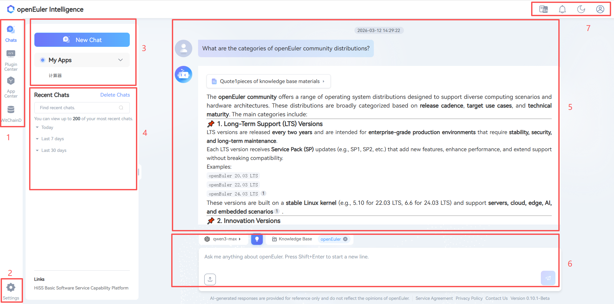

# Preface

## Overview

This document introduces the usage methods of Witty Assistant Web, providing detailed descriptions of various functions on the Witty Assistant online service Web interface, along with common questions and answers. Please refer to the corresponding manuals for details.

## Target Audience

This document is mainly intended for users of Witty Assistant Web. Users must possess the following experience and skills:

- Familiarity with openEuler operating system-related information
- Experience with AI conversations

## Revision History

| Document Version | Release Date | Revision Description |
| -------- | ------------ | ---------------- |
| 04 | 2025-06-06 | Updated introduction for version 0.9.6 |
| 03 | 2024-09-19 | Updated new interface |
| 02 | 2024-05-13 | Optimized intelligent dialogue operation guidelines |
| 01 | 2024-01-28 | First official release |

## Introduction

### Disclaimer

- Usernames and passwords used during the verification of non-tool functions will not be used for other purposes and will not be saved in the system environment.
- Before conducting conversations or operations, you should confirm that you are the owner of the application or have obtained sufficient authorization and consent from the owner.
- Conversation results may contain internal information and related data of the applications you analyze; please manage them appropriately.
- Unless otherwise stipulated by laws, regulations, or bilateral contracts, the openEuler community makes no express or implied statements or warranties regarding analysis results, and does not make any guarantees or commitments regarding the merchantability, satisfaction, non-infringement, or fitness for a particular purpose of the analysis results.
- Any actions you take based on analysis records shall comply with legal and regulatory requirements, and you shall bear the risks yourself.
- Without owner authorization, no individual or organization may use the application or related analysis records for any activities. The openEuler community is not responsible for any consequences arising therefrom, nor does it assume any legal liability. When necessary, legal liability will be pursued.

### Witty Assistant Web Introduction

Witty Assistant Web is an intelligent platform based on the openEuler operating system. It integrates functions such as semantic interface registration, workflow orchestration & scheduling, and knowledge bases. It can provide users with some basic intelligent services, such as intelligent Q&A, intelligent customer service assistants, etc., and also allows users to access local custom interfaces to provide advanced intelligent services, such as intelligent operations, intelligent tuning, etc.

### Scenario Content

- Intelligent Assistant: Allows users to build localized intelligent assistants using the knowledge base function of Witty Assistant Web, and allows users to continuously optimize knowledge base quality through intelligent evaluation pipelines, enhancing the intelligent assistant user experience.
- Intelligent Customer Service: Allows users to build their own intelligent customer service using the Q&A pair parsing function in the Witty Assistant Web knowledge base + workflow orchestration capabilities, and allows users to optimize the intelligent customer service experience by adjusting LLM prompts in workflows.
- Intelligent Operations & Intelligent Tuning: Allows users to use Witty Assistant Web's semantic interface registration and workflow orchestration scheduling capabilities to register local operations & tuning-related traditional APIs into Witty Assistant Web, and provide services externally in the form of natural language interaction through manually orchestrated workflows, enhancing the general operations user experience.

In summary, Witty Assistant Web can be applied in various scenarios, helping companies & developers develop custom intelligent services, reducing R&D costs, and improving service usage experience.

### Access and Usage

Witty Assistant is used by accessing the Web page via URL. For account registration and login, please refer to [Registration and Login](./registration_and_login.md). For usage methods, please refer to [Intelligent Q&A User Guide](./qa_guide.md).

### Interface Description

#### Interface Sections

The Witty Assistant Web interface mainly consists of sections shown in Figure 1, with the functions of each section described in Table 1.

- Figure 1 Witty Assistant Web Interface

- Table 1 Witty Assistant Web Homepage Interface Section Descriptions

| Section | Name | Description |
| ----- | ------------ | ----------------- |
| 1 | Function Switching Area | Four parts: Dialogue, Plugin Center, Application Center, Knowledge Base, corresponding respectively to creating dialogues, registering semantic interfaces & mcp services, creating intelligent workflow (agent) applications, and knowledge base management functions |
| 2 | Model Configuration Settings Button | Users can customize LLM configurations for interaction here |
| 3 | Top 5 Used Apps Area | Displays the top 5 most recently used applications by the user |
| 4 | Session Record Management Area | Provides access to service agreements and privacy policies |
| 5 | Session History Records Area | Users can manage their conversation records here |
| 6 | User Interaction Area | Users can switch the model and knowledge base used for conversations and input queries for interaction here |
| 7 | Style Switching Area | Users can switch the page style from light to dark here |
