# Knowledge Base User Guide

## Overview

After Witty Assistant web deployment is completed, witChainD is integrated into the web interface, allowing you to use witChainD for knowledge base management. Below I will introduce the usage of witChainD.

## Feature Introduction

### Creating a Team

Create a new team by clicking "Create New Team" to create your own team. Fill in the team name and team introduction in the corresponding fields, optionally choose whether to make it public, and click Confirm.

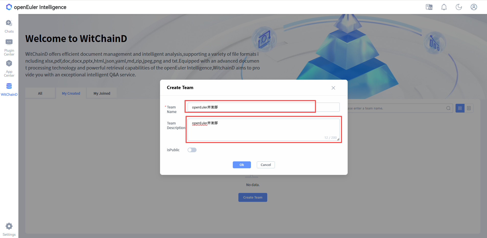

After creating a new team, the newly created team will be displayed on the witChainD page.

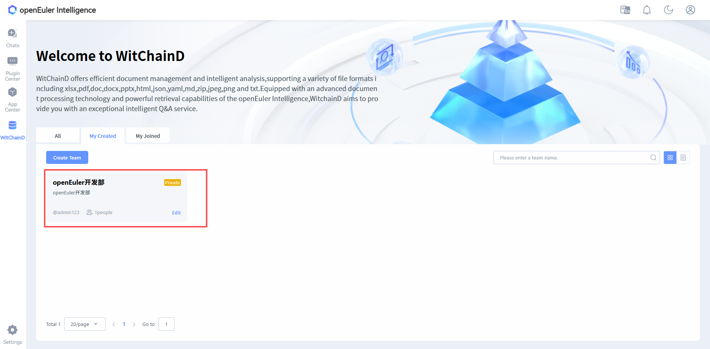

### Creating an Asset Library

Click on the newly created team to enter the **Team Asset Library Page**, then click "Create Asset Library".

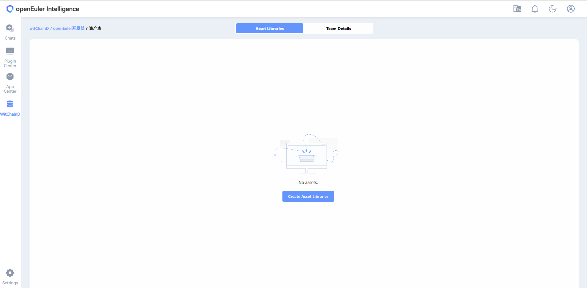

Fill in information such as the asset library name and introduction.

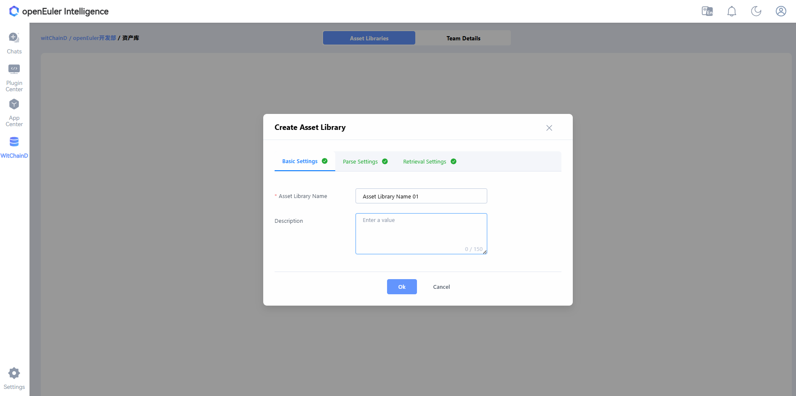

After clicking Confirm, a prompt will appear asking whether to import documents. You can either choose to import directly or click on the newly created asset library to enter it and import documents later.

After creating a new team asset library, the newly created knowledge base will be displayed on the team page.

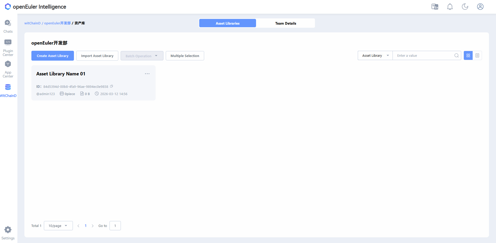

### Uploading Documents

Click on an asset library to enter the **Asset Library Page**, click "Import Documents", select files and import (multiple files can be imported at once).

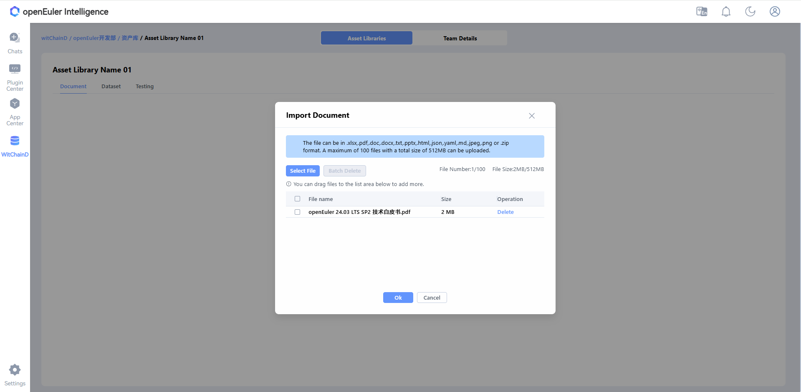

After import is complete, the newly imported documents will be displayed in the asset library and parsing will begin. Once parsing is complete, you can perform related operations on the document, such as using it to generate a dataset.

After successful parsing, click on the document name to view the document parsing status. You can also click "Reparse" to re-parse, and edit to set different parsing methods.

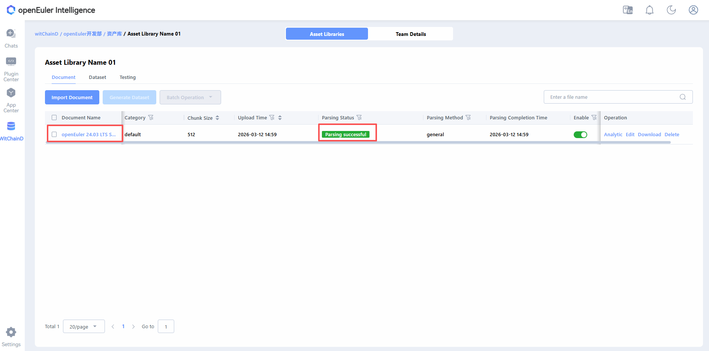

The parsing results are roughly as follows:

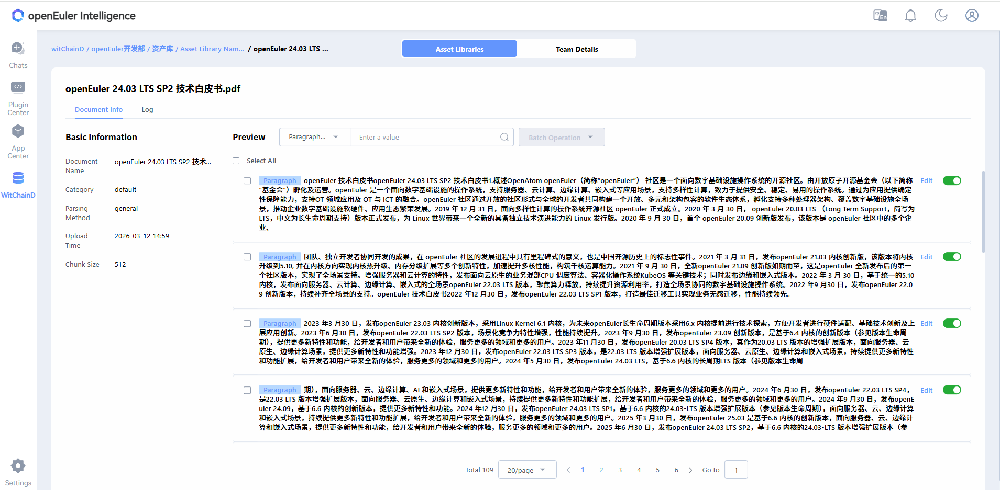

After uploading documents, you can select a knowledge base in the witty web for conversations.

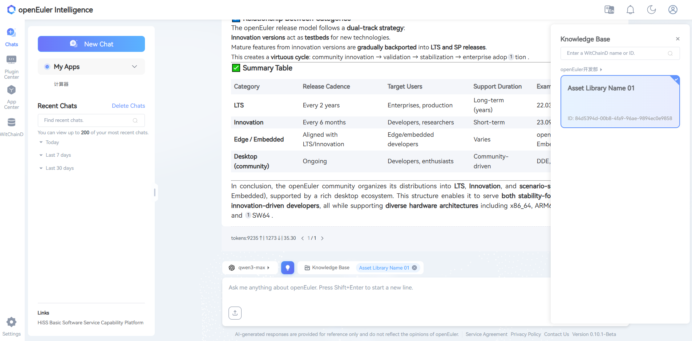

The citation numbers in each answer match the citation sources on the right.

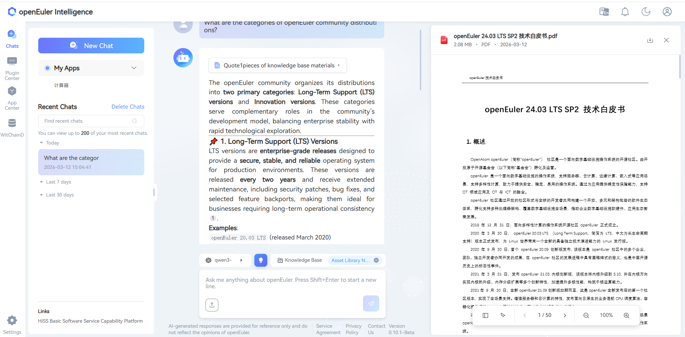

### Supplementary Information

Used to verify the effectiveness and status of imported documents, helping developers with optimization.

#### Generating Datasets

You can select imported document sets to generate datasets. Check the documents you want to generate datasets for and click "Generate Dataset".

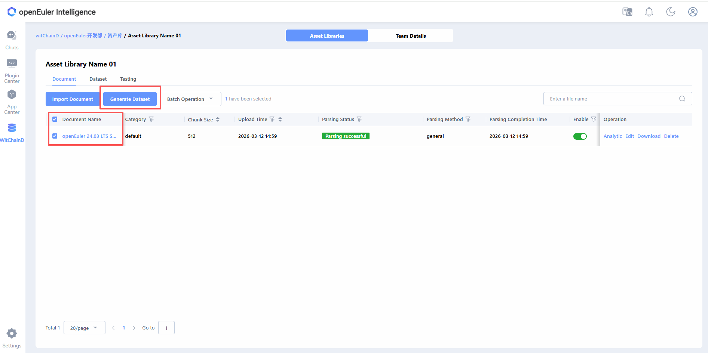

Fill in the relevant information and select the desired configuration, then click Generate. You can then wait for the dataset generation on the **Dataset Management Page**.

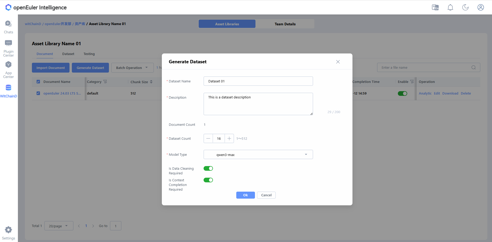

Click on a dataset name to view the dataset generation status. The results are roughly as follows:

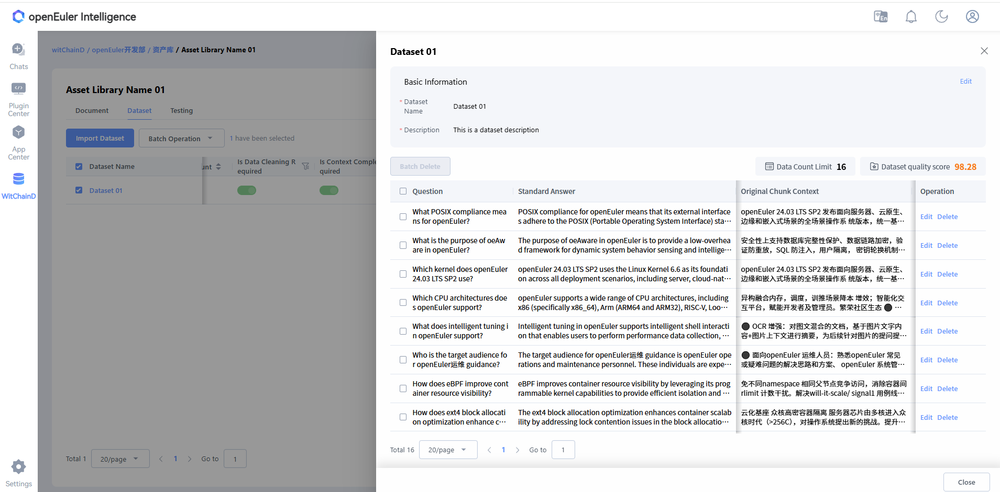

#### Accuracy Testing

Dataset evaluation: Check the dataset and click "Generate" to start.

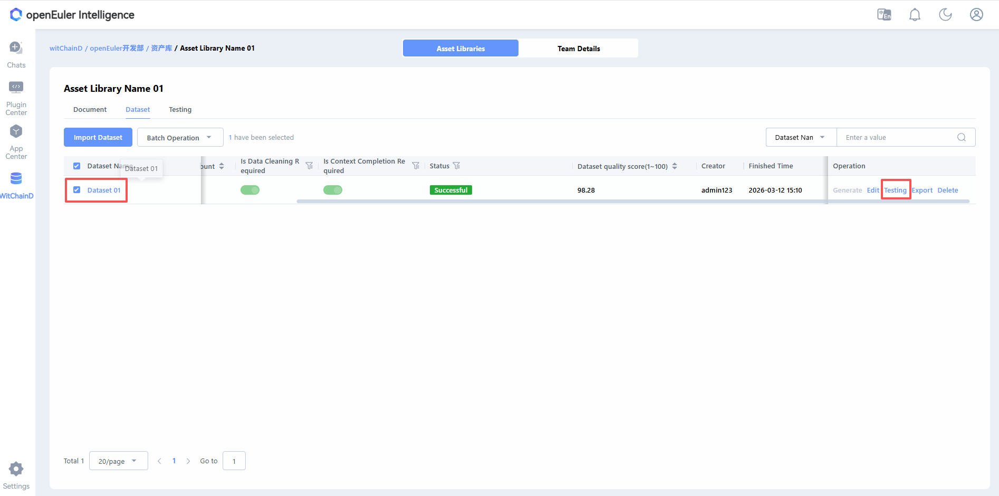

Fill in the relevant evaluation information and configuration, then click Confirm to evaluate the selected dataset.

After dataset evaluation is complete, click on the test name to view the dataset test results. The results are roughly as follows:

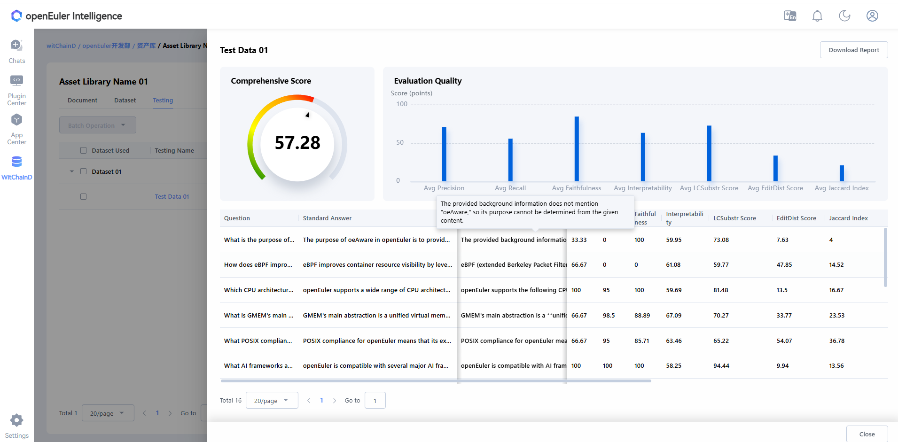

## Summary

WitChainD focuses on efficient document management and intelligent parsing, supporting multiple file formats including xlsx, pdf, doc, docx, pptx, html, json, yaml, md, zip, jpeg, png, and txt. The advanced document processing technology carried by this platform, combined with openEuler Intelligence's powerful retrieval capabilities, aims to provide you with an excellent intelligent Q&A service experience. Welcome to experience and explore more functional scenarios.
