# MCP Service Guide

## Overview

Witty Assistant Web's (hereinafter referred to as witty web) support for MCP has been enhanced.

## Installation Requirements

> - Registering, installing, and activating MCP requires administrator privileges
> - Building, testing, publishing, and using Agents requires regular user privileges
> - All Agent-related operations must be based on activated MCP

## Installing MCP

The following process uses an administrator account as an example to demonstrate the complete MCP management process:

- **Registering MCP**

   Register MCP into the witty web system through the "MCP Register" button in the Plugin Center

   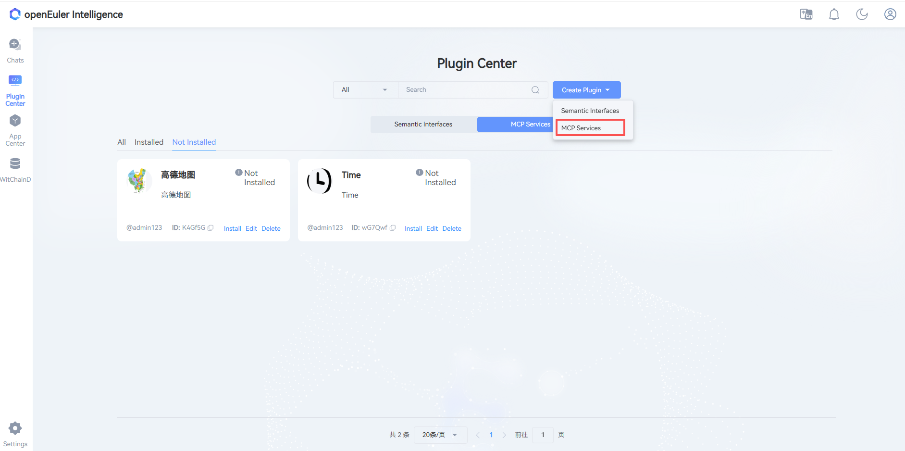

   After clicking the button, a registration window pops up (default configurations for SSE and STDIO are as follows):

   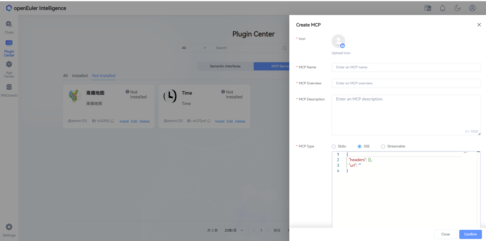

   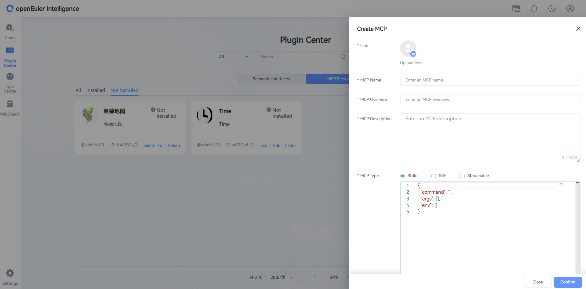

   Taking SSE registration as an example, fill in the configuration information and click "Save"

   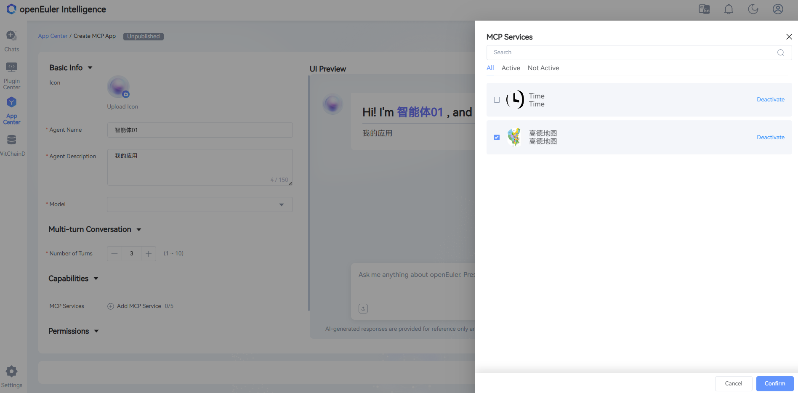

- **Installing MCP**

   >[!NOTE]Note:
   >
   > Before installing STDIO, you can adjust service dependency files and permissions in the `/opt/copilot/semantics/mcp/template` directory on the corresponding container or server

   Click the "Install" button on the registered MCP card to install

   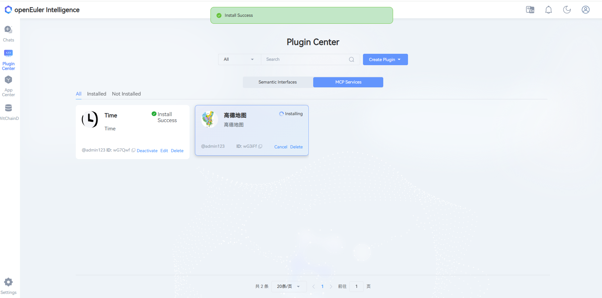

- **Viewing MCP**

   After successful installation, click on the MCP card to view the tools supported by the service

   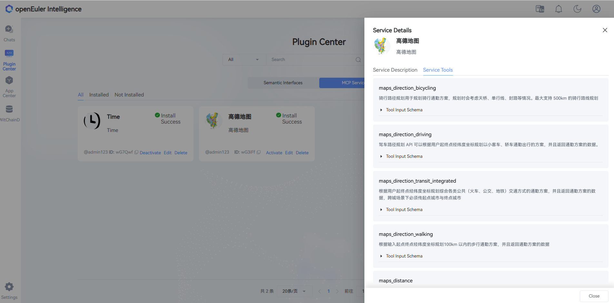

- **Activating MCP**

   Click the "Activate" button to enable the MCP service

   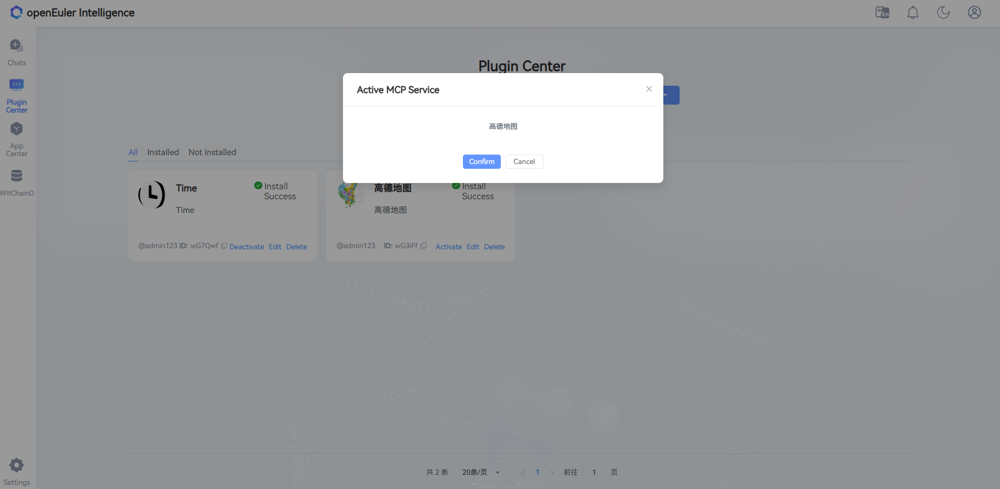

## Using Agents

The following operations can be performed by regular users, and all operations must be based on activated MCP:

- **Creating an Agent Application**

   Click the "Create Application" button in the Application Center

   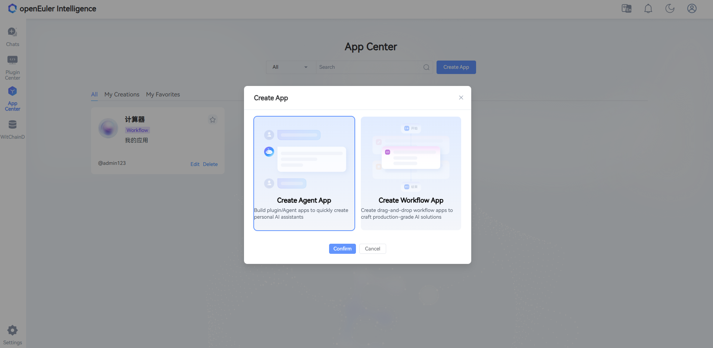

- **Configuring the Agent Application**

   After successful creation, click on the application card to enter the details page, where you can modify the application configuration information

   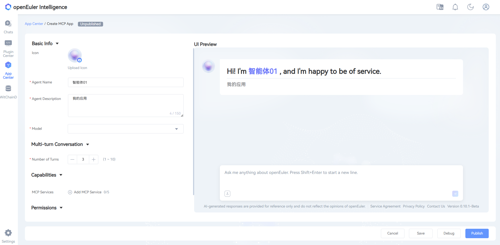

- **Associating MCP**

   Click the "Add MCP" button, and select the activated MCP from the list that pops up on the left to associate

   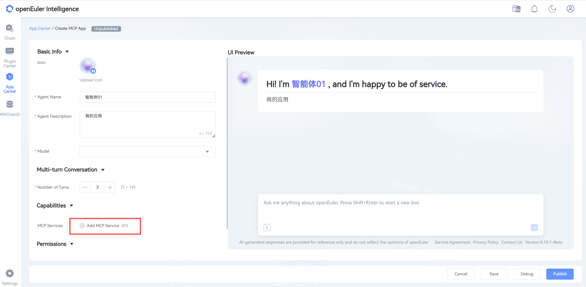

   

- **Testing the Agent Application**

   After completing MCP association and information configuration, click the "Test" button in the bottom right corner for functional testing

   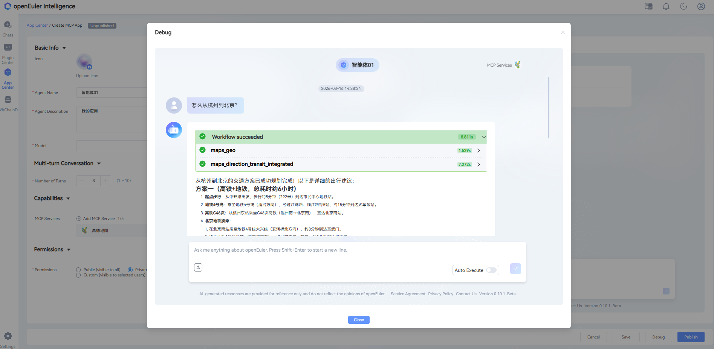

- **Publishing the Agent Application**

   After testing is successful, click the "Publish" button in the bottom right corner to publish the application

   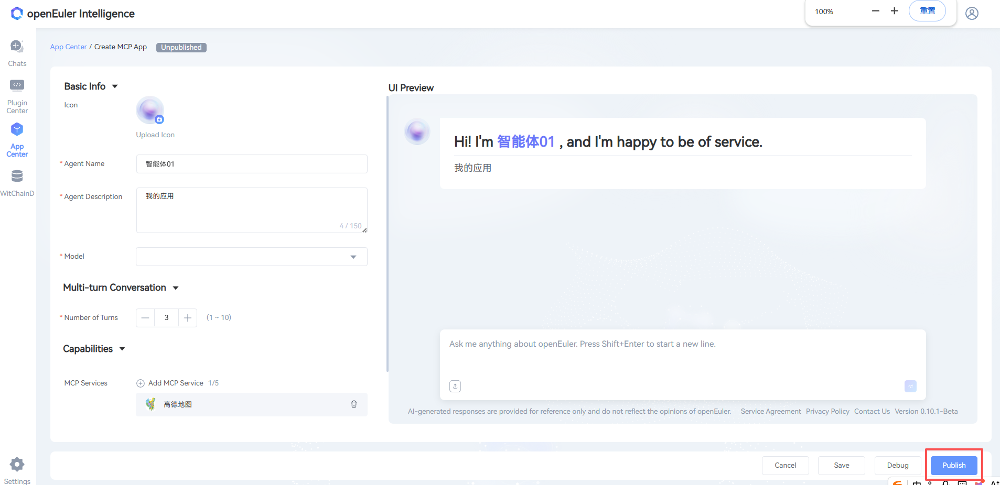

- **Using the Agent Application**

   Published applications will be displayed in the application market; double-click to use

   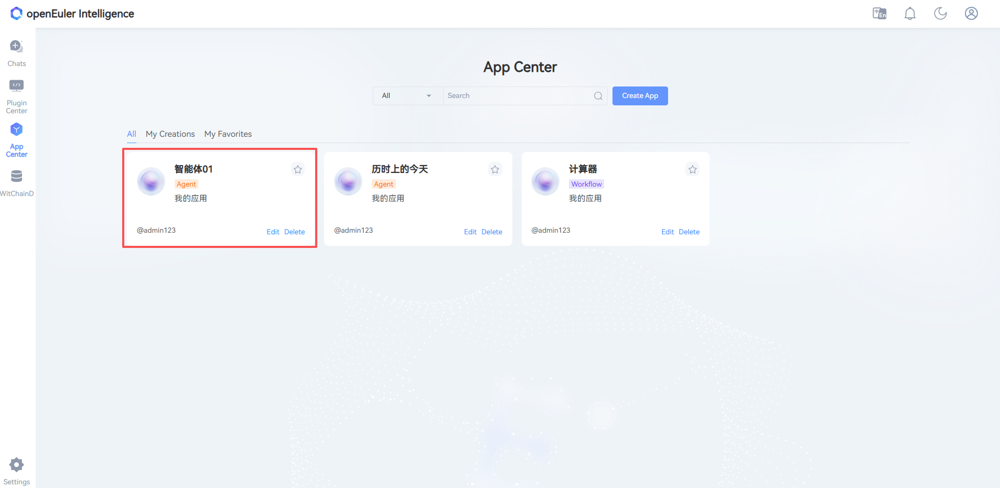

   Agent applications have two usage modes:

   **1. Automatic Mode**: Executes operations automatically without requiring user manual confirmation

   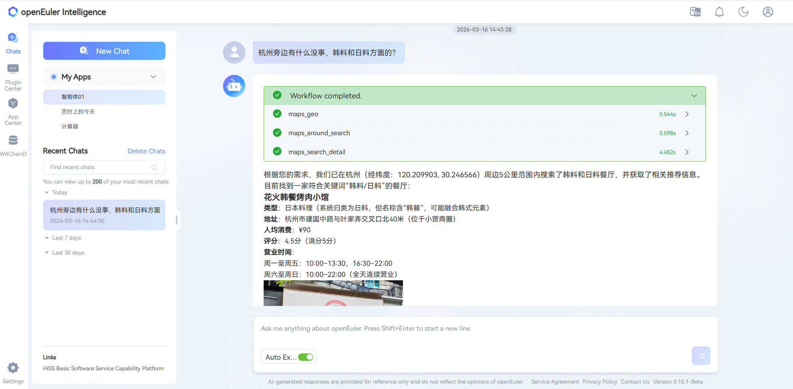

   **2. Manual Mode**: Prompts with risks before execution, requiring user confirmation before proceeding

   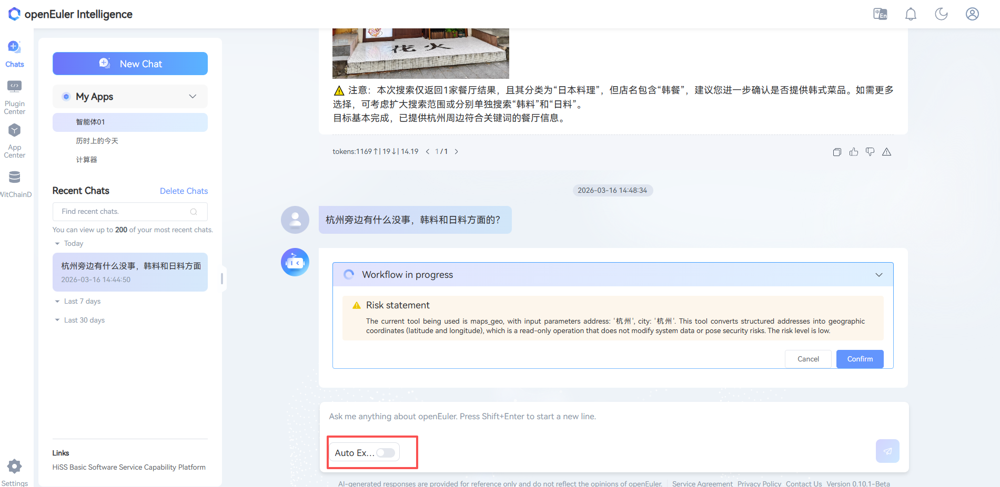

## Summary

Through the above process, users can build and use custom Agent applications based on MCP. Welcome to experience and explore more functional scenarios.
