# Intelligent Q&A User Guide

This chapter introduces how to use the Witty Assistant web interface for intelligent Q&A, hereinafter referred to as witty web.

## Starting a Conversation

In the lower part of the conversation area, you can enter the content you want to ask in the input box. Press `Shift + Enter` to start a new line, press `Enter` to send the conversation query, or click "Send" to also send the conversation query.

> [!NOTE]Note:
>
> The conversation area is located in the main part of the page, as shown in Figure 1.

- Figure 1 Conversation Area

  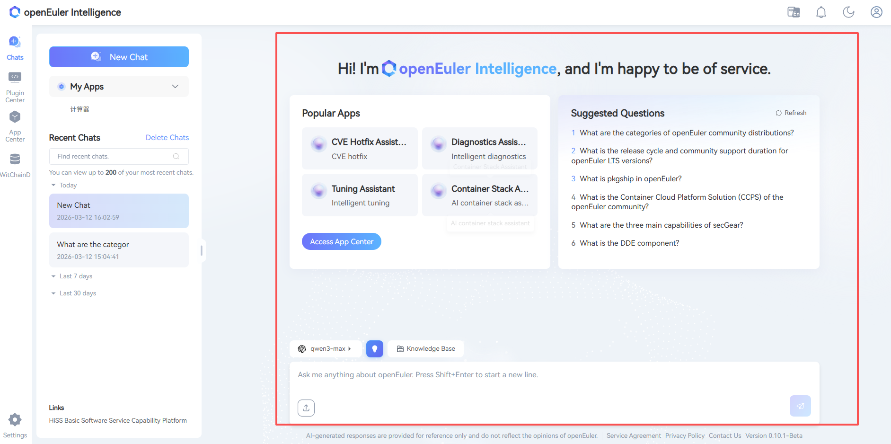

> [!NOTE]Note:
>
> The knowledge base configuration is located on the right side of the page, as shown in Figure 2. Users can enhance the Q&A experience by configuring the knowledge base.

- Figure 2 Knowledge Base Configuration

  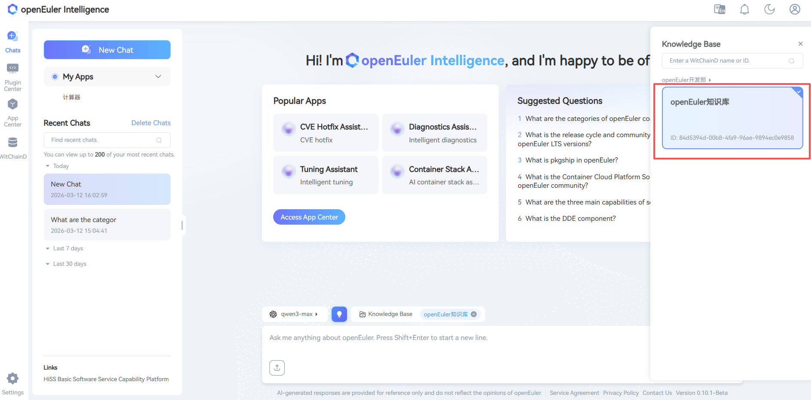

> [!NOTE]Note:
>
> Users can click the settings button in the lower left corner to enter the model configuration page. There are currently 8 provider templates available for LLM creation.

- Figure 3 LLM Creation

  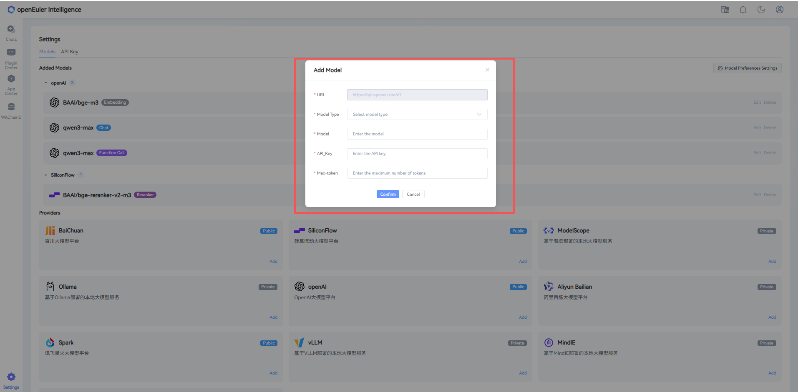

> [!NOTE]Note:
>
> Users can select a configured model through the dropdown box in the lower left corner (the system provides a default model).

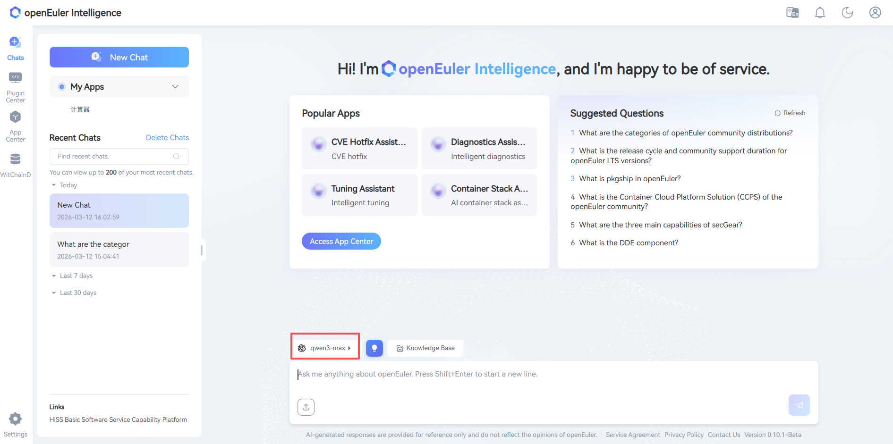

### Multi-Round Continuous Conversations

witty web intelligent Q&A supports multi-round continuous conversations. Simply continue asking questions in the same conversation to use this feature, as shown in Figure 4. witty web will complete the user's questions based on the context.

- Figure 4 Multi-Round Conversation

  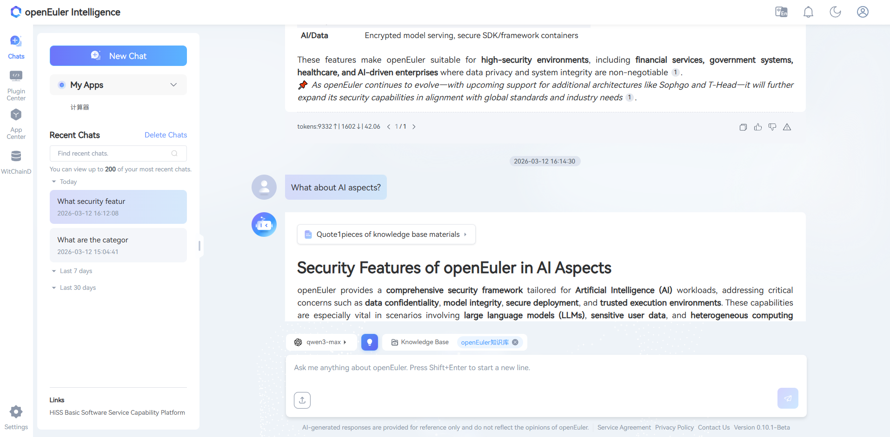

### Uploading Files

**Step 1** Click the "Upload File" button in the lower left corner of the conversation area, as shown in Figure 5.

- Figure 5 Upload File Button

  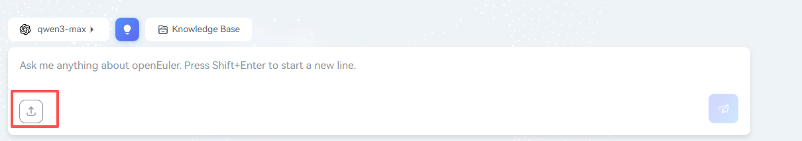

> [!NOTE]Note:
>
> Hovering the mouse over the "Upload File" button will display prompts about allowed file specifications and formats, as shown in Figure 6.

- Figure 6 Mouse Hover Displaying Upload File Specification Prompt

  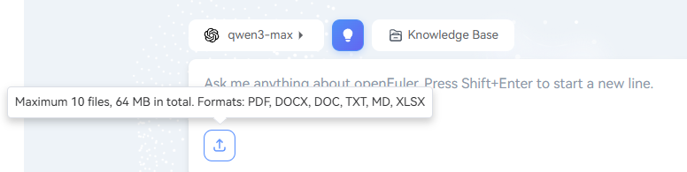

**Step 2** In the pop-up file selection box, select the files to upload and click "Open" to upload them. A maximum of 10 files can be uploaded, with a total size limit of 64MB. Accepted formats: PDF, docx, doc, txt, md, xlsx.

After uploading begins, the upload progress will be displayed below the conversation area, as shown in Figure 7.

- Figure 7 All Files Being Uploaded Simultaneously Arranged Below the Q&A Input Box

  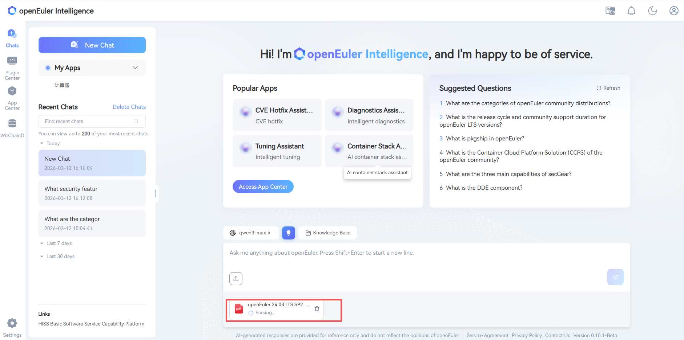

After files are successfully uploaded, the left history area will display the number of uploaded files, as shown in Figure 9.

- Figure 8 Conversation History Record Tag Showing the Number of Uploaded Files

  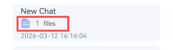

### Asking Questions About Files

After file upload is complete, you can ask questions about the files. The questioning method is the same as the normal conversation mode, as shown in Figure 10.

- Figure 10 Asking Questions Related to Uploaded Files

  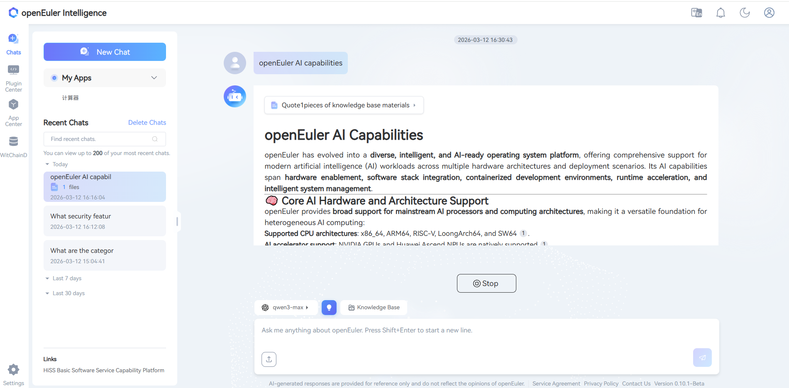

## Managing Conversations

> [!NOTE]Note:
>
> The conversation management area is on the left side of the page.

### Creating a New Conversation

Click the "New Conversation" button to create a new conversation, as shown in Figure 12.

- Figure 11 "New Conversation" Button at the Top Left of the Page

  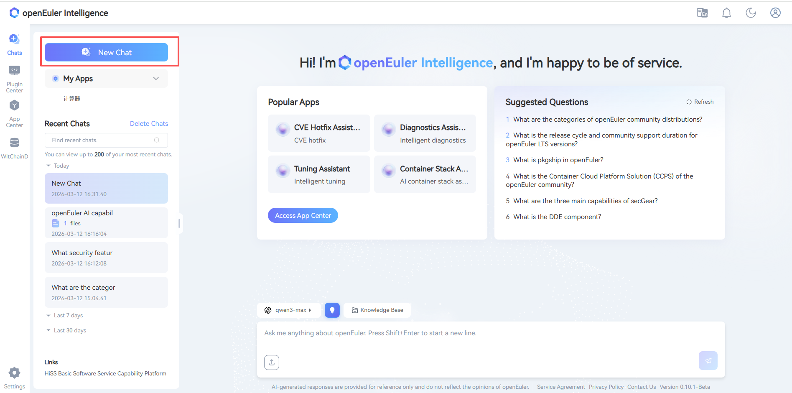

### Searching Conversation History

Enter keywords in the history search input box on the left side of the page, then click

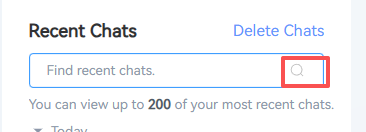

to search conversation history, as shown in Figure 12.

- Figure 12 Conversation History Search Box

  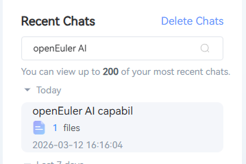

### Managing Individual Conversation History Records

The history records list is located below the history search bar. To the right of each conversation history record, click

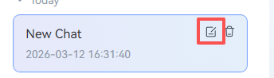

to edit the name of the conversation history record, as shown in Figure 13.

- Figure 13 Click the "Edit" Icon to Rename a History Record

  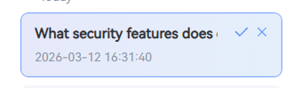

After rewriting the conversation history record name, click the

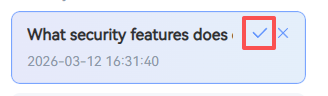

on the right to complete the renaming, or click the

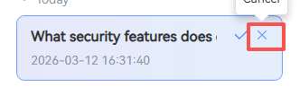

on the right to cancel this renaming, as shown in Figure 14.

- Figure 14 Complete/Cancel Renaming History Record

  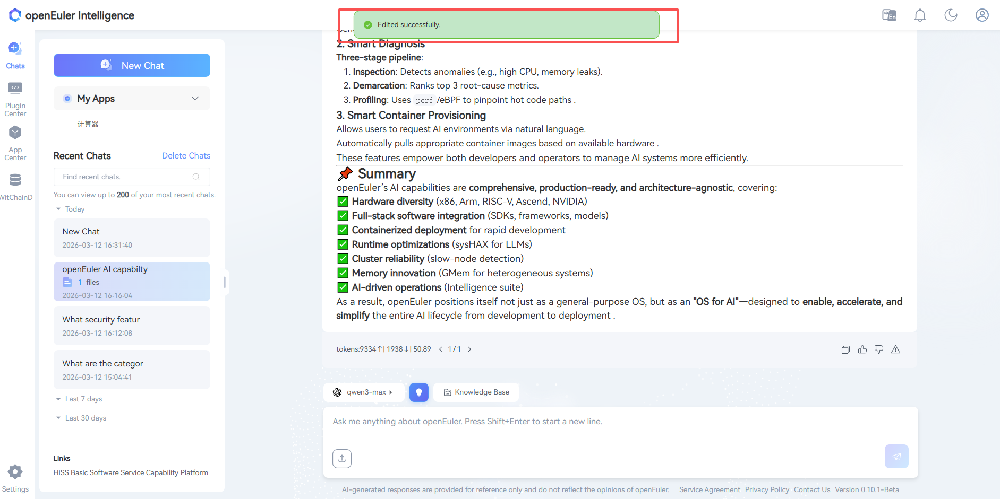

Additionally, click the delete icon to the right of a conversation history record, as shown in Figure 16, to perform a second confirmation for deleting a single conversation history record. In the second confirmation pop-up box, as shown in Figure 17, click "Confirm" to confirm deletion of the single conversation history record, or click "Cancel" to cancel this deletion.

- Figure 15 Click the "Trash Can" Icon to Delete a Single History Record

  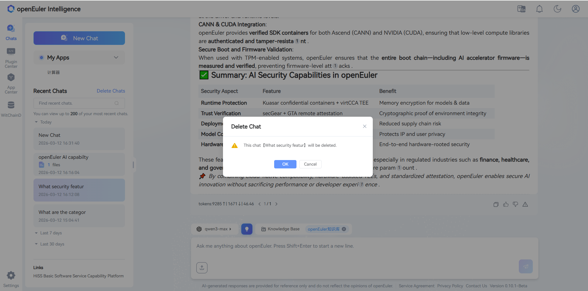

- Figure 16 Delete History Record After Second Confirmation

  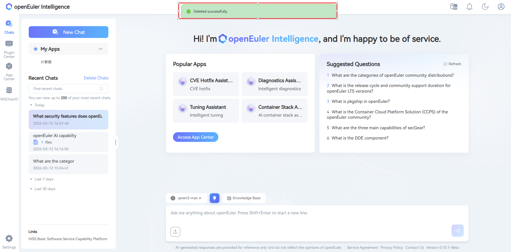

### Batch Deleting Conversation History Records

First, click "Batch Delete", as shown in Figure 18.

- Figure 18 Batch Delete Function at the Top Right of the History Search Box

  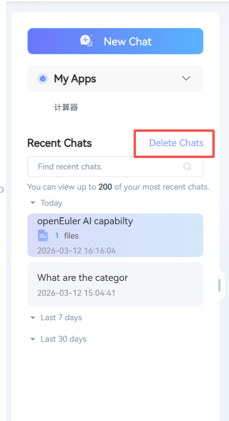

Then you can select history records for deletion, as shown in Figure 19. Click "Select All" to select all history records. Click a single history record or the selection box to the left of a history record to select a single history record.

- Figure 19 Check the Box on the Left to Select History Records for Batch Deletion

  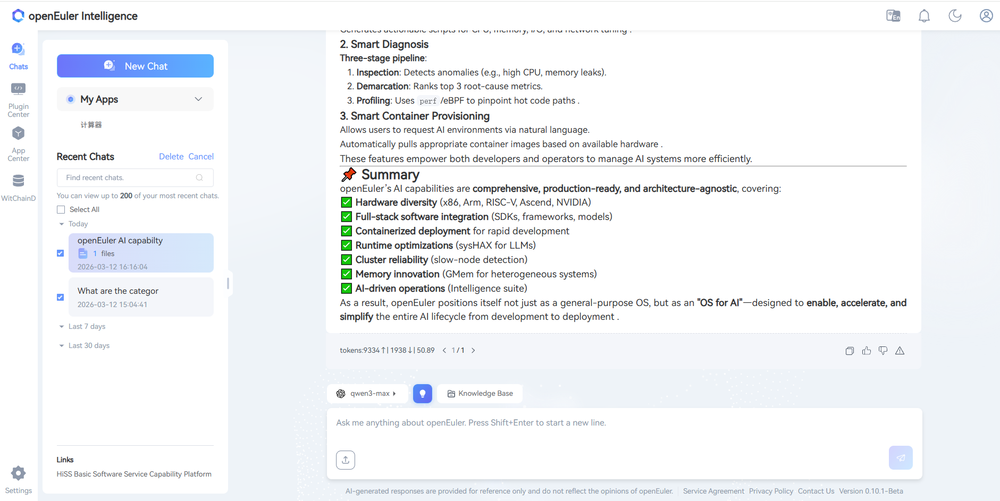

Finally, a second confirmation is required for batch deletion of history records, as shown in Figure 20. Click "Confirm" to delete, click "Cancel" to cancel this deletion.

- Figure 20 Delete Selected History Records After Second Confirmation

  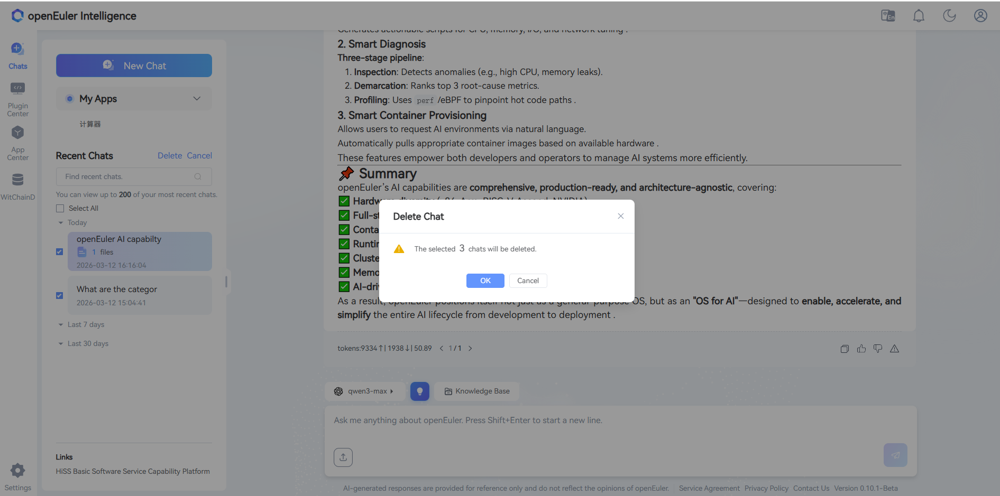

## Appendix

### User Information Export Instructions

The witty web backend has a user information export function. If users need this, they must proactively contact us via email at <contact@openeuler.io>. Operations will then send the exported user information back to the user via email.
