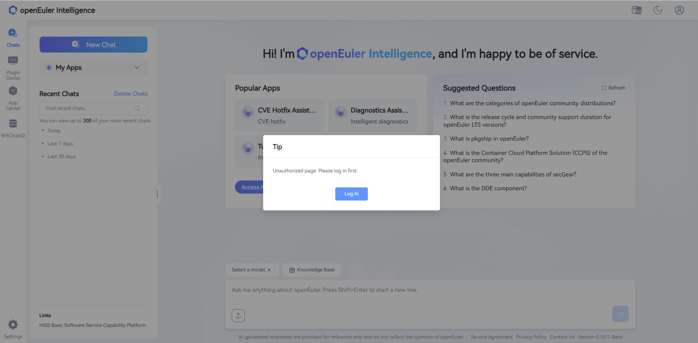
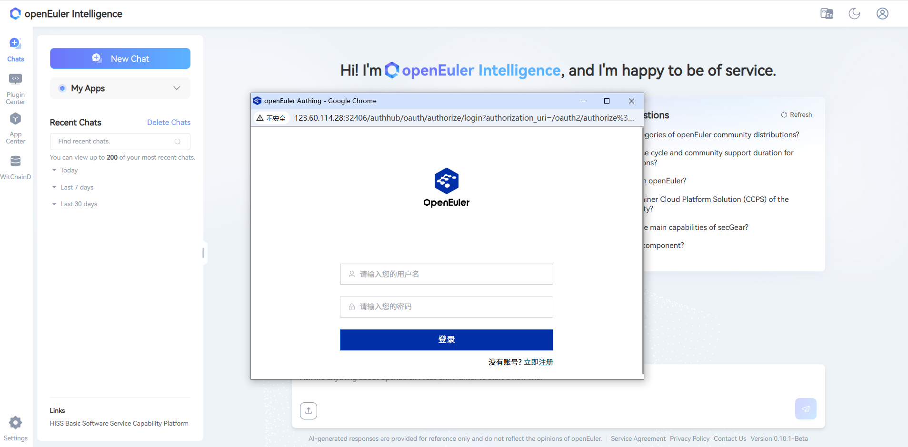
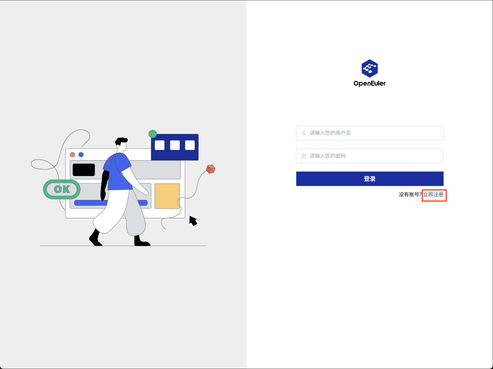
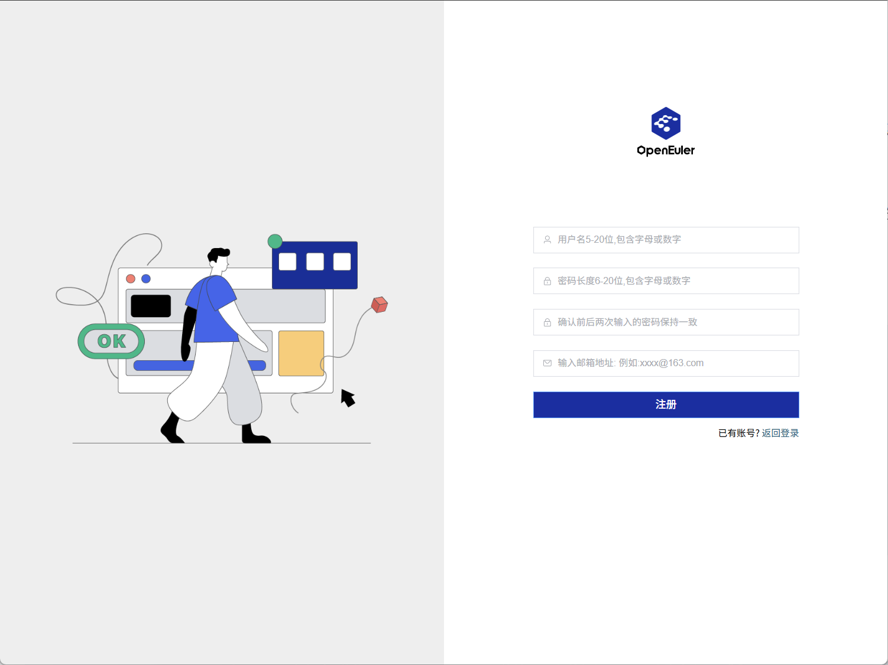
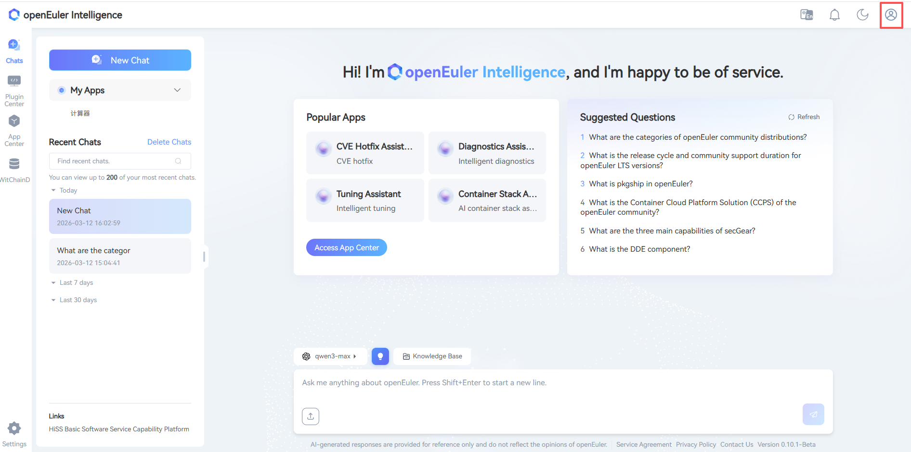
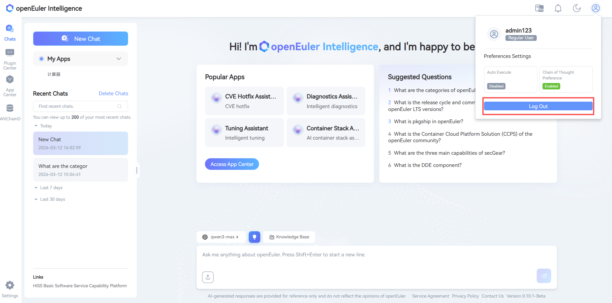

# Logging into the Witty Assistant Web Page

This chapter introduces the specific steps for logging into the deployed Witty Assistant web interface, hereinafter referred to as witty web.

## Environment Requirements

The main browser requirements are shown in Table 1.

- Table 1 Browser Requirements

| Browser Type | Minimum Version | Recommended Version |
| ----- | ----- | ----- |
| Google Chrome | 72 | 121 or higher |
| Mozilla Firefox | 89 | 122 or higher |
| Apple Safari | 11.0 | 16.3 or higher |

## Operation Steps

### Logging into the Web Page

Open a browser on your local PC, enter the deployed domain name or IP address in the address bar, and press `Enter`. When not logged in, entering witty web will display a login prompt pop-up box, as shown in the following figure:

Log in to witty web (with a registered account) by opening the login interface, as shown in the following figure:

## Registering an Account

Click "Register Now" in the lower right corner of the login information input box

Enter the account registration page and fill in the relevant information according to the page prompts

After filling in the account information as required by the page, click "Register" to complete the registration successfully. After registration, you can return to log in.

## Logging Out

Click the upper right corner, and the "Logout" dropdown box will appear

Click "Logout" to log out

