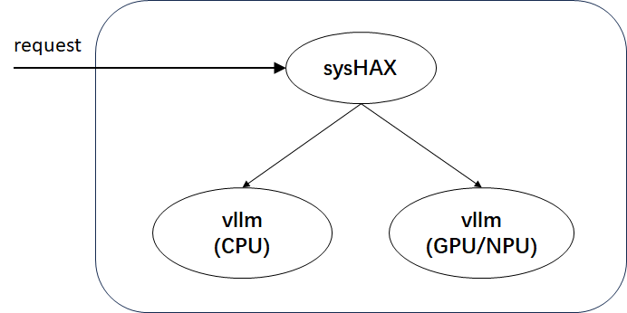

# XPU Turbo Deployment Guide

## Overview

XPU Turbo, formerly known as sysHAX, is positioned as a K+X heterogeneous fusion inference accelerator, mainly comprising two parts:

- Inference Dynamic Scheduling
- CPU Inference Acceleration

**Inference Dynamic Scheduling**: For inference tasks, the prefill phase is compute-intensive, while the decode phase is memory access-intensive. Therefore, from a computing resource perspective, the prefill phase is suitable for execution on hardware such as GPU/NPU, whereas the decode phase can be executed on hardware such as CPU.
**CPU Inference Acceleration**: Accelerates CPU inference performance through NUMA affinity, parallel optimization, operator optimization, and other methods on the CPU.

sysHAX consists of two deliverables:


The deliverables include:

- sysHAX: Responsible for request processing and scheduling of prefill and decode requests
- vllm: vllm is a large model inference service, deployed in both GPU/NPU and CPU versions for processing prefill and decode requests respectively. From the perspective of developer usability, vllm will be released in containerized form.

vllm is a **high-throughput, low-memory** **Large Language Model (LLM) inference and serving engine** that supports **CPU compute acceleration**, providing efficient operator dispatch mechanisms, including:

- Schedule: Optimizes task distribution, improving parallel computing efficiency
- Prepare Input: Efficient data preprocessing, accelerating input construction
- Ray Framework: Leverages distributed computing to improve inference throughput
- Sample: Optimizes sampling strategies, improving generation quality
- Framework Post-processing: Integrates multiple optimization strategies to enhance overall inference performance

This engine combines **efficient computation scheduling and optimization strategies** to provide a **faster, more stable, and more scalable** solution for LLM inference.

## Environment Preparation

| KEY        |  VALUE                                   |
| ---------- | ---------------------------------------- |
| Server Model | Kunpeng 920 series CPU                   |
| GPU        |  Nvidia A100                              |
| Operating System | openEuler 24.03 LTS SP1                 |
| python     | 3.9 or above                              |
| docker     | 25.0.3 or above                           |

- docker 25.0.3 can be installed via `dnf install moby`.
- Please note that sysHAX currently only supports NVIDIA GPUs on the AI accelerator side; ASCEND NPU adaptation is in progress.

## Deployment Process

First, check whether nvidia drivers and cuda drivers have been installed via `nvidia-smi` and `nvcc -V`. If not, nvidia drivers and cuda drivers need to be installed first.

### Installing NVIDIA Container Toolkit

If NVIDIA Container Toolkit is already installed, this step can be skipped. Otherwise, follow the process below for installation:

<https://docs.nvidia.com/datacenter/cloud-native/container-toolkit/latest/install-guide.html>

- Execute the `systemctl restart docker` command to restart docker, making the content added by the container toolkit plugin in the docker configuration file take effect.

### vllm Setup in Container Scenario

The following process deploys vllm in a GPU container.

```shell
docker pull hub.oepkgs.net/neocopilot/syshax/syshax-vllm-gpu:0.2.1

docker run --name vllm_gpu \
    --ipc="shareable" \
    --shm-size=64g \
    --gpus=all \
    -p 8001:8001 \
    -v /home/models:/home/models \
    -w /home/ \
    -itd hub.oepkgs.net/neocopilot/syshax/syshax-vllm-gpu:0.2.1 bash
```

In the above script:

- `--ipc="shareable"`: Allows the container to share the IPC namespace, enabling inter-process communication.
- `--shm-size=64g`: Sets the container shared memory to 64G.
- `--gpus=all`: Allows the container to use all GPU devices on the host.
- `-p 8001:8001`: Port mapping, mapping port 8001 of the host to port 8001 of the container. Developers can modify this as needed.
- `-v /home/models:/home/models`: Directory mounting, mapping the host's `/home/models` to `/home/models` inside the container, enabling model sharing. Developers can modify the mapped directory as needed.

```shell
vllm serve /home/models/DeepSeek-R1-Distill-Qwen-32B \
    --served-model-name=ds-32b \
    --host 0.0.0.0 \
    --port 8001 \
    --dtype=auto \
    --swap_space=16 \
    --block_size=16 \
    --preemption_mode=swap \
    --max_model_len=8192 \
    --tensor-parallel-size 2 \
    --gpu_memory_utilization=0.8 \
    --enable-auto-pd-offload
```

In the above script:

- `--tensor-parallel-size 2`: Enables tensor parallelism, splitting the model to run on 2 GPUs, requiring at least 2 GPUs. Developers can modify this as needed.
- `--gpu_memory_utilization=0.8`: Limits GPU memory usage to 80%, preventing service crashes due to memory exhaustion. Developers can modify this as needed.
- `--enable-auto-pd-offload`: Triggers PD separation during swap out.

The following process deploys vllm in a CPU container.

```shell
docker pull hub.oepkgs.net/neocopilot/syshax/syshax-vllm-cpu:0.2.1

docker run --name vllm_cpu \
    --ipc container:vllm_gpu \
    --shm-size=64g \
    --privileged \
    -p 8002:8002 \
    -v /home/models:/home/models \
    -w /home/ \
    -itd hub.oepkgs.net/neocopilot/syshax/syshax-vllm-cpu:0.2.1 bash
```

In the above script:

- `--ipc container:vllm_gpu`: Shares the IPC (inter-process communication) namespace of the container named vllm_gpu. Allows this container to exchange data directly through shared memory, avoiding cross-container copying.

```shell
NRC=4 INFERENCE_OP_MODE=fused OMP_NUM_THREADS=160 CUSTOM_CPU_AFFINITY=0-159 SYSHAX_QUANTIZE=q4_0 \
vllm serve /home/models/DeepSeek-R1-Distill-Qwen-32B \
    --served-model-name=ds-32b \
    --host 0.0.0.0 \
    --port 8002 \
    --dtype=half \
    --block_size=16 \
    --preemption_mode=swap \
    --max_model_len=8192 \
    --enable-auto-pd-offload
```

In the above script:

- `INFERENCE_OP_MODE=fused`: Enables CPU inference acceleration
- `OMP_NUM_THREADS=160`: Specifies the number of CPU inference threads as 160. This environment variable takes effect only after specifying INFERENCE_OP_MODE=fused
- `CUSTOM_CPU_AFFINITY=0-159`: Specifies the CPU core binding scheme, which will be detailed later.
- `SYSHAX_QUANTIZE=q4_0`: Specifies the quantization scheme as q4_0. The current version supports 2 quantization schemes: `q8_0`, `q4_0`.
- `NRC=4`: GEMV operator chunking method. This environment variable has good acceleration effects on 920 series processors.

Note that the GPU container must be started before starting the CPU container.

Check the current machine's hardware status through lscpu, with key focus on:

```shell
Architecture:             aarch64
  CPU op-mode(s):         64-bit
  Byte Order:             Little Endian
CPU(s):                   160
  On-line CPU(s) list:    0-159
Vendor ID:                HiSilicon
  BIOS Vendor ID:         HiSilicon
  Model name:             -
    Model:                0
    Thread(s) per core:   1
    Core(s) per socket:   80
    Socket(s):            2
NUMA:
  NUMA node(s):           4
  NUMA node0 CPU(s):      0-39
  NUMA node1 CPU(s):      40-79
  NUMA node2 CPU(s):      80-119
  NUMA node3 CPU(s):      120-159
```

This machine has 160 physical cores, SMT not enabled, 4 NUMA nodes, with 40 cores on each NUMA node.

Use these two scripts to set the core binding scheme: `OMP_NUM_THREADS=160 CUSTOM_CPU_AFFINITY=0-159`. In these two environment variables, the first is the number of CPU inference threads to start, and the second is the IDs of CPUs to bind. To achieve NUMA affinity in CPU inference acceleration, core binding operations need to follow these rules:

- The number of threads started must equal the number of CPUs bound.
- The number of CPUs used on each NUMA node must be the same to maintain load balancing.

For example, in the above script, CPUs 0-159 are bound. Among them, 0-39 belong to NUMA node 0, 40-79 belong to NUMA node 1, 80-119 belong to NUMA node 2, and 120-159 belong to NUMA node 3. Each NUMA node uses 40 CPUs, ensuring load balancing across NUMA nodes.

### sysHAX Installation

There are two ways to install sysHAX. You can install the rpm package via dnf. Note that using this method requires upgrading openEuler to openEuler 24.03 LTS SP2 or above:

```shell
dnf install sysHAX
```

Or start directly using source code:

```shell
git clone -b v0.2.0 https://gitee.com/openeuler/sysHAX.git
```

Some basic configuration needs to be done before starting sysHAX:

```shell
# When installing sysHAX using dnf install sysHAX
syshax init
syshax config services.gpu.port 8001
syshax config services.cpu.port 8002
syshax config services.conductor.port 8010
syshax config models.default ds-32b
```

```shell
# When using git clone -b v0.2.0 https://gitee.com/openeuler/sysHAX.git
python3 cli.py init
python3 cli.py config services.gpu.port 8001
python3 cli.py config services.cpu.port 8002
python3 cli.py config services.conductor.port 8010
python3 cli.py config models.default ds-32b
```

Additionally, you can view all configuration commands via `syshax config --help` or `python3 cli.py config --help`.

After configuration is complete, start the sysHAX service with the following command:

```shell
# When installing sysHAX using dnf install sysHAX
syshax run
```

```shell
# When using git clone -b v0.2.0 https://gitee.com/openeuler/sysHAX.git
python3 main.py
```

When starting the sysHAX service, a service connectivity test will be performed. sysHAX complies with the openAPI standard. Once the service is started, you can call the large model service via API. You can test it with the following script:

```shell
curl http://0.0.0.0:8010/v1/chat/completions -H "Content-Type: application/json" -d '{
    "model": "ds-32b",
    "messages": [
        {
            "role": "user",
            "content": "Introduce openEuler."
        }
    ],
    "stream": true,
    "max_tokens": 1024
}'
```
