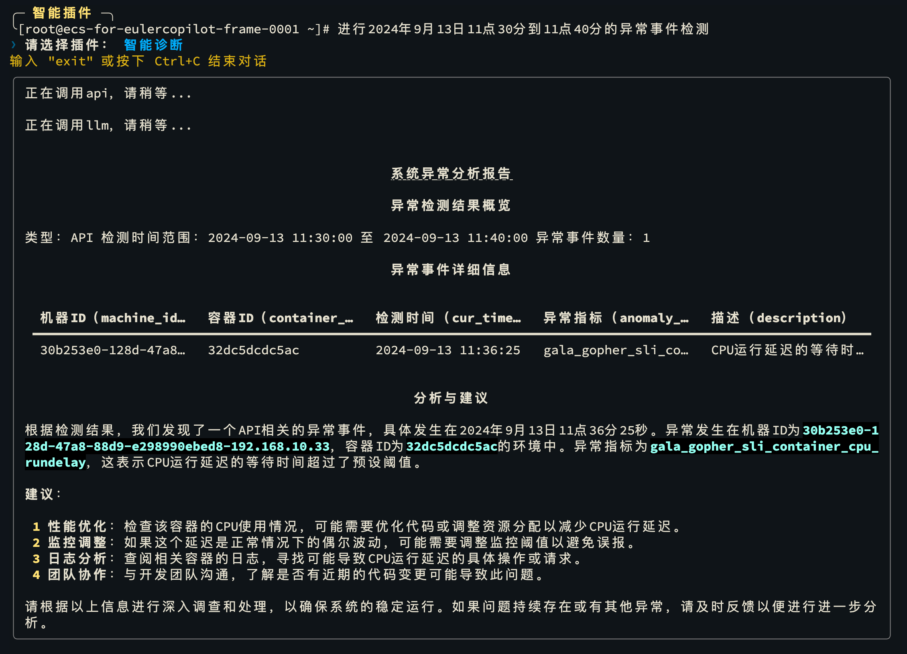
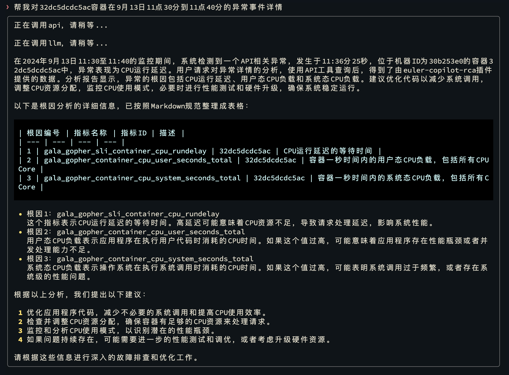
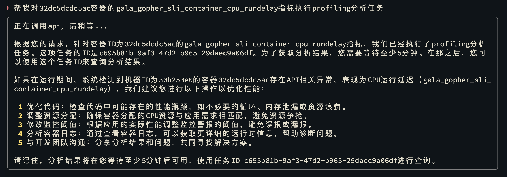
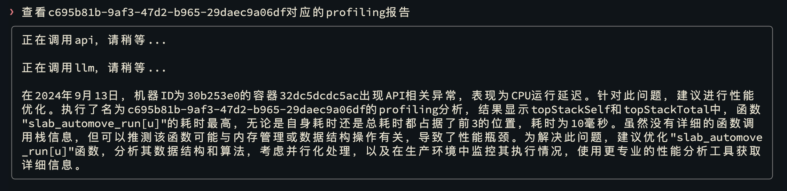

# 智能插件：智能诊断

部署智能诊断工具后，可以通过 openEuler Copilot System 智能体框架实现对本机进行诊断。
在智能诊断模式提问，智能体框架服务可以调用本机的诊断工具诊断异常状况、分析并生成报告。

## 操作步骤

**步骤1** 切换到“智能插件”模式

```bash
copilot -p
```


**步骤2** 异常事件检测

```bash
帮我进行异常事件检测
```

按下 `Ctrl + O` 键提问，然后在插件列表中选择“智能诊断”。



**步骤3** 查看异常事件详情

```bash
查看 XXX 容器的异常事件详情
```



**步骤4** 执行异常事件分析

```bash
请对 XXX 容器的 XXX 指标执行 profiling 分析
```



**步骤5** 查看异常事件分析报告

等待 5 至 10 分钟，然后查看分析报告。

```bash
查看 <profiling-id> 对应的 profiling 报告
```


