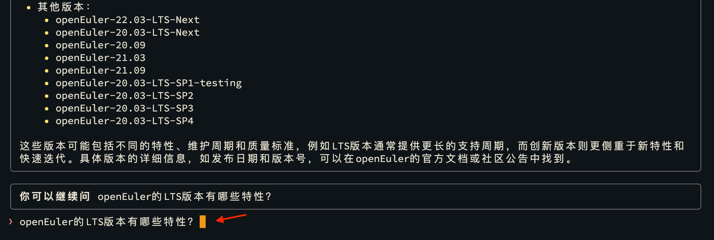
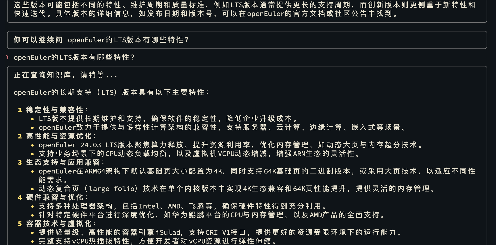
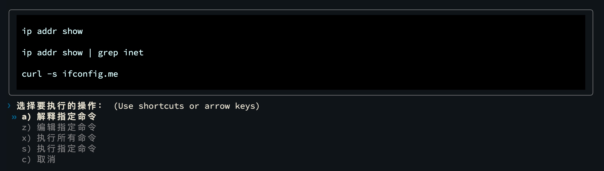
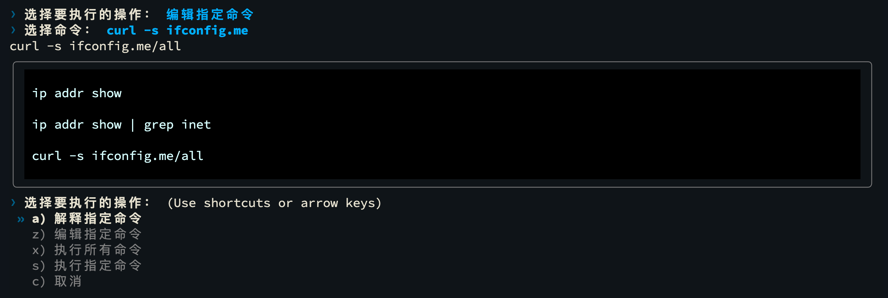

# 命令行助手使用指南

## 简介

openEuler Copilot System 命令行助手是一个命令行（Shell）AI 助手，您可以通过它来快速生成 Shell 命令并执行，从而提高您的工作效率。除此之外，基于 Gitee AI 在线服务的标准版本还内置了 openEuler 的相关知识，可以助力您学习与使用 openEuler 操作系统。

## 环境要求

- 操作系统：openEuler 22.03 LTS SP3，或者 openEuler 24.03 LTS 及以上版本
- 命令行软件：
  - Linux 桌面环境：支持 GNOME、KDE、DDE 等桌面环境的内置终端
  - 远程 SSH 链接：支持兼容 xterm-256 与 UTF-8 字符集的终端

## 安装

openEuler Copilot System 命令行助手支持通过 OEPKGS 仓库进行安装。

### 配置 OEPKGS 仓库

```bash
sudo dnf config-manager --add-repo https://repo.oepkgs.net/openeuler/rpm/`sed 's/release //;s/[()]//g;s/ /-/g' /etc/openEuler-release`/extras/`uname -m`
```

```bash
sudo dnf clean all
```

```bash
sudo dnf makecache
```

### 安装命令行助手

```bash
sudo dnf install eulercopilot-cli
```

若遇到 `Error: GPG check FAILED` 错误，使用 `--nogpgcheck` 跳过检查。

```bash
sudo dnf install --nogpgcheck eulercopilot-cli
```

## 初始化

```bash
copilot --init
```

然后根据提示输入 API Key 完成配置。


初次使用前请先退出终端或重新连接 SSH 会话使配置生效。

- **查看助手帮助页面**

  ```bash
  copilot --help
  ```

  

## 使用

在终端中输入问题，按下 `Ctrl + O` 提问。

### 快捷键

- 输入自然语言问题后，按下 `Ctrl + O` 可以直接向 AI 提问。
- 直接按下 `Ctrl + O` 可以自动填充命令前缀 `copilot`，输入参数后按下 `Enter` 即可执行。

### 智能问答

命令行助手初始化完成后，默认处于智能问答模式。
命令提示符**左上角**会显示当前模式。
若当前模式不是“智能问答”，执行 `copilot -c` (`copilot --chat`) 切换到智能问答模式。


AI 回答完毕后，会根据历史问答生成推荐问题，您可以复制、粘贴到命令行中进行追问。输入追问的问题后，按下 `Enter` 提问。





智能问答模式下支持连续追问，每次追问最多可以关联3条历史问答的上下文。

输入 `exit` 可以退出智能问答模式，回到 Linux 命令行。


- 若问答过程中遇到程序错误，可以按下 `Ctrl + C` 立即退出当前问答，再尝试重新提问。

### Shell 命令

AI 会根据您的问题返回 Shell 命令，openEuler Copilot System 命令行助手可以解释、编辑或执行这些命令，并显示命令执行结果。


命令行助手会自动提取 AI 回答中的命令，并显示相关操作。您可以通过键盘上下键选择操作，按下 `Enter` 确认。



#### 解释

如果 AI 仅返回了一条命令，选择解释后会直接请求 AI 解释命令，并显示回答。
若 AI 回答了多条命令，选择后会显示命令列表，您每次可以选择**一条**请求 AI 解释。


完成解释后，您可以继续选择其他操作。


#### 编辑


选择一条命令进行编辑，编辑完成后按下 `Enter` 确认。



完成编辑后，您可以继续编辑其他命令或选择其他操作。

#### 执行

如果 AI 仅返回了一条命令，选择执行后会直接执行命令，并显示执行结果。
若 AI 回答了多条命令，选择后会显示命令列表，您每次可以选择**多条**命令来执行。

您可以通过键盘上下键移动光标，按下 `空格键` 选择命令，按下 `Enter` 执行所选命令。
被选中的命令会显示**蓝色高亮**，如图所示。


若不选择任何命令，直接按下 `Enter`，则会跳过执行命令，直接进入下一轮问答。

按下 `Enter` 后，被选中的命令会从上到下依次执行。


若执行过程中遇到错误，命令行助手会显示错误信息，并**终止执行命令**，进入下一轮问答。
您可以在下一轮问答中提示 AI 更正命令，或要求 AI 重新生成命令。

### 智能插件

在 Linux 命令行中执行 `copilot -p` (`copilot --plugin`) 切换到智能插件模式。


输入问题并按下 `Ctrl + O` 提问后，从列表中选择插件，按下 `Enter` 调用插件回答问题。


## 卸载

```bash
sudo dnf remove eulercopilot-cli
```

然后使用以下命令删除配置文件。

```bash
rm ~/.config/eulercopilot/config.json
```

卸载完成后请重启终端或重新连接 SSH 会话使配置还原。
