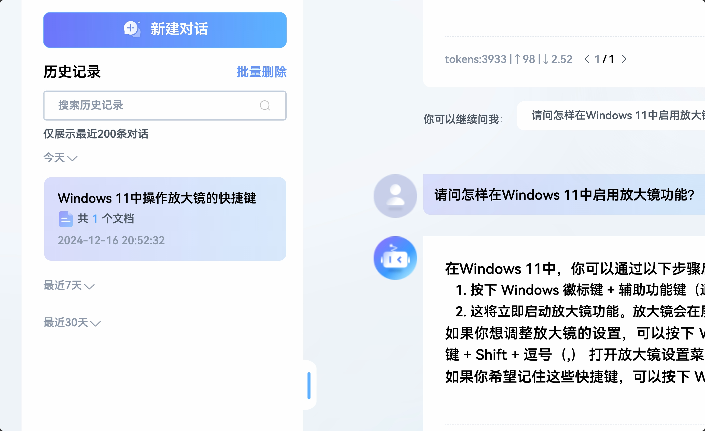
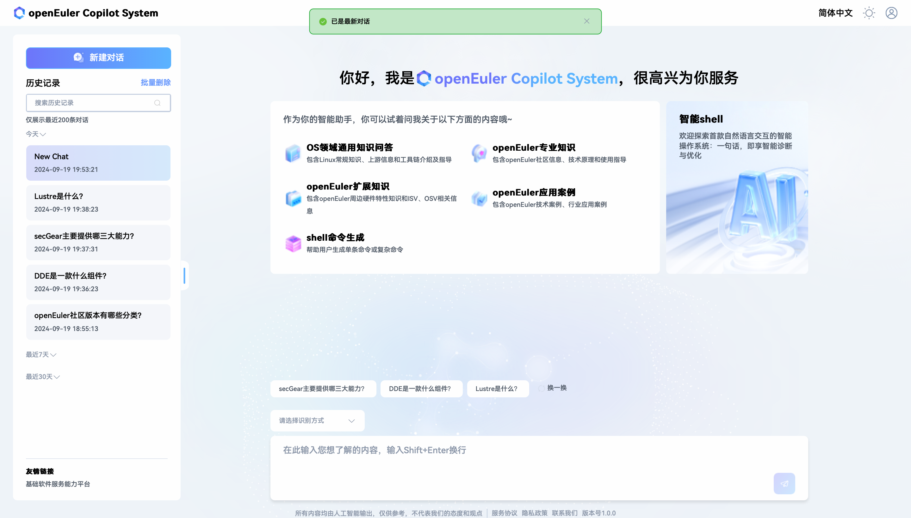
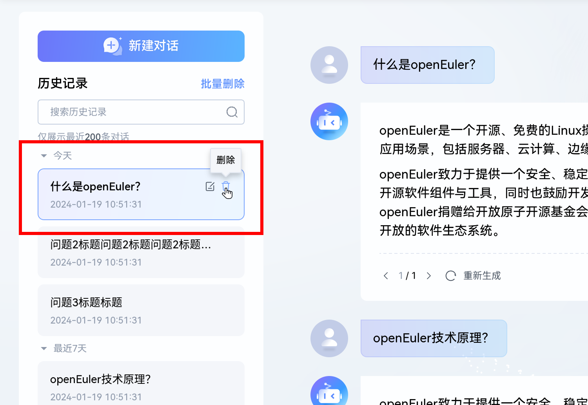
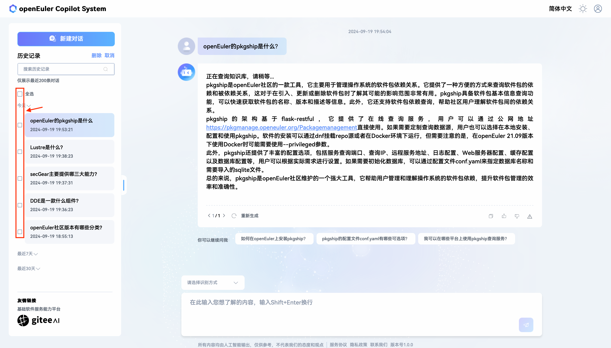
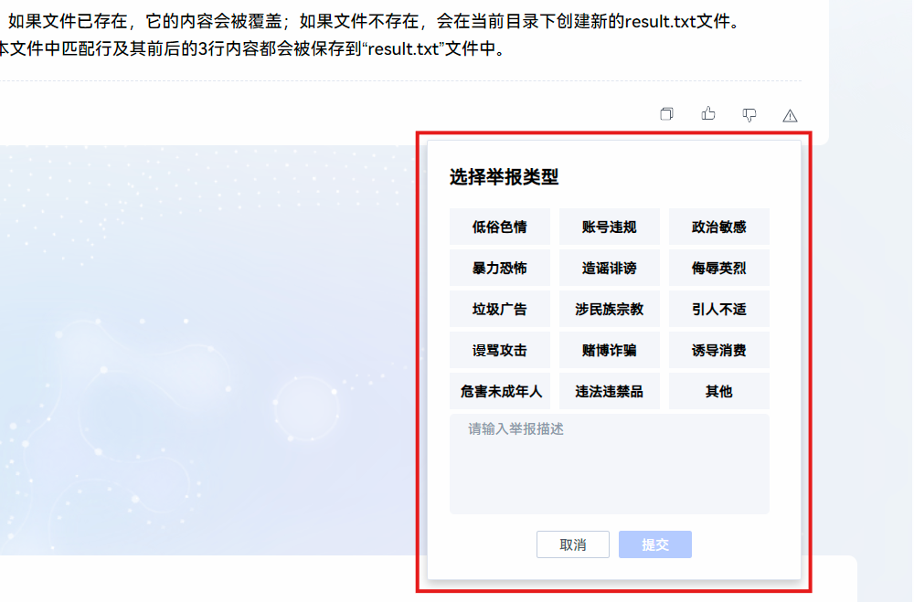
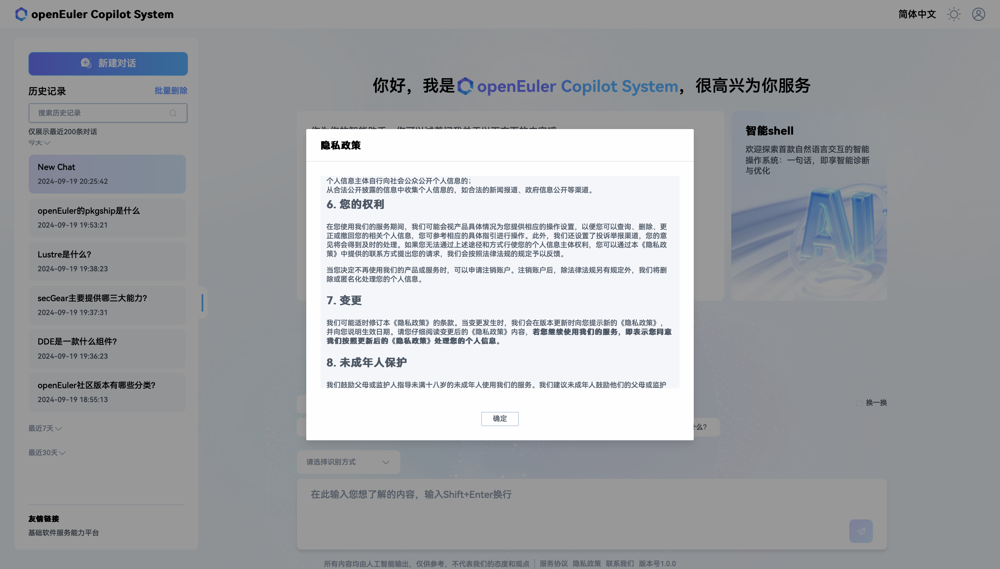

# 智能问答使用指南

## 开始对话

在对话区下侧输入框即可输入对话想要提问的内容，输入 `Shift + Enter` 可进行换行，输入 `Enter` 即可发送对话提问内容，或者单击“发送”也可发送对话提问内容。

> **说明**
>
> 对话区位于页面的主体部分，如图 1 所示。

- 图 1 对话区
  

### 多轮连续对话

openEuler Copilot System 智能问答支持多轮连续对话。只需要在同一个对话中继续追问即可使用，如图 2 所示。

- 图 2 多轮对话
  

### 重新生成

如遇到 AI 生成的内容有误或不完整的特殊情况，可以要求 AI 重新回答问题。单击对话回答左下侧的“重新生成”文字，可让 openEuler Copilot System 重新回答用户问题，重新回答后，在对话回答右下侧，会出现回答翻页的图标和，单击或可查看不同的回答，如图 3 所示。

- 图 3 重新生成
  

### 推荐问题

在 AI 回答的下方，会展示一些推荐的问题，单击即可进行提问，如图 4 所示。

- 图 4 推荐问题
  

## 自定义背景知识

openEuler Copilot System 支持上传文件功能。上传文件后，AI 会将上传的文件内容作为背景知识，在回答问题时，会结合背景知识进行回答。上传的背景知识只会作用于当前对话，不会影响其他对话。

### 上传文件

**步骤1** 单击对话区左下角的“上传文件”按钮，如图 5 所示。

- 图 5 上传文件按钮
  

> **说明**
>
> 鼠标悬停到“上传文件”按钮上，会显示提示允许上传文件的规格和格式，如图 6 所示。

- 图 6 鼠标悬停显示上传文件规格提示
  

**步骤2** 在弹出的文件选择框中，选择需要上传的文件，单击“打开”，即可上传文件。最多上传10个文件，总大小限制为64MB。接受 PDF、docx、doc、txt、md、xlsx。

开始上传后，对话区下方会显示上传进度，如图 7 所示。

- 图 7 同时上传的所有文件排列在问答输入框下方
  

文件上传完成后会自动解析，如图 8 所示，解析完成后，对话区下方会显示每个文件的大小信息。

- 图 8 文件上传至服务器后将显示“正在解析”
  

文件上传成功后，左侧历史记录区会显示上传的文件数量，如图 9 所示。

- 图 9 对话历史记录标签上会展示上传文件数量
  

### 针对文件提问

文件上传完成后，即可针对文件进行提问，提问方式同普通对话模式，如图 10 所示。
回答结果如图 11 所示。

- 图 10 询问与上传的文件相关的问题
  

- 图 11 AI 以上传的为背景知识进行回答
  

## 管理对话

> **说明**
>
> 对话管理区在页面左侧。

### 新建对话

单击“新建对话”按钮即可新建对话，如图 12 所示。

- 图 12 “新建对话”按钮在页面左上方
  

### 对话历史记录搜索

在页面左侧历史记录搜索输入框输入关键词，然后单击即可进行对话历史记录搜索如图 13 所示。

- 图 13 对话历史记录搜索框
  

### 对话历史记录单条管理

历史记录的列表位于历史记录搜索栏的下方，在每条对话历史记录的右侧，单击即可编辑对话历史记录的名字，如图 14 所示。

- 图 14 点击“编辑”图标重命名历史记录
  

在对话历史记录名字重新书写完成后，单击右侧即可完成重命名，或者单击右侧放弃本次重命名，如图 15 所示。

- 图 15 完成/取消重命名历史记录
  

另外，单击对话历史记录右侧的删除图标，如图 16 所示，即可对删除单条对话历史记录进行二次确认，在二次确认弹出框，如图 17 所示，单击“确认”，可确认删除单条对话历史记录，或者单击“取消”，取消本次删除。

- 图 16 点击“垃圾箱”图标删除单条历史记录
  

- 图 17 二次确认后删除历史记录
  

### 对话历史记录批量删除

首先单击“批量删除”，如图 18 所示。

- 图 18 批量删除功能在历史记录搜索框右上方
  

然后可对历史记录进行选择删除，如图 19 所示。单击“全选”，即对所有历史记录选中，单击单条历史记录或历史记录左侧的选择框，可对单条历史记录进行选中。

- 图 19 在左侧勾选要批量删除历史记录
  

最后需要对批量删除历史记录进行二次确认，如图 20 所示，单击“确认”，即删除，单击“取消”，即取消本次删除。

- 图 20 二次确认后删除所选的历史记录
  

## 反馈与举报

在对话记录区，对话回答的右下侧，可进行对话回答反馈，如图 21 所示，单击，可给对话回答点赞；单击，可以给对话回答反馈不满意的原因。

- 图 21 点赞和不满意反馈
  

对于反馈不满意原因，如图 22 所示，在单击之后，对话机器人会展示反馈内容填写的对话框，可选择相关的不满意原因的选项。

- 图 22 回答不满意反馈
  

其中单击选择“存在错误信息”，需要填写参考答案链接和描述，如图 23 所示。

- 图 23 回答不满意反馈——存在错误信息
  

### 举报

如果发现 AI 返回的内容中有违规信息，可以点击右下角按钮举报，如图 24 所示。点击举报后选择举报类型并提交，若没有合适的选项，请选择“其他”并输入原因，如图 25 所示。

- 图 24 举报按钮在对话块的右下角
  

- 图 25 点击后可选择举报类型
  

## 查看服务协议和隐私政策

单击文字“服务协议”，即可查看服务协议，单击文字“隐私政策”，即可查看隐私政策，如图 26、图 27 所示。

- 图 26 服务协议和隐私政策入口在页面底部信息栏
  

- 图 27 点击后显示服务协议或隐私政策弹窗
  

## 附录

### 用户信息导出说明

openEuler Copilot System 后台存在用户信息导出功能，如用户需要，需主动通过 <contact@openeuler.io> 邮箱联系我们，运维会将导出的用户信息通过邮箱回送给用户。
