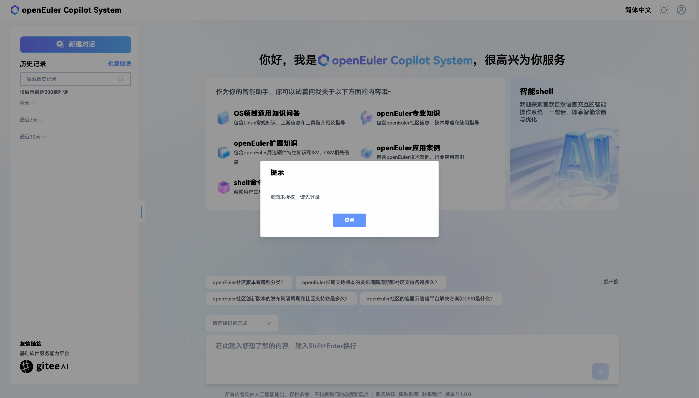

# 登录 EulerCopilot

本章节介绍登录通过 *[EulerCopilot 部署指南](../../部署指南)* 部署的 EulerCopilot 网页端的操作步骤。

## 浏览器要求

浏览器要求如表 1 所示。

- 表 1 浏览器要求

| 浏览器类型 | 最低版本 | 推荐版本 |
| ----- | ----- | ----- |
| Google Chrome | 72 | 121 或更高版本 |
| Mozilla Firefox | 89 | 122 或更高版本 |
| Apple Safari | 11.0 | 16.3 或更高版本 |

## 操作步骤

**步骤1** 打开本地 PC 机的浏览器，在地址栏输入 *[部署指南](../../部署指南/网络环境下部署指南.md#2-安装-openeuler-copilot-system)* 中配置好的域名，按下 `Enter`。在未登录状态，进入 EulerCopilot，会出现登录提示弹出框，如图 1 所示。

- 图 1 未登录

**步骤2** 登录 EulerCopilot（已注册账号）。

打开登录界面，如图 2 所示。

- 图 2 登录 EulerCopilot

## 注册 EulerCopilot 账号

**步骤1**  在登录信息输入框右下角单击“立即注册”，如图 3 所示。

- 图 3 立即注册

**步骤2** 进入账号注册页，根据页面提示填写相关内容，如图 4 所示。

- 图 4 账号注册

**步骤3** 按页面要求填写账号信息后，单击“注册”，即可注册成功。注册后即可返回登录。

## 退出登录

**步骤1** 单击后，会出现“退出登录”下拉框，如图 5 所示。

> **说明**
> 账号管理区位于页面的右上角部分，如图 5 所示。

- 图 5 账号管理区

**步骤2** 单击“退出登录”即可退出登录，如图 5 所示。
