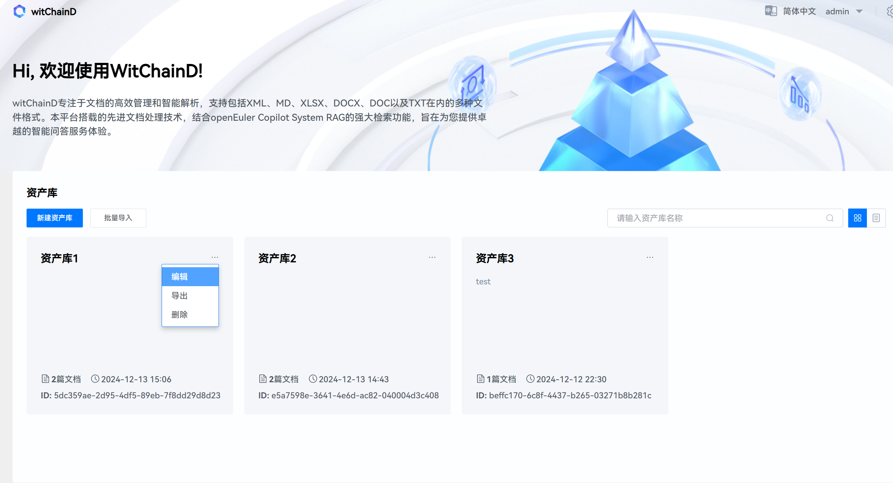
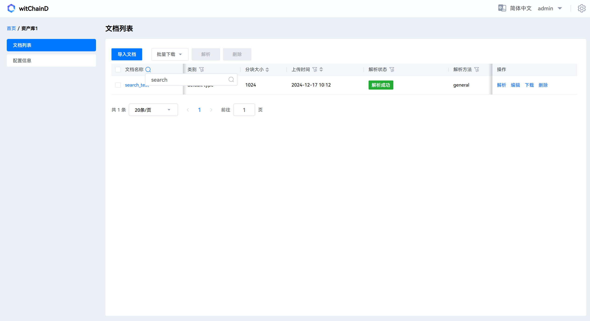

# witChainD 使用指南——知识库管理

完成 witChainD 部署之后，即可使用 witChainD 进行知识库管理管理。

下文会从页面的维度进行 witChainD 的功能介绍。

## 1. 资产库管理界面

该页面为资产库管理界面，用户登录后将会进入该界面。

**支持操作：**

- 配置模型：点击右上角的设置按键，可以修改模型相关的配置。

  

- 新增资产库：点击新建资产库按钮新建，支持自定义名称、描述、语言、嵌入模型、解析方法、文件分块大小、文档类别。注意：重复名称会自动将名称修改成资产库id。

  

- 编辑资产库：点击资产库的编辑按钮编辑，支持修改名称、描述、语言、解析方法、文件分块大小、文档类别。注意：不能修改成重复名称。

  

  

- 导出资产库：点击资产库的导出按钮导出，导出完成后需要按任务列表中的下载任务下载对应资产库到本地。
  
  

- 批量导入资产库：点击批量导入，上传本地文件后选中即可导入。

  

- 搜索资产库：在搜索栏中键入文本，可以搜索得到名称包含对应文本的资产库。

## 2. 文档管理界面

在资产管理界面点击对应资产库，可以进入文档管理界面。

**支持操作：**

- 导入文档：点击导入文档，从本地上传文件导入，导入后会自动以该资产库默认配置开始解析。

  

- 解析文档：点击操作中的解析，对文档进行解析。也可以选中多个文档批量解析。

  
  
  
  
  

- 编辑文档配置：点击编辑对文档配置进行编辑，支持编辑文档名称、解析方法、类别、文件分块大小。

  

- 下载文档：点击下载即可将文档下载至本地，也可以选中多个文档批量下载。

- 删除文档：点击删除即可将文档从资产库中删除，也可以选中多个文档批量删除。

- 搜索文档：点击文档名称旁的搜索键，在弹出的搜索框中键入搜索的文本，可以搜索得到名称包含这些文本的文档。

  

- 编辑资产库配置：支持编辑资产库名称、描述、语言、默认解析方法、文件分块大小、文档信息类别。

  

## 3. 解析结果管理界面

点击解析完成的文档，可以进入文档的解析结果管理界面。界面中会按照顺序显示文档解析后的文本块内容预览，每个文本块会附带一个标签，表示该文本块中的信息来源于文档中的段落、列表或者是图片。右侧的开关表示该文本块是否被启用。

**支持操作**：

- 关闭/启用文本块：点击文本块右侧的开关即可关闭/启用对应文本块，也可以选中多个文本块批量关闭/启用。

  

- 搜索文本块：在搜索框中键入内容，可以查找包含对应内容的文本块。
