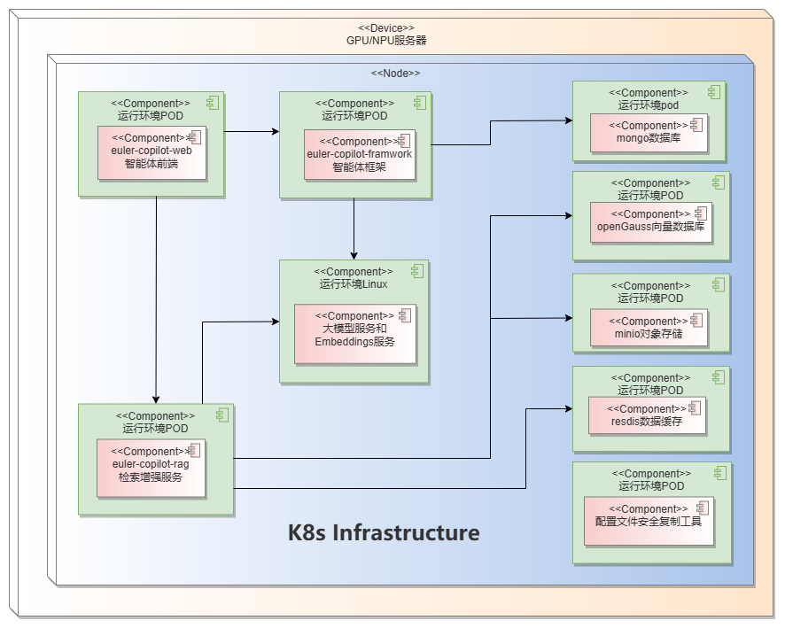
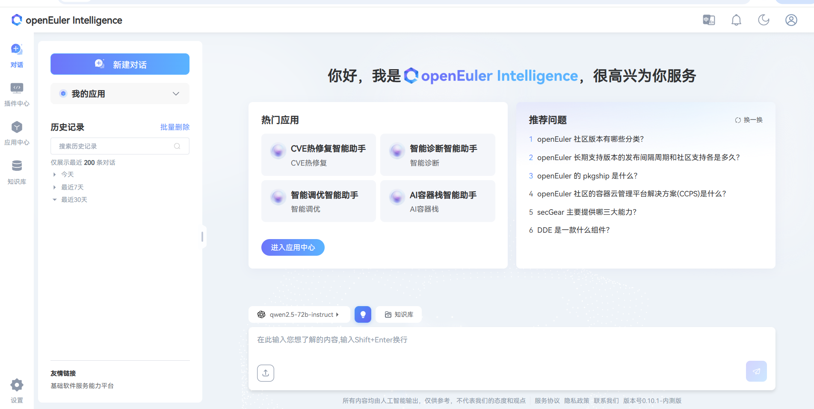
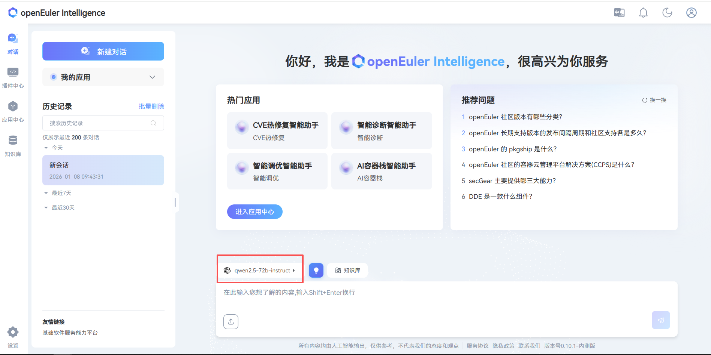
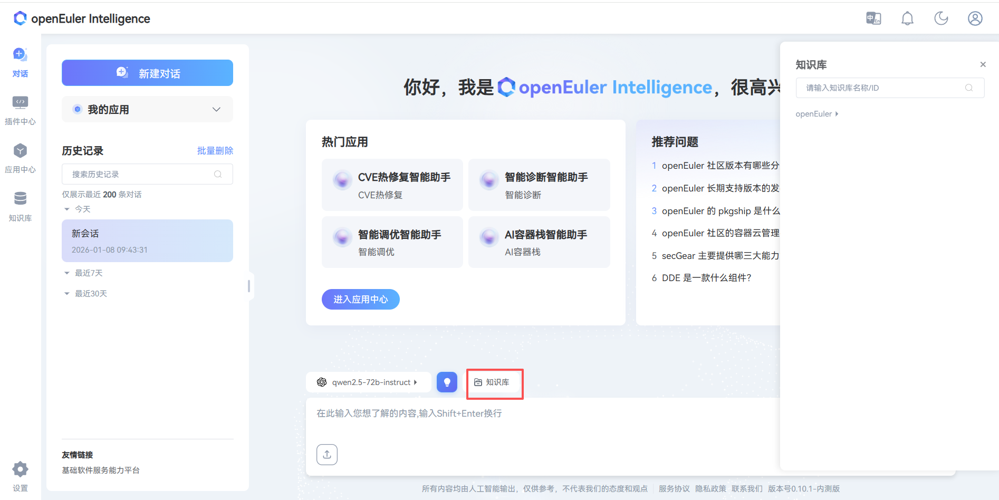

# 智能助手Web（Witty Assistant）部署指南

**版本信息**  
当前版本：v0.10.1  
发布日期：2026年1月23日

## 产品概述

 智能助手Web（Witty Assistant）是一款智能问答工具，Witty Assistant 的 web 客户端提供 AI 驱动的智能问答交互界面，支持多种 LLM 后端，集成 MCP 协议，使用 Witty Assistant 的 Web 客户端，可以解决操作系统知识获取的便捷性问题，并为 OS 领域模型赋能开发者及运维人员。作为操作系统知识获取工具，它支持智能问答、知识库管理、智能体应用和工作流应用、以及语义接口的上传，结合智能体任务规划能力，显著降低开发和使用操作系统特性的门槛。

本指南提供基于自动化脚本的 Witty Assistant 智能助手系统部署说明，支持一键自动部署和手动分步部署两种方式。

### 组件介绍

| 组件名称 | 服务端口 | 服务描述 |
| --------- | --------- | --------- |
| euler-copilot-framework | 8002 (内部) | 智能体框架核心服务，负责任务调度与执行 |
| euler-copilot-web | 8080 | Web 前端用户界面服务 |
| euler-copilot-rag | 9988 (内部) | 检索增强生成服务，支持文档检索与分析 |
| authhub-backend-service | 11120 (内部) | 认证授权服务后端 |
| authhub-web-service | 8000 | 认证授权服务前端 |
| mysql | 3306 (内部) | MySQL 关系型数据库，存储用户数据及配置信息 |
| redis | 6379 (内部) | Redis 缓存数据库，支持会话和临时数据存储 |
| minio | 9000/9001 (内/外部) | MinIO 对象存储服务，用于文档和文件管理 |
| mongo | 27017 (内部) | MongoDB 文档数据库，存储非结构化数据 |
| openGauss | 5432 (内部) | openGauss 向量数据库，支持语义检索和向量计算 |
| secret_inject | 无端口 | 配置文件安全注入工具，确保敏感信息安全 |

### 系统要求

#### 软件要求

| 组件 | 版本要求 | 备注说明 |
| ------ | --------- | --------- |
| 操作系统 | openEuler 22.03 LTS 或更高版本 | 建议使用官方认证版本 |
| Kubernetes | K3s v1.30.2+ (集成Traefik Ingress) | 轻量级 Kubernetes 发行版 |
| 包管理 | Helm v3.15.3+ | Kubernetes 应用包管理工具 |
| Python环境 | Python 3.9.9+ | 模型下载和脚本执行环境 |

#### 硬件规格

| 资源类型 | 最小配置 | 生产推荐配置 | 说明 |
| --------- | --------- | ------------- | ------ |
| CPU核心 | 4核 | 16核及以上 | 建议支持 AVX512 指令集 |
| 内存 | 4GB | 64GB | |
| 存储空间 | 32GB | 64GB+ | |
| 大模型 | qwen2.5-14B | qwen2.5-32B | 支持本地部署或API调用 |
| GPU显存 (可选) | NVIDIA RTX A4000 8GB | NVIDIA A100 80GB * 2 | 仅 GPU 推理场景需要 |

**部署前提条件说明**：

1. 纯 CPU 环境建议通过API方式调用云服务模型或部署量化版本地模型
2. 若已存在 Kubernetes 集群（版本≥1.28），可跳过 K3s 安装步骤

### 部署架构



## 快速开始

### 获取部署脚本

从 [官方 Git 仓库](https://atomgit.com/openeuler/euler-copilot-framework.git) 下载最新仓库 ：

```bash
# 1. 有网络环境下执行
cd /home
git clone https://atomgit.com/openeuler/euler-copilot-framework.git -b release-0.10.1
```

```bash
# 2. 无网络环境下执行
# 切换至 release-0.10.1 分支下载 ZIP 并上传至目标服务器
unzip euler-copilot-framework.tar -d /home
cd /home/euler-copilot-framework/deploy/scripts
```

### 获取资源（无网络环境下执行）

从 [Witty Assistant 资源地址](https://repo.oepkgs.net/openEuler/rpm/openEuler-22.03-LTS/contrib/eulercopilot/) 手动下载最新镜像和工具等 ：

**资源列表**：

| 资源类型 | 文件清单 | 存放位置 | 架构支持 |
|--------- | --------- | --------- | --------- |
| **镜像文件** | `euler-copilot-framework:0.10.1-[x86/arm]`<br>`euler-copilot-web:0.10.1-[x86/arm]`<br>`data_chain_back_end:0.10.1-[x86/arm]`<br>`data_chain_web:0.10.1-[x86/arm]`<br>`authhub:0.9.3-x86`<br>`authhub-web:0.9.3-x86`<br>`opengauss:latest-x86`<br>`redis:7.4-alpine-x86`<br>`mysql:8-x86`<br>`minio:empty-x86`<br>`mongo:7.0.16-x86`<br>`secret_inject:dev-x86` | /home/eulercopilot/images | x86_64, ARM64 |
| **模型文件** | `bge-m3-Q4_K_M.gguf`<br>`deepseek-llm-7b-chat-Q4_K_M.gguf` | /home/eulercopilot/models | 通用 |
| **部署工具** | `helm-v3.15.0-linux-{arm64/amd64}.tar.gz`<br>`k3s-airgap-images-{arm64/amd64}.tar.zst`<br>`k3s-{arm64/amd64}`<br>`k3s-install.sh`<br>`ollama-linux-{arm64/amd64}.tgz` | /home/eulercopilot/tools | x86_64, ARM64 |

```bash
# 有联网环境可执行脚本保存镜像并传输至目标服务器
# 进入脚本目录
cd /home/euler-copilot-framework/deploy/scripts/9-other-script/

# 执行镜像保存脚本（指定版本和架构）
bash save_images.sh --version 0.10.1 --arch x86

# 镜像将保存至/home/eulercopilot/images，使用SCP传输镜像文件至目标服务器
scp -r /home/eulercopilot/images/* root@target-server:/home/eulercopilot/images/
```

### 部署执行

#### 一键部署

- 一键自动部署模式主要适用于**没有预先部署大语言模型资源**的用户：

   ```bash
   bash deploy.sh
   ```

   ```text
   ==============================
   Witty Assistant 部署系统
   ==============================
   0) 一键自动部署模式 - 全自动安装（推荐新手）
   1) 手动分步部署模式 
   2) 服务重启管理
   3) 系统卸载与清理
   4) 退出部署程序
   ==============================
   请选择部署模式 [0-4]: 0
   ```

- **自动安装和配置所有必需组件**：
  - 自动部署 k3s、helm、Ollama
  - 下载并部署 Deepseek 大语言模型（deepseek-llm-7b-chat）
  - 下载并部署 Embedding 模型（bge-m3）
  - 安装数据库、Authhub 认证服务和 Witty Assistant 应用
  - 可在纯CPU环境运行，如有GPU资源须预先安装 GPU 驱动，会自动利用加速推理
  - 自动配置模型接口供 Witty Assistant 调用

#### 分步部署

- 分步部署模式主要适用于**已有大语言模型接口和embedding模型接口**的场景。

- 预先准备模型服务：
  - 确保大语言模型服务已部署或可访问
  - 确保 embedding 模型服务已部署或可访问
  - 在部署前编辑 values.yaml 文件，预先填写模型服务信息，例如各模型的 API 的endpoint、密钥、name等

   ```yaml
   #  配置示例：
   models:
   # 用于问答的大语言模型；需要OpenAI兼容的API
   answer:
      # [必需] API端点URL（请根据API提供商文档确认是否包含"v1"后缀）
      endpoint: https://$ip:$port/v1
      # [必需] API密钥；默认为空
      key: sk-123456
      # [必需] 模型名称
      name: qwen3-32b
      # [必需] 模型最大上下文长度；推荐>=8192
      ctxLength: 8192
      # 模型最大输出长度，推荐>=2048
      maxTokens: 8192
   # 用于函数调用的模型；推荐使用特定的推理框架
   functionCall:
      # 推理框架类型，默认为ollama
      # 可用框架类型：["vllm", "sglang", "ollama", "openai"]
      backend: openai
      # [必需] 模型端点；请根据API提供商文档确认是否包含"v1"后缀
      # 留空则使用与问答模型相同的配置
      endpoint: https://$ip:$port/v1
      # API密钥；留空则使用与问答模型相同的配置
      key: sk-123456
      # 模型名称；留空则使用与问答模型相同的配置
      name: qwen3-32b
      # 模型最大上下文长度；留空则使用与问答模型相同的配置
      ctxLength: 8192
      # 模型最大输出长度；留空则使用与问答模型相同的配置
      maxTokens: 8192
   # 用于数据嵌入的模型
   embedding:
      # 推理框架类型，默认为openai
      # [必需] Embedding API类型：["openai", "mindie"]
      type: openai
      # [必需] Embedding URL（需要包含"v1"后缀）
      endpoint: https://$ip:$port/v1
      # [必需] Embedding模型API密钥
      key: sk-123456
      # [必需] Embedding模型名称
      name: BAAI/bge-m3
      # reranker模型
   # 用于对rag检索结果重排的模型，支持openai 轨迹流动 vllm asscend等提供的api
   reranker:
      # [必填] reranker接口类型：["guijiliudong", "algorithm",
      # "bailian", "v1lm", "assecend"]
      type: guijiliudong
      # [必填] reranker URL（需要带上“/v1/rerank”后缀）
      endpoint: https://api.siliconflow.cn/v1/rerank
      # [必填] reranker 模型API Key
      key: sk-123456
      # [必填] reranker 模型名称
      name: BAAI/bge-reranker-v2-m3
      # [必填] reranker 模型icon URL
      icon: https://sf-maas-uat-prod.oss-cn-shanghai.aliyuncs.com/Model_LOGO/BAAI.svg
   ```

   ```bash
   # 执行脚本
   bash deploy.sh
   ```

   ```bash
   # 选择1手动部署
   ==============================
         主部署菜单
   ==============================
   0) 一键自动部署 
   1) 手动分步部署 - 已有模型服务
   2) 重启服务
   3) 卸载所有组件并清除数据
   4) 退出程序
   ==============================
   请输入选项编号（0-3）: 1
   ```

   ```bash
   # 跳过步骤3、4、5后依次执行
   ==============================
         手动分步部署菜单
   ==============================
   1) 执行环境检查脚本
   2) 安装k3s和helm
   3) 安装Ollama - 如已有模型服务可跳过
   4) 部署Deepseek模型 - 如已有模型服务可跳过
   5) 部署Embedding模型 - 如已有模型服务可跳过
   6) 安装数据库
   7) 安装AuthHub
   8) 安装Witty Assistant
   9) 返回主菜单
   ==============================
   请输入选项编号（1-9）:
   ```

### 重启操作

- 选择需要重启的服务按回车执行

   ```bash
   ==============================
         服务重启菜单
   ==============================
   可重启的服务列表：
   1) authhub-backend
   2) authhub
   3) framework
   4) minio
   5) mongo
   6) mysql
   7) opengauss
   8) rag
   9) rag-web
   10) redis
   11) web
   12) 返回主菜单
   ==============================
   请输入要重启的服务编号（1-12）:
   ```

### 卸载操作

- 卸载操作仅卸载服务并清除数据，不卸载部署工具

   ```bash
   ==============================
         主部署菜单
   ==============================
   0) 一键自动部署
   1) 手动分步部署
   2) 卸载所有组件并清除数据
   3) 退出程序
   ==============================
   请输入选项编号（0-3）: 2
   ```

### 运维指令

- 使用以下指令进行服务和镜像维护

   ```bash
   # 查看服务状态
   kubectl get pod -n euler-copilot
   ```

   ```bash
   # 查看组件日志
   kubectl logs $pod_name -n euler-copilot
   ```

   ```bash
   # 大模型配置修改
   cd /home/euler-copilot-framework/deploy/chart/euler_copilot
   vim values.yaml
   helm upgrade euler-copilot -n euler-copilot .
   ```

   ```bash
   # 集群事件检查
   kubectl get events -n euler-copilot
   ```

   ```bash
   # 镜像查看
   k3s crictl images
   # 镜像卸载
   k3s crictl rmi $image_id
   # 镜像导入
   k3s ctr image import $image_tar
   ```

### 验证安装

恭喜您，**Witty Assistant** 已成功部署！为了开始您的体验，请在浏览器中输入 `https://$host:30080` 访问 Witty Assistant 的网页：

- 首次访问点击 **立即注册** 创建账号
- 完成登录流程

   
   

### 构建专有领域智能问答

知识库专注于文档的高效管理和智能解析，支持包括xlsx,pdf,doc,docx,pptx,html,json,yaml,md,zip以及txt在内的多种文件格式。本平台搭载的先进文档处理技术，结合 Witty Assistant 的强大检索功能，旨在为您提供卓越的智能问答服务体验。详细操作可访问 [知识库管理使用指南](https://atomgit.com/openeuler/euler-copilot-framework/blob/master/docs/zh/openeuler_intelligence/intelligent_assistant/advance/knowledge_base/user_guide/knowledge_base_guidance.md)

- **进入知识库管理系统**：
  - 点击知识库
  - 新建团队，点击确定
  - 点击新建资产库或导入资产库

- **配置资产库**
  - 点击对话
  - 点击模型
   
  - 点击知识库
   
  - 选择资产库
   

## 附录

### 大模型准备

#### GPU 环境（基于 vLLM）

1. 安装依赖：

   ```bash
   # 基础环境
   Python >= 3.10
   CUDA >= 11.7
   GPU 驱动安装：https://www.nvidia.cn/drivers/lookup/

   # 安装 vLLM
   pip install vllm
   # 如果需要 OpenAI 兼容的 Web 服务器
   pip install 'vllm[openai]'
   ```

2. 下载模型：

   ```bash
   # 使用 huggingface-cli
   pip install huggingface-cli
   huggingface-cli download --resume-download Qwen/Qwen1.5-14B-Chat --local-dir Qwen1.5-14B-Chat
   ```

3. 启动服务：

   ```bash
   python -m vllm.entrypoints.openai.api_server \
      --model /root/models/Qwen1.5-14B-Chat/ \
      --served-model-name qwen1.5-14b-chat \
      --api-key sk-123456 \
      --host 0.0.0.0 \
      --port 30000 \
      --tensor-parallel-size 8 \
      --gpu-memory-utilization 0.7 \
      --dtype half
   ```

   常用参数说明

   ```bash
   # 核心参数
   --model /path/to/model           # 模型路径
   --served-model-name name         # API 中的模型名称
   --api-key sk-xxxxxx              # API 密钥（可设置多个，用逗号分隔）
   --host 0.0.0.0                   # 监听地址
   --port 30000                     # 端口号

   # GPU 相关参数
   --tensor-parallel-size 8         # GPU 数量（张量并行）
   --gpu-memory-utilization 0.7     # GPU 内存利用率
   --dtype half                     # 数据类型（half/float16, bfloat16, float32）
   ```

4. 修改配置：

   ```bash
   # 修改模型设置
   vim /home/euler-copilot-framework/deploy/chart/euler_copilot/values.yaml
   ```

5. 更新服务：
  
   ```bash
   # 更新服务
   helm upgrade -n euler-copilot euler-copilot .
   ```

   ```bash
   # 重启framework服务
   kubectl get pod -n euler-copilot
   kubectl delete pod framework-deploy-65b669fc58-q9bw7 -n euler-copilot
   ```

6. curl 大模型接口

   ```bash
   curl http://localhost:30000/v1/chat/completions \
   -H "Content-Type: application/json" \
   -H "Authorization: Bearer sk-123456" \
   -d '{
      "model": "qwen1.5-14b-chat",
      "messages": [
         {"role": "system", "content": "你是一个乐于助人的智能助手"},
         {"role": "user", "content": "你好"}
      ],
      "stream": true,
      "n": 1,
      "max_tokens": 8192
   }'
   ```

#### NPU 环境

参考：[昇腾镜像仓库](https://www.hiascend.com/developer/ascendhub)

### FAQ

[参考链接](https://atomgit.com/openeuler/docs/blob/stable-common/docs/zh/faq/community_tools/openeuler_intelligence_deployment_faqs.md)
