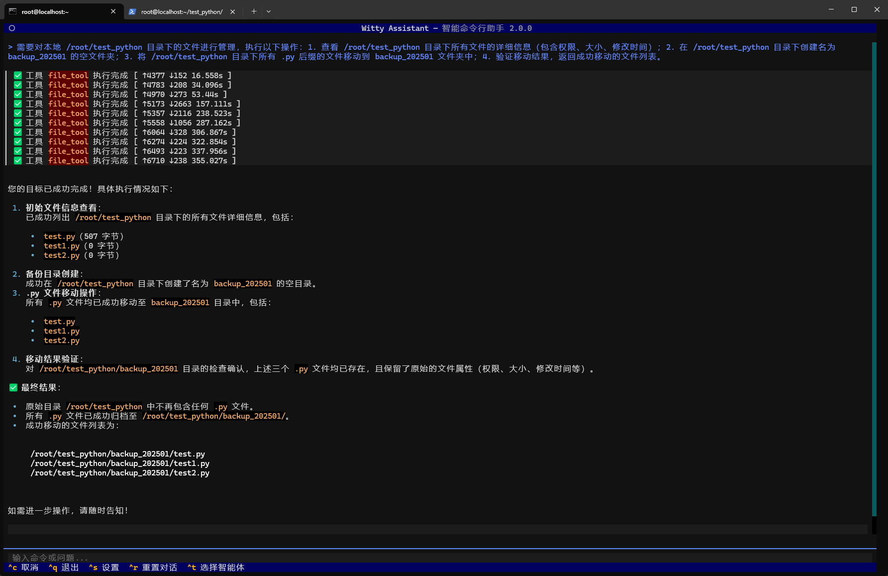

# Witty Assistant 智能体介绍

## 1. 引言

本手册重点介绍 Witty 平台当前集成的核心智能体 —— OE-智能运维助手，该智能体是 openEuler Intelligence 生态体系下面向基础运维领域的专用工具。其核心优势在于整合两大 MCP 服务能力，实现 openEuler 系统基础运维全场景覆盖与轻量化知识检索的有机结合。手册通过标准化的能力说明与实操案例，为企业运维人员提供 “即查即用” 的操作指引，助力降低运维门槛、提升运维工作的标准化与高效化水平。

### 默认智能体总汇表

| Agent 名称 | 核心适用场景 | 核心能力模块 |
|------------|--------------|--------------|
| OE-智能运维助手 | 基础运维全场景（命令执行、文件管理、系统监控等）+ 轻量化知识检索 | 1. oe-cli-mcp-server：基础运维全能力工具集<br>2. rag-server：轻量化知识库管理与检索工具集 |

## 2. OE-智能运维助手

OE-智能运维助手通过整合两大核心 MCP 服务，实现“基础运维 + 知识检索”的一站式运维中枢。所有工具均适配 openEuler 系统特性，支持本地/远程执行（部分工具）、中英文双语返回，具备严格的参数规范与统一的返回格式，可直接集成到企业运维流程中。

### 2.1 MCP 服务矩阵

| 服务分类 | MCP 工具名称（带锚点） | 核心功能定位 | 默认端口 |
|----------|------------------------|--------------|----------|
| 基础运维服务 | <a href="#cmd_executor_tool">cmd_executor_tool</a> | 本地/SSH远程命令/脚本执行，自动适配超时时间 | 12555 |
| 基础运维服务 | <a href="#file_tool">file_tool</a> | 本地文件/目录查、增、改、删全操作 | 12555 |
| 基础运维服务 | <a href="#network_fix_bootproto_tool">network_fix_bootproto_tool</a> | 自动修复NetworkManager IP获取问题 | 12555 |
| 基础运维服务 | <a href="#pkg_tool">pkg_tool</a> | openEuler软件包查、装、更、卸、缓存清理 | 12555 |
| 基础运维服务 | <a href="#proc_tool">proc_tool</a> | 进程/服务查看、启动、停止、强制终止 | 12555 |
| 基础运维服务 | <a href="#ssh_fix_tool">ssh_fix_tool</a> | openEuler系统SSH连接问题诊断与修复 | 12555 |
| 基础运维服务 | <a href="#sys_info_tool">sys_info_tool</a> | 系统/硬件/安全信息批量采集 | 12555 |
| 轻量化RAG服务 | <a href="#create_knowledge_base">create_knowledge_base</a> | 创建独立知识库，支持自定义chunk大小与向量化配置 | 12311 |
| 轻量化RAG服务 | <a href="#delete_knowledge_base">delete_knowledge_base</a> | 删除指定知识库，级联清理文档与chunk | 12311 |
| 轻量化RAG服务 | <a href="#list_knowledge_bases">list_knowledge_bases</a> | 列出所有知识库，展示详情与当前选中状态 | 12311 |
| 轻量化RAG服务 | <a href="#select_knowledge_base">select_knowledge_base</a> | 选择当前使用的知识库，关联后续文档操作 | 12311 |
| 轻量化RAG服务 | <a href="#import_document">import_document</a> | 多格式文档并发导入，自动解析与向量化 | 12311 |
| 轻量化RAG服务 | <a href="#search">search</a> | 关键词+向量混合检索，返回最相关结果 | 12311 |
| 轻量化RAG服务 | <a href="#list_documents">list_documents</a> | 查看当前知识库下所有文档详情 | 12311 |
| 轻量化RAG服务 | <a href="#delete_document">delete_document</a> | 删除指定文档，级联清理关联chunk | 12311 |
| 轻量化RAG服务 | <a href="#update_document">update_document</a> | 更新文档chunk大小并重新解析向量化 | 12311 |
| 轻量化RAG服务 | <a href="#export_database">export_database</a> | 导出知识库数据库文件，支持备份 | 12311 |
| 轻量化RAG服务 | <a href="#import_database">import_database</a> | 导入数据库文件，合并知识库与文档 | 12311 |

### 2.2 使用案例

以下按“网络问题排查、系统资源监控、文件操作、软件包管理、SSH连接修复、知识库检索”六大高频运维场景分类，提供自然语言交互 Prompt 格式，直接替换 IP、文件路径、知识库名称等关键信息即可使用，所有场景均贴合企业内部运维实际需求。

- 场景 ：本地文件批量管理

  ```text
    需要对本地 /root/test_python 目录下的文件进行管理，执行以下操作：
       1. 查看 /root/test_python 目录下所有文件的详细信息（包含权限、大小、修改时间）；
       2. 在 /root/test_python 目录下创建名为 backup_202501 的空文件夹；
       3. 将 /root/test_python 目录下所有 .py 后缀的文件移动到 backup_202501 文件夹中；
       4. 验证移动结果，返回成功移动的文件列表。
  ```
  


## 3. MCP 总览

OE-智能运维助手包含 2 个核心 MCP Server，分别提供基础运维与轻量化 RAG 服务，所有服务独立部署、独立运维，单个服务故障不影响其他服务正常运行。以下详细列出各 Server 信息及下属工具的核心详情。

### 3.1 MCP_Server列表

| 端口号 | 服务名称 | 目录路径 | 简介 |
|--------|----------|----------|------|
| 12555 | oe-cli-mcp-server | mcp_center/oe_cli_mcp_server | 基础运维MCP：提供命令执行、文件管理、系统信息查询、进程管理、软件包管理、SSH修复、Network修复等核心工具 |
| 12311 | rag-server | mcp_center/third_party_mcp/rag | 轻量化rag服务：提供知识库创建与管理、文档导入与检索、数据库导出与导入等核心工具 |

### 3.2 MCP_Server 详情

#### 3.2.1 oe-cli-mcp-server

| MCP_Server 名称 | MCP_Tool 列表 | 工具功能 | 核心输入参数 | 关键返回内容 |
|-----------------|---------------|----------|--------------|--------------|
|                 | <a id="cmd_executor_tool">cmd_executor_tool</a> | 支持本地/SSH远程执行shell命令/脚本，按指令类型自动设置超时时间，超时自动终止 | - host：执行目标主机IP/主机名（默认127.0.0.1，本地执行）<br>- command：需执行的shell命令/脚本（必填）<br>- timeout：超时时间（可选，正整数，单位：秒） | success（执行结果）、message（执行信息/错误提示）、result（命令输出内容）、target（执行目标）、timeout_used（实际超时时间） |
|                 | <a id="file_tool">file_tool</a> | 支持本地文件/目录的查、增、改、删全操作，纯Python实现，无shell依赖 | - action：操作类型（必填，枚举：ls/cat/add/append/edit/rename/chmod/delete）<br>- file_path：目标文件/目录绝对路径（必填）<br>- 其他参数：content（写入内容）、new_path（新路径）、mode（权限模式）等（按需传入） | success（执行结果）、message（执行信息/错误提示）、result（操作结果列表）、file_path（操作路径）、target（固定127.0.0.1） |
|                 | <a id="network_fix_bootproto_tool">network_fix_bootproto_tool</a> | 自动修复NetworkManager启动后未自动获取IP的问题，编辑网卡配置并重启服务 | - target：目标主机IP/主机名（默认127.0.0.1）<br>- lang：语言设置（可选） | success（修复结果）、message（修复结果说明）、target（目标主机）、result（详细步骤信息列表） |
| **oe-cli-mcp-server** | <a id="pkg_tool">pkg_tool</a> | 支持openEuler系统软件包的查、装、更、卸、缓存清理，基于dnf/rpm安全调用 | - action：操作类型（必填，枚举：list/info/install/local-install/update/update-sec/remove/clean）<br>- 其他参数：pkg_name（包名）、rpm_path（RPM绝对路径）、cache_type（缓存类型）等（按需传入） | success（执行结果）、message（执行信息/错误提示）、result（操作结果列表/日志）、pkg_name（操作包名）、target（固定127.0.0.1） |
|                 | <a id="proc_tool">proc_tool</a> | 支持进程/服务的查看、启动、停止、强制终止等管理操作，基于ps/systemctl/kill命令 | - proc_actions：操作类型列表（必填，枚举：list/find/stat/start/restart/stop/kill）<br>- 其他参数：proc_name（进程名）、pid（进程ID）、service_name（服务名）等（按需传入） | success（操作结果）、message（操作信息/错误提示）、result（操作结果列表/日志）、target（固定127.0.0.1）、proc_actions（已执行操作） |
|                 | <a id="ssh_fix_tool">ssh_fix_tool</a> | 诊断并修复openEuler系统SSH连接失败问题，检查端口连通性、sshd服务状态并修复配置 | - target：目标主机IP/主机名（必填）<br>- port：SSH端口（默认22）<br>- lang：语言设置（可选） | success（修复结果）、message（修复结果说明）、target（目标主机）、result（各步骤执行结果列表） |
|                 | <a id="sys_info_tool">sys_info_tool</a> | 批量采集openEuler系统的系统、硬件、安全类信息，纯Python+系统命令安全调用 | - info_types：信息类型列表（必填，枚举：os/load/uptime/cpu/mem/disk/gpu/net/selinux/firewall） | success（采集结果）、message（采集信息/错误提示）、result（结构化采集数据）、target（固定127.0.0.1）、info_types（已采集类型） |

#### 3.2.2 rag-server

| MCP_Server 名称 | MCP_Tool 列表 | 工具功能 | 核心输入参数 | 关键返回内容 |
|-----------------|---------------|----------|--------------|--------------|
|                 | <a id="create_knowledge_base">create_knowledge_base</a> | 创建新的知识库，支持自定义chunk大小与向量化配置，创建后需选择方可使用 | - kb_name：知识库名称（必填，唯一）<br>- chunk_size：chunk大小（必填，单位：token）<br>- 其他参数：embedding_model（向量化模型）、embedding_endpoint（服务端点）等（可选） | success（创建结果）、message（操作说明）、data（含kb_id、kb_name、chunk_size） |
|                 | <a id="delete_knowledge_base">delete_knowledge_base</a> | 删除指定知识库，不可删除当前选中知识库，级联删除下属文档与chunk | - kb_name：知识库名称（必填） | success（删除结果）、message（操作说明）、data（含已删除kb_name） |
|                 | <a id="list_knowledge_bases">list_knowledge_bases</a> | 列出所有可用知识库，展示详细信息与当前选中状态 | 无参数 | success（查询结果）、message（操作说明）、data（含知识库列表、数量、当前选中kb_id） |
| **rag-server** | <a id="select_knowledge_base">select_knowledge_base</a> | 选择知识库作为当前使用对象，后续操作关联该知识库 | - kb_name：知识库名称（必填） | success（选择结果）、message（操作说明）、data（含kb_id、kb_name、文档数量） |
|                 | <a id="import_document">import_document</a> | 多文件并发导入当前选中知识库，支持TXT/DOCX/DOC，自动解析切分与向量化 | - file_paths：文件绝对路径列表（必填）<br>- chunk_size：chunk大小（可选，默认使用知识库配置） | success（导入结果）、message（操作说明，含成功/失败数量）、data（含总文件数、成功/失败文件列表） |
|                 | <a id="search">search</a> | 混合关键词与向量检索当前选中知识库，加权合并结果并去重排序 | - query：查询文本（必填）<br>- top_k：返回数量（可选，默认从配置读取） | success（检索结果）、message（检索说明）、data（含chunk列表、结果数量） |
|                 | <a id="list_documents">list_documents</a> | 查看当前选中知识库下所有文档的详细信息 | 无参数 | success（查询结果）、message（操作说明）、data（含文档列表、数量） |
|                 | <a id="delete_document">delete_document</a> | 删除当前选中知识库下的指定文档，级联删除关联chunk | - doc_name：文档名称（必填） | success（删除结果）、message（操作说明）、data（含已删除doc_name） |
|                 | <a id="update_document">update_document</a> | 更新文档chunk大小，重新解析切分并生成新向量 | - doc_name：文档名称（必填）<br>- chunk_size：新chunk大小（必填，单位：token） | success（更新结果）、message（操作说明）、data（含doc_id、doc_name、新chunk数量/大小） |
|                 | <a id="export_database">export_database</a> | 导出整个知识库数据库文件到指定路径，支持备份 | - export_path：导出绝对路径（必填） | success（导出结果）、message（操作说明）、data（含源路径、导出路径） |
|                 | <a id="import_database">import_database</a> | 导入.db数据库文件，合并内容到现有知识库，自动处理重名冲突 | - source_db_path：源数据库绝对路径（必填） | success（导入结果）、message（操作说明）、data（含源路径、导入知识库/文档数量） |
