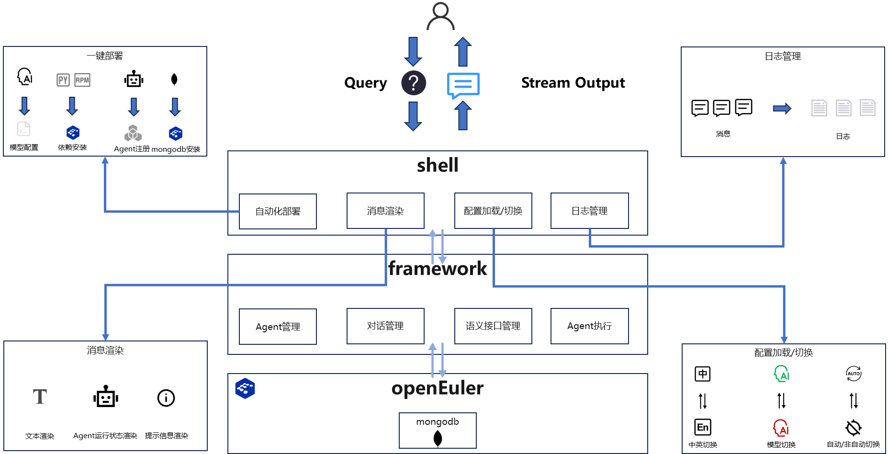

# oe-cli

## 1. 工具概述

oe-cli 是基于 openEuler 操作系统开发的一款 Shell 端工具，依托大模型核心能力，可实现用户自然语言诉求到工具调用的自动化转换，并将工具调用结果以自然语言形式直观呈现，为 openEuler 用户提供高效、便捷的运维交互入口。

## 2. 核心能力模块

oe-cli 核心功能由四大模块构成，各模块职责与实现逻辑如下：

### 2.1 自动化部署模块

该模块通过标准化流程实现 oe-cli 及关联组件的一键部署，具体流程包括：

1. **交互配置**：通过用户交互获取框架部署形态、大模型基础参数等关键信息，并自动写入配置文件，确保部署参数准确性；

2. **依赖安装**：自动执行部署脚本，完成两类依赖的安装：

- RPM 依赖：包含 Agent 调度框架等核心组件，保障工具调度能力；

- Python 依赖：涵盖支撑 oe-cli 部署与运行的基础库，确保工具功能完整性。

### 2.2 消息渲染模块

模块聚焦三类关键消息的标准化渲染，提升信息展示可读性与用户交互体验：

1. **文本消息渲染**：对任务执行后的总结性信息进行格式化处理，清晰呈现任务结果；

2. **Agent 运行状态渲染**：实时展示 Agent 单步执行状态，便于用户监控任务进展；

3. **提示消息渲染**：在非自动运行模式下，对需用户确认的操作提示信息进行规范化渲染，引导用户完成交互。

### 2.3 配置加载与切换模块

模块支持 Shell 端核心配置的灵活切换，满足不同场景下的使用需求，具体切换能力包括：

1. **中英文信息切换**：实现 Shell 界面展示语言及 Agent 输出内容的中英文切换，适配不同语言偏好用户；

2. **模型切换**：支持 Agent 调度所用大模型的快速切换，便于用户根据业务需求选择适配模型；

3. **交互方式切换**：提供 Agent 运行模式（自动化运行 / 用户手动确认执行）的切换功能，兼顾效率与操作可控性。

### 2.4 日志管理模块

模块以时间维度为核心，对关键运行信息进行规范化日志管理：将 Shell 自身运行日志及 Agent 执行日志，按预设文件大小进行自动备份，确保日志可追溯、易管理，为问题排查与运维分析提供数据支撑。

## 3. 工具价值

oe-cli 依托一键部署、标准化消息渲染、灵活配置切换及规范化日志管理四大核心能力，为 openEuler 用户打造自然语言化运维交互入口，可有效降低 openEuler 新用户入门门槛，同时减少运维人员操作复杂度，降低整体运维成本，助力提升 openEuler 操作系统运维效率。
