# oe-cli使用手册

## 引言

OE-CLI 是 openEuler Intelligence 的命令行客户端，提供 AI 驱动的命令行交互体验。支持多种 LLM 后端，集成 MCP 协议，提供现代化的 TUI 界面。

### 核心特性

- **智能终端界面**: 基于 Textual 的现代化 TUI 界面
- **流式响应**: 实时显示 AI 回复内容
- **部署助手**: 内置 openEuler Intelligence 自动部署功能

## 1. 整体使用描述（基于win10cmd）

### 1.1 打开 oe-cli

打开 oe-cli，ctrl + c 中断，ctrl + q 退出，ctrl + s 打开设置，ctrl + t 选择智能体，支持鼠标选择。

```sh
oi
```


### 1.2 智能体选择

选择智能体，默认为OE-智能运维助手，按上下键选择，回车确认，ESC取消，高亮表示选中。

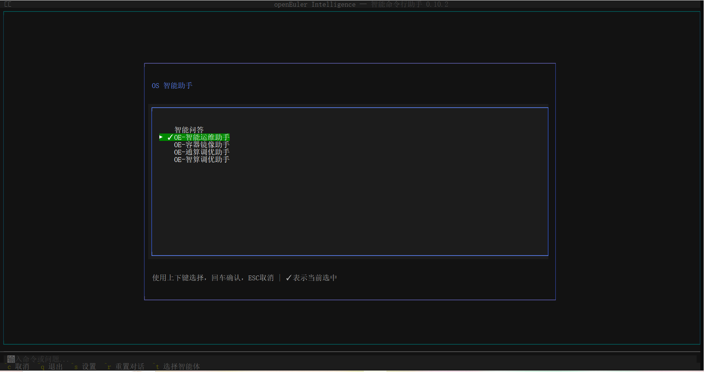

### 1.3 智能体使用

进行智能体的使用，此处以OE-智能运维助手举例，回车确认，进入对话界面


### 1.4 工具执行确认

在左下角输入栏输入命令或问题，如帮我分析当前机器性能情况，智能体会根据提问自动选择合适的 MCP 工具，并询问是否执行，此处点击确认

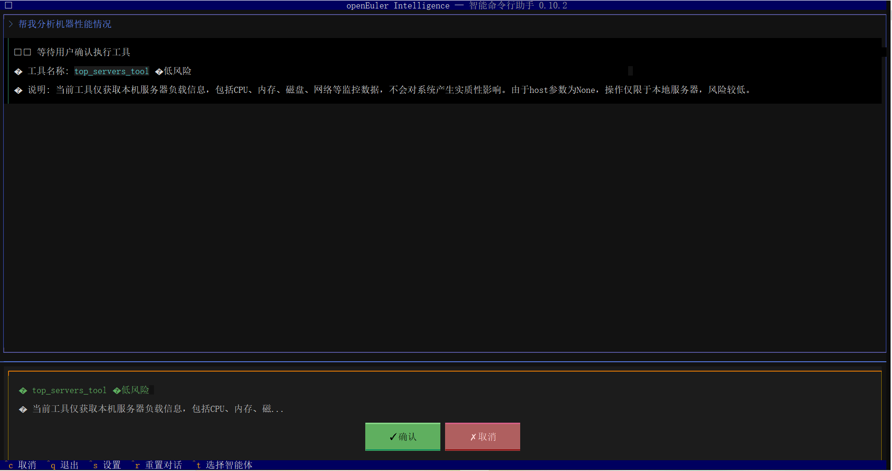

### 1.5 oe-cli预设

可以在oi前输入以下命令配置客户端

#### 配置语言

**支持的语言：**

- **English (en_US)** - 默认语言
- **简体中文 (zh_CN)**

切换至简体中文

```sh
oi --locale zh_CN
```

切换至英文

```sh
oi --locale en_US
```

语言设置会自动保存，下次启动时生效。

#### 设置初始化智能体

设置智能体命令
```sh
oi --agent
```

#### 设置日志级别并验证

```sh
oi --log-level INFO
```

### 1.6 查看日志

查看最新的日志内容:

```sh
oi --logs
```

### 1.7 设置相关

​修改工具执行确认为自动确认 ，点击设置


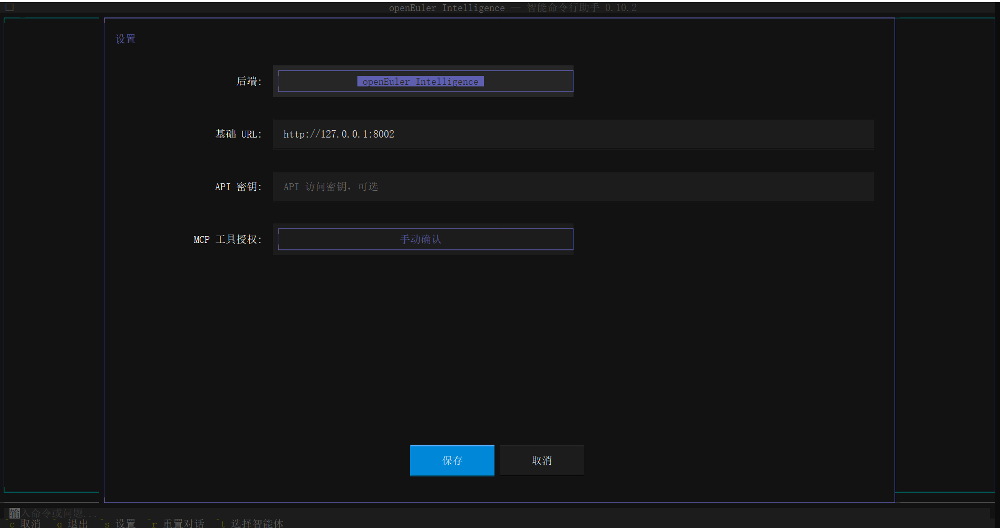

​点击mcp工具授权，可以切换手动确认或自动确认

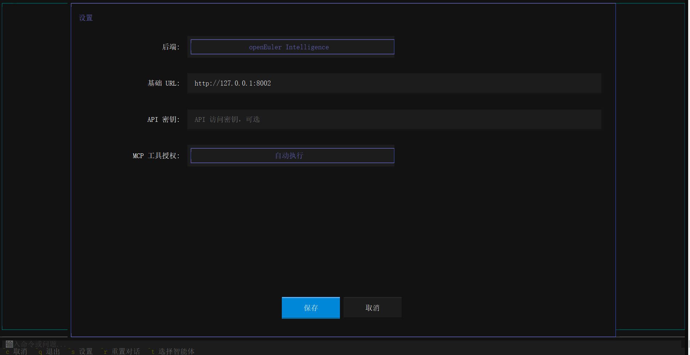

​此处也可以配置oi-runtime地址，默认是本机8002端口

​点击后端：openEuler Intelligence 可以切换到大模型配置界面进行配置。

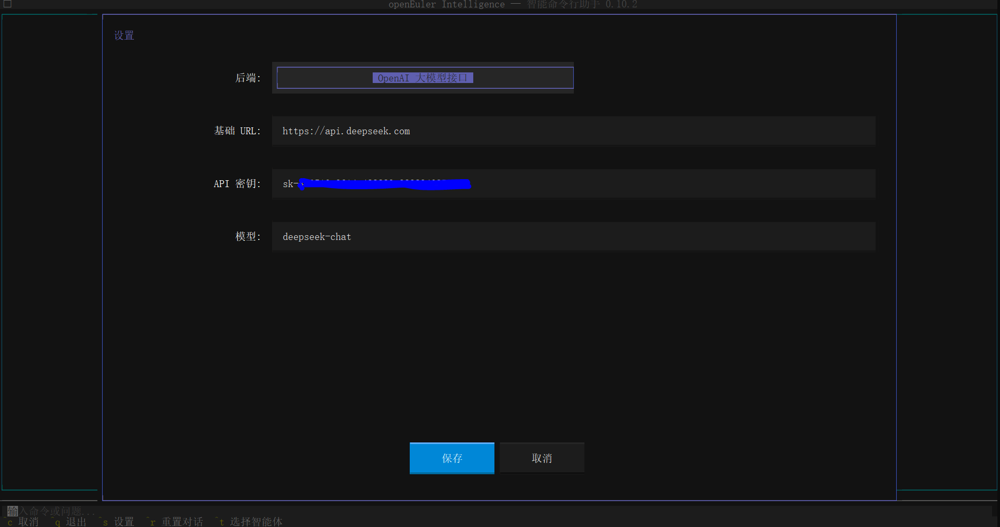

### 1.8 界面操作快捷键

- **Ctrl+S**: 打开设置界面
- **Ctrl+R**: 重置对话历史
- **Ctrl+T**: 选择智能体
- **Tab**: 在命令输入框和输出区域之间切换焦点
- **Esc**: 退出应用程序

### 补充：操作的细节，包括oi --logs日志等，参考shell的[readme](https://gitee.com/openeuler/euler-copilot-shell/blob/master/README.md)

## 2. 平台演示

### 2.1 使用cmd

#### 打开 oe-cli

```sh
oi
```


#### 使用智能体


根据具体情况依次执行 MCP 工具

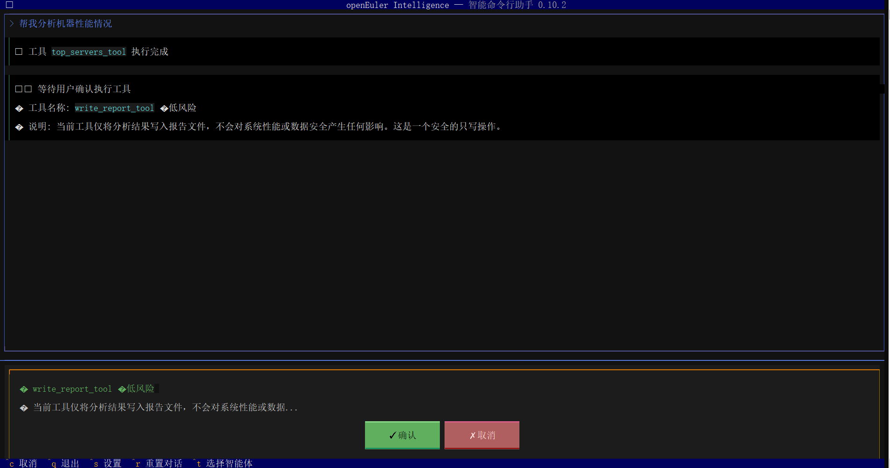

智能体根据工具调用结果输出分析报告

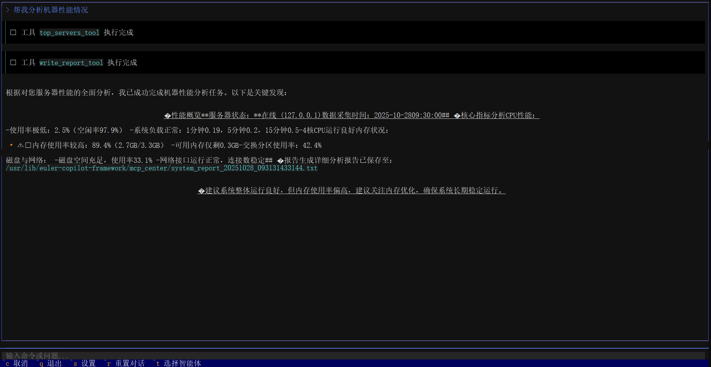

### 2.2 使用vscode

#### 打开 oe-cli


#### 智能体选择

使用方法参上面，以下主要为演示部分页面：

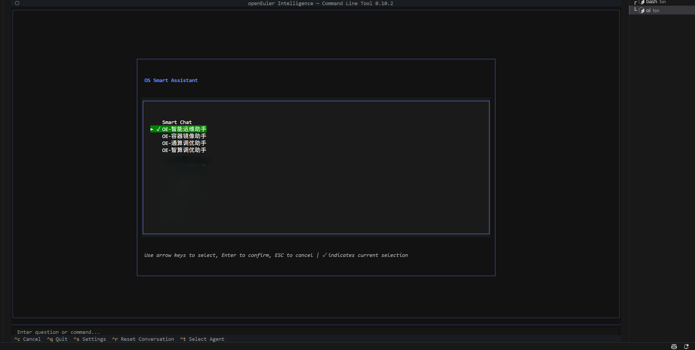

#### 智能体的使用

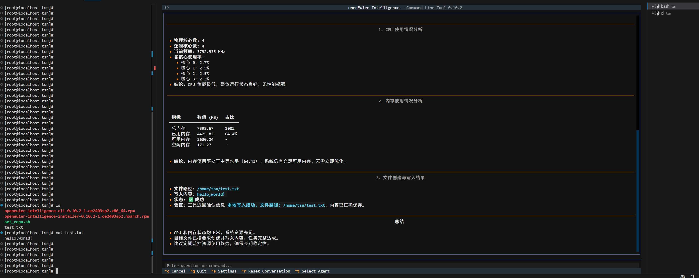

### 设置

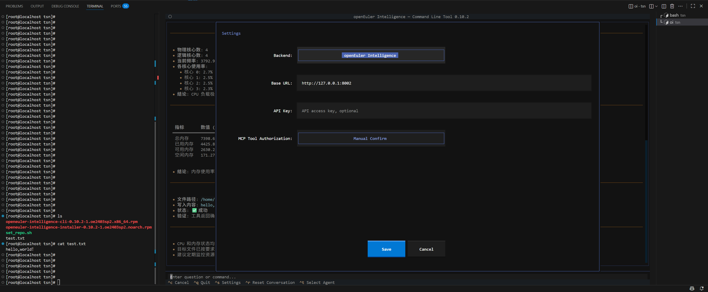

### 2.4 使用Xshell

#### 打开 oe-cli

```bash
oi
```


#### 智能体选择

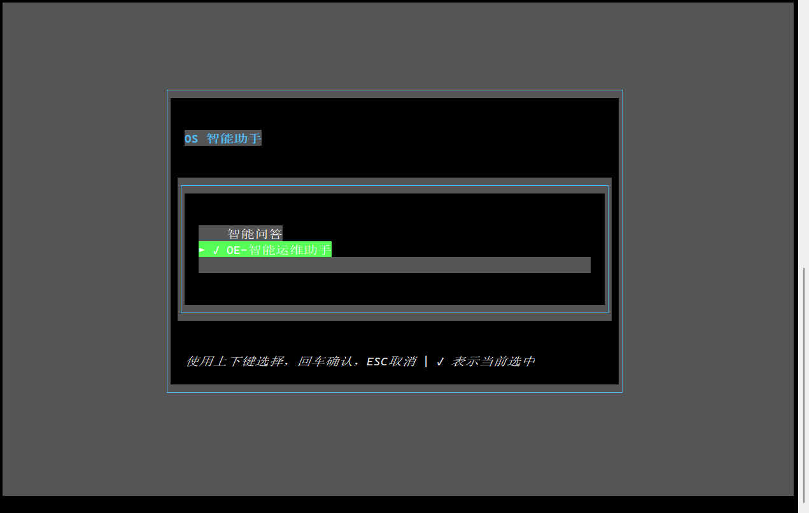

#### 智能体使用

智能体工具确认


智能体问题回答


#### 设置

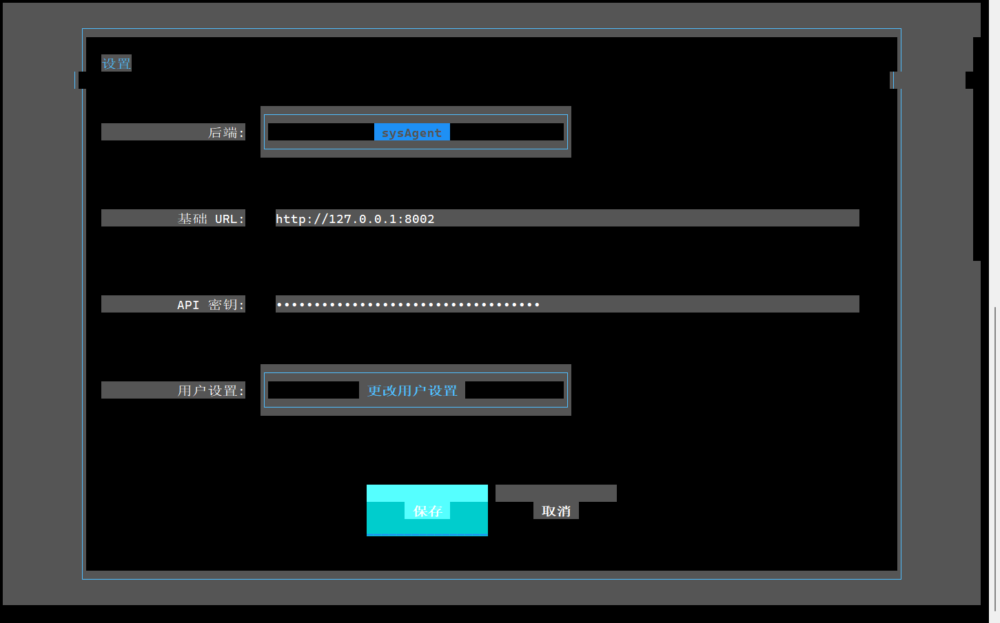

## 3.进阶功能

### 3.1 自定义mcp

准备mcp服务，基于mcp协议开发，支持sse格式调用

首先准备一个json文件，格式如下，需要配置**url**为自定义mcp的访问端口，/sse为标准路由，修改**name、overview、description**，其他内容为默认即可。如下json为openEuler Intelligence对应的mcp服务配置文件：

**说明**：init 多次调用会删除之前注册的mcp 服务，重新注册

~~~json
{
    "name": "systrace_mcp_server",
    "overview": "systrace 运维 mcp 服务",
    "description": "systrace 运维 mcp 服务",
    "mcpType": "sse",
    "author": "root",
    "config": {
        "env": {},
        "autoApprove": [],
        "disabled": false,
        "auto_install": false,
        "description": "",
        "timeout": 60,
        "url": "http://127.0.0.1:12145/sse"
    }
}
~~~


​准备好json文件之后，**命令行执行**下面的命令，注意json文件传入**全路径**，如/tmp/config.json

~~~bash
oi-manager --a init /tmp/config.json
~~~

### 3.2 创建agent

​mcp创建完毕之后，**命令行执行**如下命令，此处json文件是步骤3.2创建的，执行完init命令之后json文件中会自动添加serviceId字段用来标识在openEuler Intelligence中创建的mcp服务，create创建的是单个mcp服务对应一个agent智能体。

~~~bash
oi-manager --a create /tmp/config.json
~~~

config.json 同上，是调用init之后，会在原始json里面添加serviceId字段标识mcp服务

~~~json
{
    "name": "systrace_mcp_server",
    "overview": "systrace 运维 mcp 服务",
    "description": "systrace 运维 mcp 服务",
    "mcpType": "sse",
    "author": "root",
    "config": {
        "env": {},
        "autoApprove": [],
        "disabled": false,
        "auto_install": false,
        "description": "",
        "timeout": 60,
        "url": "http://127.0.0.1:12145/sse"
    },
    "serviceId":"p2qQke"
}
~~~

### 3.3 创建多对一的agent应用

​如果需要创建多个mcp对应一个agent智能体应用，可以在命令行执行如下命令：

~~~sh
oi-manager --a comb /tmp/comb_config.json
~~~

​需要注意此处的json文件不是步骤3.2创建的，需要重新创建一个json文件，具体内容如下：

~~~json
{
  "appType": "agent", #应用类型，不需要修改
  "icon": "", #图标
  "name": "agent_comb",  #创建应用的名字
  "description": "测试agent comb", #创建的应用的描述
  "dialogRounds": 3, #对话轮次，默认3
  "permission": {  #权限，不需要修改
    "visibility": "public",
    "authorizedUsers": []
  },
  "workflows": [], #工作流预留参数，不需要修改
  "mcpService": [
    {
      "id": "jFOWgw" #注册的mcp返回的serviceId
    },
    {
      "id": "4tA5TO" #注册的mcp返回的serviceId
    }
  ],
  "published": "True" #是否公开
}

~~~

​说明：此处主要修改name、description、mcpService，mcpService列表里面的id是步骤3.2执行完成后在json文件中自动生成的，需要将多少个mcp配置成一个agent智能体，就配置多少个id。

​**执行结果日志**

~~~sh
[root@localhost deploy]# oi-manager --a init /root/mcp_config/perf_mcp/config.json 
2025-08-15 09:49:54,874 - mcp_manager - INFO - 成功加载配置文件: /root/mcp_config/perf_mcp/config.json
2025-08-15 09:49:54,874 - mcp_manager - INFO - 删除MCP服务: dJsLV4
2025-08-15 09:49:54,960 - mcp_manager - INFO - 已删除旧的MCP服务ID
2025-08-15 09:49:54,961 - mcp_manager - INFO - 创建MCP服务
2025-08-15 09:49:55,060 - mcp_manager - INFO - MCP服务创建成功，service_id: XMZ7Pb
2025-08-15 09:49:55,061 - mcp_manager - INFO - 配置文件已更新: /root/mcp_config/perf_mcp/config.json
2025-08-15 09:49:55,061 - mcp_manager - INFO - 操作执行成功
[root@localhost deploy]# oi-manager --a create /root/mcp_config/perf_mcp/config.json 
2025-08-15 09:50:03,819 - mcp_manager - INFO - 成功加载配置文件: /root/mcp_config/perf_mcp/config.json
2025-08-15 09:50:03,819 - mcp_manager - INFO - 安装MCP服务: XMZ7Pb
2025-08-15 09:50:04,052 - mcp_manager - INFO - 等待MCP服务就绪: XMZ7Pb
2025-08-15 09:50:14,955 - mcp_manager - INFO - MCP服务 XMZ7Pb 已就绪 (耗时 9 秒)
2025-08-15 09:50:14,956 - mcp_manager - INFO - 激活MCP服务: XMZ7Pb
2025-08-15 09:50:15,057 - mcp_manager - INFO - 应用创建成功，app_id: cd4a8f3b-9b25-4608-8d4c-d2c435e15ffd
2025-08-15 09:50:15,057 - mcp_manager - INFO - 发布应用: cd4a8f3b-9b25-4608-8d4c-d2c435e15ffd
2025-08-15 09:50:15,149 - mcp_manager - INFO - Agent创建流程完成
2025-08-15 09:50:15,149 - mcp_manager - INFO - 操作执行成功
~~~

## 4. 使用案例 euler-copilot-tune 调优的使用

​euler-copilot-tune项目（[README](https://gitee.com/openeuler/A-Tune/blob/euler-copilot-tune/README.md)）适配了mcp协议，支持oi调用。

​采用oi --init方式轻量安装openEuler-Intelligence时，euler-copilot-tune会作为默认的mcp服务安装到服务器上，mcp服务以systemctl管理，服务名称为：tune-mcp_server。如果需要使用**最新版本的euler-copilot-tune**，可以源码下载安装，命令如下：

~~~bash
git clone https://gitee.com/openeuler/A-Tune.git -b euler-copilot-tune

cd A-tune

python3 setup.py install
~~~

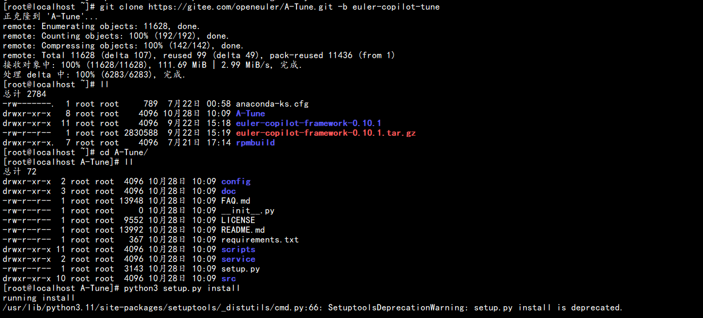
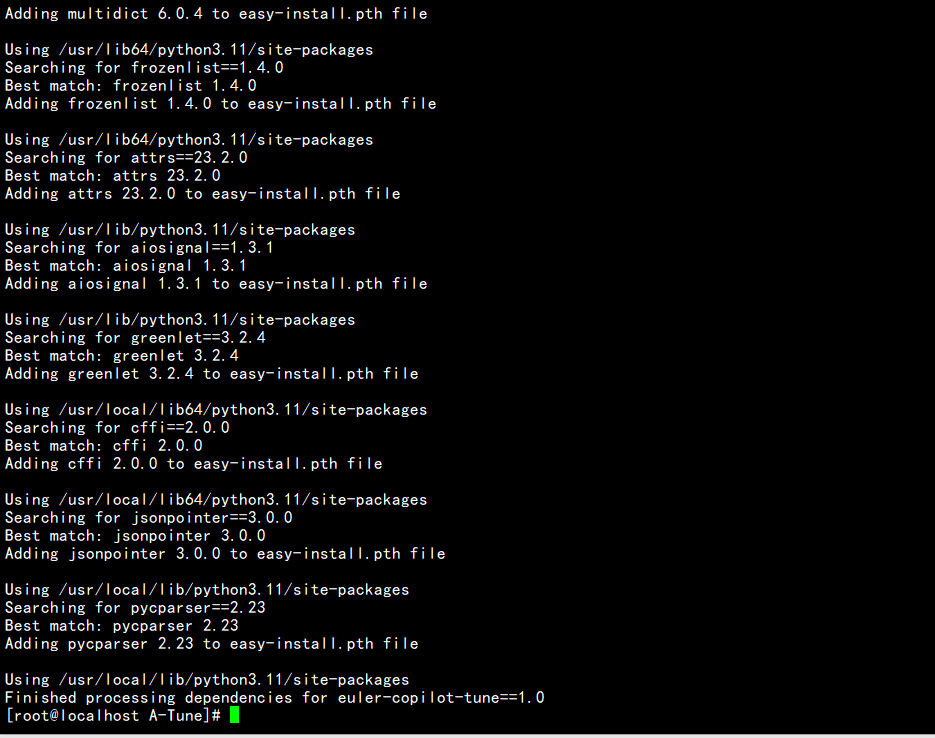

​euler-copilot-tune mcp服务归属于OE-通算调优助手。调优主要分为**采集服务数据，分析性能瓶颈，推荐优化参数，开始调优**四个步骤，自然语言交互时围绕这四个步骤按顺序依次提问执行。

### 使用前准备

​需要一台被调优机器及服务（如Nginx、Mysql等），可以参考euler-copilot-tune的使用案例准备环境：[README](https://gitee.com/openeuler/A-Tune/blob/euler-copilot-tune/README.md#应用示例)

​修改/etc/euler-copilot-tune/config/目录下的配置文件**.env.yaml**和**app_config.yaml**，修改内容参考：[README](https://gitee.com/openeuler/A-Tune/blob/euler-copilot-tune/README.md#配置文件准备)，修改完成后重启 （**systemctl restart tune-mcp_server**） 服务


​修改oi-runtime mcp读取默认时间

~~~sh
vi /etc/euler-copilot-framework/config.toml

#添加如下配置 单位秒
[mcp_config]
sse_client_read_timeout = 360000 

#重启oi-runtime
systemctl restart oi-runtime
~~~

### 使用

​**选择OE-通算调优助手**


​终端输入：帮我采集192.168.159.129 机器的 nginx 服务的性能数据，分析推荐参数，开始调优

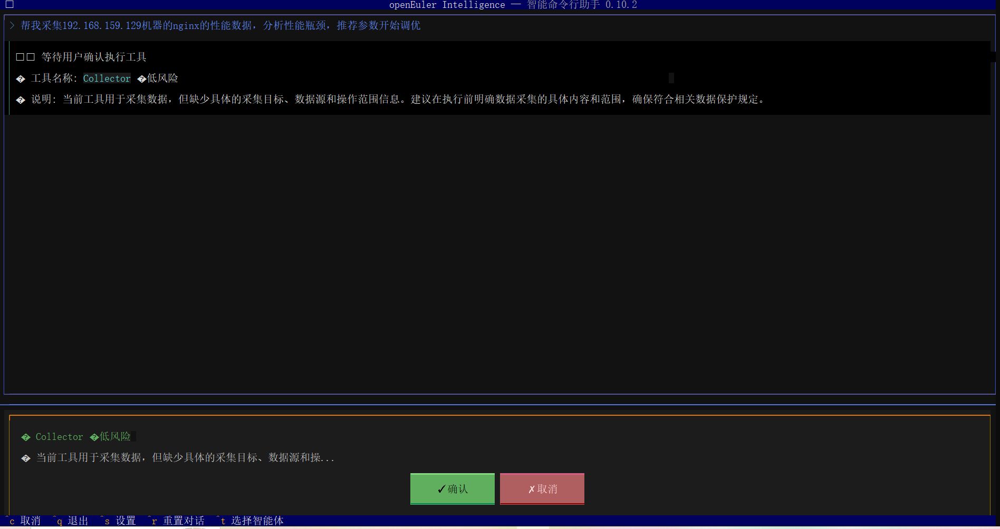

​点击确认后"tune-mcp_server"会进行数据采集，可以通过如下命令来查看运行日志

```sh
journalctl -xe -u tune-mcpserver --all -f 
```

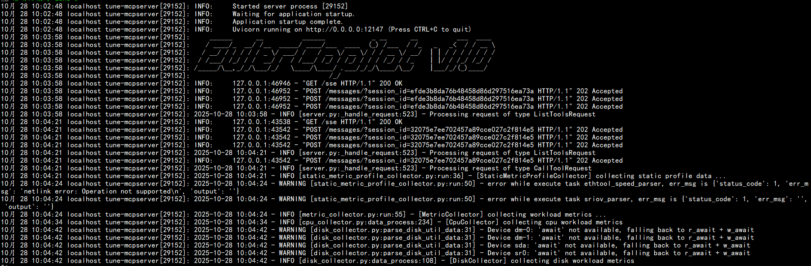

执行完Collector后，会依次执行数据分析工具，参数推荐工具，性能调优开始工具


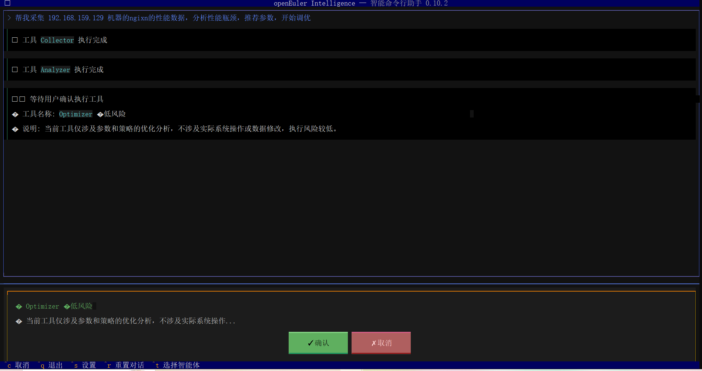

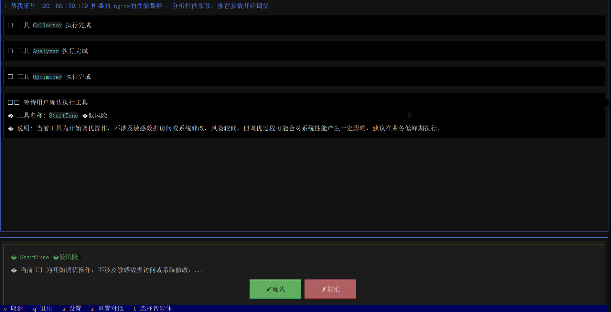

执行完成之后使用如下命令查看调优运行结果

```sh
journalctl -xe -u tune-mcpserver --all -f 
```

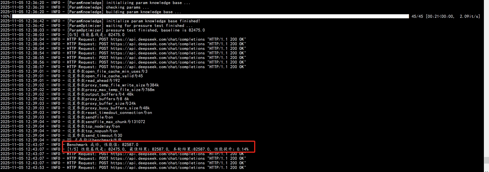
