# Witty Assistant 命令行客户端使用手册

## 引言

Witty Assistant 是 openEuler Intelligence 旗下的一款 OS 智能助手。Witty Assistant 的命令行客户端提供 AI 驱动的命令行交互体验，支持多种 LLM 后端，集成 MCP 协议，提供现代化的 TUI 界面。

### 核心特性

- **智能终端界面**: 基于 Textual 的现代化 TUI 界面
- **流式响应**: 实时显示 AI 回复内容
- **部署助手**: 内置 Witty Assistant 后端服务自动部署功能
- **配置管理**：内置设置界面（Ctrl+S）与本地配置文件，便于切换后端/更新连接信息

## 1. 使用说明（基于win11cmd）

### 1.1 打开 Witty Assistant

打开 Witty Assistant，ctrl + c 中断，ctrl + q 退出，ctrl + s 打开设置，ctrl + t 选择智能体，支持鼠标选择。

```sh
witty
```


### 1.2 智能体选择

点击选择智能体（ ctrl + t ），默认为 OE-智能运维助手，按上下键选择，回车确认，ESC 取消，高亮表示选中。

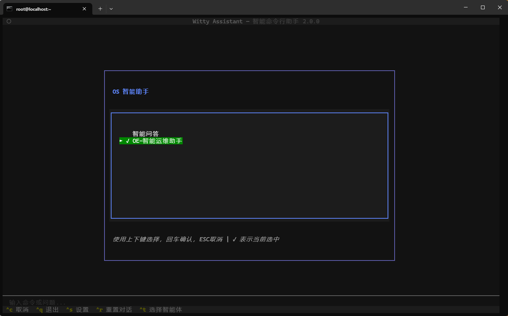

### 1.3 配置chat模型

点击设置（ ctrl + s ），点击更改用户设置

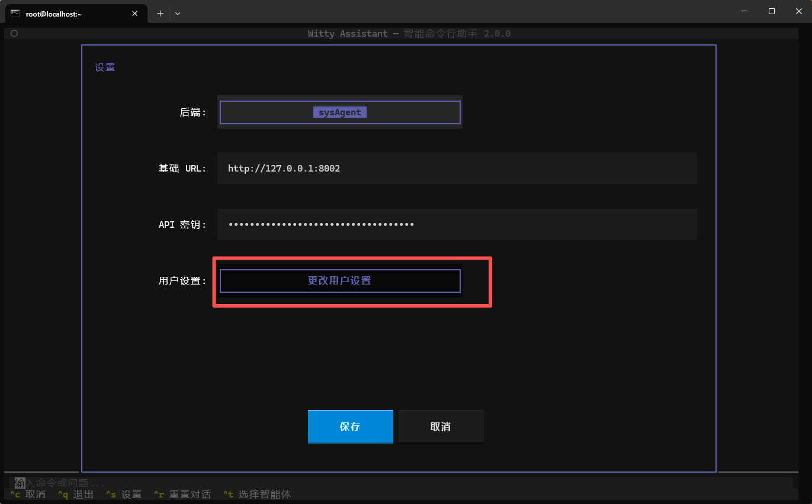

点击大模型设置，按上下键选择模型，**空格**激活模型（字体变绿为激活），然后**回车**保存，模型会在初始化和大模型设置管理进行配置。

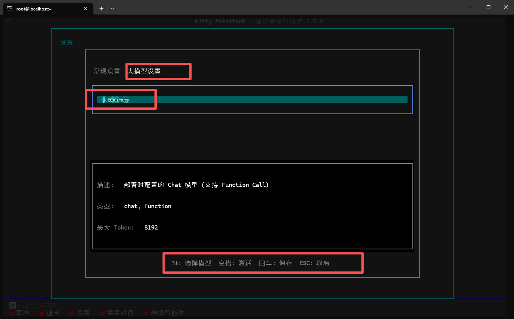

### 1.4 智能体使用

进行智能体的使用，此处以OE-智能运维助手举例，回车确认，进入对话界面。


### 1.5 对话并工具执行确认

在左下角输入栏输入命令或问题，如帮我查看内存使用情况，智能体会根据提问自动选择合适的 MCP 工具，并询问是否执行，此处点击确认。

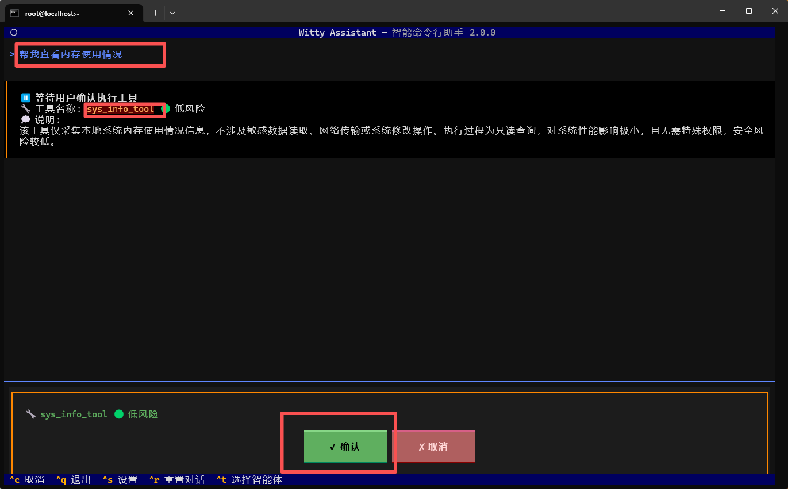

结果输出：


>[!NOTE]说明
>
> 修改工具执行确认为自动确认 ，点击设置。
> 
> 点击 mcp 工具授权，可以切换手动确认或自动确认。
> 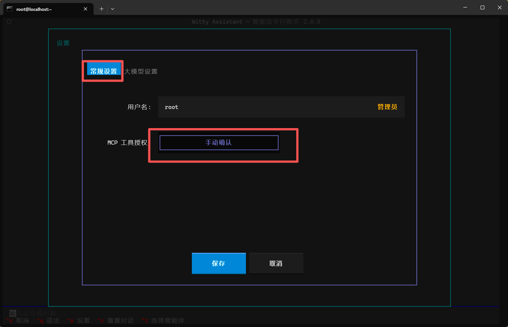

### 1.6 Witty Assistant预设

可以在 witty 前输入以下命令配置客户端。

#### 配置语言

**支持的语言：**

- **English (en_US)** - 默认语言
- **简体中文 (zh_CN)**

切换至简体中文

```sh
witty set-default locale zh_CN
```

切换至英文

```sh
witty set-default locale en_US
```

语言设置会自动保存，下次启动时生效。

#### 设置初始化智能体

设置智能体命令

```sh
witty set-default agent
```

#### 设置日志级别并验证

```sh
witty set-default log-level INFO
```

### 1.7 查看日志

查看最新的日志内容:

```sh
witty logs
```

### 1.8 大模型配置管理

```sh
witty llm
```

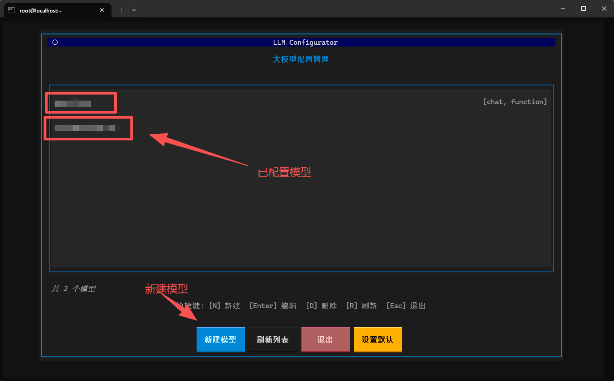

### 1.9 界面操作快捷键

- **Ctrl+S**: 打开设置界面
- **Ctrl+R**: 重置对话历史
- **Ctrl+T**: 选择智能体
- **Tab**: 在命令输入框和输出区域之间切换焦点
- **Esc**: 退出应用程序
- **Ctrl+C**: 取消当前正在执行的任务（中断 LLM 请求或停止执行命令）
- **Ctrl+Q**: 退出程序并关闭 TUI

### 补充：操作的细节，包括 witty logs 日志等，参考 shell 的 [readme](https://atomgit.com/openeuler/euler-copilot-shell)

## 2. 平台演示

### 2.1 使用cmd

#### 选择智能体

```sh
witty
```
#### 打开 Witty Assistant


#### 智能体选择


#### 使用智能体


智能体根据工具调用结果输出结果


### 2.2 使用vscode

#### 打开 Witty Assistant

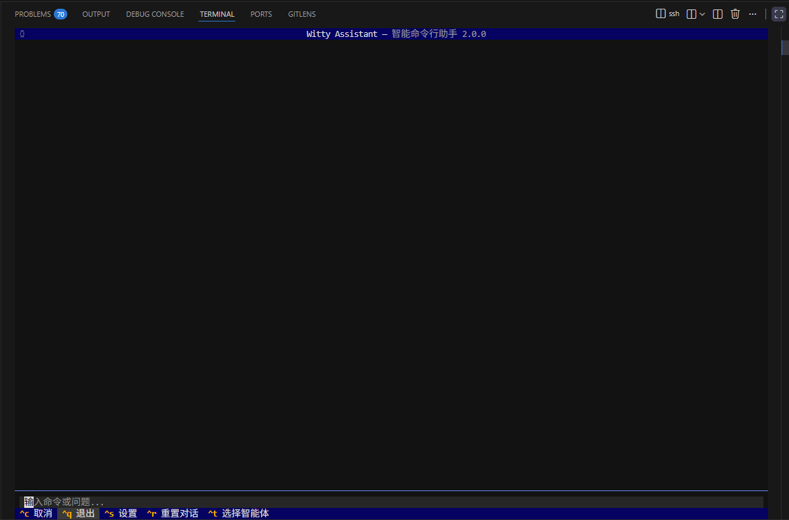

#### 智能体选择

使用方法参上面，以下主要为演示部分页面：

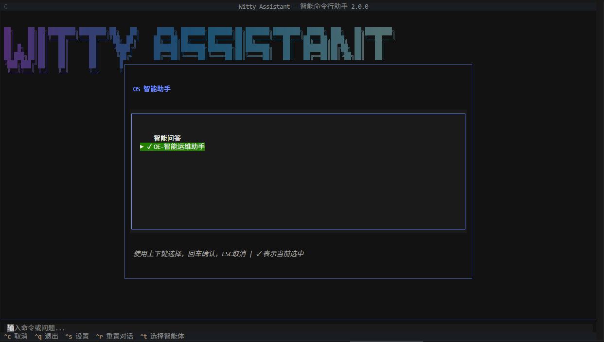

#### 智能体使用

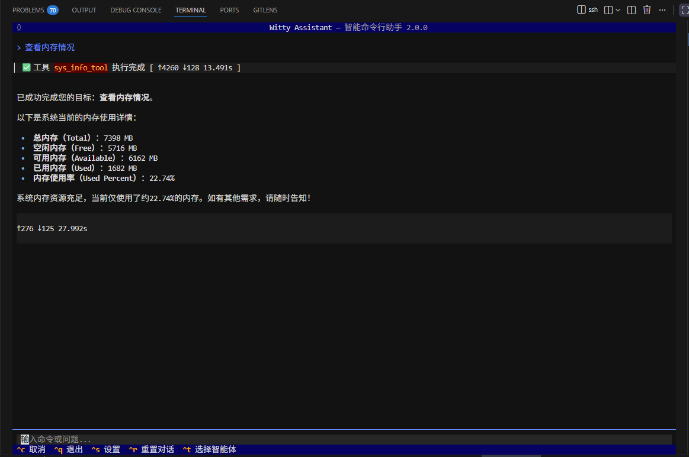

## 3. 使用案例

以“Nginx服务启动”为例，演示openEuler智能助手的进阶用法：

**自然语言交互**：启动openEuler智能助手，切换至“OE-智能运维助手”，输入“安装nginx并启动”；

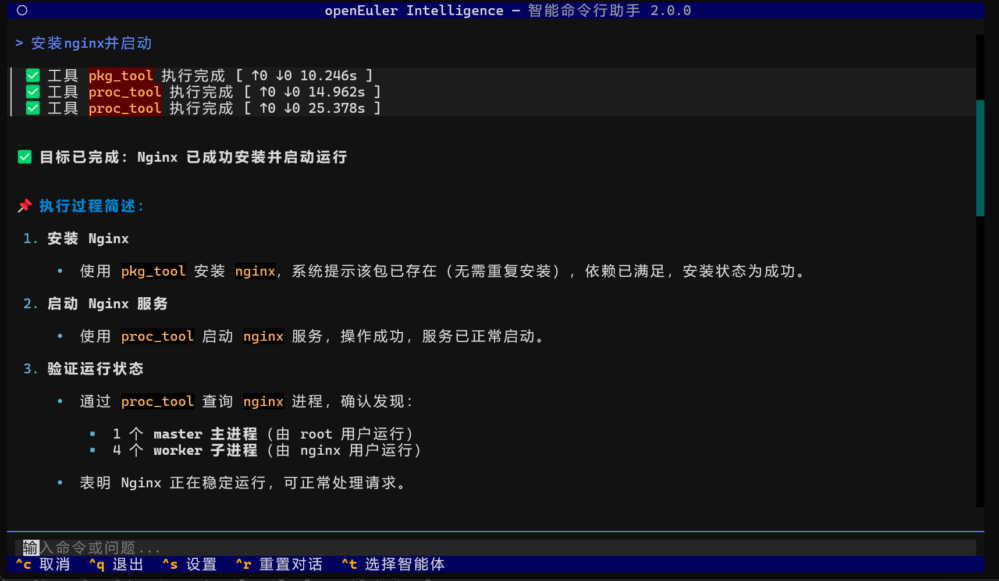

**查看nginx进程**：输入“查看nginx的进程情况”，查看nginx进程来看是否安装启动成功；

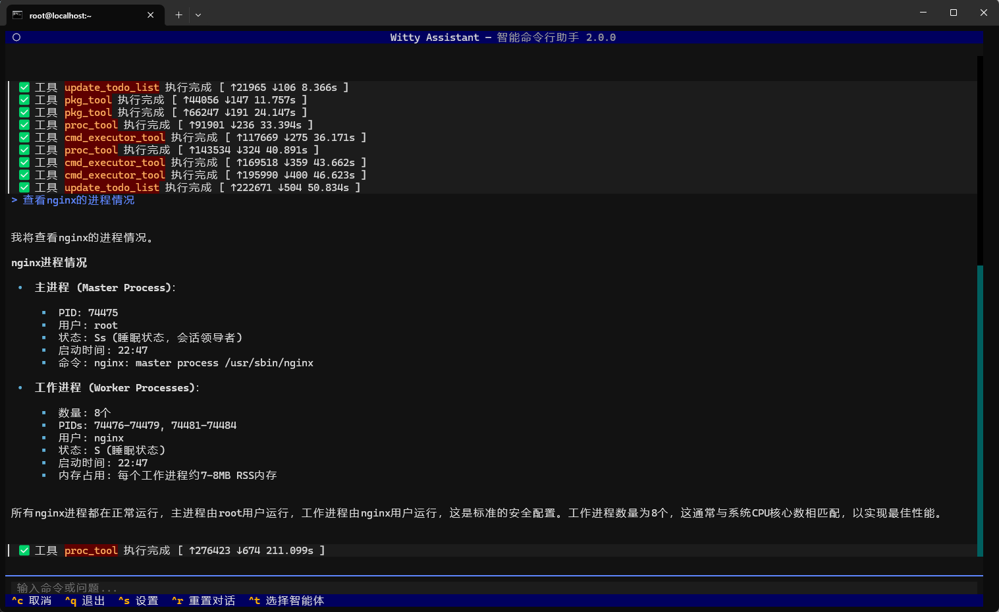

**使用命令行验证结果**：通过`systemctl status nginx`验证nginx是否被成功启动。

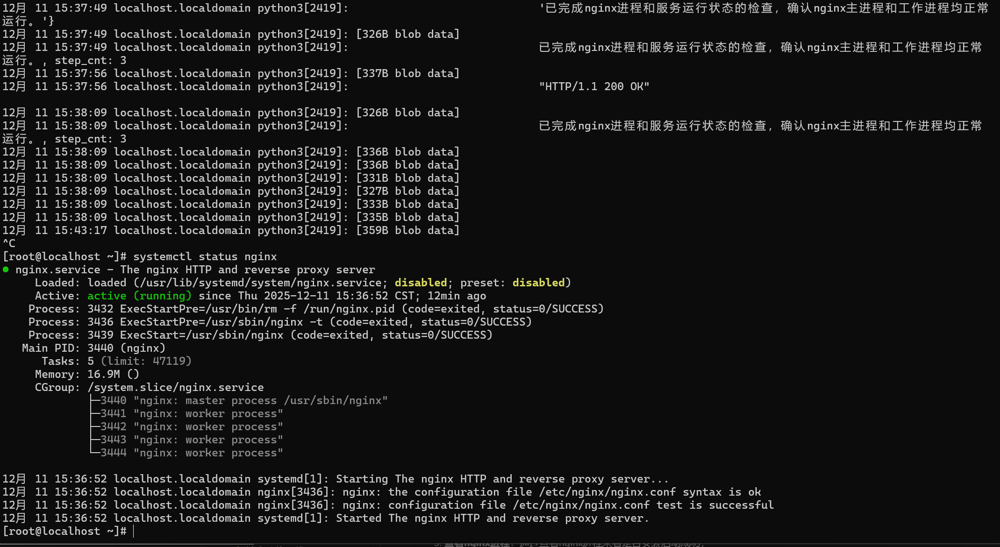
