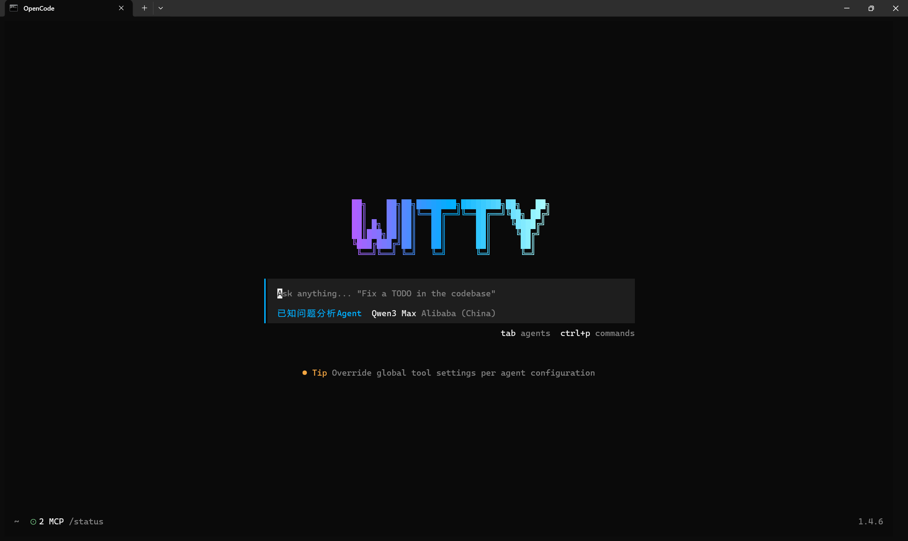
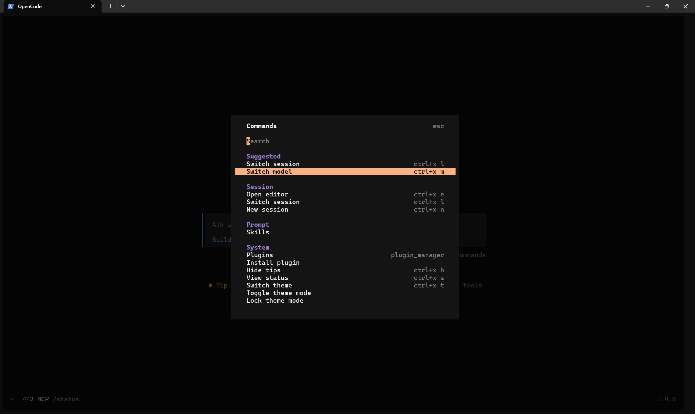

# Witty OpenCode 安装指南

本手册适用于 Witty OpenCode 1.3.17 版本。后续与OpenCode保持同步更新。

## 环境要求

- **操作系统**：openEuler 24.03 LTS SP3 或更高版本
- **内存**：至少 8GB RAM
- **存储**：至少 20GB 可用磁盘空间
- **网络**：稳定的互联网连接（如需离线部署，请提前准备所需资源，详见 FAQ）
- **大模型服务**：
  - 线上：需具备支持工具调用的线上大模型 API 访问权限，例如百炼、DeepSeek Chat、智谱、MiniMax、硅基流动等
  - 本地：支持部署在本地的 LLM 服务，如 llama-server、ollama、vLLM、LM Studio 等，需使用支持工具调用的大模型，例如 Qwen3、DeepSeek 3.2、GLM-4.7、MiniMax M2.1、Kimi K2 等
- **系统权限**：需具备 sudo 权限，以便安装必要的软件包和依赖项

## 快速开始

### 配置 repo 源 

进入 **/etc/yum.repos.d** 中，在最后添加以下的 repo 源：

```bash
[update-EPOL]
name=update-EPOL
baseurl=https://repo.openeuler.org/openEuler-24.03-LTS-SP3/EPOL/update/main/$basearch/
metadata_expire=1h
enabled=1
gpgcheck=1
gpgkey=http://repo.openeuler.org/openEuler-24.03-LTS-SP3/OS/$basearch/RPM-GPG-KEY-openEuler
```

### 安装 Witty OpenCode

开始使用前，请先运行以下命令更新系统软件包：

```bash
sudo dnf update -y
```

需手动安装 Witty OpenCode，请执行：

```bash
sudo dnf install witty-opencode-base
```

另外需要安装的知识库、日志检测等插件：

```bash
sudo dnf install euler-copilot-rag
sudo dnf install witty-lite-rag
sudo dnf install witty-log-detection
```

安装完成后输入：**opencode** ，即可进入对话界面：



可以看到左下角两个已经激活的MCP服务；输入 **/skills** ，可以查看到 **skill-creator** 存在；按 **tab** 切换Agent，能看到 **已知问题分析Agent**。
如果以上都显示成功，那么代表您已经成功安装 **Witty OpenCode**。

### Witty OpenCode模型切换

输入 **ctrl+p** 可以进入 **command** 界面，选择其中 **Switch model**即可切换模型；输入 **ctrl+a** 可以切换提供商，之后输入您的APIKEY即可使用想要的模型。



这里强烈建议您使用较好的模型替代原本模型。好模型能带来更好的体验效果。

### 配置参数

如果您想更好的使用 **Witty OpenCode** 以及 **已知问题分析Agent**，请按下述操作配置两个 **MCP**。

进入 `/opt/mcp-servers/servers/` 中，对于 **light_rag** ，修改 `~/light_rag/src/config.toml` ，主要为其中 **embedding** 部分添加您的embedding模型服务：

```bash
# 向量化服务配置
[embedding]
type = "openai"
api_key = ""
endpoint = ""
model_name = "text-embedding-v4"
timeout = 30
vector_dimension = 1024
embedding_batch_size = 8
```

对于 **witty_log_detection** ，修改 `~/witty_log_detection/src/common/config.toml` ，主要为其中的 **embedding** 和 **llm** 部分添加模型服务：

```bash
# Embedding模型配置
[EMBEDDING_MODEL]
EMBEDDING_PROVIDER = "openai"
EMBEDDING_END_POINT = "https://api.siliconflow.cn/v1/embeddings"
EMBEDDING_API_KEY = ""
EMBEDDING_MODEL_NAME = "BAAI/bge-m3"
EMBEDDING_BATCH_SIZE = 16

# LLM模型配置
[LLM_MODEL]
LLM_PROVIDER = "openai"
LLM_END_POINT = "https://dashscope.aliyuncs.com/compatible-mode/v1"
LLM_API_KEY = ""
LLM_MODEL_NAME = "qwen3-max"
LLM_MAX_TOKENS = 32000
LLM_BATCH_SIZE = 32
```

若您想更加了解两个MCP相关的配置，可以去源仓库查看：`https://atomgit.com/openeuler/euler-copilot-rag/tree/dev` 

### 其他信息

1. 输入 **ctrl+p** 进入 **command** 的界面中，可以通过 **Switch session** 来切换对话。

2. 可以输入 `@` 来选择你想要的 **Agent**

3. 如果想要修改 **Witty OpenCode** 相关配置，可以去 `/etc/opencode/opencode.json` 中修改，具体修改方式请自行常看相关文档。

4. 所有的 **Skill** 创建在 `/usr/share/witty/opencode/skills` 中。

## 源码部署

源码部署可用于非 **openEuler** 或者非 **witty-opencode** 环境中

所有的代码都在 `https://atomgit.com/openeuler/euler-copilot-rag` 仓库下，主要是其中 light_rag 、witty_log_detection 和 opencode

```bash
git clone -b dev https://atomgit.com/openeuler/euler-copilot-rag.git
```

### light_rag & log_detection 源码部署

#### 基础环境准备

在 openEuler 机器上安装基础工具，并准备源码目录，将代码git clone到相应的目录下：

```bash
sudo dnf install -y python3 python3-pip uv python3-mcp
sudo yum install -y mesa-libGL 
# 假设源码根目录在以下路径
export SRC_ROOT=/path/to/euler-copilot-rag-source
```

#### 安装目录并复制源码

假设mcp部署在 `/opt/mcp-servers/servers/` 下

```bash
sudo mkdir -p /opt/mcp-servers/servers/light_rag
sudo mkdir -p /opt/mcp-servers/servers/witty_log_detection

sudo cp -r "$SRC_ROOT/light_rag/"* /opt/mcp-servers/servers/light_rag/
sudo cp -r "$SRC_ROOT/witty_log_detection/"* /opt/mcp-servers/servers/witty_log_detection/

sudo find /opt/mcp-servers/servers/light_rag -type d -exec chmod 755 {} \;
sudo find /opt/mcp-servers/servers/light_rag -type f -exec chmod 644 {} \;
sudo find /opt/mcp-servers/servers/witty_log_detection -type d -exec chmod 755 {} \;
sudo find /opt/mcp-servers/servers/witty_log_detection -type f -exec chmod 644 {} \;
```

#### uv安装子包依赖

```bash
mkdir /usr/share/witty/opencode
mkdir /usr/share/witty/opencode/config.d/
mkdir /usr/share/witty/opencode/agents
mkdir /usr/share/witty/opencode/agents/known-issue-agent/
mkdir /usr/share/witty/opencode/skills

sudo uv sync --project /opt/mcp-servers/servers/light_rag/src \
  --cache-dir /opt/mcp-servers/servers/light_rag/.uv_cache \
  --index-url https://mirrors.huaweicloud.com/repository/pypi/simple

sudo uv sync --project /opt/mcp-servers/servers/witty_log_detection/src \
  --cache-dir /opt/mcp-servers/servers/witty_log_detection/.uv_cache \
  --index-url https://mirrors.huaweicloud.com/repository/pypi/simple
```

#### 启动服务

```bash
sudo cp /opt/mcp-servers/servers/light_rag/light_rag.service /etc/systemd/system/light_rag.service
sudo cp /opt/mcp-servers/servers/witty_log_detection/witty_log_detection.service /etc/systemd/system/witty_log_detection.service

sudo systemctl daemon-reload
sudo systemctl enable --now light_rag.service
sudo systemctl enable --now witty_log_detection.service
```

### agents 源码部署

以下源码都在名叫 ‘opencode’ 的文件夹中：

```bash
sudo install -m 0644 "$SRC_ROOT/opencode/config.d/opencode.json" \
  /usr/share/witty/opencode/config.d/known-issue-agent.json

sudo install -m 0644 "$SRC_ROOT/opencode/agents/已知问题分析Agent.md" \
  /usr/share/witty/opencode/agents/known-issue-agent/known-issue-agent.md

sudo cp -a "$SRC_ROOT/opencode/skills/skill-creator" \
  /usr/share/witty/opencode/skills/
```

在 `/etc/opencode` 下的 opencode.json 中写入以下代码，若没有，则创建：

```bash
{
  "$schema": "https://opencode.ai/config.json",
  "skills": {
    "paths": [
      "/usr/share/witty/opencode/skills"
    ]
  },
  "agent": {
    "已知问题分析Agent": {
      "description": "对故障日志进行分析，使用witty_log_detection工具进行分析，使用light_rag工具进行检索，生成分析报告",
      "prompt": "{file:/usr/share/witty/opencode/agents/known-issue-agent/known-issue-agent.md}",
      "color": "#00AFFF",
      "light_rag_*": "allow",
      "witty_log_detection_*": "allow",
      "edit": "allow",
      "bash": {
        "*": "allow"
      },
      "read": {
        "*": "allow",
        "*.env": "ask",
        "*.env.*": "ask"
      }
    }
  },
  "mcp": {
    "light_rag": {
      "type": "remote",
      "url": "http://localhost:12311/sse",
      "enabled": true
    },
    "witty_log_detection": {
      "type": "remote",
      "url": "http://localhost:12144/sse",
      "enabled": true
    }
  }
}
```

## 附录

### 其他环境使用 Witty OpenCode

可手动下载相应的RPM包并安装使用，可以去该地址下面下载： `https://eulermaker.openeuler.openatom.cn/api/ems5/repositories/witty-builder/`

其中主要的rpm包为以下几个：

```bash
euler-copilot-rag-0.10.2-3.oe2403sp3.x86_64.rpm
witty-lite-rag-0.10.2-3.oe2403sp3.x86_64.rpm  
witty-log-detection-0.10.2-3.oe2403sp3.x86_64.rpm
witty-opencode-1.3.17-1.oe2403sp3.src.rpm 
witty-opencode-base-1.3.17-1.oe2403sp3.noarch.rpm
```

### 内网大模型 API 服务

若内网环境中的大模型服务需通过 HTTPS 访问，请确保证书已在系统中正确配置，以避免部署过程中出现证书验证失败的问题。如无法配置有效证书，请在环境变量中添加以下内容以跳过证书验证：

```bash
export OI_SKIP_SSL_VERIFY=true
```

建议将上述命令添加至 `~/.bashrc` 或 `~/.bash_profile` 文件中，以确保每次登录时均设置该环境变量。

### 本地部署大模型服务

若无可用的大模型服务，可在本地部署一个支持工具调用能力的大模型服务。

若本地设备无 GPU，建议使用激活参数较少的 MoE 模型，例如 Qwen3-30B-A3B，以获得更佳的性能表现。本地部署大模型需要较大的计算资源，建议使用至少具备 32GB 内存和多核 CPU 的服务器或 PC 进行部署。

### FAQ

#### Q1：如何设置安装界面的语言？

**A1**：安装界面的默认语言会根据终端的语言环境变量自动选择。可通过设置 `LANG` 环境变量来指定语言，例如：

```bash
export LANG=zh_CN.UTF-8  # 设置为中文
export LANG=en_US.UTF-8  # 设置为英文
```

#### Q2：部署过程中 pip 包下载缓慢怎么办？

**A2**：可使用国内 pip 镜像源，例如清华大学的镜像源。通过修改 pip 配置文件来使用清华镜像源：

```bash
mkdir -p ~/.pip
echo "[global]" > ~/.pip/pip.conf
echo "index-url = https://pypi.tuna.tsinghua.edu.cn/simple" >> ~/.pip/pip.conf
```

#### Q3：如无法访问外网，如何获取所需的依赖包？

**A3**：可在有外网的环境中下载所需的依赖包，然后传输至目标环境进行安装。具体步骤如下：

1. 在有外网的环境中，使用以下命令下载所需依赖包：

    ```bash
    pip download -d /path/to/download/dir <package-name>
    ```

    请将 `<package-name>` 替换为实际需要下载的包名，`/path/to/download/dir` 替换为实际的下载目录。

2. 将下载的依赖包拷贝到目标环境中。

3. 在目标环境中，使用以下命令安装依赖包：

    ```bash
    pip install --no-index --find-links=/path/to/download/dir <package-name>
    ```

    请将 `/path/to/download/dir` 替换为实际的下载目录，`<package-name>` 替换为实际需要安装的包名。

#### Q4：服务器系统版本受限，无法升级到 openEuler 24.03 LTS SP3，怎么办？

**A4**：可尝试在当前系统版本上手动安装所需的软件包和依赖项。由于 openEuler 24.03 LTS 及以上版本均使用内核 6.6 和 Python 3.11，因此只需将 `/etc/os-release` 和 `/etc/openEuler-release` 文件中的版本信息修改为 24.03 LTS SP3 即可。

请注意，此方法需自行准备所需的软件包和依赖项，可能会遇到兼容性问题，建议在测试环境中验证后再应用于生产环境。
