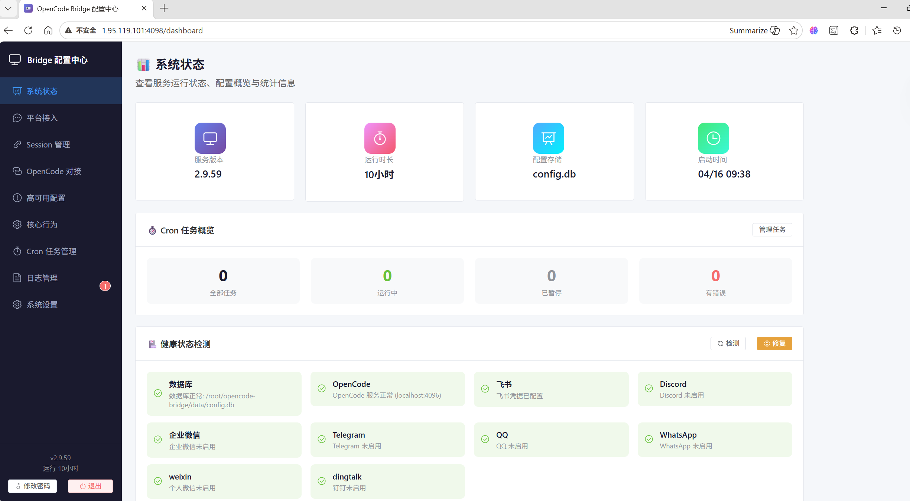
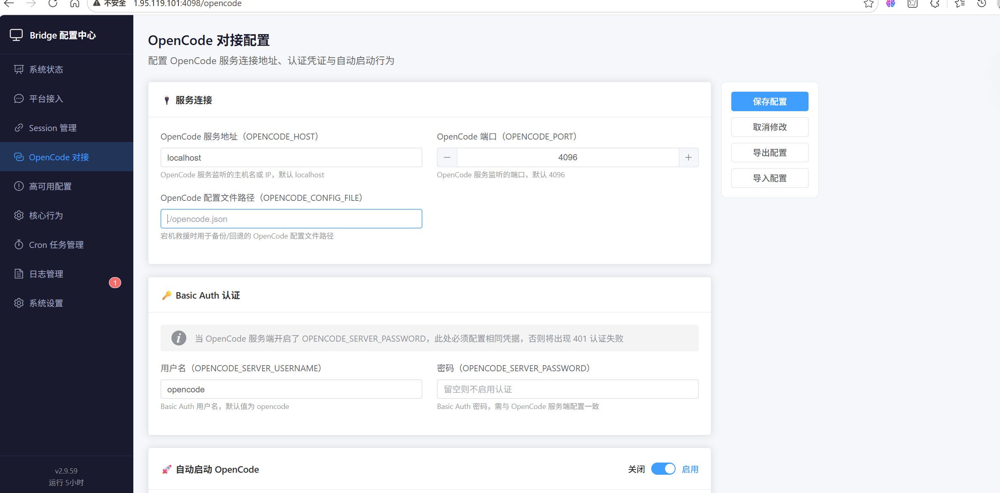
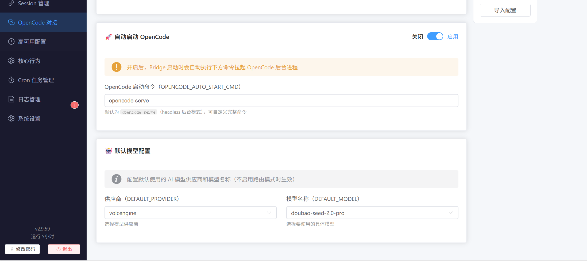

# OpenCode Bridge 桥接器安装教程

## 一、产品概述

OpenCode Bridge 是一款**通用型智能桥接服务**，可快速打通各类主流通讯平台，实现消息互通、指令转发与统一管理。

### 支持平台

飞书、个人微信、企业微信、QQ、钉钉、Discord、WhatsApp、Telegram

### 核心能力

**特色增强能力**

- Cron 定时计划任务
- 主动心跳保活
- 可视化后台配置

**原生基础能力**

- 权限闭环管理
- 问答卡片推送
- 对话上下文隔离
- 文件发送
- 会话绑定续连
- 权限透传、指令透传

---

## 二、一键安装部署教程

> 环境要求：已安装 `Git`、`Node.js`（推荐 v16+）
> 全流程采用自动化脚本，无需手动配置复杂参数

### 1. 拉取代码并安装依赖

```sh
# 克隆项目源码
git clone https://github.com/HNGM-HP/opencode-bridge.git
cd opencode-bridge

# 【推荐】使用国内镜像加速安装依赖
npm install --include=dev --registry=https://registry.npmmirror.com

# 赋予部署脚本执行权限
chmod +x ./scripts/deploy.sh
```

**可选优化（大幅加快安装速度）**

跳过不必要的二进制文件下载：

```sh
export ELECTRON_SKIP_BINARY_DOWNLOAD=1
export PUPPETEER_SKIP_DOWNLOAD=1
```

### 2. 执行自动化部署

```sh
./scripts/deploy.sh
```

脚本会自动完成环境检查、配置初始化、端口分配等操作。

### 3. 启动桥接器服务

```sh
./scripts/start.sh
```

启动成功后，服务将在后台持续运行。

### 4. 访问可视化配置后台

- **本地访问**：`http://localhost:4098`
- **远程访问**：`http://[你的服务器IP]:4098`

### 5. 部署成功验证

打开地址后，出现**桥接器可视化配置页面**，即代表安装启动完成。



### 6. 基础配置（必做）

1. 配置 OpenCode 服务 IP 与端口


2. 配置 OpenCode 启动命令


配置保存后，桥接器即可正常对接服务运行。

### 7. 特殊配置

进入项目目录并编辑环境变量配置文件：

```sh
cd opencode-bridge
vim .env
```

在 `.env` 文件中添加如下配置并保存：

```sh
OPENCODE_AUTO_START=false
```
