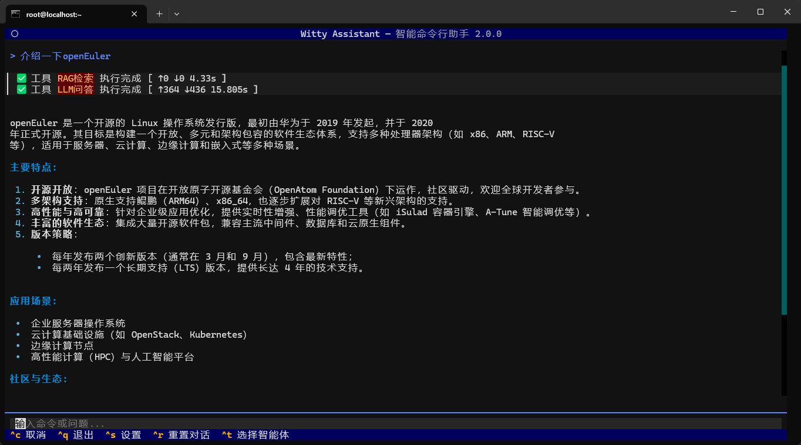

# 智能助手 CLI (Witty Assistant) 智能体介绍

## 引言

本手册聚焦 智能助手 CLI（ Witty Assistant ） 智能体能力体系展开全面介绍，智能体系列是 Witty Assistant 平台面向垂直业务场景打造的智能交互工具，依托专属技术架构与 MCP 服务能力底座，深度适配业务场景需求，实现轻量化、场景化的智能服务落地。
现阶段 Witty Assistant 平台已集成LLM chat、已知问题分析Agent两款智能体，其中 LLM chat聚焦智能对话问询能力，为用户提供自然语言交互支撑；已知问题分析Agent是面向日志异常检测与知识库检索领域的专用工具，其核心优势在于整合两大 MCP 服务能力，实现日志异常检测全流程管理与轻量化知识检索的有机结合；已知问题分析Agent将面向已知问题诊断场景开发。手册通过标准化的能力说明与实操案例，为运维人员提供 “即查即用” 的操作指引，助力降低运维门槛、提升运维工作的标准化与高效化水平。

### 默认智能体总汇表

| Agent 名称 | 核心适用场景 | 核心能力模块 |
| --------- | ----------- | ----------- |
| LLM chat | 智能对话问询 | LLM模型 |
| 已知问题分析Agent | 日志异常检测 + 轻量化知识检索 | 1. witty_log_detection：日志异常检测全流程工具集 <br> 2. light_rag：轻量化知识库管理与检索工具集 |

## LLM chat

LLM chat 是 Witty Assistant 平台集成的智能对话类智能体，核心依托 LLM 大语言模型能力，无需依赖 MCP 服务支撑，专注为用户提供高效、自然的智能对话问询服务，是 Witty Assistant 平台智能交互体系的基础支撑模块。

### 核心能力介绍

LLM chat 核心依托用户配置的主流 LLM 大语言模型，具备高效、精准的自然语言对话与问询能力，无需依赖 MCP 服务及复杂配置。其定位为“轻量化智能对话助手”，无专业操作门槛，用户可通过自然语言直接发起问询，快速获取清晰、精准的应答反馈。

### 使用案例

以下展示基础的使用案例

```markdown
介绍一下openEuler
```



## 已知问题分析Agent

已知问题分析 Agent 通过整合两大核心 MCP 服务，实现 “日志异常检测 + 知识检索” 的一站式诊断中枢。所有工具均遵循标准 MCP 规范，具备严格的参数规范与统一的返回格式，可直接集成到运维诊断流程中。

>[!NOTE]说明：Witty 提供开源[运维案例库](https://atomgit.com/openeuler/witty-ops-cases)

### 核心能力介绍

| 服务分类 | MCP 工具名称 | 核心功能定位 |
| -------- | -------- | ----------- |
| 日志异常检测 | create_log_parse_task | 创建多类型日志解析任务 |
| 日志异常检测 | get_task_message | 查询日志解析任务状态与信息 |
| 日志异常检测 | stop_task | 终止指定日志解析任务 |
| 日志异常检测 | get_task_result | 获取日志解析异常结果 |
| 轻量化RAG | Knowledge_base_manager | 知识库创建与列表管理 |
| 轻量化RAG | document_manager | 文档导入与分块解析 |
| 轻量化RAG | search | 知识库混合检索与线上检索 |

### 使用案例

以下演示日志异常检测与知识库检索相关场景，提供自然语言交互 Prompt 格式，关键参数信息即可使用，贴合已知问题诊断实际需求。

- 场景 ：运维案例导入

  ```text
  帮我把/home/oe-运维/batch_1下的25年10月_row_32_海思驱动导致系统挂死.txt和25年10月_row_5_无法进入openEuler系统.txt导入知识库
  ```


- 场景 ：问题分析诊断

  ```text
  你帮我去知识库查询一下无法进入openEuler系统应该怎么办
  ```


---


## MCP 总览

以下详细列出各 Server 信息及下属工具的核心详情。

### MCP_Server列表

| 端口号 | 服务名称 | 简介 |
|--------|----------|----------|
| 12144 | witty_log_detection | 日志异常检测服务，支持日志解析任务创建、任务管理、异常日志查询 |
| 12311 | light_rag | 轻量化 RAG 服务，支持知识库管理、文档解析、混合语义检索 |

### MCP_Server 详情

#### witty_log_detection

<div style="overflow-x: auto; max-width: 100%;">

| MCP_Server 名称 | MCP_Tool 列表 | 工具功能 | 核心输入参数 | 关键返回内容 |
|----------------|---------------|----------|--------------|--------------|
| witty_log_detection | **create_log_parse_task** | 日志解析任务创建器。支持创建不同类型的日志解析任务（基础/关键词检测/聚类检测/LLM检测），可指定日志文件范围、时间范围及异常检测规则。 | **必填：** `file_path_list`（日志文件路径列表）<br>**可选：** <br>`task_type`（任务类型：base/log_detection_base_on_keywords/<br>log_detection_base_on_clustering/log_detection_base_on_llm）、<br>`query`（异常现象查询语句）、<br>`max_anomaly_log_count`（最大异常日志数量，默认64）、<br>`anomaly_keywords`（异常关键词列表）、<br>`time_start`（时间起始，格式YYYY-MM-DD HH:MM）、<br>`time_end`（时间结束，格式YYYY-MM-DD HH:MM） | `task_id`（uuid4格式的任务ID） |
| witty_log_detection | **get_task_message** | 任务信息查询器。查询指定日志解析任务的基本信息，包括任务状态、完成进度、创建时间及任务参数。 | **必填：** <br>`task_id`（任务ID） | `task_id`（任务ID）、<br>`task_name`（任务名称）、<br>`task_type`（任务类型）、<br>`completion_percent`（完成进度0.0-100.0）、<br>`status`（任务状态）、<br>`task_related_params`（任务参数JSON字符串）、<br>`created_at`（创建时间） |
| witty_log_detection | **stop_task** | 任务终止器。终止指定ID的日志解析任务，返回操作是否成功。 | **必填：** `task_id`（任务ID） | `success`（是否成功，布尔值） |
| witty_log_detection | **get_task_result** | 任务结果获取器。分页查询指定日志解析任务的结果，可筛选异常/正常日志，返回日志内容、异常原因及异常分数等信息。 | **必填：** <br>`task_id`（任务ID）<br>**可选：** <br>`offset`（分页偏移量）、<br>`limit`（分页返回数量）、<br>`is_anomalous`（是否仅返回异常日志） | `total`（总结果数量）<br>**results（列表）：** <br>`id`（日志解析结果ID）、<br>`file_path`（日志文件路径）、<br>`task_id`（任务ID）、<br>`is_anomalous`（是否异常）、<br>`content`（日志内容）、<br>`anomaly_reason`（异常原因）、<br>`anomaly_score`（异常分数0.0-100.0） |

</div>

#### light_rag

<div style="overflow-x: auto; max-width: 100%;">

| MCP_Server 名称 | MCP_Tool 列表 | 工具功能 | 核心输入参数 | 关键返回内容 |
|----------------|---------------|----------|--------------|--------------|
| light_rag | **Knowledge_base_manager** | 知识库管理器。支持创建知识库和列出知识库。通过 `action` 参数控制操作。创建时可配置 chunk 大小及向量化模型。 | **必填：** `action`（`"add"` 创建 / `"list"` 列出）<br>**创建时必填：** `kb_name`（知识库名称，需唯一）、`chunk_size`（chunk 大小，单位 token）<br>**可选：** `embedding_model`、`embedding_endpoint`、`embedding_api_key`<br>**列出时可选：** `keyword`（模糊过滤知识库名称） | `success`（是否成功）、`message`（描述）<br>**创建时 data：** `kb_id`、`kb_name`、`chunk_size`<br>**列出时 data：** `knowledge_bases`（列表）、`count`、`keyword` |
| light_rag | **document_manager** | 文档管理器。支持将文档导入指定知识库，或获取文档的解析结果（chunks）。支持 TXT、DOCX、DOC、PDF、MD 等格式，自动解析、分块与向量化。 | **必填：** `action`（`"add"` 导入 / `"getchunks"` 获取解析结果）、`kb_name`（知识库名称）<br>**导入时必填：** `file_paths`（绝对路径列表，支持 1~n 个文件）<br>**导入时可选：** `chunk_size`（默认使用知识库配置）<br>**获取解析时必填：** `doc_name`（文档名称） | `success`、`message`<br>**导入时 data：** `total`、`success_count`、`failed_count`、`success_files`、`failed_files`<br>**获取解析时 data：** `doc_id`、`doc_name`、`kb_name`、`chunks`、`count` |
| light_rag | **search** | 在指定知识库中进行混合检索。结合关键词检索（FTS5）与向量检索（sqlite-vec），加权合并、去重后按 Jaccard 相似度重排序，返回 top-k 结果。可选启用 GitHub Issues/Commits 线上检索。 | **必填：** `query`（查询文本）、`kb_names`（知识库名称列表）<br>**可选：** `top_k`（返回数量，默认 5）、`keyword_weight`（关键词权重 0–1，默认 0.3）、`banned_chunk_ids`（排除的 chunk ID 列表）、`online`（是否启用 GitHub 检索）、`online_top_k`（GitHub 返回数量） | `success`、`message`<br>**data：** `chunks`（chunk 列表，含 id、content、score、doc_name 等）、`count`、`github_results`（仅 `online=true` 时返回） |

</div>
