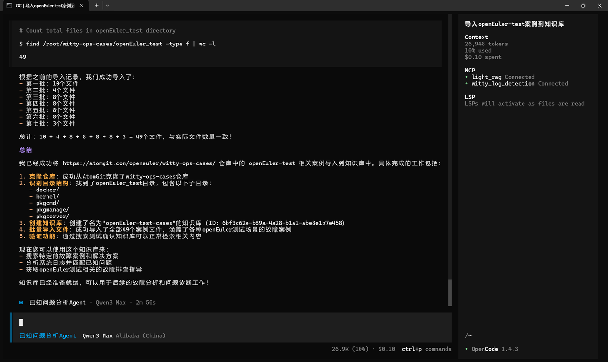
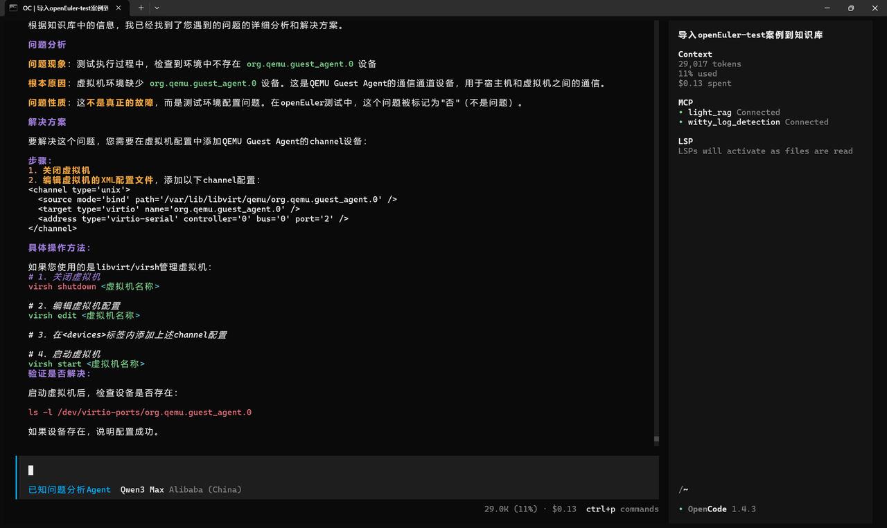

# 智能助手 CLI (Witty OpenCode) 智能体介绍

## 引言

本手册聚焦 智能助手 CLI（ Witty OpenCode ） 智能体能力体系展开全面介绍，智能体系列是 Witty OpenCode 平台面向垂直业务场景打造的智能交互工具，依托专属技术架构与 MCP 服务能力底座，深度适配业务场景需求，实现轻量化、场景化的智能服务落地。
现阶段 Witty OpenCode 平台已集成 **已知问题分析Agent** 智能体；已知问题分析Agent是面向日志异常检测与知识库检索领域的专用工具，其核心优势在于整合两大 MCP 服务能力，实现日志异常检测全流程管理与轻量化知识检索的有机结合；已知问题分析Agent将面向已知问题诊断场景开发。手册通过标准化的能力说明与实操案例，为运维人员提供 “即查即用” 的操作指引，助力降低运维门槛、提升运维工作的标准化与高效化水平。

### 默认智能体总汇表

| Agent 名称 | 核心适用场景 | 核心能力模块 |
| --------- | ----------- | ----------- |
| 已知问题分析Agent | 日志异常检测 + 轻量化知识检索 | 1. witty_log_detection：日志异常检测全流程工具集 <br> 2. light_rag：轻量化知识库管理与检索工具集 |

## 已知问题分析Agent

已知问题分析 Agent 通过整合两大核心 MCP 服务，实现 “日志异常检测 + 知识检索” 的一站式诊断中枢。所有工具均遵循标准 MCP 规范，具备严格的参数规范与统一的返回格式，可直接集成到运维诊断流程中。
此外，Witty 提供开源[运维案例库](https://atomgit.com/openeuler/witty-ops-cases)，可为各类系统故障、性能瓶颈与操作难题提供可复用的排查思路与解决方案。案例库覆盖 openEuler 等主流操作系统场景，包含日志分析、内核问题、网络故障等典型运维场景，用户可直接参考或基于案例二次开发，进一步提升故障定位与解决效率。

### 核心能力介绍

| 服务分类 | MCP 工具名称 | 核心功能定位 |
| -------- | -------- | ----------- |
| 日志异常检测 | create_log_parse_task | 创建多类型日志解析任务 |
| 日志异常检测 | get_task_message | 查询日志解析任务状态与信息 |
| 日志异常检测 | stop_task | 终止指定日志解析任务 |
| 日志异常检测 | get_task_result | 获取日志解析异常结果 |
| 轻量化RAG | Knowledge_base_manager | 知识库创建与列表管理 |
| 轻量化RAG | document_manager | 文档导入与分块解析 |
| 轻量化RAG | search | 知识库混合检索与线上检索 |

### 使用案例

以下演示日志异常检测与知识库检索相关场景，提供自然语言交互 Prompt 格式，关键参数信息即可使用，贴合已知问题诊断实际需求。

- 场景 ：运维案例导入

  ```text
  帮我将https://atomgit.com/openeuler/witty-ops-cases/这个仓库的openEuler-test相关案例导入知识库中。
  ```



- 场景 ：问题分析诊断

  ```text
  我在测试时出现：未检测到org.qemu.guest_agent.0设备；这是什么问题？
  ```



## MCP 总览

以下详细列出各 Server 信息及下属工具的核心详情。

### MCP_Server列表

| 端口号 | 服务名称 | 简介 |
|--------|----------|----------|
| 12144 | witty_log_detection | 日志异常检测服务，支持日志解析任务创建、任务管理、异常日志查询 |
| 12311 | light_rag | 轻量化 RAG 服务，支持知识库管理、文档解析、混合语义检索 |

### MCP_Server 详情

#### witty_log_detection

<div style="overflow-x: auto; overflow-y: hidden; width: 100%; max-width: 1200px; white-space: nowrap;">

| MCP_Server 名称 | MCP_Tool 列表 | 工具功能 | 核心输入参数 | 关键返回内容 |
|----------------|---------------|---------------------------------------------|--------------|--------------|
| witty_log_detection | **create_log_parse_task** | 日志解析任务创建器。支持多类型检测（基础/关键词/聚类/LLM），可指定日志文件、时间范围及异常规则。 | **必填：** `file_path_list`（日志文件路径列表）<br>**可选：** `task_type`（检测类型）、`query`（异常描述）、`max_anomaly_log_count`（默认64）、`anomaly_keywords`、`time_start`/`time_end`（YYYY-MM-DD HH:MM） | `task_id`（uuid4格式任务ID） |
| witty_log_detection | **get_task_message** | 任务信息查询器。查询任务状态、进度、创建时间及参数。 | **必填：** `task_id`（任务ID） | `task_id`、`task_name`、`task_type`、`completion_percent`、`status`、`task_related_params`、`created_at` |
| witty_log_detection | **stop_task** | 任务终止器。终止指定日志解析任务，返回操作结果。 | **必填：** `task_id`（任务ID） | `success`（布尔值，是否成功） |
| witty_log_detection | **get_task_result** | 任务结果获取器。分页查询解析结果，可筛选异常日志。 | **必填：** `task_id`（任务ID）<br>**可选：** `offset`（偏移量）、`limit`（返回数量）、`is_anomalous`（仅异常日志） | `total`（总数量）<br>**results：** `id`、`file_path`、`is_anomalous`、`content`、`anomaly_reason`、`anomaly_score` |

</div>

#### light_rag

<div style="overflow-x: auto; overflow-y: hidden; width: 100%; max-width: 1200px; white-space: nowrap;">

| MCP_Server 名称 | MCP_Tool 列表 | 工具功能 | 核心输入参数 | 关键返回内容 |
|----------------|---------------|----------------------------------------|--------------|--------------|
| light_rag | **Knowledge_base_manager** | 知识库管理器。支持创建/列出知识库，可配置chunk大小、向量化模型。 | **必填：** `action`（add/list）<br>**创建必填：** `kb_name`（唯一名称）、`chunk_size`（token数）<br>**可选：** `embedding_model`、`keyword`（模糊筛选） | `success`、`message`<br>**创建：** `kb_id`/`kb_name`/`chunk_size`<br>**列出：** `knowledge_bases`/`count`/`keyword` |
| light_rag | **document_manager** | 文档管理器。支持多格式文档导入/解析结果查询，自动分块向量化。 | **必填：** `action`（add/getchunks）、`kb_name`<br>**导入必填：** `file_paths`（绝对路径列表）<br>**可选：** `chunk_size`（默认知识库配置） | `success`、`message`<br>**导入：** `total`/`success_count`/`failed_files`<br>**解析：** `doc_id`/`doc_name`/`chunks`/`count` |
| light_rag | **search** | 混合检索工具。关键词+向量检索，加权排序，支持GitHub线上检索。 | **必填：** `query`（查询文本）、`kb_names`（知识库列表）<br>**可选：** `top_k`（默认5）、`keyword_weight`（0-1）、`online`（GitHub检索） | `success`、`message`<br>**data：** `chunks`（含score/doc_name）、`count`、`github_results`（线上检索时） |

</div>
