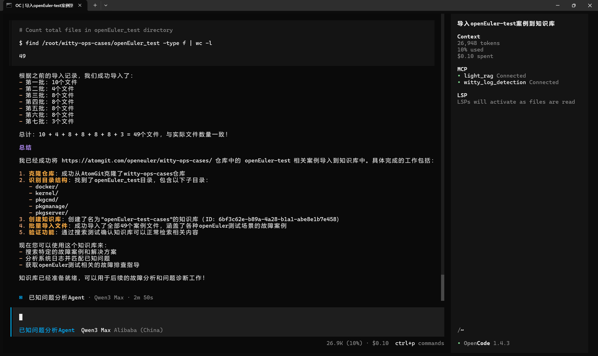
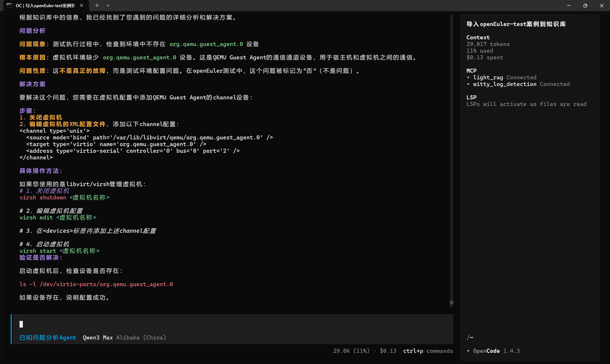
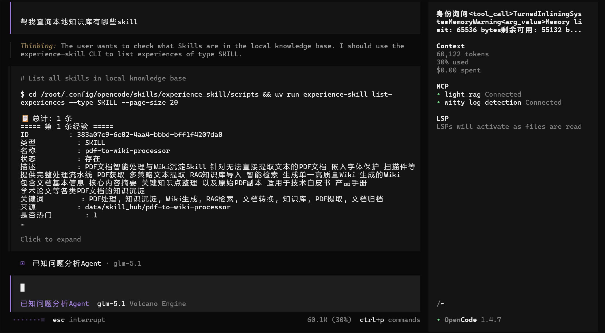
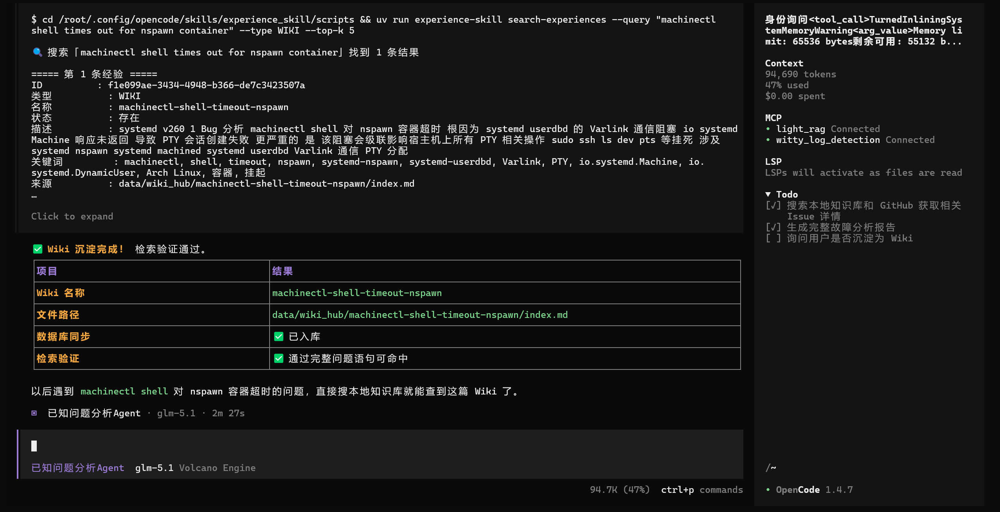
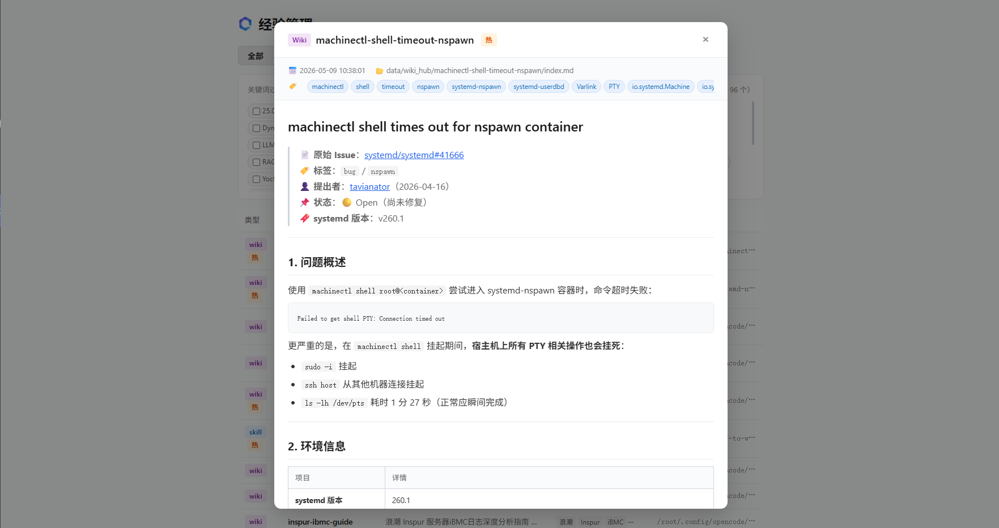

# 智能助手 CLI (Witty OpenCode) 智能体介绍

## 引言

本手册聚焦 智能助手 CLI（ Witty OpenCode ） 智能体能力体系展开全面介绍，智能体系列是 Witty OpenCode 平台面向垂直业务场景打造的智能交互工具，依托专属技术架构与工具能力底座，深度适配业务场景需求，实现轻量化、场景化的智能服务落地。
现阶段 Witty OpenCode 平台已集成 **已知问题分析Agent** 智能体；已知问题分析Agent是面向日志异常检测、知识库检索与经验技能管理领域的专用工具，其核心优势在于整合日志异常检测全流程管理、轻量化知识检索与经验技能沉淀三大核心能力；已知问题分析Agent将面向已知问题诊断场景开发。手册通过标准化的能力说明与实操案例，为运维人员提供 “即查即用” 的操作指引，助力降低运维门槛、提升运维工作的标准化与高效化水平。

### 默认智能体总汇表

| Agent 名称 | 核心适用场景 | 核心能力模块 |
| --------- | ----------- | ----------- |
| 已知问题分析Agent | 日志异常检测 + 轻量化知识检索 + 经验技能管理 | 1. witty_log_detection：日志异常检测全流程工具集 <br> 2. light_rag：轻量化知识库管理与检索工具集 <br> 3. experience_skill：经验技能管理工具集（Skill + Wiki 全生命周期管理） |

## 已知问题分析Agent

已知问题分析 Agent 是集成了 "日志异常检测 + 知识检索 + 经验沉淀" 的一站式诊断中枢。通过整合日志异常检测服务、轻量化 RAG 服务与经验技能管理三类核心能力，实现已知问题诊断场景的全流程覆盖。其中日志异常检测与知识检索采用标准化工具接口，经验技能管理通过 CLI 与 Web 界面提供服务，各模块均具备严格的参数规范与统一的返回格式，可直接集成到运维诊断流程中。
此外，Witty 提供开源[运维案例库](https://atomgit.com/openeuler/witty-ops-cases)，可为各类系统故障、性能瓶颈与操作难题提供可复用的排查思路与解决方案。案例库覆盖 openEuler 等主流操作系统场景，包含日志分析、内核问题、网络故障等典型运维场景，用户可直接参考或基于案例二次开发，进一步提升故障定位与解决效率。

### 核心能力介绍

| 服务分类 | 工具名称 | 核心功能定位 |
| -------- | -------- | ----------- |
| 日志异常检测 | create_log_parse_task | 创建多类型日志解析任务 |
| 日志异常检测 | get_task_message | 查询日志解析任务状态与信息 |
| 日志异常检测 | stop_task | 终止指定日志解析任务 |
| 日志异常检测 | get_task_result | 获取日志解析异常结果 |
| 轻量化RAG | Knowledge_base_manager | 知识库创建与列表管理 |
| 轻量化RAG | document_manager | 文档导入与分块解析 |
| 轻量化RAG | search | 知识库混合检索与线上检索 |
| 经验技能管理 | experience-skill (CLI) | Skill/Wiki 经验的全生命周期管理：创建、评估、检索、合并、优化 |
| 经验技能管理 | search-experiences | 基于 SQLite + FTS5 的全文检索，快速定位 Skill 或 Wiki |
| 经验技能管理 | add-experiences | 将 Skill/Wiki 注册到本地经验库，建立全文索引 |
| 经验技能管理 | list-experiences | 分页浏览已注册经验，支持按类型/名称/热门度筛选 |
| 经验技能管理 | web | 启动 Web 管理界面，图形化浏览与管理经验 |

### 使用案例

以下演示日志异常检测、知识库检索与经验技能管理相关场景，提供自然语言交互 Prompt 格式，关键参数信息即可使用，贴合已知问题诊断实际需求。

- 场景 ：运维案例导入

  ```text
  帮我将https://atomgit.com/openeuler/witty-ops-cases/这个仓库的openEuler-test相关案例导入知识库中。
  ```

  

- 场景 ：问题分析诊断

  ```text
  我在测试时出现：未检测到org.qemu.guest_agent.0设备；这是什么问题？
  ```

  

- 场景 ：经验技能检索

  ```text
  /experience-skill 帮我查询本地知识库有哪些skill
  ```

  Agent 会调用 `experience-skill search-experiences --query "dnf 冲突" --top-k 5`，优先以本地经验内容作为回答依据。

  

- 场景 ：将本次排查经验沉淀为 Skill/Wiki

  ```text
  将本次排查沉淀为 Wiki
  ```

  Agent 会调用 `create-skill` 能力，自动生成标准化 Wiki 文档并注册到经验库。

  

  生成的 Wiki 文档可以在**8080端口**查看。

  

## 核心能力总览

以下详细列出各核心能力模块及其下属工具/命令的详情。

### 能力模块列表

| 端口号 | 服务名称 | 简介 |
|--------|----------|----------|
| 12144 | witty_log_detection | 日志异常检测服务，支持日志解析任务创建、任务管理、异常日志查询 |
| 12311 | light_rag | 轻量化 RAG 服务，支持知识库管理、文档解析、混合语义检索 |
| - | experience_skill | 经验技能管理服务，通过 CLI 与 Web 界面提供 Skill/Wiki 的全生命周期管理（非独立 MCP Server，作为 Skill 能力集成） |

### 能力模块详情

#### witty_log_detection

<div style="overflow-x: auto; overflow-y: hidden; width: 100%; max-width: 1200px; white-space: nowrap;">

| 模块名称 | 工具/命令列表 | 功能说明 | 核心输入参数 | 关键返回内容 |
|----------------|---------------|---------------------------------------------|--------------|--------------|
| witty_log_detection | **create_log_parse_task** | 日志解析任务创建器。支持多类型检测（关键词/聚类/LLM/嵌入），可指定日志文件、时间范围及异常规则。 | **必填：** `file_path_list`（日志文件路径列表）<br>**可选：** `task_type`（检测类型）、`query`（异常描述）、`max_anomaly_log_count`（默认64）、`anomaly_keywords`、`time_start`/`time_end`（YYYY-MM-DD HH:MM） | `task_id`（uuid4格式任务ID） |
| witty_log_detection | **get_task_message** | 任务信息查询器。查询任务状态、进度、创建时间及参数。 | **必填：** `task_id`（任务ID） | `task_id`、`task_name`、`task_type`、`completion_percent`、`status`、`task_related_params`、`created_at` |
| witty_log_detection | **stop_task** | 任务终止器。终止指定日志解析任务，返回操作结果。 | **必填：** `task_id`（任务ID） | `success`（布尔值，是否成功） |
| witty_log_detection | **get_task_result** | 任务结果获取器。分页查询解析结果，可筛选异常日志。 | **必填：** `task_id`（任务ID）<br>**可选：** `offset`（偏移量）、`limit`（返回数量）、`is_anomalous`（仅异常日志） | `total`（总数量）<br>**results：** `id`、`file_path`、`is_anomalous`、`content`、`anomaly_reason`、`anomaly_score` |

</div>

**使用建议**
基于HDFS日志数据集对witty_log_detection进行异常日志检测能力测试得到以下使用结论：

- 基于关键字的检测在**关键字匹配**的情况下，能够有较高的精确率，但全局召回率偏低，建议在检测特定问题时使用；
- 基于聚类和embedding的检测在设置较低异常阈值（anomaly_score<40）的情况下，有较高的召回率，建议在检测一般问题时使用；
- 基于聚类的检测在设置高异常阈值（anomaly_score>90）的情况下也有较高精确率，可以使用与未知但高风险的问题检测；
- 基于llm的检测在常见日志中有着较好的能力，建议在日常日志中优先使用,针对一些不常见日志，llm的效果较差；
- 在针对一些不常见日志时，建议新增log_feature模板，用于提取日志中的特征信息，可对检测能力进行增强。

#### light_rag

<div style="overflow-x: auto; overflow-y: hidden; width: 100%; max-width: 1200px; white-space: nowrap;">

| 模块名称 | 工具/命令列表 | 功能说明 | 核心输入参数 | 关键返回内容 |
|----------------|---------------|----------------------------------------|--------------|--------------|
| light_rag | **Knowledge_base_manager** | 知识库管理器。支持创建/列出知识库，可配置chunk大小、向量化模型。 | **必填：** `action`（add/list）<br>**创建必填：** `kb_name`（唯一名称）、`chunk_size`（token数）<br>**可选：** `embedding_model`、`keyword`（模糊筛选） | `success`、`message`<br>**创建：** `kb_id`/`kb_name`/`chunk_size`<br>**列出：** `knowledge_bases`/`count`/`keyword` |
| light_rag | **document_manager** | 文档管理器。支持多格式文档导入/解析结果查询，自动分块向量化。 | **必填：** `action`（add/getchunks）、`kb_name`<br>**导入必填：** `file_paths`（绝对路径列表）<br>**可选：** `chunk_size`（默认知识库配置） | `success`、`message`<br>**导入：** `total`/`success_count`/`failed_files`<br>**解析：** `doc_id`/`doc_name`/`chunks`/`count` |
| light_rag | **search** | 混合检索工具。关键词+向量检索，加权排序，支持GitHub线上检索。 | **必填：** `query`（查询文本）、`kb_names`（知识库列表）<br>**可选：** `top_k`（默认5）、`keyword_weight`（0-1）、`online`（GitHub检索） | `success`、`message`<br>**data：** `chunks`（含score/doc_name）、`count`、`github_results`（线上检索时） |

</div>

#### experience_skill

experience_skill 是经验技能管理组件，用于统一管理用户工作经验的能力沉淀。支持 **Skill**（标准化工作流程）与 **Wiki**（资料文档提炼）两类资源的全生命周期管理，为智能体能力持续迭代升级提供底层支撑。

**核心特性**：

- **双模经验管理**：支持 Skill（工作流程技能）与 Wiki（资料知识库）两类经验资源
- **全生命周期覆盖**：创建、评估、检索、合并、优化五大标准化能力
- **高性能全文检索**：基于 SQLite + FTS5 + `simple` 中文/拼音分词器，支持模糊搜索与语义匹配
- **热门经验追踪**：自动标记高频使用经验（同类型 Top 20），支持 LRU 淘汰与按热门度筛选
- **CLI 命令行工具**：提供完整的命令行接口，便于集成到自动化流水线
- **Web 管理界面**：基于 FastAPI 的图形化管理前端，支持类型筛选、关键词过滤、分页浏览

**CLI 命令列表**（在 `experience_skill/scripts/` 目录下执行）：

| 子命令 | 用途 | 核心参数 |
|--------|------|----------|
| `sync` | 同步 `data/` 中所有经验到数据库 | - |
| `add-experiences` | 添加 Skill/Wiki 经验到数据库 | `--type`（SKILL/WIKI）、`--source`（来源路径） |
| `list-experiences` | 分页列出经验，支持类型/名称/热门过滤 | `--type`、`--name`、`--is-hot`、`--page`、`--page-size` |
| `search-experiences` | **全文检索经验**（FTS5 + 关键字） | `--query`（关键词）、`--type`、`--top-k` |
| `delete-by-ids` | 按 ID 列表删除经验 | `--ids` |
| `delete-by-source` | 按来源路径删除经验 | `--source` |
| `delete-all` | 清空所有经验数据 | - |
| `web` | 启动 Web 管理界面 | `--port`（默认8080）、`--no-browser` |

**Skill 管理能力**：

| 能力 | 说明 |
|------|------|
| **create-skill** | 从对话会话中沉淀可复用工作流程，生成标准化 Skill；创建前自动检索查重 |
| **eval-skill** | 基于 Skill 内置评测集开展质量核验，综合评估实用性、准确性、完整性与可读性 |
| **find-skill** | 结合 SQLite 关键字检索 + FTS5 全文检索，快速定位目标 Skill |
| **merge-skill** | 检索识别相似 Skill，支持多份同质内容合并整合，剔除重复片段 |
| **optimize-skill** | 依据质量评估报告迭代优化，更新过期流程、修复代码问题、完善评测用例 |

**Wiki 管理能力**：

| 能力 | 说明 |
|------|------|
| **create-wiki** | 对工作查阅的网页、文档等资料进行提炼精简，沉淀为标准化 Wiki；创建前自动查重 |
| **eval-wiki** | 通过随机抽样、问答核验等方式，校验 Wiki 召回命中率与内容质量 |
| **find-wiki** | 依托数据库检索与全文检索能力，快速筛选、定位所需 Wiki 文档 |
| **merge-wiki** | 识别同质化 Wiki 资源，支持多文档合并整编，保留有效内容、剔除重复信息 |
| **optimize-wiki** | 根据评估结果迭代优化，包含错误修正、内容补全、格式规整、可读性提升 |

**Web 管理界面**：

```bash
cd experience_skill/scripts
uv run experience-skill web
```

默认监听 `http://127.0.0.1:8080`，支持 `--port` 和 `--no-browser` 参数。Web 页面功能包括：

- **类型筛选**：全部 / Skill / Wiki 标签切换
- **名称搜索**：模糊匹配经验名称
- **关键词过滤**：多选关键词标签联动过滤
- **热门筛选**：仅查看热门经验
- **分页浏览**：上一页 / 下一页翻页

**数据模型**：

| 表名 | 说明 |
|------|------|
| `experience_table` | 经验主表，存储 Skill/Wiki 的元信息（id, type, name, description, status, is_hot, source 等） |
| `keyword_table` | 关键词表，关联经验的标签关键词 |
| `experience_fts` | FTS5 全文索引虚拟表，对 description 字段建立中文/拼音混合全文索引 |

**Agent 集成方式**：

当用户通过 `/experience-skill` 提出技术问题时，Agent 必须按以下顺序执行：

1. **提取关键词并检索本地知识库**：从用户问题中提取核心关键词，执行 `search-experiences` 检索 Skill 和 Wiki
2. **读取并优先使用本地知识**：若检索命中，按来源路径读取对应文档，以本地知识库内容作为主要回答依据
3. **本地知识不足时使用通用知识**：若检索结果为空，直接使用自身通用知识回答
4. **解决全新问题后按需沉淀**：解决本地知识库中不存在的全新问题后，可酌情询问用户是否沉淀为 Skill 或 Wiki
