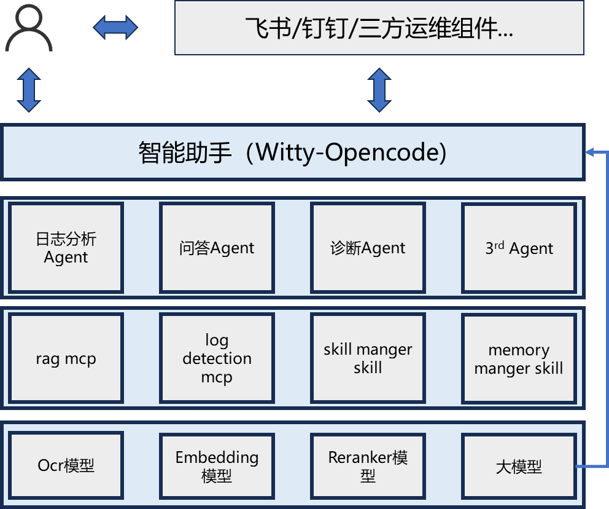

# 智能助手 Witty-OpenCode 介绍

## 产品概述

Witty-OpenCode 是基于 openCode 构建的智能助手 CLI 工具，面向 openEuler 生态提供自然语言化运维交互入口。通过深度集成大模型能力，实现自然语言指令到运维操作的精准转化，有效降低 openEuler 新用户入门门槛，简化运维人员操作流程，全面降低系统运维成本。

## 架构图

## 功能架构

Witty-OpenCode 整体采用四层架构设计，自上而下依次为：交互入口层、各类 Agent 层、MCP 与 Skill 基础组件层、底层模型服务层。

### 一、交互入口层

作为用户与智能助手的统一交互接口，当前已支持 Shell 命令行交互，后续将拓展 Web 端等多形态入口，适配不同使用场景与用户习惯。
入口层支持 Skill 注册、MCP 注册及 Agent 构建能力，并可通过桥接器将 Agent 能力对外输出至飞书等协作平台。

### 二、Agent 能力层

目前已实现三大核心 Agent：

1. **日志分析 Agent**
基于关键字检索、聚类算法及大模型理解能力，对系统日志进行智能分析，辅助用户快速定位问题根因。

2. **问答 Agent**
面向用户问题实现知识库精准检索，结合大模型生成专业、准确的应答；支持 docx、pdf、md、txt 等多格式文档入库，持续扩充知识库容量与覆盖范围。

3. **诊断 Agent**
自动生成并执行系统诊断命令，完成系统巡检与故障排查；同时可将典型运维流程沉淀为标准化 Skill，实现运维经验积累与助手能力持续迭代。

### 三、MCP 与 Skill 基础组件层

提供底层通用能力支撑：

- MCP 服务：已实现 RAG、Log Detection 能力，分别为问答 Agent、日志分析 Agent 提供核心技术支撑；
- 基础组件：包含 Skill Manager 与 Memory Manager，为诊断 Agent 提供技能编排、记忆管理与经验复用能力。

### 四、模型服务层

为全链路能力提供模型底座支持，包括：

- OCR、Embedding、Reranker 模型：分别支撑日志分析与问答场景的文本处理、向量表征与结果精排；
- 大模型服务：为所有 Agent 提供统一的理解、推理与生成能力。
