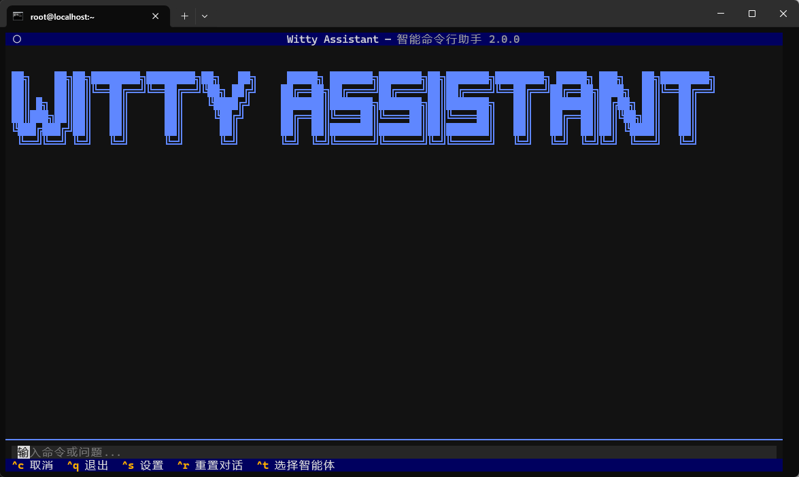
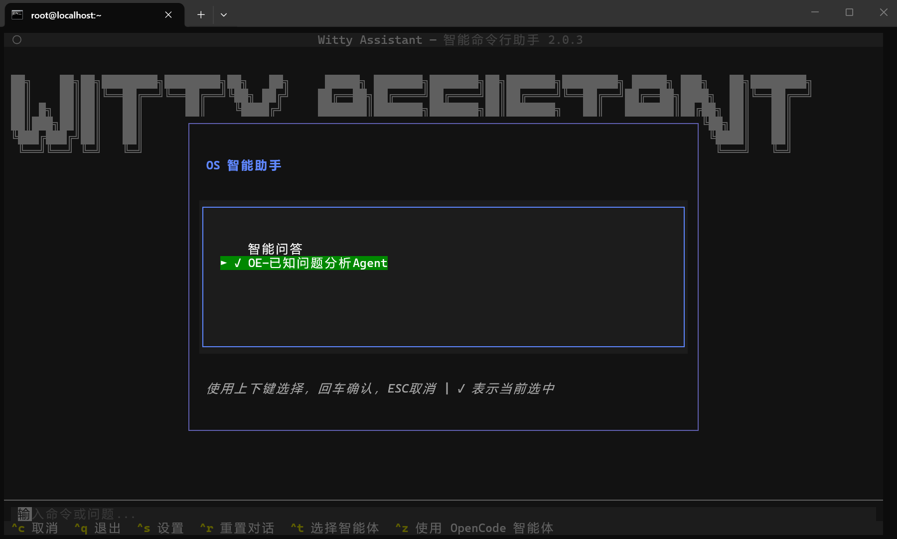
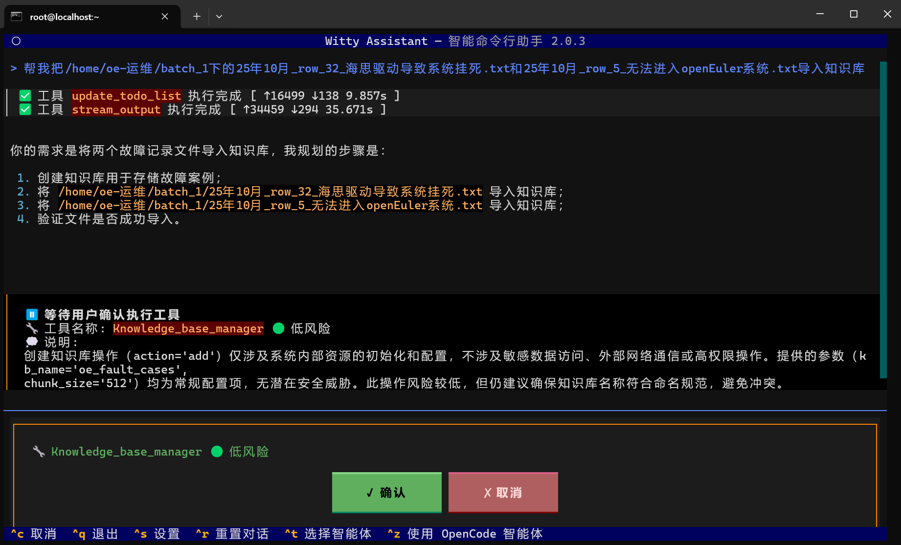
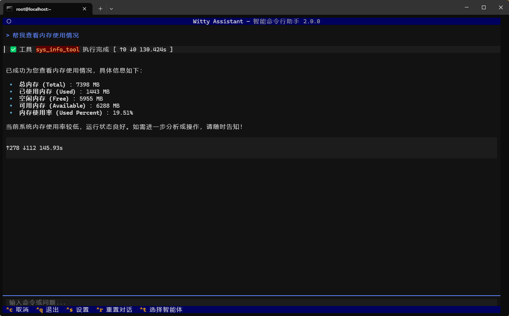
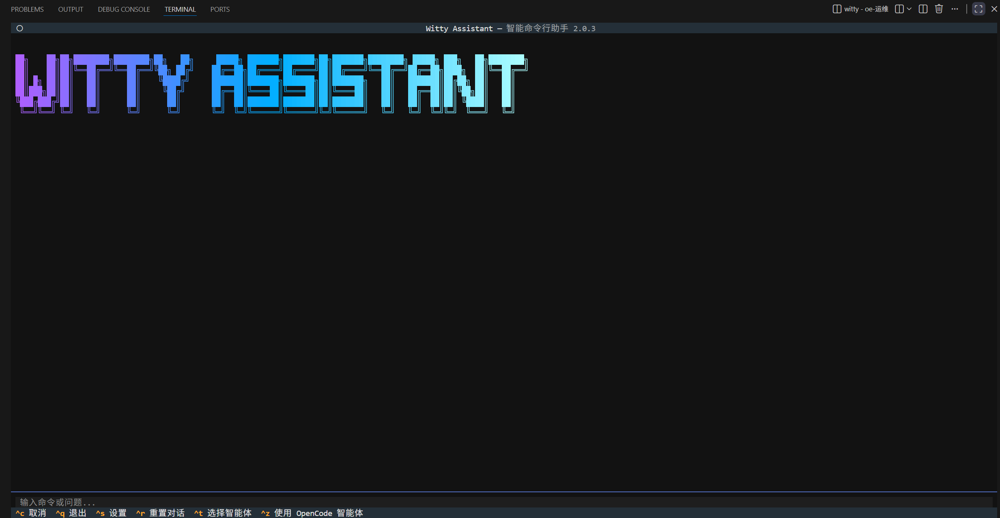
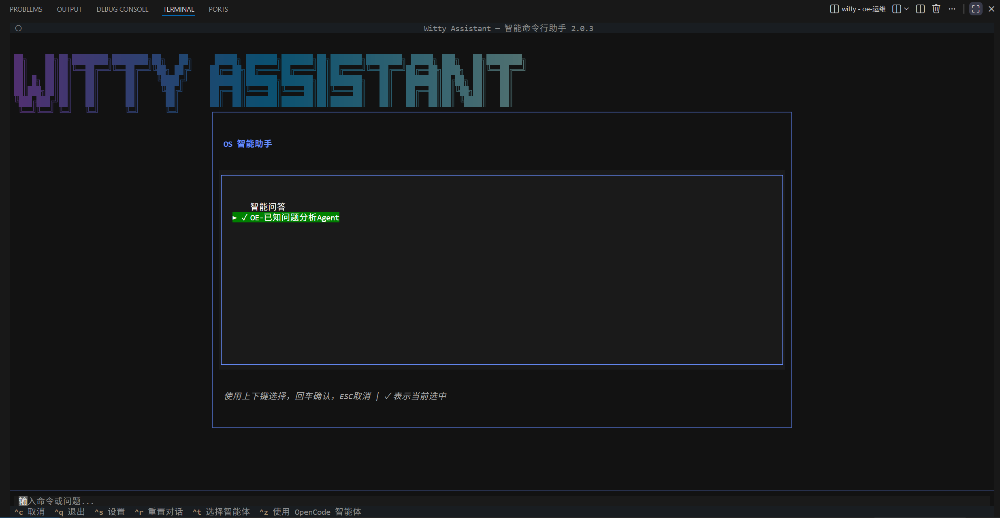
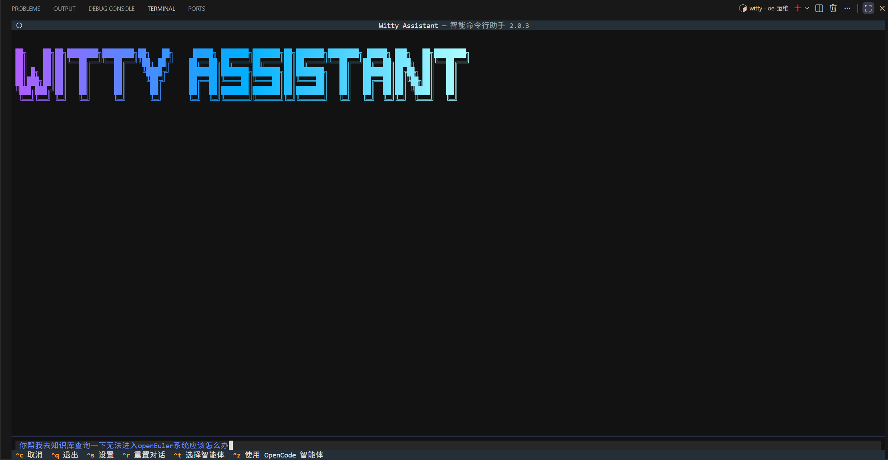
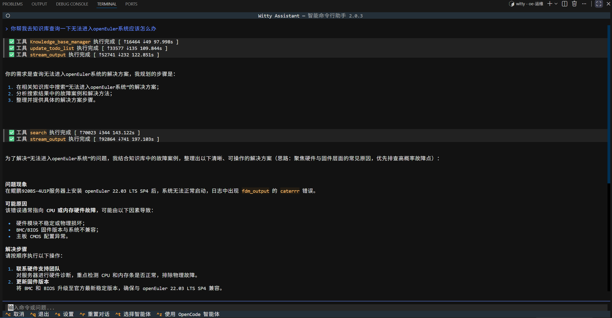

# 智能助手 CLI (Witty Assistant) 使用介绍

## 引言

智能助手 CLI 是 openEuler Intelligence 旗下的一款 OS 智能助手，Witty Assistant 的命令行客户端提供 AI 驱动的命令行交互体验，支持多种 LLM 后端，集成 MCP 协议，提供现代化的 TUI 界面。

### 核心特性

- **智能终端界面**: 基于 Textual 的现代化 TUI 界面
- **流式响应**: 实时显示 AI 回复内容
- **部署助手**: 内置 Witty Assistant 后端服务自动部署功能
- **配置管理**：内置设置界面（Ctrl+S）与本地配置文件，便于切换后端/更新连接信息

## 使用说明

### 打开 Witty Assistant

打开 Witty Assistant，ctrl + c 中断，ctrl + q 退出，ctrl + s 打开设置，ctrl + t 选择智能体，支持鼠标选择。

```sh
witty
```



### 选择智能体

点击选择智能体（ ctrl + t ），默认为 已知问题分析Agent，按上下键选择，回车确认，ESC 取消，高亮表示选中，智能体详情参照[智能体介绍]()。



### 使用智能体

进行智能体的使用，此处以已知问题分析Agent举例，回车确认，进入对话界面。


在左下角输入栏输入命令或问题，如:

```txt
帮我把/home/oe-运维/batch_1下的25年10月_row_32_海思驱动导致系统挂死.txt和25年10月_row_5_无法进入openEuler系统.txt导入知识库
```

智能体会根据提问自动选择合适的 MCP 工具，并询问是否执行，此处点击确认。



结果输出：



>[!NOTE]说明：
>
> 设置->更改用户设置->常规设置，可以设置MCP工具授权模式。

### Witty Assistant预设

可以在 witty 前输入以下命令配置客户端。

#### 配置语言

**支持的语言：**

- **English (en_US)** - 默认语言
- **简体中文 (zh_CN)**

切换至简体中文

```sh
witty set-default locale zh_CN
```

切换至英文

```sh
witty set-default locale en_US
```

语言设置会自动保存，下次启动时生效。

#### 设置初始化智能体

设置智能体命令

```sh
witty set-default agent
```

#### 设置日志级别并验证

```sh
witty set-default log-level INFO
```

### 查看日志

查看最新的日志内容:

```sh
witty logs
```

### 管理大模型配置

```sh
witty llm
```


### 界面操作快捷键

- **Ctrl+S**: 打开设置界面
- **Ctrl+R**: 重置对话历史
- **Ctrl+T**: 选择智能体
- **Tab**: 在命令输入框和输出区域之间切换焦点
- **Esc**: 退出应用程序
- **Ctrl+C**: 取消当前正在执行的任务（中断 LLM 请求或停止执行命令）
- **Ctrl+Q**: 退出程序并关闭 TUI

>[!NOTE]说明：
>
> 操作的细节，包括 witty logs 日志等，参考 shell 的 [README](https://atomgit.com/openeuler/euler-copilot-shell)

## 平台演示

### 使用Windows Terminal

#### 打开 Witty Assistant

```sh
witty
```


#### 选择智能体


#### 使用智能体


智能体根据工具调用结果输出结果


### 使用vscode

#### 打开 Witty Assistant



#### 选择智能体

使用方法参上面，以下主要为演示部分页面：



#### 使用智能体


## 使用案例

以“无法进入openEuler系统问题”为例，演示智能助手 cli的进阶用法：

**自然语言交互**：启动 Witty Assistant ，切换至“已知问题分析Agent”，输入“你帮我去知识库查询一下无法进入openEuler系统应该怎么办”；



**查看执行结果**：等待执行结束，会分析并生成解决方案；



