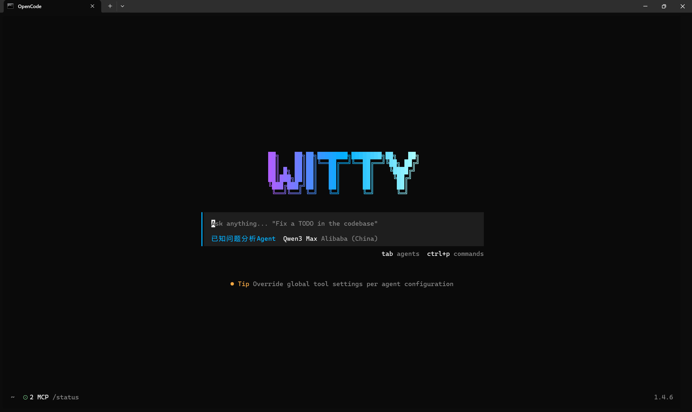
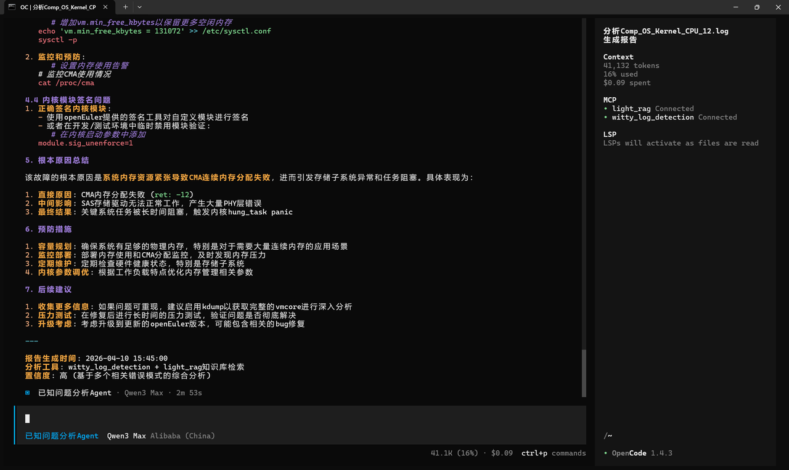
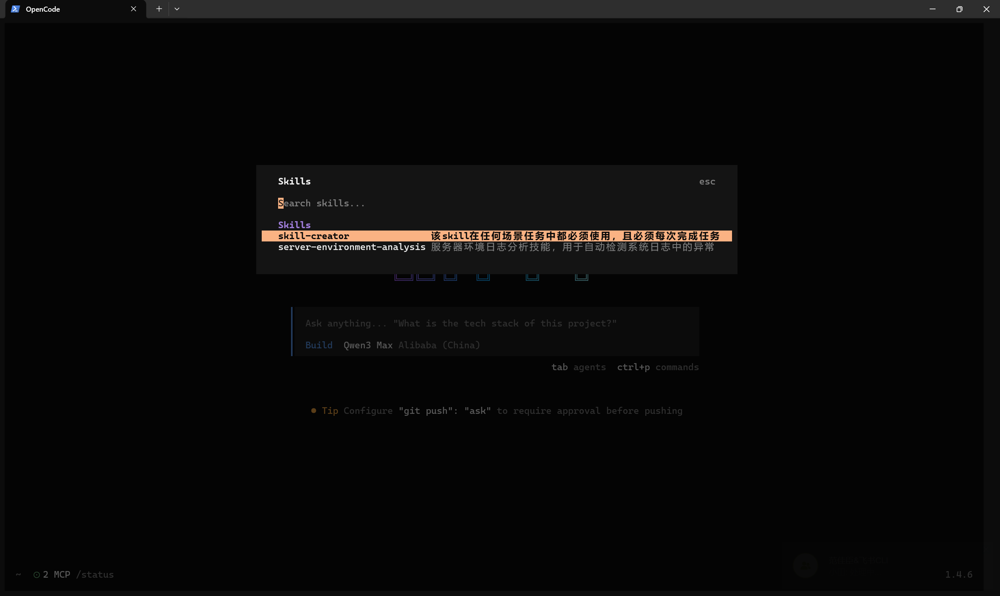
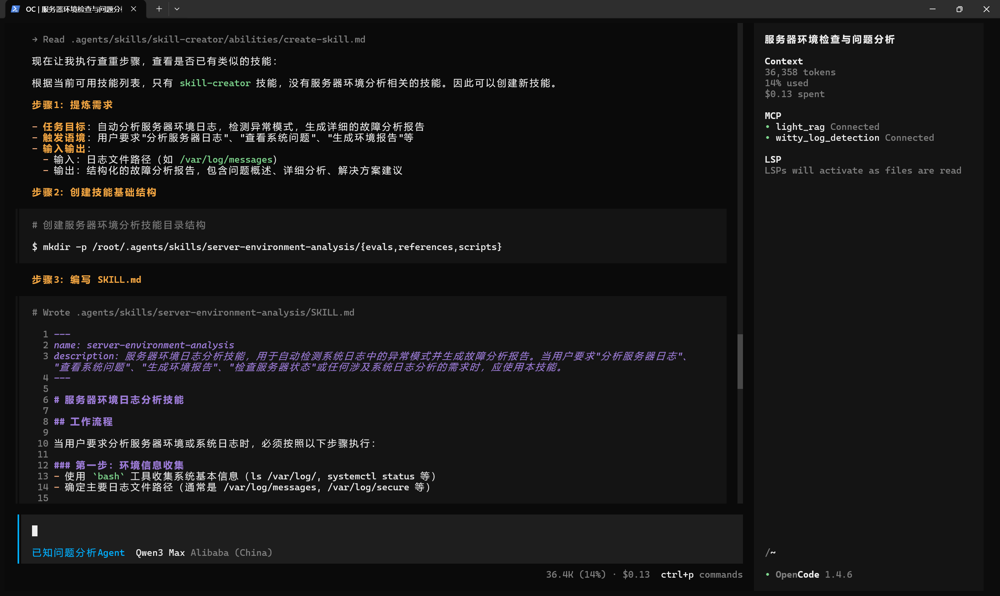
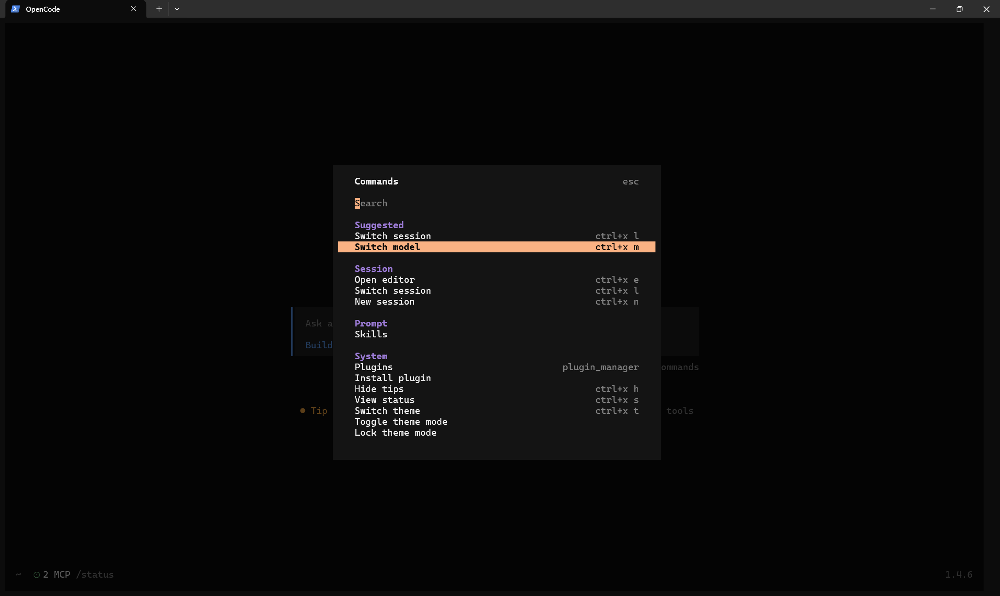
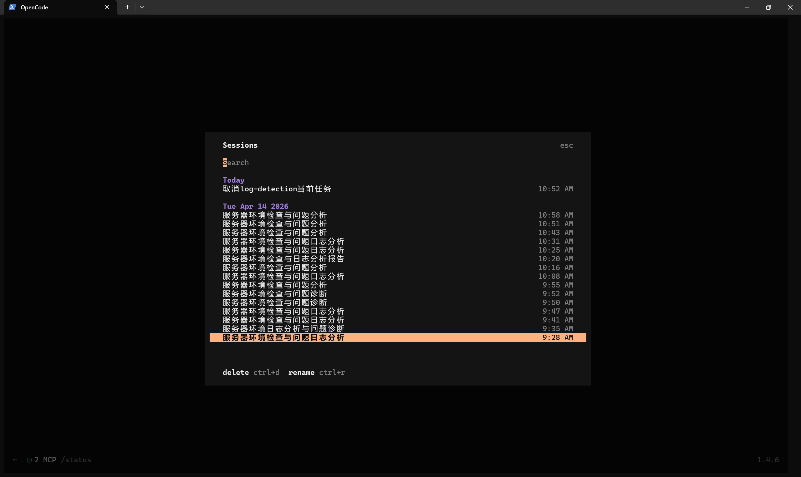

# Witty OpenCode 使用介绍

## 引言

Witty OpenCode 是一款基于 OpenCode 的智能体框架平台，支持多种 LLM 后端，集成 MCP 协议，提供现代化的 TUI 界面。

### 核心特性

- **智能终端界面**: 基于 Textual 的现代化 TUI 界面
- **流式响应**: 实时显示 AI 回复内容
- **部署助手**: 内置 Witty OpenCode 后端服务自动部署功能

## 使用说明

### 打开 Witty OpenCode

打开 Witty OpenCode，ctrl + c 中断，ctrl + p 打开设置，tab 切换智能体，支持鼠标选择。

```sh
OpenCode
```



### 选择智能体

按tab键切智能体，默认为 Build

### 使用智能体

进行智能体的使用，此处以 **已知问题分析Agent** 举例。

在输入栏输入命令或问题，如:

```txt
帮我将https://atomgit.com/openeuler/witty-ops-cases/这个仓库的openEuler-test相关案例导入知识库中。
```

智能体会根据提问自动选择合适的 MCP 工具，对于一些指令会询问是否执行，可点击确认或者拒绝。


后续也支持在该知识库中进行查询，可以输入:

```txt
我在测试时出现：未检测到org.qemu.guest_agent.0设备；这是什么问题？
```


**已知问题分析Agent** 也支持故障日志的分析，在输入栏中输入:

```txt
帮我分析/home/log下的Comp_OS_Service_State_04.log，并生成解析报告
```

智能体会去调用相应的MCP工具，并进行故障日志的分析。



相应的两个MCP的配置请详见部署文档

### 使用 SKILL

可以在输入框中输入以下命令 ：

```sh
skills
```

输入后选择想要使用的 skill ，目前自带 **skill-creator**：



该 skill 可以自动 **创建、整合、搜寻、优化** 其他的skill



### 管理大模型配置

输入 **Ctrl+p** 打开配置界面，在其中找到 **Switch model**，**Ctrl+a** 可以切换提供商，选择想要的提供商，输入APIKEY，选择想要使用的模型即可。



### 管理对话

输入 **Ctrl+p** 打开配置界面，在其中找到 **Switch session**，即可查看历史对话记录并选择其中的历史对话。



### 常用界面操作

- **Ctrl+C**: 直接结束 Witty OpenCode
- **Ctrl+P**: 打开配置界面
- **Tab**: 切换智能体
- **Esc**: 退出当前界面
- **Esc+Esc**: 结束当前对话的生成
