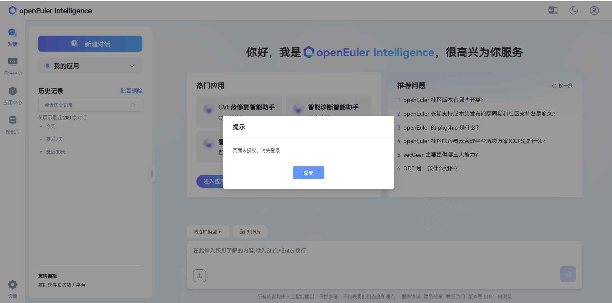
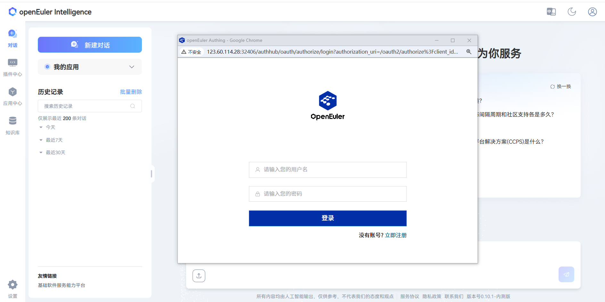
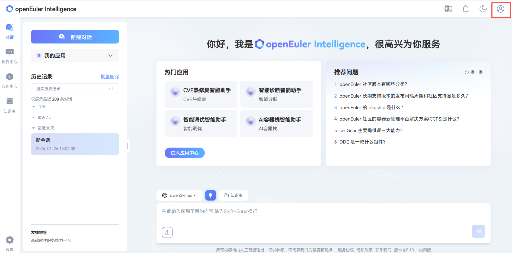
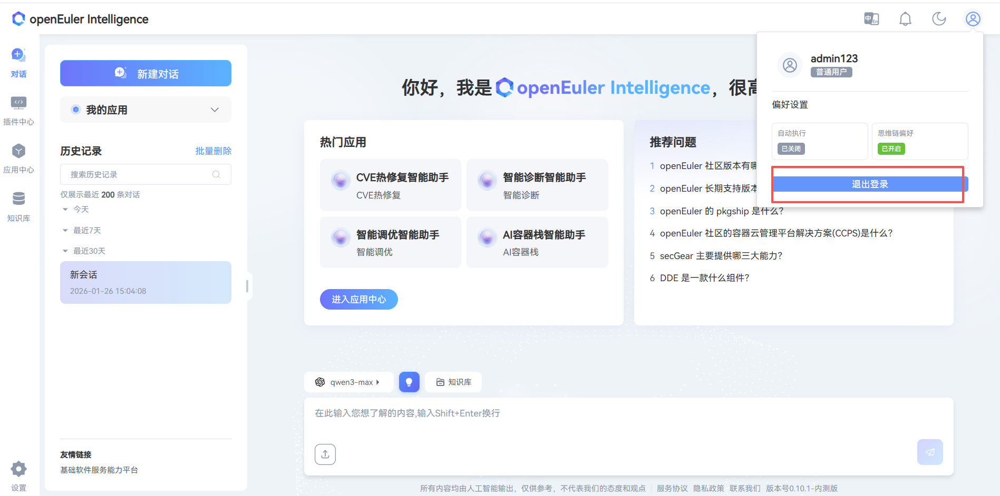

# 登录 Witty Assistant 的 web 页面

本章节介绍如何登录已部署的  Witty Assistant 的 web 网页端的具体步骤，以下简称 witty web 。

## 环境要求

主要对浏览器要求如表 1 所示。

- 表 1 浏览器要求

| 浏览器类型 | 最低版本 | 推荐版本 |
| ----- | ----- | ----- |
| Google Chrome | 72 | 121 或更高版本 |
| Mozilla Firefox | 89 | 122 或更高版本 |
| Apple Safari | 11.0 | 16.3 或更高版本 |

## 操作步骤

### 登录网页

打开本地 PC 机的浏览器，在地址栏输入部署好的域名或IP，按下 `Enter`。在未登录状态，进入 witty web，会出现登录提示弹出框，如下图所示：

登录 witty web（已注册账号），打开登录界面，如下图所示：

## 注册账号

在登录信息输入框右下角单击“立即注册”

进入账号注册页，根据页面提示填写相关内容

按页面要求填写账号信息后，单击“注册”，即可注册成功。注册后即可返回登录。

## 退出登录

单击右上角，会出现“退出登录”下拉框

单击“退出登录”即可退出登录

