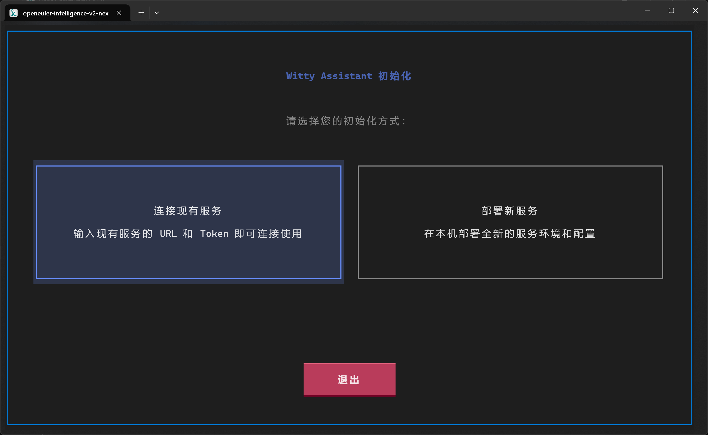
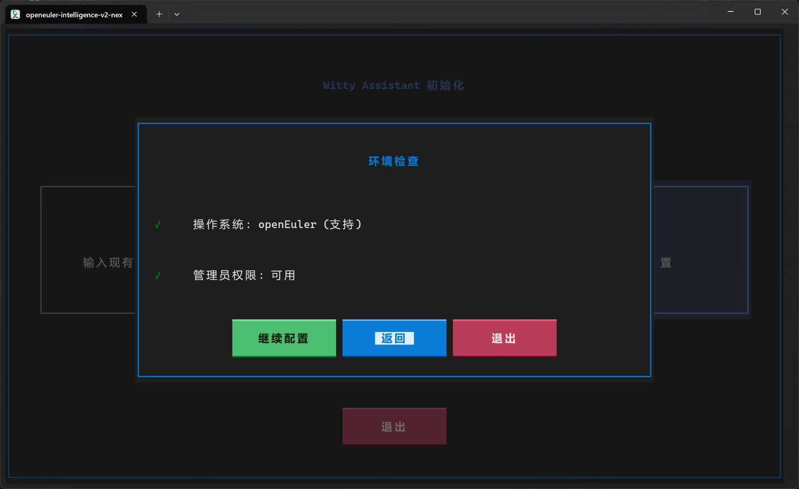
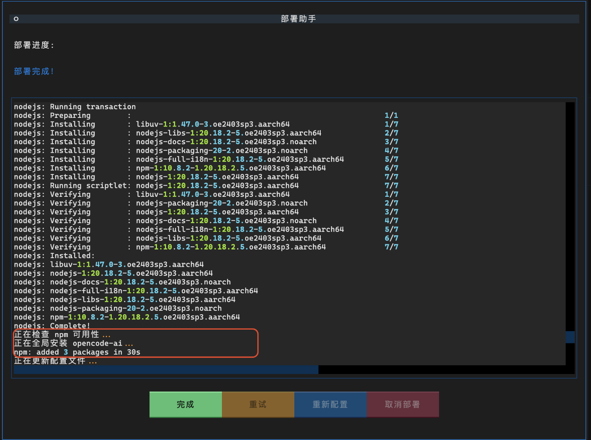
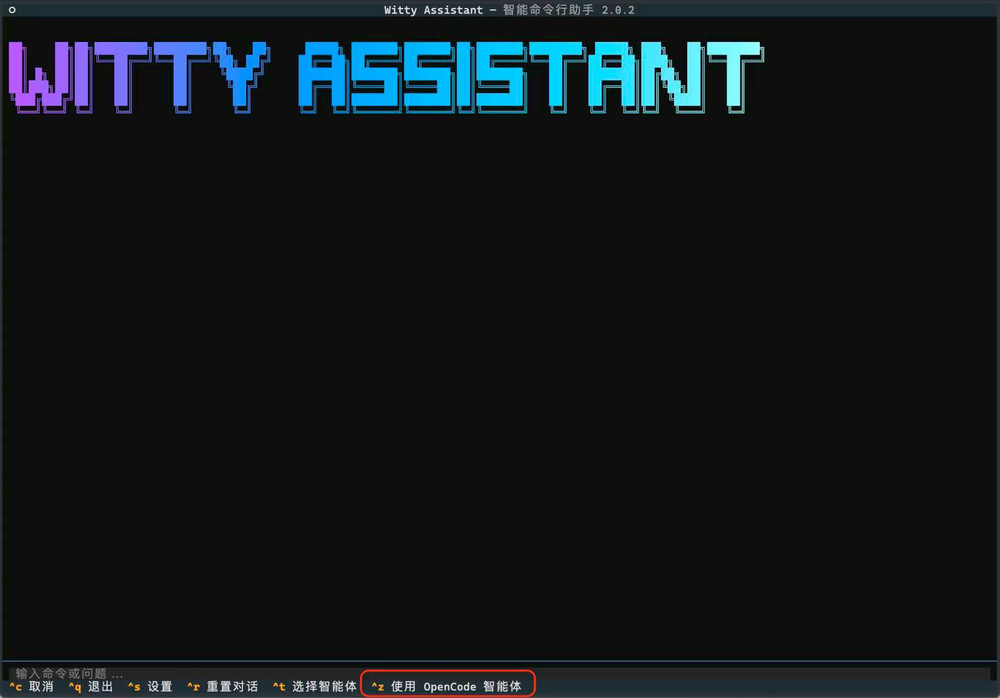
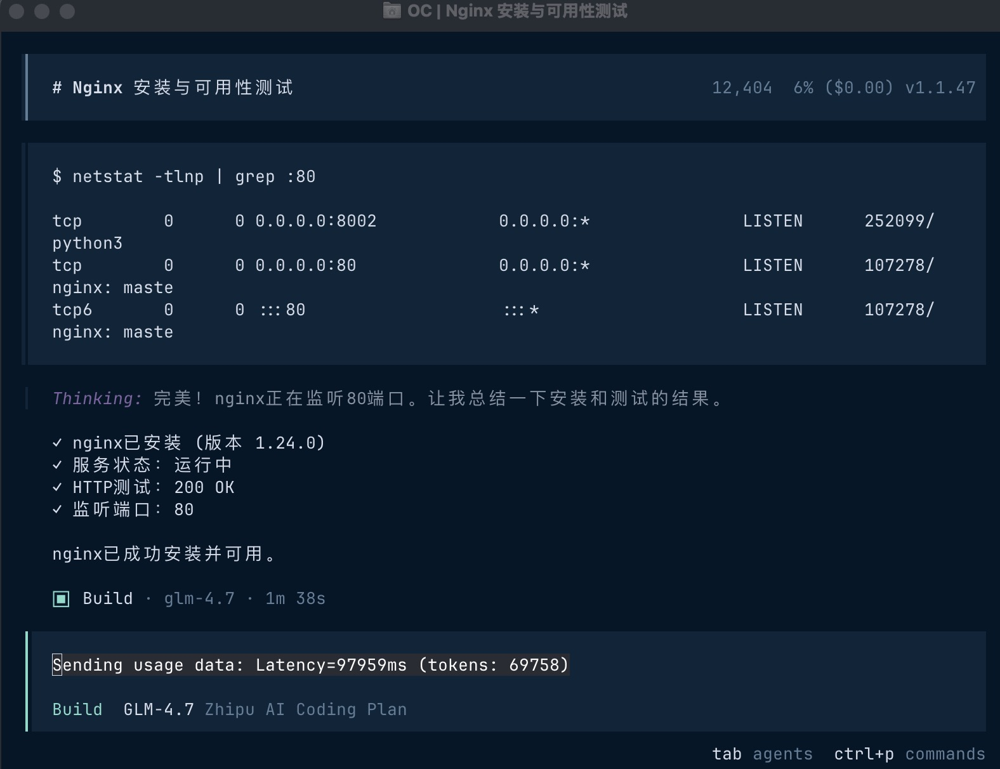
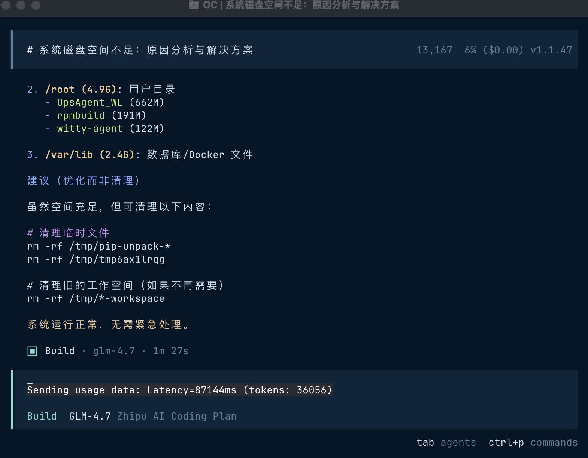
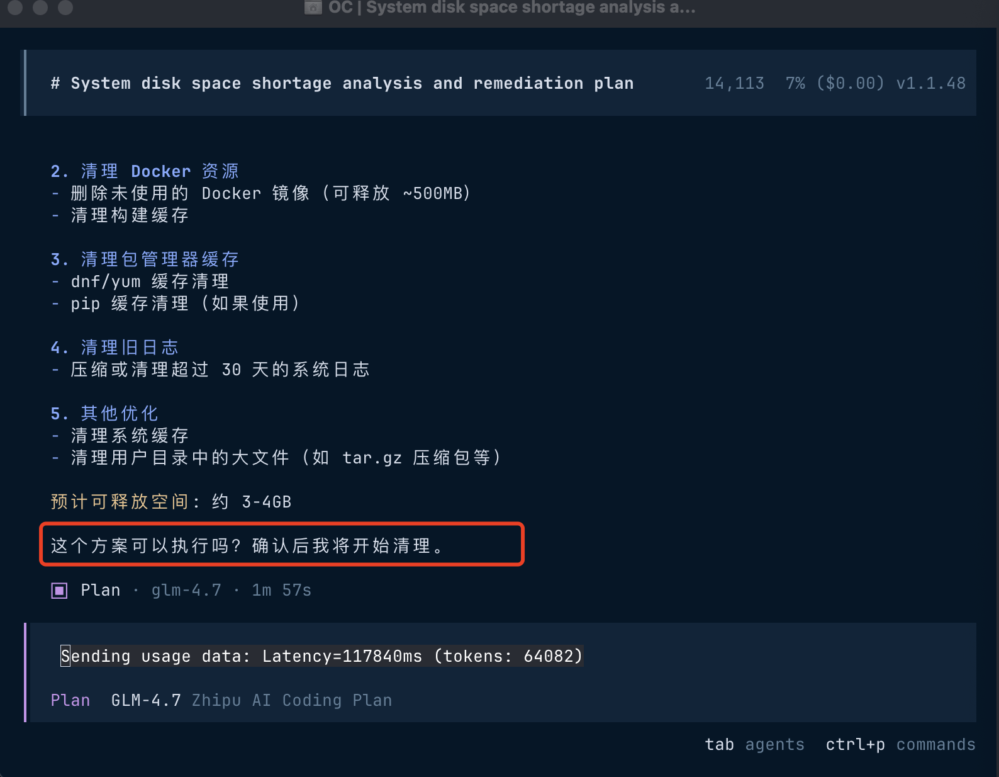

# Witty Assistant默认集成OpenCode：开启openEuler"智能运维"新时代

## 引言

在数智化转型的浪潮中，服务器运维面临着复杂度高、效率低、门槛高等挑战。openEuler 24.03 LTS SP3 推出的 Witty Assistant 智能助手，通过默认集成 OpenCode AI 编码代理框架，为服务器运维带来了革命性的变化。

Witty Assistant 提供 LLM 驱动的命令行交互体验，支持对接多种 LLM 后端及 AI Agent。而 OpenCode 作为核心的 AI 编码代理框架，将大语言模型封装为可插拔的智能体，不仅能生成适配 openEuler 的专业运维脚本，还能快速诊断故障、确保配置合规、优化系统性能，真正实现了"自然语言驱动的智能运维"。

本文将详细介绍如何通过 Witty Assistant 利用默认集成的 OpenCode 能力，开启高效、智能的服务器运维之旅。

## OpenCode：Witty Assistant的高级智能体

### 核心特性

OpenCode 作为 Witty Assistant 的默认集成组件，为其注入了强大的智能运维能力：

- **智能脚本生成**：根据自然语言指令，自动生成适配 openEuler 的运维脚本
- **故障诊断与分析**：快速识别系统问题，提供详细的诊断报告和解决方案
- **配置合规检查**：自动检查系统配置是否符合最佳实践和安全标准
- **性能优化建议**：基于系统状态分析，提供针对性的性能优化方案
- **自动化运维流程**：支持复杂运维任务的自动化执行和调度
- **多工具集成**：无缝集成系统命令、监控工具和管理工具

### 默认集成优势

Witty Assistant 默认集成 OpenCode 带来了显著优势：

- **开箱即用**：无需额外安装配置，部署完成即可使用 OpenCode 的全部功能
- **深度整合**：与 openEuler 系统深度整合，提供原生的运维体验
- **智能增强**：OpenCode 的 AI 能力大幅提升了 Witty Assistant 的智能水平
- **安全可靠**：针对 openEuler 环境优化，确保操作的安全性和可靠性
- **持续进化**：随着大模型能力的提升，OpenCode 的运维能力也在不断增强

## 环境准备

### 系统要求

在部署 Witty Assistant（包含默认集成的 OpenCode）之前，请确保您的 openEuler 24.03 LTS SP3 系统满足以下要求：

| 资源 | 最低配置 | 推荐配置 |
|------|---------|---------|
| 操作系统 | openEuler 24.03 LTS SP3 | openEuler 24.03 LTS SP3 |
| CPU | 4 核 | 8 核及以上 |
| 内存 | 8GB RAM | 16GB RAM 及以上 |
| 存储 | 20GB 可用空间 | 40GB 可用空间及以上 |
| 网络 | 稳定互联网连接 | 稳定互联网连接 |

### 大模型服务要求

OpenCode 需要依赖支持工具调用能力的大模型服务：

- **线上服务**：百炼、DeepSeek Chat、智谱、MiniMax、硅基流动等
- **本地部署**：llama-server、ollama、vLLM、LM Studio 等
- **推荐模型**：Qwen3、DeepSeek 3.2、GLM-4.7、MiniMax M2.1、Kimi K2 等

### 系统权限

需要具备 sudo 权限以安装必要的软件包和依赖项。

## 初始化Witty Assistant

### 启动初始化

执行以下命令进入 Witty Assistant 初始化界面：

```bash
sudo witty init
```


### 选择部署新服务

在欢迎界面选择"部署新服务"，Witty Assistant 将自动进行环境检查。


选择"继续配置"，进入参数配置界面。

### 启动部署

完成参数配置后，点击下方"开始部署"按钮，启动部署程序。


部署完成后，会显示已经初始化的智能体，包括默认配置的 OpenCode 智能体。

### 验证 OpenCode 集成

您应该能在 witty TUI界面看到 OpenCode 智能体已默认配置并可用。

## OpenCode智能运维实战

### 进入 Witty Assistant

执行以下命令进入 Witty Assistant 交互界面：

```bash
witty
```


### 选择 OpenCode 智能体

在交互界面中，按 `Ctrl+Z` 选择 "使用OpenCode智能体"。

### 核心运维场景实战

#### 场景一：智能安装与配置服务

**用户指令**：安装 Nginx 服务，并配置为开机自启，测试是否可用

**OpenCode 执行过程**：
1. 分析用户需求，确定需要执行的操作步骤
2. 生成并执行安装 Nginx 的命令
3. 配置 Nginx 为开机自启
4. 启动 Nginx 服务
5. 测试 Nginx 服务是否正常运行
6. 返回详细的执行结果和状态

**执行示例**：


#### 场景二：故障诊断与分析

**用户指令**：系统磁盘空间不足，分析原因并提供解决方案

**OpenCode 执行过程**：
1. 检查系统磁盘使用情况
2. 分析占用空间较大的文件和目录
3. 识别可能的问题原因
4. 提供针对性的解决方案

**执行示例**：




## 高级配置与管理

### LLM 配置管理

**管理 LLM 配置**（需要管理员权限，仅适用于 sysAgent 后端）：

```bash
sudo witty llm
```

### 日志管理

**查看日志**：

```bash
witty logs
```

**设置日志级别**：

```bash
witty set-default log-level INFO
```

## 常见问题解答 (Q&A)

### Q1: 安装界面的语言如何设置？

**A1**: 安装界面的默认语言会根据终端的语言环境变量自动选择。可以通过设置 `LANG` 环境变量来指定语言，例如：

```bash
export LANG=zh_CN.UTF-8  # 设置为中文
export LANG=en_US.UTF-8  # 设置为英文
```

部署完成后，如果需要更改界面语言，可以在命令行界面使用以下命令：

```bash
witty set-default locale zh_CN  # 切换到中文
witty set-default locale en_US  # 切换到英文
```

### Q2: 部署过程中遇到 pip 包下载很慢怎么办？

**A2**: 可以使用国内的 pip 镜像源，例如清华大学的镜像源。可以通过修改 pip 配置文件来使用清华镜像源：

```bash
mkdir -p ~/.pip
echo "[global]" > ~/.pip/pip.conf
echo "index-url = https://pypi.tuna.tsinghua.edu.cn/simple" >> ~/.pip/pip.conf
```

### Q3: 如果无法访问外网，如何获取所需的依赖包？

**A3**: 可以在有外网的环境中下载所需的依赖包，然后传输至目标环境中进行安装。具体步骤如下：

1. 在有外网的环境中，使用以下命令下载所需的依赖包：

   ```bash
   pip download -d /path/to/download/dir <package-name>
   ```

   将 `<package-name>` 替换为实际需要下载的包名，`/path/to/download/dir` 替换为实际的下载目录。

2. 将下载的依赖包拷贝到目标环境中。

3. 在目标环境中，使用以下命令安装依赖包：

   ```bash
   pip install --no-index --find-links=/path/to/download/dir <package-name>
   ```

   将 `/path/to/download/dir` 替换为实际的下载目录，`<package-name>` 替换为实际需要安装的包名。

请注意，使用这种方法安装需要自行准备所需的软件包和依赖项，可能会遇到兼容性问题，建议在测试环境中进行验证后再应用到生产环境中。

## 总结

Witty Assistant 默认集成 OpenCode 为 openEuler 24.03 LTS SP3 带来了智能运维的新时代。通过自然语言交互，运维人员可以轻松完成复杂的系统管理任务，而无需记忆繁琐的命令和配置。

OpenCode 的 AI 能力不仅提高了运维效率，还降低了运维门槛，使得更多技术人员能够参与到服务器管理中。同时，其故障诊断、性能优化和安全合规检查能力，也为系统的稳定性和安全性提供了有力保障。

随着大模型技术的不断进步，OpenCode 的智能运维能力也将持续进化，为 openEuler 用户带来更加智能、高效、安全的运维体验。

让我们一起拥抱这个智能运维的新时代，让服务器管理变得更加简单、高效、可靠！