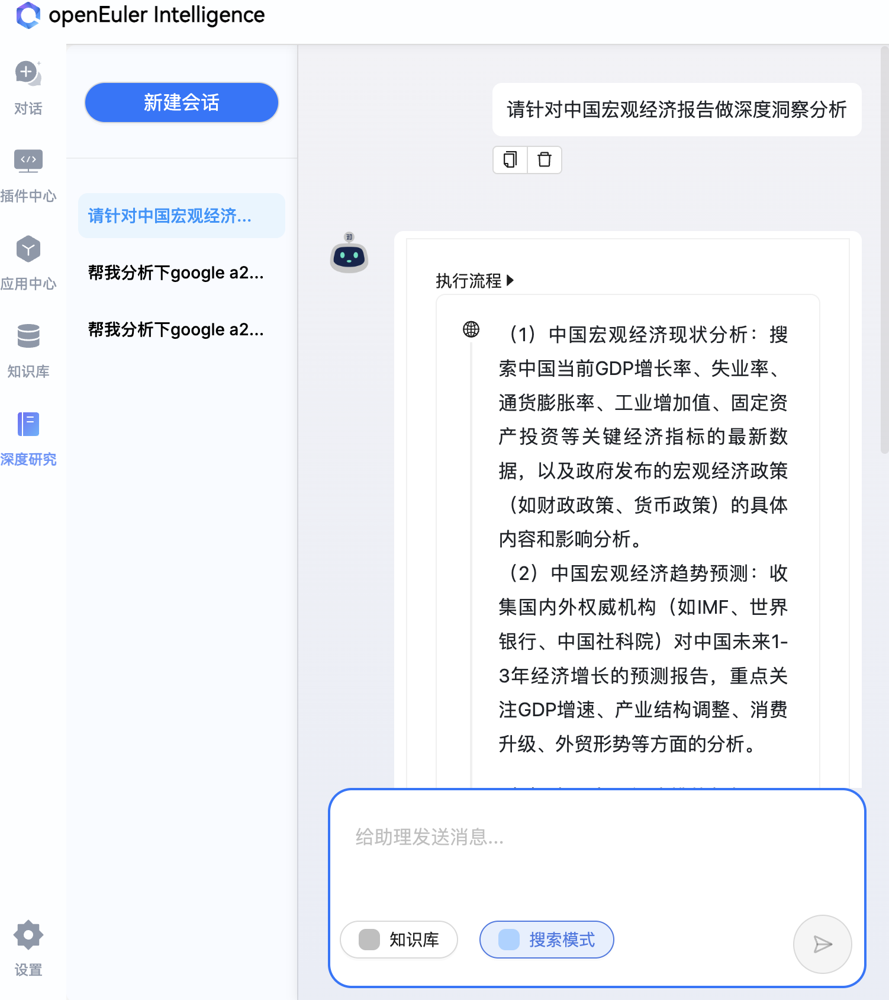
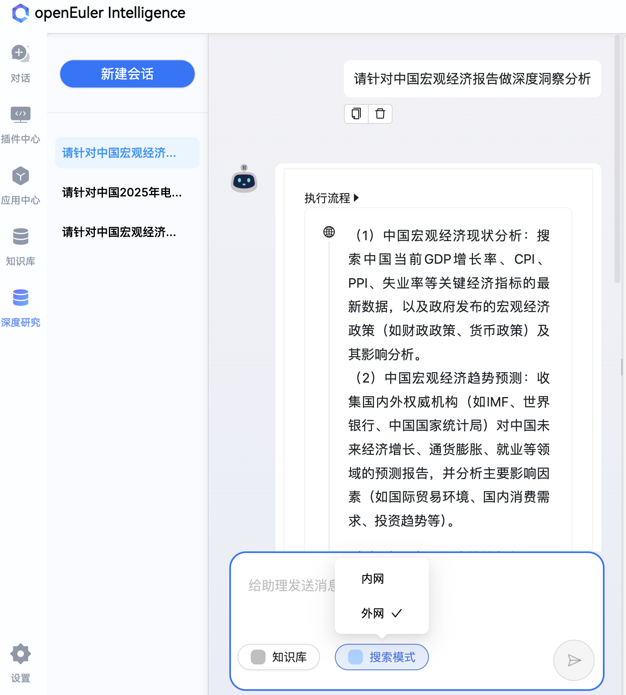
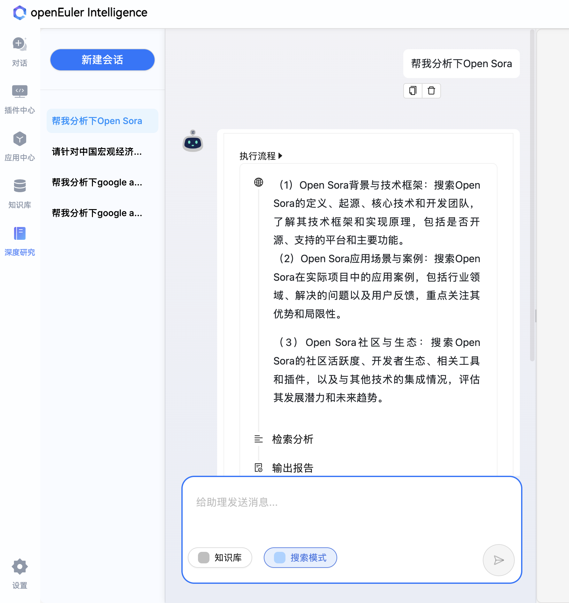
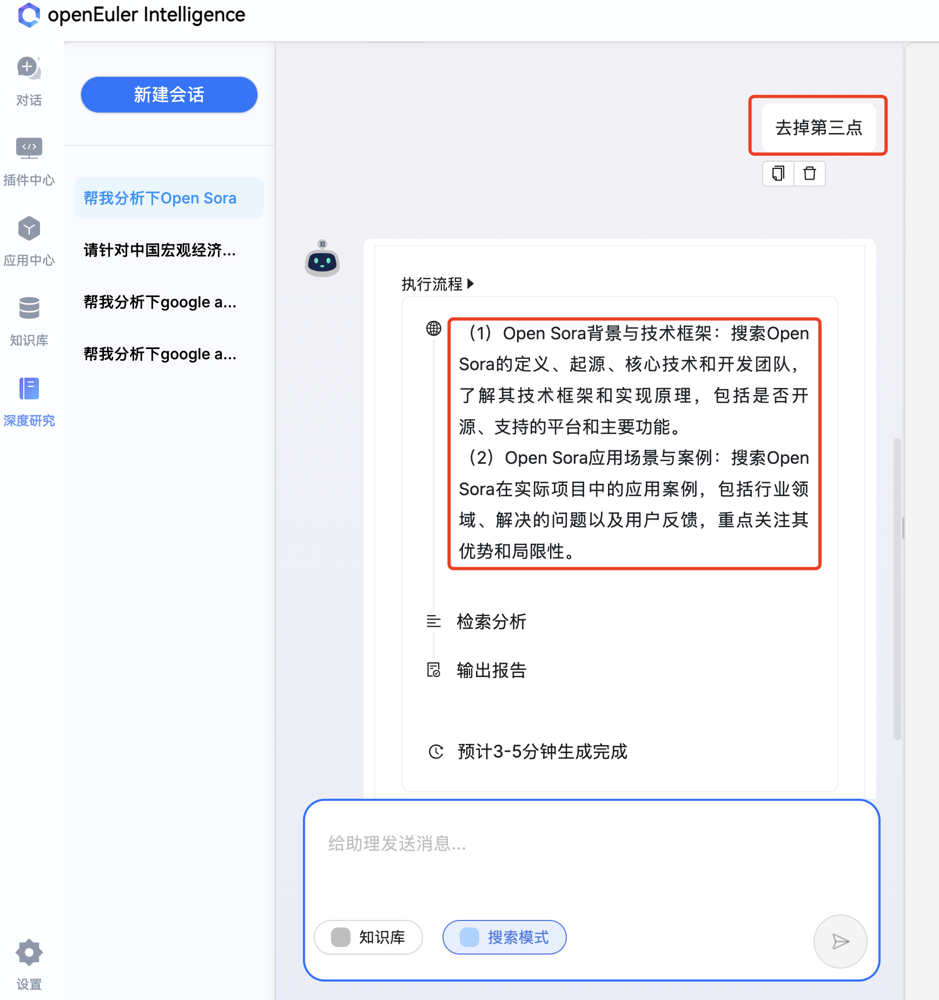
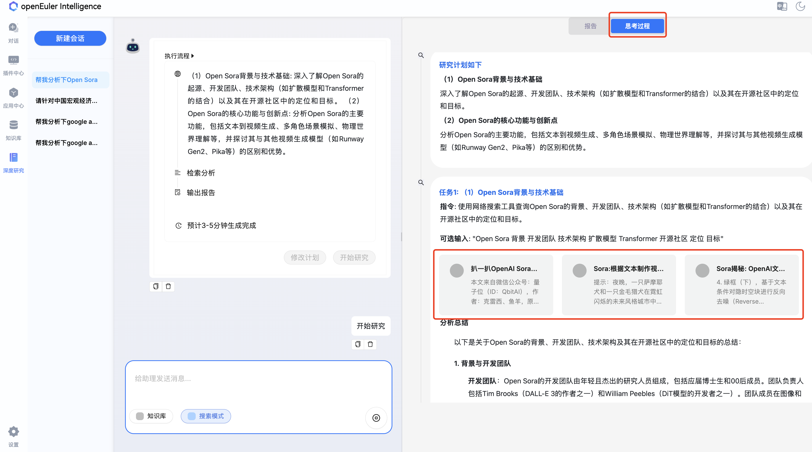
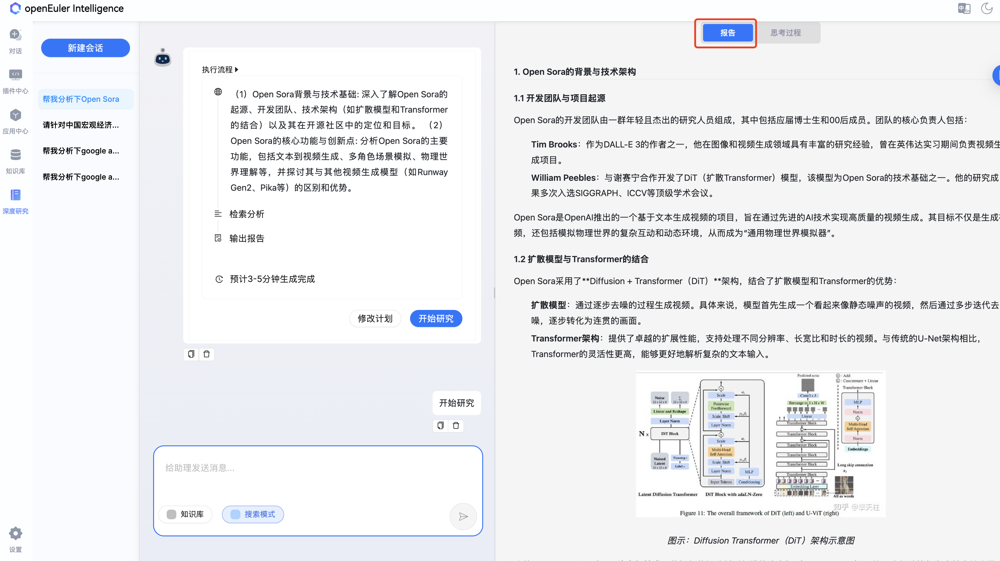
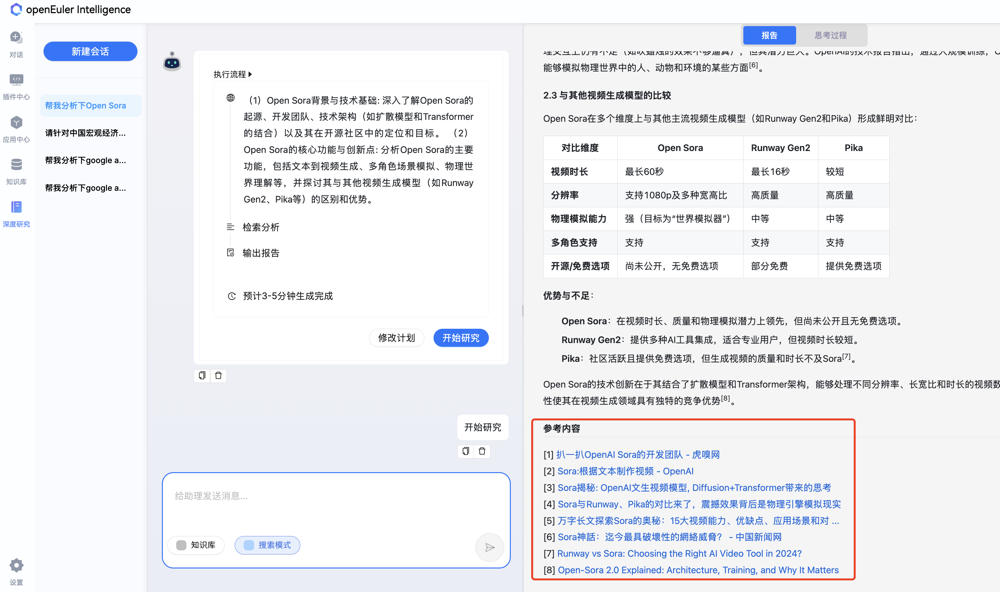
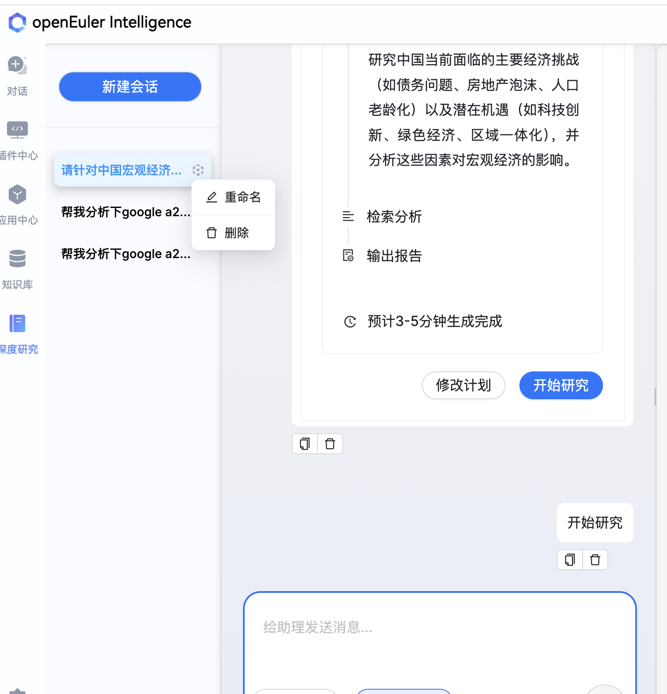
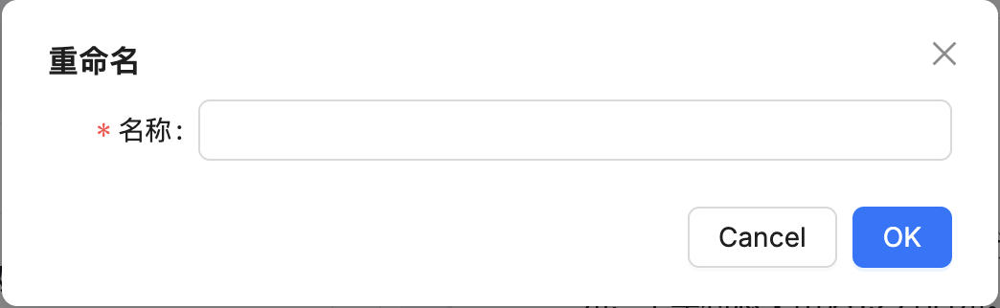
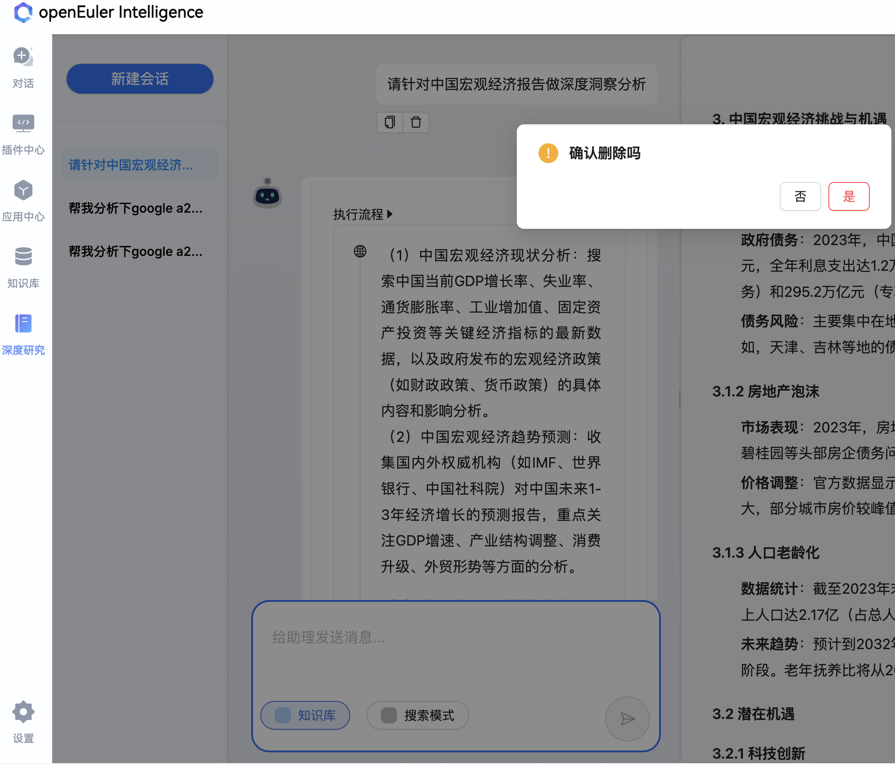

# 深度研究使用指南

## 开始对话

在对话区下侧输入框即可输入想要研究的内容，输入 `Shift + Enter` 可进行换行，输入 `Enter` 即可发送研究内容，或者单击“发送”也可发送研究内容。

> **说明**
>
> 对话区位于页面的下方，如图 1 所示。

- 图 1 对话区
  

### 搜索模式

深度研究功能支持互联网、客户内部网络、知识库三种搜索源搜索信息，三种搜索源可随意搭配。
其中：
- 互联网搜索：使用tavilt搜索引擎进行搜索，需要在MCP配置中配置后使用，详见配置说明。
- 内部网络搜索：支持内部网络进行搜索。需要在MCP配置中配置后使用，详见配置说明。
- 知识库搜索：支持Ragflow知识检索。需要在MCP配置中配置后使用，详见配置说明。

搜索源选择方式如图2所示。

- 图 2 外部数据源选择
  


### 深度研究

选择完搜索源之后，在对话框输入待分析的问题，点击发送。首先会生成如下研究计划：

- 图 3 研究计划
  

此研究计划用于指导信息搜集过程，如果想要修改计划，可以直接点击修改计划后在对话框中输入修改内容或者直接在对话框中输入想要修改的内容，如图4示例：

- 图 4 研究计划
  

计划可以按照如上步骤进行多次修改，修改完成后，点击开始研究，即可开始深度研究，右侧会实时显示思考过程以及最终报告。如图5-7所示：

- 图 5 思考过程
  

- 图 6 报告生成
  

- 图 7 引用文献
  


## 管理对话

> **说明**
>
> 对话管理区在页面左侧。

### 新建对话

单击“新建会话”按钮即可新建对话，如图 8 所示。

- 图 8 “新建对话”按钮在页面左上方
  


### 对话历史记录管理

历史记录的列表位于新建会话的下方，在每条对话历史记录的右侧，单击图标即可编辑对话历史记录的名字或删除，如图 9 所示。

- 图 9 点击图标重命名或删除历史记录
  

点击重命名后重新输入名字，并确认后即可完成历史记录重命名，单击图 10右侧![OK]即可完成重命名，或者单击图 10左侧![Cancel]放弃本次重命名，如图 10 所示。

- 图 10 完成/取消重命名历史记录
  

另外，单击对话历史记录右侧的删除按钮，如图 11 所示，即可对删除单条对话历史记录进行二次确认，在二次确认弹出框，如图 11 所示，单击“是”，可确认删除单条对话历史记录，或者单击“否”，取消本次删除。

- 图 11 点击删除按钮删除单条历史记录
  

## 配置说明
config.yaml文件配置说明：
```yaml
model:
    model_platform: deepseek # 支持列表见camel官方文档：https://docs.camel-ai.org/key_modules/models#direct-integrations
    model_type: deepseek-chat # 支持列表见camel官方文档：https://docs.camel-ai.org/key_modules/models#direct-integrations
    api_key:  # 对应模型提供商的api key
    base_url: # 对应模型提供商的base url
    model_config_dict: # 额外的模型配置
    stream: true

# 数据源配置项：每个数据源对应一个或多个MCP服务，用户可指定数据源
# web_search：对应于互联网搜索，下面的服务名tavily即为mcp_config.json配置中的服务名
# knowledge：对应于知识检索服务，下面的服务名ragflow_retrieval即为mcp_config.json配置中的服务名
# intra_search：对应于互联网搜索，下面的服务名intra_search即为mcp_config.json配置中的服务名
datasource:
    web_search:
        mcp_server_names:
            - tavily
    knowledge:
        mcp_server_names:
            - ragflow_retrieval
    intra_search:
        mcp_server_names:
            - intra_search
```
mcp_config.json配置说明
支持stdio、streamable_http方式。
```json
{
    "mcpServers": {
        "tavily": {
            "command": "python",
            "args": [
                "integrations/mcps/tavily.py",
                "--mode",
                "stdio"
            ],
            "env": {
                "PYTHONPATH": "./",
                "TAVILY_API_KEY": "YOUR API KEY"
            }
        },
        "ragflow_retrieval": {},
        "intra_search": {}
    }
}
```
其中ragflow_retrieval知识检索工具返回的格式要求为：
```json
{
  "query": "用户查询",
  "results": [
    {
      "url": "文档预览链接或者文档名",
      "title": "文档标题",
      "description": "文档描述",
      "content": "文档内容"
    }
  ]
}
```
用户画像功能配置：
此功能用于为深度研究构建定制化上下文，用户可以开启该功能提升深度研究在专业领域的表现。此功能基于Ragflow知识检索工具实现。
开启此功能：环境变量中配置USE_CONTEXT=True，默认不开启。
此功能需要配置文件mcp_context_config.json，内容如下：
```json
{
  "mcpServers": {
    "context": {
      "command": "python",
      "args": [
        "integrations/mcps/user_profile.py",
        "--mode",
        "stdio"
      ],
      "env": {
          "PYTHONPATH": "./",
          "RAGFLOW_DATASET_ID" :"ragflow知识检索服务的目标知识库id",
          "RAGFLOW_API_KEY" : "ragflow的用户个人api_key",
          "DEFAULT_BASE_URL" : "ragflow知识检索服务地址"
      }
    }
  }
}
```
